# B01 · RA1 — Caracterización de sistemas de Inteligencia Artificial

> **Apuntes de referencia del RA1.** La **sesión presencial** se centra en **2 cosas** (caracterizar + decidir con KPI); este documento es el material de **lectura y consulta** completo, con la teoría, los casos, las imágenes y las fuentes.
>
> **RA1:** *Caracteriza sistemas de Inteligencia Artificial relacionándolos con la mejora de la eficiencia operativa de las organizaciones y empresas.*

**Criterios de evaluación:**

| CE | Criterio oficial | Sección |
|----|------------------|---------|
| **4a** | Se han identificado los principios fundamentales de los sistemas inteligentes. | §1–§4 |
| **4b** | Se ha recopilado información sobre campos donde se aplica la IA. | §6 |
| **4c** | Se han identificado las técnicas básicas a utilizar en el entorno de la IA. | §5, §7 |
| **4d** | Se han identificado nuevas formas de interacciones en los negocios que mejoran la eficiencia operativa. | §8–§9 |

## 1. ¿Qué es la inteligencia artificial?

La **inteligencia artificial (IA)** es la tecnología que permite a las máquinas **simular el aprendizaje, la comprensión, la resolución de problemas, la toma de decisiones y la creatividad** humanas. Las aplicaciones con IA pueden ver e identificar objetos, entender y responder al lenguaje, aprender de la experiencia, recomendar decisiones y, cada vez más, **actuar de forma autónoma** (un agente que reserva un vuelo, un coche que conduce).

> **Definición (Comisión Europea, adaptada).** Un **sistema de IA** es un software —y, en su caso, hardware— diseñado por humanos que, ante un objetivo complejo, **percibe su entorno** (datos estructurados o no), **razona** sobre el conocimiento derivado de esos datos y **decide** las mejores acciones para lograr el objetivo, en el mundo físico o digital. Puede usar **reglas simbólicas** o **aprender un modelo numérico**, y adaptar su comportamiento al observar los efectos de sus acciones.

### 1.1 El ciclo percepción → razonamiento → acción

Un **sistema inteligente** percibe, razona y actúa para lograr un objetivo:

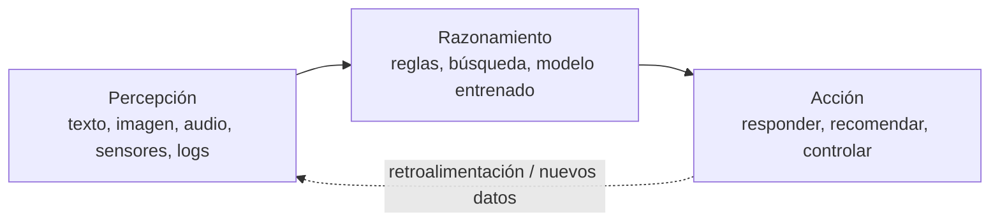

- **Percepción:** captar datos del mundo (texto, imagen, audio, sensores, registros de negocio).
- **Razonamiento:** procesarlos para obtener conocimiento o decidir (un modelo entrenado, un conjunto de reglas, una búsqueda).
- **Acción:** actuar sobre el entorno o sobre las personas (responder, recomendar, controlar un proceso).

### 1.2 Características de un sistema inteligente

| Característica | Descripción |
|---|---|
| **Autonomía** | Opera sin supervisión humana constante |
| **Adaptación** | Aprende de los datos y mejora con la experiencia |
| **Toma de decisiones** | Recomienda o actúa basándose en datos, no solo en reglas fijas |

> **Ejemplo · ¿Es IA un termostato?** Un termostato `si T < 18 °C → enciende` es, formalmente, un sistema de IA **basado en reglas**. La diferencia con la IA moderna es que, cuando la tarea se complica, definir todas las reglas a mano es imposible: ahí entra el **aprendizaje automático**, que deduce los patrones de los datos.

## 2. IA débil y IA fuerte

La clasificación más simple de la IA es **según la tarea que resuelve**:

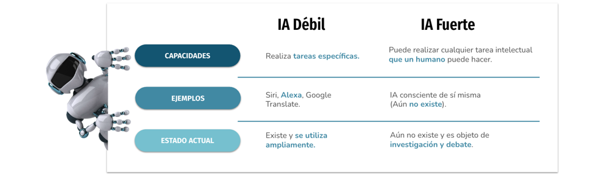

| Nivel | Alcance | Estado hoy |
|---|---|---|
| **ANI (débil/estrecha)** | Una o pocas tareas acotadas; reactiva, sin conciencia | **Toda la IA existente** (Siri, recomendadores, traductores) |
| **AGI (general)** | Transfiere conocimiento y razona en dominios no entrenados | Teórica, sin prototipo |
| **ASI (superinteligencia)** | Supera lo humano en cualquier tarea intelectual | Ciencia-ficción |

La IA débil es **reactiva** (no actúa si no se la activa), **no flexible** (colapsa ante lo no previsto) y **no tiene conciencia**: computa, no razona en sentido humano. Aun así, **tiene riesgos**: al ejecutar su tarea sin considerar el contexto ético o social, puede causar daño si se usa sin prudencia.

> **Más información · Tests de inteligencia.** El **test de Turing** (1950) es conductual: un interrogador conversa por escrito con una persona y una máquina; si no las distingue, la máquina lo supera. El **test de Lovelace** (2001) mide otra cosa: si el sistema **origina** un resultado que su propio programador no puede explicar a partir del código. Superar Turing no implica superar Lovelace.

## 3. Tres lentes para clasificar la IA

### 3.1 Escuelas de pensamiento

| | IA convencional (simbólico-deductiva) | IA computacional (subsimbólico-inductiva) |
|---|---|---|
| Cómo razona | Análisis formal y estadístico explícito | Aprendizaje interactivo a partir de datos |
| Técnicas | Sistemas expertos, razonamiento por casos, redes bayesianas | Redes neuronales, SVM, lógica difusa, computación evolutiva |
| Origen | La «automatización» clásica (reglas + estadística) | El **aprendizaje automático** actual |

### 3.2 Russell y Norvig (1995)

En *Artificial Intelligence: A Modern Approach*, proponen cuatro categorías según el **origen del comportamiento**:

| Categoría | Enfoque | Ejemplo |
|---|---|---|
| **Sistemas cognitivos** | Piensan como humanos | Modelos cognitivos |
| **Test de Turing** | Actúan como humanos | Robótica conversacional |
| **Leyes del pensamiento** | Piensan con lógica formal | Sistemas expertos acotados |
| **Agentes racionales** | Actúan racionalmente | Agentes de software actuales |

### 3.3 Hintze (2016): por capacidades

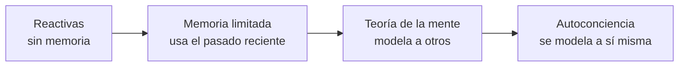

- **Reactivas:** sin memoria. **Deep Blue** (IBM, venció a Kaspárov en 1997) evalúa el tablero en tiempo real, sin concepto de lo anterior.
- **Memoria limitada:** usan observaciones recientes. Los **vehículos autónomos** actuales memorizan velocidad y trayectoria de otros coches para decidir un cambio de carril.
- **Teoría de la mente** y **autoconciencia:** teóricas, sin sistemas reales.

## 4. Breve historia de la IA

| Año | Hito |
|---|---|
| 1943 | McCulloch y Pitts: primera neurona artificial |
| 1950 | Turing publica *Computing Machinery and Intelligence* y propone el **test de Turing** |
| 1956 | Dartmouth: John McCarthy acuña el término **inteligencia artificial** |
| 1958 | Rosenblatt: el **perceptrón**, primera red que aprende |
| 1997 | **Deep Blue** (IBM) vence al campeón de ajedrez Kaspárov |
| 2011 | **Watson** (IBM) gana en *Jeopardy!*; emerge la ciencia de datos |
| 2015 | Google libera **TensorFlow** como código abierto |
| 2016 | **AlphaGo** (DeepMind) vence en Go |
| 2017 | Vaswani et al. publican *Attention Is All You Need*: nace el **Transformer** |
| 2022 | Los **grandes modelos de lenguaje (LLM)**, como ChatGPT, cambian la industria |
| 2024-26 | Modelos **multimodales** y **agentes de IA** autónomos |

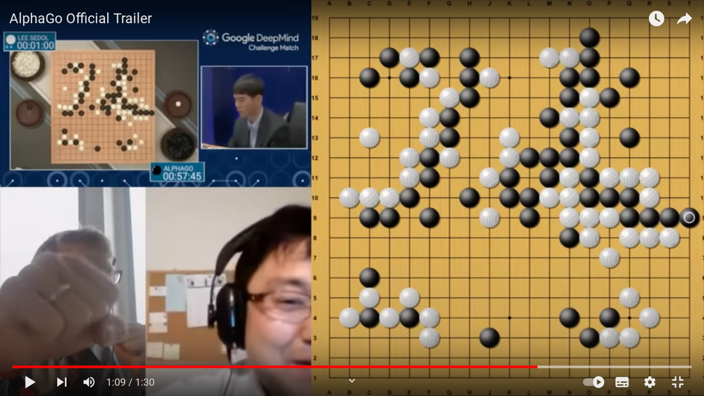

> **Más información.** La historia de la IA es cíclica: periodos de optimismo seguidos de «inviernos» y renacimientos. El salto actual (2017 en adelante) se apoya en tres palancas: **datos** masivos, **cómputo** en GPU y la arquitectura **Transformer**.

## 5. IA, machine learning, deep learning e IA generativa

La relación entre estos términos son **cajas anidadas**:

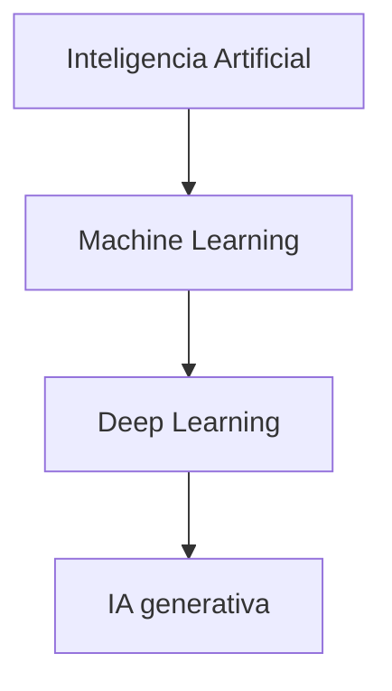

> **Regla para recordar.** **Todo machine learning es IA, pero no toda IA es machine learning.** Y todo deep learning es machine learning; la IA generativa es una parte del deep learning.

### 5.1 Aprendizaje automático (ML)

El **ML** crea **modelos** entrenando un algoritmo sobre datos para predecir o decidir **sin ser programado explícitamente** para cada caso. Su objetivo es la **generalización**: acertar con datos **nuevos**.

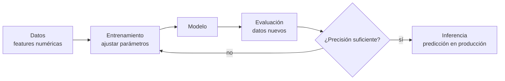

> **Ejemplo · Precio de una casa.** `Precio = A·superficie + B·habitaciones − C·edad + base`. El objetivo del ML es encontrar `A`, `B`, `C` y `base` que minimicen el error con las ventas conocidas.

### 5.2 Tipos de aprendizaje

| Tipo | Datos | Objetivo | Ejemplos |
|---|---|---|---|
| **Supervisado** | Etiquetados | Predecir la respuesta | Clasificación (spam), regresión (precio) |
| **No supervisado** | Sin etiquetas | Encontrar estructura | Clustering, asociación, PCA |
| **Refuerzo (RL)** | Interacción | Maximizar recompensa | Robots, juegos, control |
| **Semi-supervisado** | Pocos etiquetados + muchos sin etiquetar | Combinar | Cuando etiquetar es caro |
| **Auto-supervisado** | Sin etiquetas humanas | Aprender de la estructura | Entrenamiento de LLM |

### 5.3 Deep learning e IA generativa

El **deep learning** usa **redes neuronales con muchas capas**: modela patrones complejos, pero necesita **muchos datos y GPU** y es menos explicable. Arquitecturas clave: **CNN** (imágenes), **RNN/LSTM** (secuencias) y **Transformers** (atención, base de los LLM).

La **IA generativa** crea contenido nuevo (texto, imagen, audio) a partir de un **prompt**. Tres fases: **modelo de base** → **ajuste** (*fine-tuning*, RLHF) → **generación + RAG**.

## 6. Campos de aplicación de la IA (CE 4b)

| Campo | Ejemplos | Beneficio típico |
|---|---|---|
| Industria y logística | Mantenimiento predictivo, rutas, control de calidad visual | Menos paradas y costes |
| Salud | Diagnóstico por imagen, triaje, descubrimiento de fármacos | Precisión, menos errores |
| Finanzas | Detección de fraude, scoring, atención al cliente | Menos pérdidas |
| Comercio y retail | Recomendación, previsión de demanda | Más ventas, menos stock |
| Marketing | Segmentación, análisis de sentimiento | Campañas más rentables |
| Educación | Tutoría adaptativa, análisis de abandono | Personalización |
| Agricultura | Riego y fertilizantes de precisión | Menos coste e impacto |

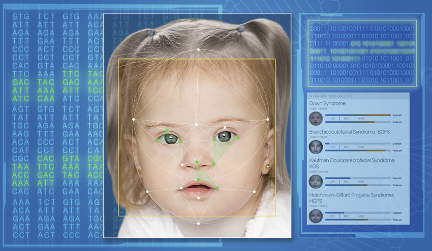

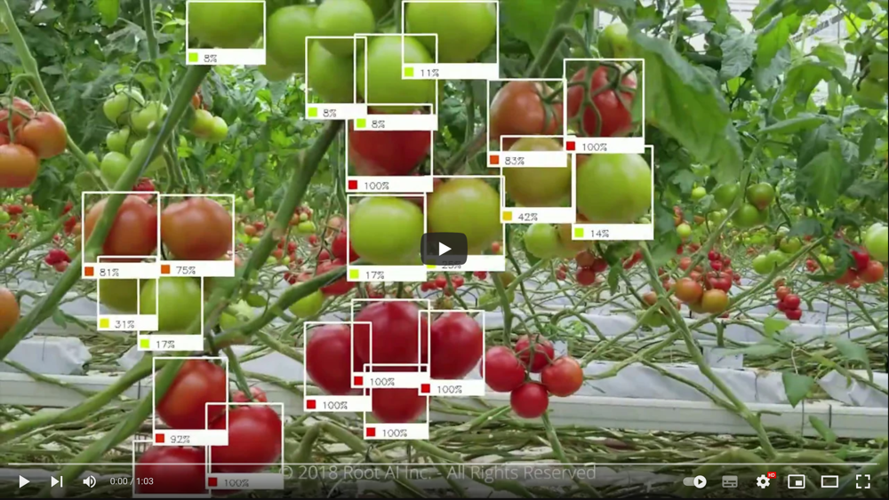

**Casos de estudio con beneficio medible:**

- **Fraude en banca.** Modelo entrenado con datos históricos etiquetados. *Antes*: revisión manual posterior a la pérdida. *Después*: alerta y bloqueo en tiempo real.
- **Mantenimiento predictivo.** Sensores de temperatura y vibración predicen fallos antes de que ocurran. *Antes*: averías inesperadas. *Después*: sustitución programada.
- **Atención al cliente con PLN.** Chatbot que responde consultas frecuentes y deriva las complejas. *Antes*: colas y horario limitado. *Después*: 24/7.
- **Salud: detección precoz.** Visión para detectar infecciones en TAC pulmonar; menos tiempo de respuesta.

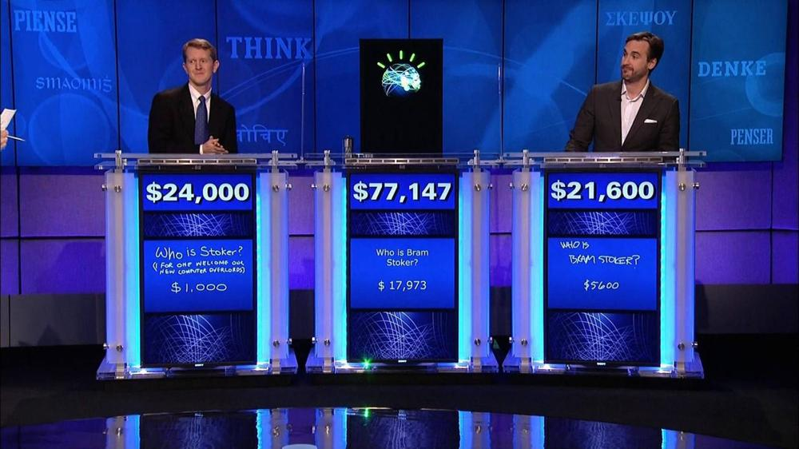

> **Ejemplo · Casos del entorno (proyectos del módulo).** **Proyecto LARA** (asistente/analítica de dominio), **hidrógeno verde** (optimización de proceso y mantenimiento predictivo) y **colmena inteligente** (IoT + visión/sonido para monitorizar y decidir). Cada uno se caracteriza con la ficha de 1 minuto y se mide con un KPI.

### 6.1 La IA en la vida cotidiana

Muchas tecnologías que usas a diario son IA, aunque no lo parezca:

| Uso cotidiano | Cómo interviene la IA |
|---|---|
| **Compras online y publicidad** | Recomendaciones personalizadas; optimización de inventario |
| **Buscadores** | Aprenden de los datos para ordenar resultados |
| **Asistentes de voz** | Responden, recomiendan y organizan rutinas |
| **Traducción automática** | Traduce texto y voz; subtítulos automáticos |
| **Hogar y ciudad inteligente** | Termostatos que aprenden; regulación del tráfico |
| **Ciberseguridad** | Detección de ciberataques por patrones |
| **Desinformación** | Detección de noticias falsas |
| **Administración pública** | Alertas tempranas de catástrofes; trámites automatizados |

## 7. Técnicas básicas de la IA (CE 4c)

| Técnica | Qué hace | Uso típico |
|---|---|---|
| **Clasificación** (supervisado) | Asigna una categoría | Spam, priorizar incidencias, cribar CV |
| **Regresión** (supervisado) | Predice un valor numérico | Prever demanda, precios |
| **Clustering** (no supervisado) | Agrupa por similitud | Segmentar clientes |
| **Detección de anomalías** | Detecta lo atípico | Fraude, averías |
| **PLN** | Entiende y genera lenguaje | Chatbots, sentimiento, resúmenes |
| **Visión artificial** | Interpreta imágenes y vídeo | Inspección, lectura de documentos |
| **Robótica** | Percibe y actúa en el mundo físico | Almacén, fabricación |
| **Sistemas expertos** | Reglas de un experto | Diagnóstico técnico |
| **IA generativa / agentes** | Crea contenido y actúa | Redacción, tramitación |

## 8. Nuevas formas de interacción y eficiencia operativa (CE 4d)

| Interacción | Qué es | Ejemplo |
|---|---|---|
| **Asistente virtual** | Responde por voz o texto | Siri, Alexa |
| **Chatbot** | Conversación automatizada | Soporte de tienda online |
| **Interacción por voz** | Transcribe y analiza audio | Actas de reunión |
| **Interacción por visión** | Lee imágenes y vídeo | Control de accesos, inspección |
| **Agentes autónomos** | Ejecutan tareas con herramientas | Reservar, tramitar una incidencia |

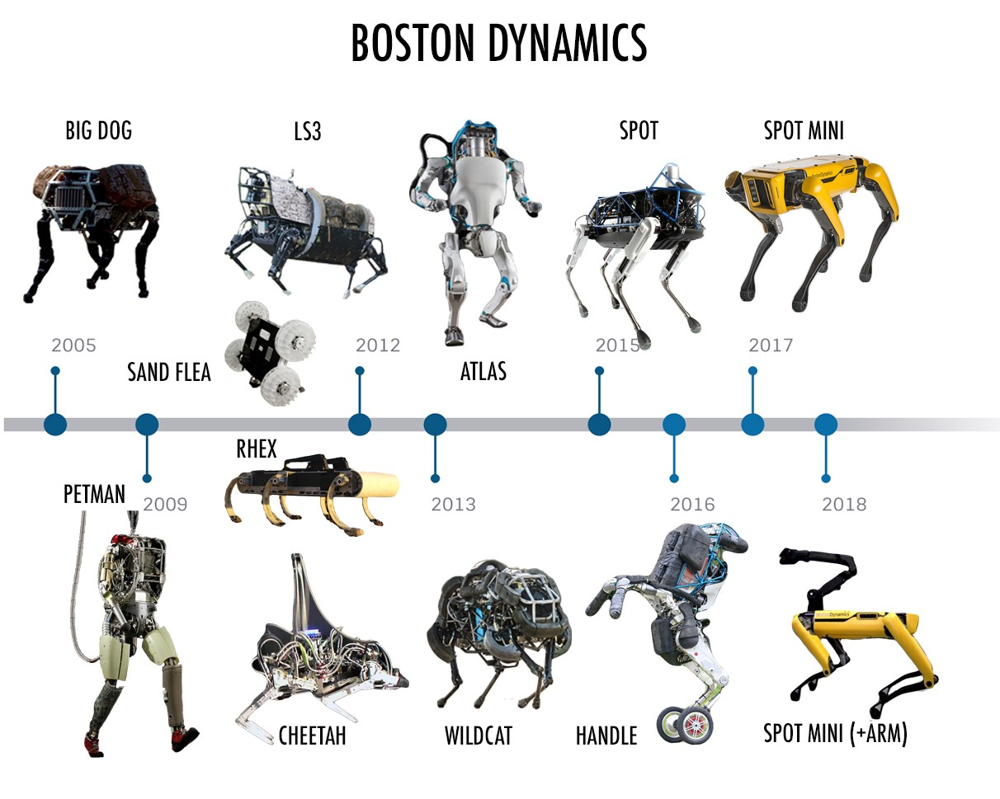

**KPIs que se suelen mejorar:**

| Caso | Antes (sin IA) | Después (con IA) |
|---|---|---|
| Atención al cliente | Colas, horario limitado | Chatbot 24/7 |
| Inspección de calidad | Revisión manual, errores | Visión artificial |
| Previsión de demanda | Roturas o excedentes | Predicción con ML |
| Detección de fraude | Revisión posterior | Tiempo real |

**KPIs con nombre propio:** **FCR** (resolución al primer contacto), **AHT** (tiempo medio de gestión), **Containment rate** (% cerradas por la IA), **OEE** (efectividad de equipo), **MTBF** (tiempo medio entre averías), **Cycle time** y **coste por documento**.

> **Ejemplo resuelto · El KPI decide.** Un centro recibe **1.000 consultas/día** a **3 €** y 5 min cada una. Un chatbot resuelve el **60 %** en 10 s a **0,10 €**.
> - Antes: `1.000 × 3 € = 3.000 €/día`.
> - Después: `600 × 0,10 € + 400 × 3 € = 1.260 €/día` → **−58 % de coste** y tiempo medio de ~5 a ~2 min.
>
> Esquema que se repite siempre: **problema → KPI base → técnica → antes/después → decisión** (con riesgos).

### 8.1 De la técnica al beneficio

| Técnica | Ejemplo de uso | Mejora operativa |
|---|---|---|
| Clasificación | Priorizar incidencias, cribar CV | Menos tiempo y error |
| Regresión | Prever demanda, precios | Menos stock roto |
| Clustering | Segmentar clientes | Campañas más rentables |
| Anomalías | Fraude, averías | Menos pérdidas |
| PLN | Chatbots, sentimiento | Atención 24/7 |
| Visión | Inspección, OCR | Menos errores |
| Agentes / GenAI | Redacción, tramitación | Tareas repetitivas ↓ |

## 9. Predictivo vs. generativo, agentes vs. fine-tuning

- **IA predictiva:** estima un resultado (probabilidad, categoría, valor).
- **IA generativa:** crea contenido nuevo a partir de un *prompt*.
- **Agentes:** programas que **diseñan su flujo de trabajo** y **usan herramientas** para lograr un objetivo. No solo responden: **actúan**.
- ***Fine-tuning*:** adaptar un modelo base a una tarea concreta con datos específicos. Un agente puede usar un modelo afinado; no son excluyentes.

## 10. Beneficios, riesgos y marco legal

- **Beneficios:** automatización de tareas repetitivas, más y más rápida información de los datos, mejor decisión, menos errores, disponibilidad 24×7, menor riesgo físico.
- **Riesgos:** datos con sesgos o manipulación, modelos robados o alterados, fallos operativos (*model drift*), privacidad y ética. Un modelo entrenado con datos sesgados **amplifica** ese sesgo.
- **Marco normativo:** el **AI Act** (Reglamento UE 2024/1689) clasifica la IA por riesgo; el **RGPD** limita el uso de datos personales (minimización). El calendario del AI Act se ha ido actualizando: verifícalo en el DOUE antes de evaluarlo.
- **IA responsable:** explicabilidad, equidad, robustez, rendición de cuentas y privacidad.

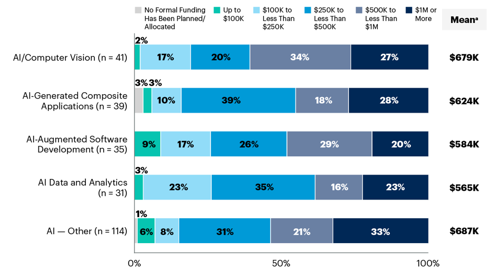

### Puntos clave

- Un sistema inteligente **percibe, razona y actúa**; sus rasgos son autonomía, adaptación y decisión.
- La IA se clasifica por **tarea** (débil/fuerte), por **escuela** (convencional/computacional) y por **capacidades** (Russell-Norvig, Hintze): son lentes complementarias.
- **IA > ML > DL > IA generativa**: todo ML es IA, pero no toda IA es ML.
- Aprendizaje **supervisado**, **no supervisado**, **por refuerzo**, **semi** y **auto-supervisado**.
- La IA ya está en la vida cotidiana y en la empresa; las **nuevas interacciones** mejoran la eficiencia reduciendo coste, tiempo o error.
- Sin **KPI comparado** (antes/después), no hay mejora demostrable.

## 11. Ejemplo guiado: de un problema de negocio a una solución de IA

Cerramos con el esquema que repetirás en el miniproyecto. El caso es ficticio para no depender de datos externos.

**Problema:** una tienda online recibe **200 reclamaciones de devolución al día** por email. Hoy, dos personas leen cada correo, lo clasifican a mano y lo enrutan. Tardan unos **8 minutos** por correo y el error de clasificación ronda el **15 %**.

**Paso 1 · Elegir el KPI.** Medimos el **tiempo de ciclo** (8 min/reclamación), la **tasa de error** (15 %) y el **coste** (2 personas a jornada completa).

**Paso 2 · Identificar la técnica.** Clasificar texto en categorías (devolución, cambio, defecto, consulta) es **PLN + clasificación supervisada** (p. ej. naive Bayes sobre texto vectorizado).

**Paso 3 · Estimar el antes/después.** Un clasificador resuelve el **70 %** en 30 s y el resto lo revisa una persona:

- Tiempo medio por correo: `0,30 × 0,5 min + 0,70 × 8 min ≈ 5,8 min` (frente a 8).
- Error de clasificación objetivo: **< 5 %** (frente al 15 %).
- Las dos personas pasan de clasificar a **tratar solo los casos complejos**.

**Paso 4 · Decidir y comunicar.** El responsable presenta la mejora con los KPIs antes/después y señala los riesgos (correos ambiguos, privacidad de los datos según el RGPD).

> **Más información.** Este esquema —*problema → KPI → técnica → antes/después → decisión*— es exactamente lo que significa **caracterizar un sistema de IA** (RA1): no hace falta entrenar todavía el modelo, solo identificar qué técnica encaja y qué mejora operativa aporta.

## 12. Autoevaluación

1. Define con tus palabras la inteligencia artificial y cita tres capacidades que simula.

Tecnología que permite a las máquinas simular capacidades humanas: **aprender, razonar y percibir/decidir** (también comprender y crear).

2. ¿Qué es un sistema inteligente y qué tres rasgos lo caracterizan?

Un sistema que **percibe → razona → actúa** para lograr un objetivo. Rasgos: **autonomía, adaptación y toma de decisiones**.

3. ¿Es IA un termostato? ¿De qué tipo?

Sí, formalmente es IA **basada en reglas** (`si T < 18 → enciende`). Es un caso elemental; cuando las reglas no bastan, se usa **machine learning**.

4. Diferencia IA débil y fuerte. ¿Cuál es toda la IA actual?

La **débil** resuelve una tarea acotada y no se adapta; la **fuerte** igualaría a una persona en cualquier tarea. **Toda la IA actual es débil**.

5. Diferencia la escuela convencional de la computacional.

La **convencional** (simbólico-deductiva) razona con reglas y lógica explícitas; la **computacional** (subsimbólica-inductiva) **aprende de los datos** (redes neuronales, SVM).

6. Ordena los niveles de Hintze y pon un ejemplo.

Reactiva → memoria limitada → teoría de la mente → autoconciencia. **Deep Blue** es reactiva; un **coche autónomo** es de memoria limitada.

7. Explica «todo ML es IA, pero no toda IA es ML».

El ML es una **familia dentro** de la IA (aprende de datos). Hay IA sin ML: sistemas basados en reglas y búsquedas heurísticas.

8. Clasifica: spam con etiquetas, agrupar clientes, robot por recompensa.

**Supervisado** (spam), **no supervisado** (clustering) y **refuerzo** (recompensa).

9. ¿Qué diferencia hay entre clasificación y regresión?

La **clasificación** predice una categoría (spam/no spam); la **regresión**, un valor numérico continuo (precio).

10. ¿Qué es un KPI y por qué decide si la IA aporta eficiencia?

Un indicador medible (tiempo de ciclo, coste unitario, tasa de error). La IA aporta eficiencia **solo si mejora un KPI** comparado antes/después; sin número, es una opinión.

## 13. Glosario

| Término | Definición |
|---|---|
| **IA** | Tecnología que simula capacidades humanas (aprender, razonar, decidir) |
| **Sistema inteligente** | Sistema que percibe, razona y actúa para lograr un objetivo |
| **IA débil / fuerte** | Orientada a una tarea concreta (toda la actual) / IA general al nivel humano (teórica) |
| **ANI / AGI / ASI** | IA estrecha / general / superinteligencia |
| **IA convencional / computacional** | Escuela simbólico-deductiva / subsimbólica-inductiva |
| **Test de Turing** | Un interrogador no distingue a la máquina de una persona |
| **Test de Lovelace** | El sistema origina algo que su programador no puede explicar |
| **ML** | Técnicas que aprenden patrones de los datos sin programación explícita |
| **Deep learning** | Subconjunto del ML basado en redes neuronales profundas |
| **IA generativa** | IA que crea contenido nuevo (texto, imagen, audio) |
| **LLM** | Modelo de lenguaje grande (p. ej. ChatGPT) |
| **Generalización** | Capacidad del modelo de acertar con datos nuevos |
| **Supervisado / no supervisado** | Con etiquetas / sin etiquetas |
| **Refuerzo (RL)** | Aprendizaje por prueba-error con recompensas |
| **Clasificación / regresión** | Predecir categorías / valores continuos |
| **Clustering** | Agrupación no supervisada de datos similares |
| **PLN** | Procesamiento del lenguaje natural (texto y voz) |
| **Visión por computador** | IA que interpreta imágenes y vídeo |
| **Sistema experto** | IA basada en reglas de un experto humano |
| **Agente de IA** | Programa autónomo que usa herramientas para lograr objetivos |
| **Prompt** | Instrucción de texto para un modelo generativo |
| **Eficiencia operativa** | Reducción de costes, tiempos o errores en un proceso |
| **KPI** | Indicador clave de rendimiento (tiempo, coste, error) |

## 14. Preguntas frecuentes

??? question "¿Todo lo que usa datos es machine learning?"
    No. Hay IA sin ML (reglas, búsquedas heurísticas). El ML es la familia que **aprende** de los datos; todo ML es IA, pero no toda IA es ML.

??? question "¿En qué se diferencian IA débil e IA fuerte?"
    La débil resuelve una tarea concreta y no se adapta más allá de lo programado; la fuerte igualaría a una persona en cualquier tarea. La fuerte es teórica.

??? question "¿Cuándo conviene usar aprendizaje profundo?"
    Con **muchos datos y tareas complejas** (imagen, audio, texto). Con datos pequeños o problemas sencillos, un modelo clásico (árbol, KNN) suele bastar y es más explicable.

??? question "¿Un chatbot entiende lo que le digo?"
    No: procesa estadísticamente el lenguaje y genera respuestas plausibles. Puede equivocarse (alucinaciones) y conviene verificar.

??? question "¿La IA va a sustituir a las personas?"
    Automatiza **tareas**, no profesiones enteras. Lo habitual es que cambie el trabajo: las personas se centran en los casos complejos.

??? question "¿Qué es la IA generativa y en qué se diferencia de la predictiva?"
    La **predictiva** estima un resultado; la **generativa** crea contenido nuevo a partir de un *prompt*.

## 15. Recursos, vídeos y fuentes

**Materiales del módulo (David Martínez):**
- [UD01 · Caracterización de sistemas de IA](https://martinezpenya.es/ModelosIA/UD01/UD01_ES.html)
- [Ejercicios de autoevaluación UD01](https://martinezpenya.es/ModelosIA/UD01/UD01_Ejercicios.html)
- Notebooks: [N01 Técnicas de IA](https://martinezpenya.es/ModelosIA/UD01/notebooks/UD01_N01_tecnicas_ia.html) · [N02 Mapa de sistemas](https://martinezpenya.es/ModelosIA/UD01/notebooks/UD01_N02_mapa_sistemas.html) · [N05 Línea del tiempo](https://martinezpenya.es/ModelosIA/UD01/notebooks/UD01_N05_linea_tiempo.html)

**Vídeos (YouTube):**
- [¿Qué es la inteligencia artificial?](https://www.youtube.com/results?search_query=que+es+la+inteligencia+artificial)
- [Historia de la IA: de Turing a los LLM](https://www.youtube.com/results?search_query=historia+inteligencia+artificial)
- [Machine learning explicado](https://www.youtube.com/results?search_query=machine+learning+explicado)
- [IA generativa y LLM](https://www.youtube.com/results?search_query=ia+generativa+llm+explicado)
- [AlphaGo y Deep Blue](https://www.youtube.com/results?search_query=alphago+deep+blue)

**Fuentes y organismos:**
- [IBM · ¿Qué es la inteligencia artificial?](https://www.ibm.com/topics/artificial-intelligence) · [IBM · ¿Qué es el machine learning?](https://www.ibm.com/topics/machine-learning)
- [Parlamento Europeo · ¿Qué es la IA y cómo se usa?](https://www.europarl.europa.eu/topics/en/article/20200827STO85804/artificial-intelligence-opportunities-and-risks)
- [AI Act (Reglamento UE 2024/1689)](https://www.boe.es/doue/2024/1689/L00001-00144.pdf)
- [Russell y Norvig · AIMA](https://aima.cs.berkeley.edu/) · [Arend Hintze · «The four types of AI» (2016)](https://theconversation.com/understanding-the-four-types-of-ai-from-reactive-robots-to-self-aware-beings-67616)
- [Vaswani et al. · *Attention Is All You Need* (2017)](https://arxiv.org/abs/1706.03762)

> Créditos de imágenes: ilustraciones adaptadas de los materiales de la UD01 de David Martínez Peña (CC BY-NC-SA 4.0).

## Cobertura de criterios

| CE | Dónde se evidencia |
|----|--------------------|
| **4a** | §1–§4 (definición, ciclo, débil/fuerte, clasificaciones, historia) + Miniproyecto RA1 |
| **4b** | §6 (campos de aplicación y casos con beneficio medible) |
| **4c** | §5 y §7 (jerarquía IA>ML>DL>GenAI, técnicas) |
| **4d** | §8–§9 (interacciones, KPIs, predictivo/generativo, agentes) |
