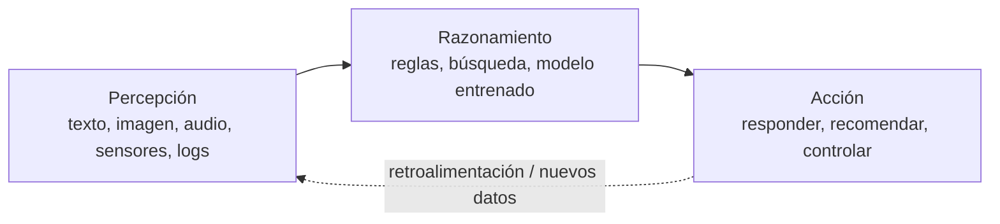
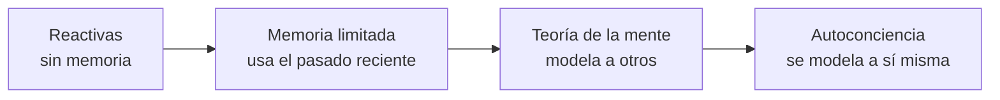
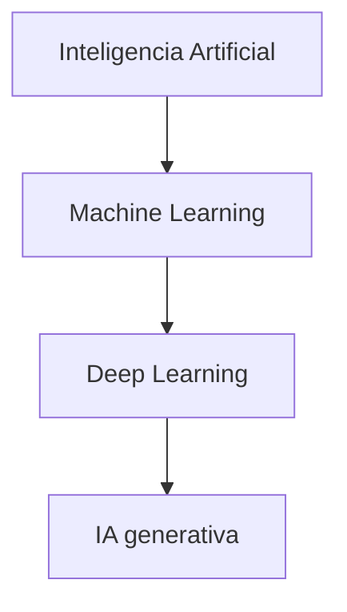
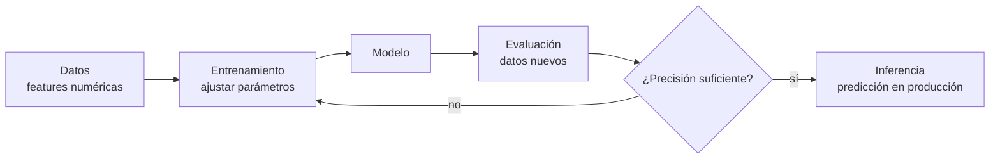
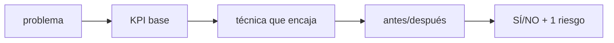

# S01 · Guía de clase — Caracterización de sistemas de IA

> **Una sola página para la clase y para repasar.** Tiene los [apuntes](apuntes.md) como base y, intercalados en el momento en que se trabajan, los **vídeos** de DotCSV, los **ejercicios** y los **cuadernos de Colab**. Es la versión para el alumnado de la [presentación](../../presentaciones/b01_s01.html); el plan minuto a minuto del docente está en el [guion de sesión](guion_video.md).

!!! abstract "Cómo leer esta guía"
    - Los bloques **«Lo esencial»** son lo que se trabaja en clase y se evalúa.
    - Los bloques desplegables **«Ampliación»** son *lectura de mapa*: existen para que sepas dónde encaja cada cosa, no entran como temario de examen.
    - Los bloques **«Ejercicio»** se hacen en el momento; las soluciones están en [Soluciones de prácticas](soluciones_s01.md).
    - Sección y criterio de evaluación (CE) de cada parte entre paréntesis.

## El plan de la sesión

| # | Tarea | Cómo la compruebo |
|---|---|---|
| **1** | **Caracterizar** cualquier sistema de IA con la ficha de 1 minuto | Rellenas una ficha completa en el entregable |
| **2** | **Decidir con 1 KPI** si compensa | Calculas antes/después y dices **sí/no + 1 riesgo** |

| CE | Criterio oficial | Dónde se trabaja aquí |
|----|------------------|-----------------------|
| **4a** | Se han identificado los principios fundamentales de los sistemas inteligentes. | §1 – §4 |
| **4b** | Se ha recopilado información sobre campos donde se aplica la IA. | §6 |
| **4c** | Se han identificado las técnicas básicas a utilizar en el entorno de la IA. | §5 y §7 |
| **4d** | Se han identificado nuevas formas de interacciones en los negocios que mejoran la eficiencia operativa. | §8 – §9 |

| Min | Momento | Sección |
|---|---|---|
| 0–10 | Apertura: gancho y ficha | §1 |
| 10–14 | Vídeo 1 → conceptos → Ejercicio 1 (+ N02) | §2 |
| 28–32 | Vídeo 2 → jerarquía IA > ML > DL > GenAI → tipos de aprendizaje → Ejercicio 2 (+ N01) | §5 |
| 50–60 | Vídeo 3 → puesta en común | §5 |
| 60–95 | **Tarea 2** · KPI y caso de las 1.000 consultas | §8 |
| 95–120 | Ejercicio 3, cierre y entregable | §12 |

---

## 1 · Apertura — ¿es inteligente tu lavadora? (CE 4a)

Tu lavadora mete agua y detergente y **ejecuta siempre el mismo guion**: tiempos, giros, temperatura. Si le echas una manta pesada, **no piensa nada nuevo**: sigue el mismo programa. Eso es **automatización**, no inteligencia.

Cambia una sola cosa: que un **sensor de carga** ajuste el agua **aprendiendo de los 10.000 lavados anteriores**, sin que nadie escriba la regla. **Eso ya es IA.**

!!! quote "La frase de la sesión"
    **¿Qué cambió? No la lavadora: el que DECIDE.** Pasa de ser *una regla escrita a mano* a ser *un modelo aprendido de los datos*.

### 1.1 ¿Qué es la inteligencia artificial?

La **inteligencia artificial (IA)** es la tecnología que permite a las máquinas **simular el aprendizaje, la comprensión, la resolución de problemas, la toma de decisiones y la creatividad** humanas. Las aplicaciones con IA pueden ver e identificar objetos, entender y responder al lenguaje, aprender de la experiencia, recomendar decisiones y, cada vez más, **actuar de forma autónoma** (un agente que reserva un vuelo, un coche que conduce).

> **Definición (Comisión Europea, adaptada).** Un **sistema de IA** es un software —y, en su caso, hardware— diseñado por humanos que, ante un objetivo complejo, **percibe su entorno** (datos estructurados o no), **razona** sobre el conocimiento derivado de esos datos y **decide** las mejores acciones para lograr el objetivo, en el mundo físico o digital. Puede usar **reglas simbólicas** o **aprender un modelo numérico**, y adaptar su comportamiento al observar los efectos de sus acciones.

### 1.2 El ciclo percepción → razonamiento → acción

Un **sistema inteligente** percibe, razona y actúa para lograr un objetivo:



- **Percepción:** captar datos del mundo (texto, imagen, audio, sensores, registros de negocio).
- **Razonamiento:** procesarlos para obtener conocimiento o decidir (un modelo entrenado, un conjunto de reglas, una búsqueda).
- **Acción:** actuar sobre el entorno o sobre las personas (responder, recomendar, controlar un proceso).

### 1.3 Características de un sistema inteligente

| Característica | Descripción |
|---|---|
| **Autonomía** | Opera sin supervisión humana constante |
| **Adaptación** | Aprende de los datos y mejora con la experiencia |
| **Toma de decisiones** | Recomienda o actúa basándose en datos, no solo en reglas fijas |

!!! example "¿Es IA un termostato?"
    Un termostato `si T < 18 °C → enciende` es, formalmente, un sistema de IA **basado en reglas**: percibe (termómetro), razona (la regla) y actúa (enciende). La diferencia con la IA moderna es que, cuando la tarea se complica, definir todas las reglas a mano es imposible: ahí entra el **aprendizaje automático**, que deduce los patrones de los datos.

**Reglas o datos: el único dilema que importa hoy.**

| | Reglas escritas | Aprendido de datos |
|---|---|---|
| **Ejemplo** | Termostato `si T<18 → enciende` | Filtro de spam que deduce criterios de ejemplos |
| **Cuándo** | Tarea cerrada y enumerable | Demasiados casos para escribir reglas |
| **Límite** | No generaliza | Necesita datos y evaluación honesta |

> **Regla de decisión:** ¿puedo escribir todas las reglas en una hoja? Si sí → **reglas**. Si no → **datos** (machine learning).

---

## 2 · IA débil y IA fuerte (CE 4a)

La clasificación más simple de la IA es **según la tarea que resuelve**:


| Nivel | Alcance | Estado hoy |
|---|---|---|
| **ANI (débil / estrecha)** | Una o pocas tareas acotadas; reactiva, sin conciencia | **Toda la IA existente** (Siri, recomendadores, traductores, ChatGPT) |
| **AGI (general)** | Transfiere conocimiento y razona en dominios no entrenados | Teórica, sin prototipo |
| **ASI (superinteligencia)** | Supera lo humano en cualquier tarea intelectual | Ciencia-ficción |

La IA débil es **reactiva** (no actúa si no se la activa), **no flexible** (colapsa ante lo no previsto) y **no tiene conciencia**: computa, no razona en sentido humano. Aun así **tiene riesgos**: al ejecutar su tarea sin considerar el contexto ético o social, puede causar daño si se usa sin prudencia.

> **«Débil» y «estrecha» son lo mismo** (ANI, *narrow*). El ejemplo que lo deja claro: ChatGPT redacta un correo perfecto, pero si le pides **presupuestar** ese mismo correo se inventa los números. Es brillante en una tarea y nula en la contigua.

??? info "Ampliación · Tests de inteligencia (Turing y Lovelace)"
    El **test de Turing** (1950) es conductual: un interrogador conversa por escrito con una persona y una máquina; si no las distingue, la máquina lo supera. El **test de Lovelace** (2001) mide otra cosa: si el sistema **origina** un resultado que su propio programador no puede explicar a partir del código. Superar Turing no implica superar Lovelace: Turing mide si *engañamos*, no si *comprendemos*.

### Vídeo 1 · ¿Qué es la IA? (00:00–03:26)

<iframe width="100%" height="380" src="https://www.youtube.com/embed/KytW151dpqU?start=0&end=206" title="DotCSV · fragmento 1" frameborder="0" allow="accelerometer; autoplay; clipboard-write; encrypted-media; gyroscope; picture-in-picture; web-share" referrerpolicy="strict-origin-when-cross-origin" allowfullscreen></iframe>

Qué mirar: el **mapa conceptual** (IA, ML, RN, big data y DL se solapan) · **IA débil vs. fuerte** · **imitar no es comprender**. [Abrir en YouTube (00:00)](https://www.youtube.com/watch?v=KytW151dpqU&t=0s) · Reproduce a 1,25×.

### La ficha de 1 minuto

La ficha destila todo lo anterior en cuatro preguntas:

```text
FICHA DE 1 MINUTO  —  <sistema>

1. ¿Qué PERCIBE?               (datos de entrada)
2. ¿Razona con REGLAS o con DATOS?
3. ¿Qué ACCIÓN produce?        (qué hace al final)
4. Tarea ESTRECHA: ¿cuál?      (solo una; lo que NO hace)
```

**Ejemplo resuelto — chatbot de reclamaciones:**

| Campo | Respuesta |
|---|---|
| **Percibe** | El texto del correo y el historial del cliente |
| **Reglas o datos** | **Datos**: clasificador entrenado con reclamaciones etiquetadas |
| **Acción** | Enruta el caso (devolución / cambio / defecto / consulta) |
| **Tarea estrecha** | Clasificar esas 4 categorías. **No** conversa de otra cosa |

| Error típico | Por qué falla |
|---|---|
| «Usa IA» en la casilla 2 | No dice **cómo** decide: ¿reglas escritas o datos? |
| Tarea estrecha: «ayudar a los usuarios» | No es estrecha: si mañana le piden otra cosa, ¿la hace? |
| Solo 3 casillas | Se olvida la 4, la más importante: **qué NO hace** |
| «Es inteligente» en la 3 | Describe, no actúa: ¿responde, recomienda, controla? |

!!! example "Ejercicio 1 · Ficha de un sistema conocido (14 min)"
    Rellena la ficha de 1 minuto de **un sistema que conozcas de verdad** (tu curro, una tienda, un DAW…). Después clasifícalo como **IA débil** (una tarea). *No valen frases de folleto.*

    **Cuaderno N02 · Mapa de sistemas:** es la plantilla de la ficha; elige 1 sistema real y clasifícalo con la evidencia que te hace decidir.

    [Abrir N02 en Colab](https://colab.research.google.com/github/jmperez-profesor/mia/blob/main/docs/bloques/B01_RA1/sesion01_mapa_sistemas.ipynb){ .md-button }

---

## 3 · Tres lentes para clasificar la IA (CE 4a)

La IA se puede clasificar de tres maneras complementarias. No son excluyentes: son tres formas de mirar lo mismo.

### 3.1 Escuelas de pensamiento

| | IA convencional (simbólico-deductiva) | IA computacional (subsimbólico-inductiva) |
|---|---|---|
| **Cómo razona** | Análisis formal y estadístico explícito | Aprendizaje interactivo a partir de datos |
| **Técnicas** | Sistemas expertos, razonamiento por casos, redes bayesianas | Redes neuronales, SVM, lógica difusa, computación evolutiva |
| **Origen** | La «automatización» clásica (reglas + estadística) | El **aprendizaje automático** actual |

### 3.2 Russell y Norvig (1995)

En *Artificial Intelligence: A Modern Approach* proponen cuatro categorías según el **origen del comportamiento**:

| Categoría | Enfoque | Ejemplo |
|---|---|---|
| **Sistemas cognitivos** | Piensan como humanos | Modelos cognitivos |
| **Test de Turing** | Actúan como humanos | Robótica conversacional |
| **Leyes del pensamiento** | Piensan con lógica formal | Sistemas expertos acotados |
| **Agentes racionales** | Actúan racionalmente | Agentes de software actuales |

### 3.3 Hintze (2016): por capacidades



- **Reactivas:** sin memoria. **Deep Blue** (IBM, venció a Kaspárov en 1997) evalúa el tablero en tiempo real, sin concepto de lo anterior.
- **Memoria limitada:** usan observaciones recientes. Los **vehículos autónomos** actuales memorizan velocidad y trayectoria de otros coches para decidir un cambio de carril.
- **Teoría de la mente** y **autoconciencia:** teóricas, sin sistemas reales.

---

## 4 · Breve historia de la IA (mapa de lectura)

??? info "Ampliación · De McCulloch y Pitts a los agentes de IA"
    

    | Año | Hito |
    |---|---|
    | 1943 | McCulloch y Pitts: primera neurona artificial |
    | 1950 | Turing publica *Computing Machinery and Intelligence* y propone el **test de Turing** |
    | 1956 | Dartmouth: John McCarthy acuña el término **inteligencia artificial** |
    | 1958 | Rosenblatt: el **perceptrón**, primera red que aprende |
    | 1997 | **Deep Blue** (IBM) vence al campeón de ajedrez Kaspárov |
    | 2011 | **Watson** (IBM) gana en *Jeopardy!*; emerge la ciencia de datos |
    | 2015 | Google libera **TensorFlow** como código abierto |
    | 2016 | **AlphaGo** (DeepMind) vence en Go |
    | 2017 | Vaswani et al. publican *Attention Is All You Need*: nace el **Transformer** |
    | 2022 | Los **grandes modelos de lenguaje (LLM)**, como ChatGPT, cambian la industria |
    | 2024-26 | Modelos **multimodales** y **agentes de IA** autónomos |

    

    

    La historia de la IA es cíclica: periodos de optimismo seguidos de «inviernos» y renacimientos. El salto actual (2017 en adelante) se apoya en tres palancas: **datos** masivos, **cómputo** en GPU y la arquitectura **Transformer**.

---

## 5 · IA, machine learning, deep learning e IA generativa (CE 4c)

### Vídeo 2 · El papel del machine learning (03:26–05:37)

<iframe width="100%" height="380" src="https://www.youtube.com/embed/KytW151dpqU?start=206&end=337" title="DotCSV · fragmento 2" frameborder="0" allow="accelerometer; autoplay; clipboard-write; encrypted-media; gyroscope; picture-in-picture; web-share" referrerpolicy="strict-origin-when-cross-origin" allowfullscreen></iframe>

Qué mirar: los **subcampos** (robótica, NLP, voz) · **ML: supervisado, no supervisado y refuerzo** · las **técnicas** (árboles, regresión, clasificación, clustering). [Abrir en YouTube (03:26)](https://www.youtube.com/watch?v=KytW151dpqU&t=206s)

### 5.1 Cajas anidadas

La relación entre estos términos son **cajas anidadas**:



> **Regla para recordar.** **Todo machine learning es IA, pero no toda IA es machine learning.** Todo deep learning es machine learning; la IA generativa es una parte del deep learning.

### 5.2 Aprendizaje automático (ML)

El **ML** crea **modelos** entrenando un algoritmo sobre datos para predecir o decidir **sin ser programado explícitamente** para cada caso. Su objetivo es la **generalización**: acertar con datos **nuevos**.



!!! example "Ejemplo · Precio de una casa"
    `Precio = A·superficie + B·habitaciones − C·edad + base`. El objetivo del ML es encontrar `A`, `B`, `C` y `base` que minimicen el error con las ventas conocidas.

### 5.3 Tipos de aprendizaje

| Tipo | Datos | Objetivo | Ejemplos |
|---|---|---|---|
| **Supervisado** | Etiquetados | Predecir la respuesta | Clasificación (spam), regresión (precio) |
| **No supervisado** | Sin etiquetas | Encontrar estructura | Clustering, asociación, PCA |
| **Refuerzo (RL)** | Interacción | Maximizar recompensa | Robots, juegos, control |
| **Semi-supervisado** | Pocos etiquetados + muchos sin etiquetar | Combinar | Cuando etiquetar es caro |
| **Auto-supervisado** | Sin etiquetas humanas | Aprender de la estructura | Entrenamiento de LLM |

> **El criterio que importa: ¿hay etiquetas?** Supervisado = te dieron la respuesta; no supervisado = nadie te la dio; refuerzo = aprende por ensayo y recompensa. Truco: si la respuesta es **«sí/no» o un nombre** → clasificación; si es un **número con decimales** → regresión; si **nadie te dio las respuestas** → clustering.

!!! example "Ejercicio 2 · Clasifica: supervisado o no supervisado (18 min)"
    Clasifica cada ítem (técnica y tipo de aprendizaje):

    | Ítem | Técnica | Tipo |
    |---|---|---|
    | (a) Grietas por foto | ¿? | ¿? |
    | (b) Agrupar clientes | ¿? | ¿? |
    | (c) Spam | ¿? | ¿? |
    | (d) Asistente por voz | ¿? | ¿? |

    ??? tip "Solución"
        (a) Visión artificial · supervisado. (b) **Clustering · no supervisado** (es el único sin etiquetas previas). (c) Clasificación de texto · supervisado. (d) PLN · supervisado / secuencial.

    **Cuaderno N01 · Técnicas de IA (demo).** La demo **supervisada** (KNN sobre clientes) devuelve la etiqueta `0/1` («reclamará / no reclamará»); la **no supervisada** (k-means sobre compras) devuelve `0/1` por fila, pero son **identificadores de grupo** inventados, no «sí/no».

    [Abrir N01 en Colab](https://colab.research.google.com/github/jmperez-profesor/mia/blob/main/docs/bloques/B01_RA1/sesion01_tecnicas_ia.ipynb){ .md-button }

### 5.4 Deep learning e IA generativa

El **deep learning** usa **redes neuronales con muchas capas**: modela patrones complejos, pero necesita **muchos datos y GPU** y es menos explicable. Arquitecturas clave: **CNN** (imágenes), **RNN/LSTM** (secuencias) y **Transformers** (atención, base de los LLM).

La **IA generativa** crea contenido nuevo (texto, imagen, audio) a partir de un **prompt**. Tres fases: **modelo de base** → **ajuste** (*fine-tuning*, RLHF) → **generación + RAG**.


### Vídeo 3 · Redes neuronales y big data (05:37–07:46)

<iframe width="100%" height="380" src="https://www.youtube.com/embed/KytW151dpqU?start=337&end=466" title="DotCSV · fragmento 3" frameborder="0" allow="accelerometer; autoplay; clipboard-write; encrypted-media; gyroscope; picture-in-picture; web-share" referrerpolicy="strict-origin-when-cross-origin" allowfullscreen></iframe>

Qué mirar: el **aprendizaje jerárquico** (capas concretas → abstractas) · **deep learning = muchas capas** · **big data** y el mapa final **IA ⊃ ML ⊃ RN/DL**. [Abrir en YouTube (05:37)](https://www.youtube.com/watch?v=KytW151dpqU&t=337s)

!!! question "Puesta en común · tres preguntas orales"
    1. **¿Todo ML es IA? ¿Y toda IA es ML?** — Todo ML es IA; no toda IA es ML (hay IA de reglas y de búsqueda).
    2. **Un ejemplo de IA sin ML.** — Un sistema experto con reglas `si… entonces…`: es IA y no aprende de datos.
    3. **¿Dónde encaja la generativa?** — Dentro del deep learning: IA > ML > DL > GenAI.

---

## 6 · Campos de aplicación de la IA (CE 4b)

| Campo | Ejemplos | Beneficio típico |
|---|---|---|
| Industria y logística | Mantenimiento predictivo, rutas, control de calidad visual | Menos paradas y costes |
| Salud | Diagnóstico por imagen, triaje, descubrimiento de fármacos | Precisión, menos errores |
| Finanzas | Detección de fraude, *scoring*, atención al cliente | Menos pérdidas |
| Comercio y retail | Recomendación, previsión de demanda | Más ventas, menos stock |
| Marketing | Segmentación, análisis de sentimiento | Campañas más rentables |
| Educación | Tutoría adaptativa, análisis de abandono | Personalización |
| Agricultura | Riego y fertilizantes de precisión | Menos coste e impacto |


**Casos de estudio con beneficio medible:**

- **Fraude en banca.** Modelo entrenado con datos históricos etiquetados. *Antes:* revisión manual posterior a la pérdida. *Después:* alerta y bloqueo en tiempo real.
- **Mantenimiento predictivo.** Sensores de temperatura y vibración predicen fallos antes de que ocurran. *Antes:* averías inesperadas. *Después:* sustitución programada.
- **Atención al cliente con PLN.** Chatbot que responde consultas frecuentes y deriva las complejas. *Antes:* colas y horario limitado. *Después:* 24/7.
- **Salud: detección precoz.** Visión para detectar infecciones en TAC pulmonar; menos tiempo de respuesta.


!!! example "Casos del entorno (proyectos del módulo)"
    **Proyecto LARA** (asistente/analítica de dominio), **hidrógeno verde** (optimización de proceso y mantenimiento predictivo) y **colmena inteligente** (IoT + visión/sonido para monitorizar y decidir). Cada uno se caracteriza con la ficha de 1 minuto y se mide con un KPI.

### 6.1 La IA en la vida cotidiana

| Uso cotidiano | Cómo interviene la IA |
|---|---|
| **Compras online y publicidad** | Recomendaciones personalizadas; optimización de inventario |
| **Buscadores** | Aprenden de los datos para ordenar resultados |
| **Asistentes de voz** | Responden, recomiendan y organizan rutinas |
| **Traducción automática** | Traduce texto y voz; subtítulos automáticos |
| **Hogar y ciudad inteligente** | Termostatos que aprenden; regulación del tráfico |
| **Ciberseguridad** | Detección de ciberataques por patrones |
| **Desinformación** | Detección de noticias falsas |
| **Administración pública** | Alertas tempranas de catástrofes; trámites automatizados |

---

## 7 · Técnicas básicas de la IA (CE 4c)

| Técnica | Qué hace | Uso típico |
|---|---|---|
| **Clasificación** (supervisado) | Asigna una categoría | Spam, priorizar incidencias, cribar CV |
| **Regresión** (supervisado) | Predice un valor numérico | Prever demanda, precios |
| **Clustering** (no supervisado) | Agrupa por similitud | Segmentar clientes |
| **Detección de anomalías** | Detecta lo atípico | Fraude, averías |
| **PLN** | Entiende y genera lenguaje | Chatbots, sentimiento, resúmenes |
| **Visión artificial** | Interpreta imágenes y vídeo | Inspección, lectura de documentos |
| **Robótica** | Percibe y actúa en el mundo físico | Almacén, fabricación |
| **Sistemas expertos** | Reglas de un experto | Diagnóstico técnico |
| **IA generativa / agentes** | Crea contenido y actúa | Redacción, tramitación |

---

## 8 · Tarea 2 — Nuevas formas de interacción y decidir con 1 KPI (CE 4d)

La IA aporta **eficiencia** solo si baja **coste, tiempo o error** medido antes/después. **Sin número, es opinión.**

### 8.1 Nuevas formas de interacción

| Interacción | Qué es | Ejemplo |
|---|---|---|
| **Asistente virtual** | Responde por voz o texto | Siri, Alexa |
| **Chatbot** | Conversación automatizada | Soporte de tienda online |
| **Interacción por voz** | Transcribe y analiza audio | Actas de reunión |
| **Interacción por visión** | Lee imágenes y vídeo | Control de accesos, inspección |
| **Agentes autónomos** | Ejecutan tareas con herramientas | Reservar, tramitar una incidencia |


### 8.2 ¿Qué es un KPI?

Un **KPI** (*Key Performance Indicator* → **indicador clave de rendimiento**) no es «un dato» ni «una cifra bonita»: es un **número elegido a propósito para decidir**. Un KPI que sirve siempre tiene esta pinta:

```text
KPI = <métrica> · <unidad> · <periodo> · <referencia (antes)> · <objetivo (después)>
```

*Ejemplo completo:* **coste de atención** (€/día, media de septiembre de 2026) — antes **3.000 €**, objetivo **≤ 1.400 €**.

| Criterio | La pregunta que te haces | No sirve | Sí sirve |
|---|---|---|---|
| **Medible** | ¿Tiene número y unidad? | «mejoramos la atención» | 3,00 € → 1,26 €/consulta |
| **Comparado** | ¿Tiene antes/después? | «cuesta 1,26 €» suelto | 3,00 → 1,26 € (**−58 %**) |
| **Atribuible** | ¿Lo mueve la IA que pongo? | suben las ventas (es diciembre) | baja el tiempo de las consultas automatizadas |
| **Honesto** | ¿Cuenta todo lo que cuesta? | solo los 0,10 € del bot | + licencia, mantenimiento y revisión humana |
| **Accionable** | Si falla, ¿sé qué hacer? | «el número está mal» | si la automatización cae del 60 % al 40 %, reentreno |

#### KPI de negocio ≠ métrica de modelo

| **KPI de negocio** (decide la empresa) | **Métrica de modelo** (decide el ML) |
|---|---|
| Coste por consulta, AHT, FCR, *containment rate* | Precisión, *recall*, F1, AUC |
| Tiempo de ciclo, MTBF, OEE, coste por documento | MAE / RMSE, latencia de respuesta |
| Tasa de fraude detectado, merma, stock roto | Cobertura y deriva (*drift*) del modelo |

> **La regla de la sesión:** la *precisión de 1,00* de la práctica **no es un KPI**: es una métrica de modelo sobre 15 filas de Iris. Para **decidir** hace falta un KPI de negocio con antes y después.

#### Ejemplos con números (uno por tipo de mejora)

| Quiero bajar… | KPI y unidad | Antes → Después (caso de clase) | Técnica |
|---|---|---|---|
| **Coste** | €/día | 3.000 € → 1.260 € (**−58 %**) | PLN / chatbot |
| **Tiempo** | min/caso | 8 min → 5,8 min (**−27 %**) | Clasificación supervisada |
| **Error** | % de clasificación errónea | 15 % → <5 % (**−10 p.p.**) | PLN supervisado |
| **Cobertura** | *containment rate* (%) | 0 % → 60 % | Chatbot 24/7 |
| **Disponibilidad** | MTBF (días) | 40 → 70 (**+75 %**) | Mantenimiento predictivo |

> **Fíjate en la unidad:** €/día, min/caso, %, días. **Si no cabe una unidad, no es un KPI.**

**KPIs con nombre propio:** **FCR** (resolución al primer contacto), **AHT** (tiempo medio de gestión), ***Containment rate*** (% cerradas por la IA), **OEE** (efectividad de equipo), **MTBF** (tiempo medio entre averías), ***Cycle time*** y **coste por documento**.

**KPIs que se suelen mejorar:**

| Caso | Antes (sin IA) | Después (con IA) |
|---|---|---|
| Atención al cliente | Colas, horario limitado | Chatbot 24/7 |
| Inspección de calidad | Revisión manual, errores | Visión artificial |
| Previsión de demanda | Roturas o excedentes | Predicción con ML |
| Detección de fraude | Revisión posterior | Tiempo real |

??? info "Ampliación · Para profundizar en los KPI"
    - [Indicador clave de desempeño (Wikipedia, es)](https://es.wikipedia.org/wiki/Indicador_clave_de_desempe%C3%B1o) · [Key performance indicator (Wikipedia, en)](https://en.wikipedia.org/wiki/Key_performance_indicator)
    - [IBM · ¿Qué es un KPI?](https://www.ibm.com/topics/kpi)
    - [SMART criteria](https://en.wikipedia.org/wiki/SMART_criteria) (que el objetivo sea concreto y con fecha) · [Vanity metric](https://en.wikipedia.org/wiki/Vanity_metric) (la métrica que solo hace quedar bien)
    - [Cuadro de mando integral](https://es.wikipedia.org/wiki/Cuadro_de_mando_integral) · [Balanced Scorecard Institute](https://www.balancedscorecard.org/)
    - **KPIs de IA:** [NIST · AI Risk Management Framework](https://www.nist.gov/itl/ai-risk-management-framework) · [Stanford HAI · AI Index Report](https://aiindex.stanford.edu/report/) · [Google re:Work](https://rework.withgoogle.com/)

### 8.3 El caso resuelto: las 1.000 consultas

Un centro recibe **1.000 consultas/día** a **3 €** y **5 min** cada una. Un chatbot resuelve el **60 %** en 10 s a **0,10 €**. ¿Compensa?

| Paso | Qué calculo | Resultado |
|---|---|---|
| 1 · KPI base | coste de atención · €/día | **3.000 €** (1.000 × 3) |
| 2 · Después | 600 automatizadas + 400 manuales | 600×0,10 + 400×3 = **1.260 €** |
| 3 · Δ | 1 − 1.260/3.000 | **−58 %** |
| 4 · Segundo KPI | tiempo: 5 min → 2 min de media | **−60 %** |
| 5 · Decisión | ¿sí/no? | **Sí**, con 1 riesgo |

!!! warning "Cuatro errores típicos al resolverlo"
    1. Sumar el bot **a** las manuales (`600×0,10 + 1.000×3`): se cuentan dos veces las automatizadas.
    2. Decir «ahorra 58 %» **sin €/día**: el % no se paga, se paga el euro.
    3. Olvidar la licencia: si el bot cuesta ≈18 €/día, el ahorro pasa de 1.740 a 1.722 €/día.
    4. Confundir **−11 p.p.** con **−11 %** al comparar dos porcentajes (15 % → 4 % = −11 p.p.).

!!! question "Tres preguntas orales"
    1. **¿Cuál es el KPI de «priorizar incidencias»?** — **Tiempo de primera respuesta** o % resuelto a la primera.
    2. **Si el chatbot solo resuelve el 30 %, ¿gasta más o menos?** — Relativamente más ahorro (77 %), pero **menos en €**: por eso se mira el euro, no el %.
    3. **¿La precisión del modelo es el KPI?** — No: es métrica de modelo. El KPI es de negocio.

### 8.4 De la técnica al beneficio

| Técnica | Ejemplo de uso | Mejora operativa |
|---|---|---|
| Clasificación | Priorizar incidencias, cribar CV | Menos tiempo y error |
| Regresión | Prever demanda, precios | Menos stock roto |
| Clustering | Segmentar clientes | Campañas más rentables |
| Anomalías | Fraude, averías | Menos pérdidas |
| PLN | Chatbots, sentimiento | Atención 24/7 |
| Visión | Inspección, OCR | Menos errores |
| Agentes / GenAI | Redacción, tramitación | Tareas repetitivas ↓ |

**El esquema que se repite siempre:**



!!! example "Ejercicio 3 · Calcula antes/después (15 min)"
    Un proceso recibe **300 reclamaciones/día** a **2 €** cada una. Un clasificador resuelve el **80 %** a **0,20 €**. Calcula coste antes, coste después y % de ahorro.

    ```python
    antes   = 300 * 2.0
    despues = 240 * 0.20 + 60 * 2.0
    print((1 - despues/antes) * 100)
    ```

    ??? tip "Solución"
        Antes: `300 × 2 = 600 €/día`. Después: `240 × 0,20 + 60 × 2 = 48 + 120 = 168 €/día`. Ahorro **72 %** (de 2 € a 0,56 € por reclamación). Mayor que el −58 % del caso de clase porque lo automatizado es más (80 %) y más barato: **los KPI no se comparan entre casos sin contexto**.

---

## 9 · Predictivo vs. generativo, agentes vs. fine-tuning (CE 4d)

- **IA predictiva:** estima un resultado (probabilidad, categoría, valor).
- **IA generativa:** crea contenido nuevo a partir de un *prompt*.
- **Agentes:** programas que **diseñan su flujo de trabajo** y **usan herramientas** para lograr un objetivo. No solo responden: **actúan**.
- ***Fine-tuning*:** adaptar un modelo base a una tarea concreta con datos específicos. Un agente puede usar un modelo afinado; no son excluyentes.

---

## 10 · Beneficios, riesgos y marco legal

- **Beneficios:** automatización de tareas repetitivas, información más rápida de los datos, mejor decisión, menos errores, disponibilidad 24×7, menor riesgo físico.
- **Riesgos:** datos con sesgos o manipulación, modelos robados o alterados, fallos operativos (*model drift*), privacidad y ética. Un modelo entrenado con datos sesgados **amplifica** ese sesgo.
- **Marco normativo:** el **AI Act** (Reglamento UE 2024/1689) clasifica la IA por riesgo; el **RGPD** limita el uso de datos personales (minimización). El calendario del AI Act se ha ido actualizando: verifícalo en el DOUE antes de evaluarlo.
- **IA responsable:** explicabilidad, equidad, robustez, rendición de cuentas y privacidad.


---

## 11 · Ejemplo guiado: de un problema de negocio a una solución de IA

Es el esquema que repetirás en el miniproyecto. El caso es ficticio para no depender de datos externos.

**Problema.** Una tienda online recibe **200 reclamaciones de devolución al día** por email. Hoy, dos personas leen cada correo, lo clasifican a mano y lo enrutan. Tardan unos **8 minutos** por correo y el error de clasificación ronda el **15 %**.

| Paso | Qué haces | Resultado |
|---|---|---|
| **1 · Elegir el KPI** | Tiempo de ciclo, tasa de error y coste | 8 min/reclamación · 15 % · 2 personas a jornada completa |
| **2 · Identificar la técnica** | Clasificar texto en categorías (devolución, cambio, defecto, consulta) | **PLN + clasificación supervisada** (p. ej. naive Bayes sobre texto vectorizado) |
| **3 · Estimar antes/después** | Un clasificador resuelve el **70 %** en 30 s y el resto lo revisa una persona | `0,30 × 0,5 + 0,70 × 8 ≈ 5,8 min` (frente a 8) · error **< 5 %** (frente al 15 %) |
| **4 · Decidir y comunicar** | KPI antes/después + riesgos | Correos ambiguos y privacidad de los datos (RGPD) |

> Este esquema —*problema → KPI → técnica → antes/después → decisión*— es exactamente lo que significa **caracterizar un sistema de IA** (RA1): no hace falta entrenar todavía el modelo, solo identificar qué técnica encaja y qué mejora operativa aporta.

---

## 12 · Cierre — lo que entregas

!!! abstract "Puntos clave"
    - Un sistema inteligente **percibe, razona y actúa**; sus rasgos son autonomía, adaptación y decisión.
    - La IA se clasifica por **tarea** (débil/fuerte), por **escuela** (convencional/computacional) y por **capacidades** (Russell-Norvig, Hintze): son lentes complementarias.
    - **IA > ML > DL > IA generativa**: todo ML es IA, pero no toda IA es ML.
    - Aprendizaje **supervisado**, **no supervisado**, **por refuerzo**, **semi** y **auto-supervisado**.
    - La IA ya está en la vida cotidiana y en la empresa; las **nuevas interacciones** mejoran la eficiencia reduciendo coste, tiempo o error.
    - Sin **KPI comparado** (antes/después), no hay mejora demostrable.
    - Un **KPI** es un número con **unidad, periodo y referencia**. **KPI de negocio ≠ métrica de modelo**: la precisión no decide, el coste o el tiempo sí.

**Un solo entregable** (ficha + KPI + decisión):

| Entregable | Qué es |
|---|---|
| **Ficha** | De **1 sistema real**: percibe / reglas o datos / acción / tarea estrecha |
| **KPI** | 2 números con unidad, **antes** y **después**, + el % |
| **Decisión** | 3 líneas + **1 riesgo** con 1 mitigación (sesgo, privacidad o drift) |

[Abrir miniproyecto en Colab](https://colab.research.google.com/github/jmperez-profesor/mia/blob/main/docs/bloques/B01_RA1/sesion01_miniproyecto.ipynb){ .md-button }

> **Rúbrica (RA1):** caracterizas con vocabulario propio · el KPI es plausible · la decisión es explícita.

---

## 13 · Autoevaluación

### Los 10 ejercicios

**Bloque 1 · Caracterizar**

1. Ficha de 1 minuto para un chatbot de reclamaciones.
2. Termostato `si T<18 → enciende` vs. filtro de spam aprendido: ¿qué tipo es cada uno y cuándo conviene cada enfoque?
3. ¿Por qué toda la IA actual es estrecha (débil)? Pon un ejemplo de lo que *no* puede hacer.
4. **(N01)** Ejecuta el notebook y explica la diferencia entre la salida supervisada y la no supervisada.
5. **(N02)** Elige 1 sistema real y clasifícalo (reglas o datos, tarea estrecha).
6. Clasifica: grietas por foto / agrupar clientes / spam / asistente por voz.

**Bloque 2 · Decidir con KPI**

7. Reproduce el caso 1.000 consultas: coste antes, después y % de ahorro.
8. Variante: 300 reclamaciones a 2 €, 80 % a 0,20 €. Calcula antes, después y %.
9. Tu proceso (LARA, hidrógeno, colmena o el tuyo): propón técnica y KPI antes/después en 2 números.
10. Nombra 1 riesgo (sesgo, privacidad, drift) y su mitigación en 1 línea.

> Corrección guiada en [Soluciones de prácticas](soluciones_s01.md) · [Preguntas frecuentes](faq_s01.md).

### Preguntas de repaso

??? question "1. Define con tus palabras la inteligencia artificial y cita tres capacidades que simula."
    Tecnología que permite a las máquinas simular capacidades humanas: **aprender, razonar y percibir/decidir** (también comprender y crear).

??? question "2. ¿Qué es un sistema inteligente y qué tres rasgos lo caracterizan?"
    Un sistema que **percibe → razona → actúa** para lograr un objetivo. Rasgos: **autonomía, adaptación y toma de decisiones**.

??? question "3. ¿Es IA un termostato? ¿De qué tipo?"
    Sí, formalmente es IA **basada en reglas** (`si T < 18 → enciende`). Es un caso elemental; cuando las reglas no bastan, se usa **machine learning**.

??? question "4. Diferencia IA débil y fuerte. ¿Cuál es toda la IA actual?"
    La **débil** resuelve una tarea acotada y no se adapta; la **fuerte** igualaría a una persona en cualquier tarea. **Toda la IA actual es débil**.

??? question "5. Diferencia la escuela convencional de la computacional."
    La **convencional** (simbólico-deductiva) razona con reglas y lógica explícitas; la **computacional** (subsimbólica-inductiva) **aprende de los datos** (redes neuronales, SVM).

??? question "6. Ordena los niveles de Hintze y pon un ejemplo."
    Reactiva → memoria limitada → teoría de la mente → autoconciencia. **Deep Blue** es reactiva; un **coche autónomo** es de memoria limitada.

??? question "7. Explica «todo ML es IA, pero no toda IA es ML»."
    El ML es una **familia dentro** de la IA (aprende de datos). Hay IA sin ML: sistemas basados en reglas y búsquedas heurísticas.

??? question "8. Clasifica: spam con etiquetas, agrupar clientes, robot por recompensa."
    **Supervisado** (spam), **no supervisado** (clustering) y **refuerzo** (recompensa).

??? question "9. ¿Qué diferencia hay entre clasificación y regresión?"
    La **clasificación** predice una categoría (spam/no spam); la **regresión**, un valor numérico continuo (precio).

??? question "10. ¿Qué es un KPI y por qué decide si la IA aporta eficiencia?"
    Un indicador medible (tiempo de ciclo, coste unitario, tasa de error). La IA aporta eficiencia **solo si mejora un KPI** comparado antes/después; sin número, es una opinión.

---

## 14 · Glosario

| Término | Definición |
|---|---|
| **IA** | Tecnología que simula capacidades humanas (aprender, razonar, decidir) |
| **Sistema inteligente** | Sistema que percibe, razona y actúa para lograr un objetivo |
| **IA débil / fuerte** | Orientada a una tarea concreta (toda la actual) / IA general al nivel humano (teórica) |
| **ANI / AGI / ASI** | IA estrecha / general / superinteligencia |
| **IA convencional / computacional** | Escuela simbólico-deductiva / subsimbólica-inductiva |
| **Test de Turing** | Un interrogador no distingue a la máquina de una persona |
| **Test de Lovelace** | El sistema origina algo que su programador no puede explicar |
| **ML** | Técnicas que aprenden patrones de los datos sin programación explícita |
| **Deep learning** | Subconjunto del ML basado en redes neuronales profundas |
| **IA generativa** | IA que crea contenido nuevo (texto, imagen, audio) |
| **LLM** | Modelo de lenguaje grande (p. ej. ChatGPT) |
| **Generalización** | Capacidad del modelo de acertar con datos nuevos |
| **Supervisado / no supervisado** | Con etiquetas / sin etiquetas |
| **Refuerzo (RL)** | Aprendizaje por prueba-error con recompensas |
| **Clasificación / regresión** | Predecir categorías / valores continuos |
| **Clustering** | Agrupación no supervisada de datos similares |
| **PLN** | Procesamiento del lenguaje natural (texto y voz) |
| **Visión por computador** | IA que interpreta imágenes y vídeo |
| **Sistema experto** | IA basada en reglas de un experto humano |
| **Agente de IA** | Programa autónomo que usa herramientas para lograr objetivos |
| **Prompt** | Instrucción de texto para un modelo generativo |
| **Eficiencia operativa** | Reducción de costes, tiempos o errores en un proceso |
| **KPI** | Indicador clave de rendimiento (tiempo, coste, error) |

---

## 15 · Vídeos y recursos

**Vídeos de DotCSV para repasar:**

- [¿Qué es el ML? ¿Y Deep Learning? (mapa conceptual)](https://www.youtube.com/watch?v=KytW151dpqU) — el vídeo de hoy.
- [¿Qué es el Aprendizaje Supervisado y No Supervisado?](https://www.youtube.com/watch?v=oT3arRRB2Cw)
- [Modelos para entender una realidad caótica (¿qué es un modelo?)](https://www.youtube.com/watch?v=Sb8XVheowVQ)
- [Regresión Lineal y Mínimos Cuadrados](https://www.youtube.com/watch?v=k964_uNn3l0) · [Descenso del Gradiente](https://www.youtube.com/watch?v=A6FiCDoz8_4)

Más en [Recursos de vídeo (DotCSV)](recursos_video.md) y en el [catálogo completo](../../recursos/dotcsv.md).

**Materiales del módulo:** [UD01 · Caracterización de sistemas de IA (D. Martínez)](https://martinezpenya.es/ModelosIA/UD01/UD01_ES.html) · [Ejercicios de autoevaluación UD01](https://martinezpenya.es/ModelosIA/UD01/UD01_Ejercicios.html)

**Fuentes:** [IBM · ¿Qué es la inteligencia artificial?](https://www.ibm.com/topics/artificial-intelligence) · [IBM · ¿Qué es el machine learning?](https://www.ibm.com/topics/machine-learning) · [Russell y Norvig · AIMA](https://aima.cs.berkeley.edu/) · [Hintze · «The four types of AI» (2016)](https://theconversation.com/understanding-the-four-types-of-ai-from-reactive-robots-to-self-aware-beings-67616) · [Vaswani et al. · *Attention Is All You Need* (2017)](https://arxiv.org/abs/1706.03762)

> Créditos de imágenes: ilustraciones adaptadas de los materiales de la UD01 de David Martínez Peña (CC BY-NC-SA 4.0).

---

## Ver también

- [Apuntes completos (RA1)](apuntes.md) · [Plan de la sesión](sesion01.md) · [Presentación de clase](../../presentaciones/b01_s01.html)
- [Guion de sesión con vídeo](guion_video.md) · [Soluciones de prácticas](soluciones_s01.md) · [Preguntas frecuentes](faq_s01.md)
