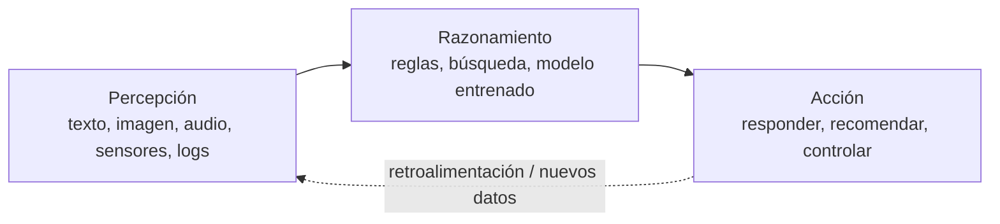
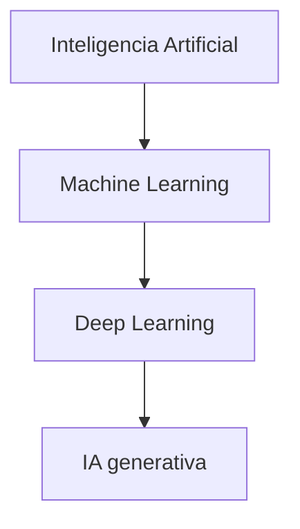
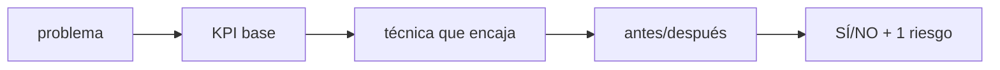

# S01 · Guía de clase — Caracterización de sistemas de IA

> **Página para trabajar en clase y repasar.** Mezcla la **teoría** (de los [apuntes](apuntes.md)), los **vídeos** (DotCSV) y los **ejercicios**, siguiendo el guion de la sesión de 2 h. Si quieres el plan minuto a minuto del docente, está en el [guion de sesión](guion_video.md); la versión para proyectar, en la [presentación](../../presentaciones/b01_s01.html).

## El plan de hoy: 2 tareas

| # | Tarea | Cómo la compruebo |
|---|---|---|
| **1** | **Caracterizar** cualquier sistema de IA con la ficha de 1 minuto | Rellenas una ficha completa en el entregable |
| **2** | **Decidir con 1 KPI** si compensa | Calculas antes/después y dices **sí/no + 1 riesgo** |

---

## 1 · Apertura — ¿es inteligente tu lavadora?

Tu lavadora mete agua, detergente y **ejecuta siempre el mismo guion** (tiempos, giros, temperatura). Si le echas una manta pesada, **no piensa nada nuevo**: sigue el mismo programa. Eso es **automatización**, no inteligencia.

Cambia una sola cosa: que un **sensor de carga** ajuste el agua **aprendiendo de los 10.000 lavados anteriores**, sin que nadie escriba la regla. **Eso ya es IA.**

!!! quote "La frase de la sesión"
    **¿Qué cambió? No la lavadora: el que DECIDE.**

### El ciclo de un sistema inteligente

Un **sistema inteligente** percibe, razona y actúa para lograr un objetivo:



| Característica | Descripción |
|---|---|
| **Autonomía** | Opera sin supervisión humana constante |
| **Adaptación** | Aprende de los datos y mejora con la experiencia |
| **Toma de decisiones** | Recomienda o actúa según datos, no solo reglas fijas |

---

## 2 · Tarea 1 — Caracterizar un sistema en 1 minuto

### 2.1 ¿Qué es la inteligencia artificial?

La **inteligencia artificial (IA)** es la tecnología que permite a las máquinas **simular el aprendizaje, la comprensión, la resolución de problemas, la toma de decisiones y la creatividad** humanas.

> **Definición (Comisión Europea, adaptada).** Un **sistema de IA** es un software —y, en su caso, hardware— diseñado por humanos que, ante un objetivo complejo, **percibe su entorno** (datos estructurados o no), **razona** sobre el conocimiento derivado de esos datos y **decide** las mejores acciones para lograr el objetivo. Puede usar **reglas simbólicas** o **aprender un modelo numérico**.

**Reglas vs. aprende (el único dilema que importa hoy):**

| | Reglas escritas | Aprendido de datos |
|---|---|---|
| **Ejemplo** | Termostato `si T<18 → enciende` | Filtro de spam que deduce criterios de ejemplos |
| **Cuándo** | Tarea cerrada y enumerable | Demasiados casos para escribir reglas |
| **Límite** | No generaliza | Necesita datos y evaluación honesta |

> **Regla de decisión:** ¿puedo escribir todas las reglas en una hoja? Si sí → reglas. Si no → datos (machine learning).

### 2.2 IA débil (estrecha) vs. IA fuerte


| Nivel | Alcance | Estado hoy |
|---|---|---|
| **ANI (débil / estrecha)** | Una o pocas tareas acotadas; reactiva, sin conciencia | **Toda la IA existente** (Siri, recomendadores, traductores, ChatGPT) |
| **AGI (general)** | Transfiere conocimiento y razona en dominios no entrenados | Teórica, sin prototipo |
| **ASI (superinteligencia)** | Supera lo humano en cualquier tarea intelectual | Ciencia-ficción |

> La IA débil **no entiende**: computa un patrón. Es brillante en su tarea y nula en la contigua — ChatGPT redacta un correo perfecto, pero si le pides **presupuestar** ese mismo correo, se inventa los números.

### 2.3 Vídeo · fragmento 1 (00:00–03:26)

<iframe width="100%" height="380" src="https://www.youtube.com/embed/KytW151dpqU?start=0&end=206" title="DotCSV · fragmento 1" frameborder="0" allow="accelerometer; autoplay; clipboard-write; encrypted-media; gyroscope; picture-in-picture; web-share" referrerpolicy="strict-origin-when-cross-origin" allowfullscreen></iframe>

Qué mirar: **mapa conceptual** (IA, ML, RN, big data, DL se solapan) · **IA débil vs. fuerte** · **imitar ≠ comprender**. [Abrir en YouTube (00:00)](https://www.youtube.com/watch?v=KytW151dpqU&t=0s)

### 2.4 La ficha de 1 minuto

```text
FICHA DE 1 MINUTO  —  <sistema>

1. ¿Qué PERCIBE?               (datos de entrada)
2. ¿Razona con REGLAS o con DATOS?
3. ¿Qué ACCIÓN produce?        (qué hace al final)
4. Tarea ESTRECHA: ¿cuál?      (solo una; lo que NO hace)
```

**Ejemplo resuelto — chatbot de reclamaciones:**

| Campo | Respuesta |
|---|---|
| **Percibe** | El texto del correo y el historial del cliente |
| **Reglas o datos** | **Datos**: clasificador entrenado con reclamaciones etiquetadas |
| **Acción** | Enruta el caso (devolución / cambio / defecto / consulta) |
| **Tarea estrecha** | Clasificar esas 4 categorías. **No** conversa de otra cosa |

### 2.5 Ejercicio 1

Rellena la ficha de 1 minuto de **un sistema que conozcas de verdad** (tu curro, una tienda, un DAW…). Después clasifícalo: **IA débil** (una tarea) — toda la IA actual lo es. *No valen frases de folleto.*

### 2.6 Cuaderno · N02 Mapa de sistemas

El cuaderno **N02** es la plantilla de la ficha: elige 1 sistema real y clasifícalo (reglas o datos, tarea estrecha) con la evidencia que te hace decidir.

[Abrir N02 en Colab](https://colab.research.google.com/github/jmperez-profesor/mia/blob/main/docs/bloques/B01_RA1/sesion01_mapa_sistemas.ipynb){: .md-button }

### 2.7 Vídeo · fragmento 2 (03:26–05:37)

<iframe width="100%" height="380" src="https://www.youtube.com/embed/KytW151dpqU?start=206&end=337" title="DotCSV · fragmento 2" frameborder="0" allow="accelerometer; autoplay; clipboard-write; encrypted-media; gyroscope; picture-in-picture; web-share" referrerpolicy="strict-origin-when-cross-origin" allowfullscreen></iframe>

Qué mirar: **subcampos** (robótica, NLP, voz) · **ML: supervisado, no supervisado, refuerzo** · **técnicas** (árboles, regresión, clasificación, clustering). [Abrir en YouTube (03:26)](https://www.youtube.com/watch?v=KytW151dpqU&t=206s)

### 2.8 IA > ML > DL > IA generativa



> **Regla para recordar.** Todo machine learning es IA, pero no toda IA es machine learning. Todo deep learning es machine learning; la IA generativa es una parte del deep learning.


### 2.9 Tipos de aprendizaje

| Tipo | Datos | Objetivo | Ejemplos |
|---|---|---|---|
| **Supervisado** | Etiquetados | Predecir la respuesta | Clasificación (spam), regresión (precio) |
| **No supervisado** | Sin etiquetas | Encontrar estructura | Clustering, asociación, PCA |
| **Refuerzo (RL)** | Interacción | Maximizar recompensa | Robots, juegos, control |
| **Semi-supervisado** | Pocos etiquetados + muchos sin etiquetar | Combinar | Cuando etiquetar es caro |
| **Auto-supervisado** | Sin etiquetas humanas | Aprender de la estructura | Entrenamiento de LLM |

### 2.10 Ejercicio 2

Clasifica en supervisado / no supervisado / PLN / visión:

| Ítem | Técnica | Tipo |
|---|---|---|
| (a) Grietas por foto | Visión artificial | Supervisado |
| (b) Agrupar clientes | Clustering | **No supervisado** |
| (c) Spam | Clasificación de texto | Supervisado |
| (d) Asistente por voz | PLN | Supervisado / secuencial |

> Clave: (b) es el único **sin etiquetas previas**. Si nadie te dio las respuestas → clustering.

### 2.11 Cuaderno · N01 Técnicas de IA (demo)

La **demo supervisada** (KNN sobre clientes) devuelve la etiqueta `0/1` («reclamará / no reclamará»); la **demo no supervisada** (k-means sobre compras) devuelve `0/1` por fila, pero son **identificadores de grupo** inventados, no «sí/no».

[Abrir N01 en Colab](https://colab.research.google.com/github/jmperez-profesor/mia/blob/main/docs/bloques/B01_RA1/sesion01_tecnicas_ia.ipynb){: .md-button }

### 2.12 Vídeo · fragmento 3 (05:37–07:46)

<iframe width="100%" height="380" src="https://www.youtube.com/embed/KytW151dpqU?start=337&end=466" title="DotCSV · fragmento 3" frameborder="0" allow="accelerometer; autoplay; clipboard-write; encrypted-media; gyroscope; picture-in-picture; web-share" referrerpolicy="strict-origin-when-cross-origin" allowfullscreen></iframe>

Qué mirar: **aprendizaje jerárquico** (capas concretas → abstractas) · **deep learning = muchas capas** · **big data** y el mapa final **IA ⊃ ML ⊃ RN/DL**. [Abrir en YouTube (05:37)](https://www.youtube.com/watch?v=KytW151dpqU&t=337s)

### 2.13 Puesta en común — tres preguntas

1. **¿Todo ML es IA? ¿Y toda IA es ML?** — Todo ML es IA; no toda IA es ML (hay IA de reglas y de búsqueda).
2. **Un ejemplo de IA sin ML** — Un sistema experto con reglas `si… entonces…`: es IA y no aprende de datos.
3. **¿Dónde encaja la generativa?** — Dentro del deep learning: IA > ML > DL > GenAI.

---

## 3 · Tarea 2 — Decidir con 1 KPI

La IA aporta **eficiencia** solo si baja **coste, tiempo o error** medido antes/después. Sin número, es opinión.

### 3.1 ¿Qué es un KPI?

Un **KPI** (*Key Performance Indicator* → **indicador clave de rendimiento**) no es «un dato» ni «una cifra bonita»: es un **número elegido a propósito para decidir**.

```text
KPI = <métrica> · <unidad> · <periodo> · <ANTES> · <DESPUÉS>

Ejemplo:  coste de atención · €/día · sept 2026 · antes 3.000 € · objetivo ≤ 1.400 €
```

### 3.2 Las 5 comprobaciones

| Criterio | Pregunta | Si falla… |
|---|---|---|
| **Medible** | ¿Tiene número **y unidad**? | «mejoramos la atención» no es un KPI |
| **Comparado** | ¿Tiene **antes y después**? | sin referencia, es una opinión |
| **Atribuible** | ¿Lo mueve **la IA que pongo yo**? | «suben las ventas» = diciembre, no el modelo |
| **Honesto** | ¿Cuenta **todo** lo que cuesta? | te olvidas de la licencia y del humano que revisa |
| **Accionable** | Si falla, ¿**sé qué hacer**? | «el número está mal» no dice nada |

### 3.3 KPI de negocio ≠ métrica de modelo

| **KPI de negocio** (decide la empresa) | **Métrica de modelo** (decide el ML) |
|---|---|
| Coste por consulta, AHT, FCR, *containment rate* | Precisión, *recall*, F1, AUC |
| Tiempo de ciclo, MTBF, OEE, coste por documento | MAE / RMSE, latencia de respuesta |

> **La regla de la sesión:** la precisión de 1,00 de la práctica **no es un KPI** — es una métrica de modelo. Para **decidir** hace falta un KPI de negocio con antes y después.

### 3.4 El caso de las 1.000 consultas

Centro con **1.000 consultas/día** a **3 €** y **5 min** cada una. Un chatbot resuelve el **60 %** a **0,10 €** en 10 s. ¿Compensa?

| Paso | Qué calculo | Resultado |
|---|---|---|
| 1 · KPI base | coste de atención · €/día | **3.000 €** (1.000 × 3) |
| 2 · Después | 600 automatizadas + 400 manuales | 600×0,10 + 400×3 = **1.260 €** |
| 3 · Δ | 1 − 1.260/3.000 | **−58 %** |
| 4 · Segundo KPI | tiempo: 5 min → 2 min de media | **−60 %** |
| 5 · Decisión | ¿sí/no? | **Sí**, con 1 riesgo |

> **Ojo con los errores:** no sumes el bot a las manuales (`600×0,10 + 1.000×3` cuenta dos veces); di siempre la unidad («ahorra 58 % **en €/día**»); descuenta la licencia; y entre porcentajes la diferencia es en **puntos porcentuales** (15 % → 4 % = −11 p.p.).

### 3.5 Tres ejemplos más

| Quiero bajar… | KPI y unidad | Antes → Después | Técnica |
|---|---|---|---|
| **Tiempo** | min/caso | 8 min → 5,8 min (**−27 %**) | Clasificación supervisada |
| **Error** | % de clasificación errónea | 15 % → <5 % (**−10 p.p.**) | PLN supervisado |
| **Paradas** | MTBF (días) | 40 → 70 (**+75 %**) | Mantenimiento predictivo |

> **Fíjate en la unidad:** €/día, min/caso, %, días. Si no cabe una unidad, no es un KPI.

### 3.6 El esquema que se repite



Caracterizar un sistema de IA **no es entrenar nada**: es identificar qué técnica encaja y qué mejora aporta.

### 3.7 Ejercicio 3

Un proceso recibe **300 reclamaciones/día** a **2 €** cada una. Un clasificador resuelve el **80 %** a **0,20 €**. Calcula: coste antes, coste después y % de ahorro.

```python
antes   = 300 * 2.0
despues = 240 * 0.20 + 60 * 2.0
print((1 - despues/antes) * 100)   # 72.0 %
```

??? tip "Solución"
    Antes: `300 × 2 = 600 €/día`. Después: `240 × 0,20 + 60 × 2 = 168 €/día`. Ahorro **72 %** (coste por reclamación de 2 € a 0,56 €).

---

## 4 · Cierre — lo que entregas

**Un solo entregable** (ficha + KPI + decisión):

| Entregable | Qué es |
|---|---|
| **Ficha** | De **1 sistema real**: percibe / reglas o datos / acción / tarea estrecha |
| **KPI** | 2 números con unidad, **antes** y **después**, + el % |
| **Decisión** | 3 líneas + **1 riesgo** (sesgo, privacidad o drift) |

[Abrir miniproyecto en Colab](https://colab.research.google.com/github/jmperez-profesor/mia/blob/main/docs/bloques/B01_RA1/sesion01_miniproyecto.ipynb){: .md-button }

> **Rúbrica (RA1):** caracterizas con vocabulario propio · el KPI es plausible · la decisión es explícita.

---

## 5 · Ejercicios de autoevaluación (10)

### Bloque 1 · Caracterizar

1. Ficha de 1 minuto para un chatbot de reclamaciones.
2. Termostato `si T<18 → enciende` vs. filtro de spam aprendido: ¿qué tipo es cada uno y cuándo conviene cada enfoque?
3. ¿Por qué toda la IA actual es estrecha (débil)?
4. **(N01)** Ejecuta el notebook y explica la diferencia entre la salida supervisada y la no supervisada.
5. **(N02)** Elige 1 sistema real y clasifícalo (reglas o datos, tarea estrecha).
6. Clasifica: grietas por foto / agrupar clientes / spam / asistente por voz.

### Bloque 2 · Decidir con KPI

7. Reproduce el caso 1.000 consultas: coste antes, después y % de ahorro.
8. Variante: 300 reclamaciones a 2 €, 80 % a 0,20 €. Calcula antes, después y %.
9. Tu proceso (LARA, hidrógeno, colmena o el tuyo): propón técnica y KPI antes/después en 2 números.
10. Nombra 1 riesgo (sesgo, privacidad, drift) y su mitigación en 1 línea.

> Corrección guiada en [Soluciones de prácticas](soluciones_s01.md) · [Preguntas frecuentes](faq_s01.md).

---

## 6 · Técnicas básicas (resumen)

| Técnica | Qué hace | Uso típico |
|---|---|---|
| **Clasificación** (supervisado) | Asigna una categoría | Spam, priorizar incidencias |
| **Regresión** (supervisado) | Predice un valor numérico | Prever demanda, precios |
| **Clustering** (no supervisado) | Agrupa por similitud | Segmentar clientes |
| **Detección de anomalías** | Detecta lo atípico | Fraude, averías |
| **PLN** | Entiende y genera lenguaje | Chatbots, sentimiento |
| **Visión artificial** | Interpreta imágenes y vídeo | Inspección, OCR |
| **Robótica** | Percibe y actúa en el mundo físico | Almacén, fabricación |
| **Sistemas expertos** | Reglas de un experto | Diagnóstico técnico |
| **IA generativa / agentes** | Crea contenido y actúa | Redacción, tramitación |

## 7 · Campos de aplicación

| Campo | Ejemplos | Beneficio típico |
|---|---|---|
| Industria y logística | Mantenimiento predictivo, control de calidad visual | Menos paradas y costes |
| Salud | Diagnóstico por imagen, descubrimiento de fármacos | Precisión, menos errores |
| Finanzas | Detección de fraude, *scoring* | Menos pérdidas |
| Comercio y retail | Recomendación, previsión de demanda | Más ventas, menos stock |
| Agricultura | Riego y fertilizantes de precisión | Menos coste e impacto |


---

## 8 · Vídeos DotCSV para repasar

- [¿Qué es el ML? ¿Y Deep Learning? (mapa conceptual)](https://www.youtube.com/watch?v=KytW151dpqU) — el vídeo de hoy.
- [¿Qué es el Aprendizaje Supervisado y No Supervisado?](https://www.youtube.com/watch?v=oT3arRRB2Cw)
- [Modelos para entender una realidad caótica (¿qué es un modelo?)](https://www.youtube.com/watch?v=Sb8XVheowVQ)
- [Regresión Lineal y Mínimos Cuadrados](https://www.youtube.com/watch?v=k964_uNn3l0) · [Descenso del Gradiente](https://www.youtube.com/watch?v=A6FiCDoz8_4)

Más en [Recursos de vídeo (DotCSV)](recursos_video.md) y en el [catálogo completo](../../recursos/dotcsv.md).

---

## Ver también

- [Apuntes completos (RA1)](apuntes.md) · [Plan de la sesión](sesion01.md)
- [Guion de sesión con vídeo](guion_video.md) · [Soluciones de prácticas](soluciones_s01.md) · [Preguntas frecuentes](faq_s01.md)
