# S01 · Guía de clase — Caracterización de sistemas de IA

## Mapa mental del bloque

Antes de empezar a hablar, mira el mapa general del RA1. Pulsa para ampliarlo.

<figure markdown>
  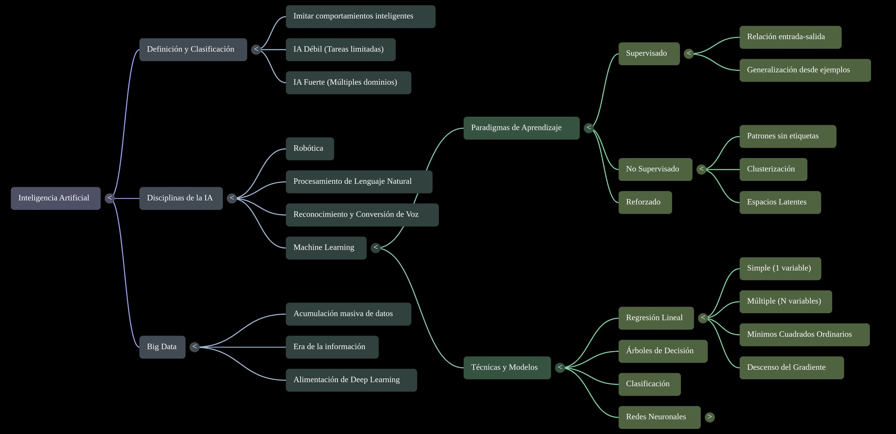{ width="100%" }
  <figcaption>Mapa mental del RA1 · elaborado con Gemini Notebook</figcaption>
</figure>

Más material en [Recursos Gemini Notebook](recursos_nbl.md).

<!-- **Una sola página para la clase y para repasar.** Tiene los [apuntes](apuntes.md) como base y, intercalados en el momento en que se trabajan, los # //**vídeos** de DotCSV, los **ejercicios** y los **cuadernos de Colab**. Es la versión para el alumnado de la [presentación](../../presentaciones/b01_s01.html); //# el plan minuto a minuto del docente está en el [guion de sesión](guion_video.md).


!!! abstract "Cómo leer esta guía"
    - Los bloques **«Lo esencial»** son lo que se trabaja en clase y se evalúa.
    - Los bloques desplegables **«Ampliación»** son *lectura de mapa*: existen para que sepas dónde encaja cada cosa, no entran como temario de examen.
    - Los bloques **«Ejercicio»** se hacen en el momento; las soluciones están en [Soluciones de prácticas](soluciones_s01.md).
    - Sección y criterio de evaluación (CE) de cada parte entre paréntesis.
    - Los bloques **«En el mundo real»** traen casos reales y actuales con su fuente. Las cifras son las que da cada fuente en la fecha indicada y pueden cambiar.
--> 
## El plan de la sesión

| # | Tarea | Cómo la compruebo |
|---|---|---|
| **1** | **Caracterizar** cualquier sistema de IA con la ficha de 1 minuto | Rellenas una ficha completa en el entregable |
| **2** | **Decidir con 1 KPI (Key Performance Indicator → indicador clave de rendimiento)** si compensa | Calculas antes/después y dices **sí/no + 1 riesgo** |

!!! info "¿En qué punto estamos? Estamos en el RA1"
    Esta sesión es el **RA1** del módulo 5071 *Modelos de Inteligencia Artificial*.

    - **RA significa «resultado de aprendizaje»**: lo que debes ser capaz de **hacer** cuando termines. No es un tema que se estudia de memoria, sino una capacidad que se demuestra.
    - **El enunciado oficial del RA1** es: *«Caracteriza sistemas de Inteligencia Artificial relacionándolos con la mejora de la eficiencia operativa de las organizaciones y empresas.»*
    - **¿Qué significa en la práctica?**
        1. **Caracterizar** un sistema de IA es **describirlo**: qué percibe, cómo decide y qué acción produce. Es lo que harás con la **ficha de 1 minuto**.
        2. **Relacionarlo con la eficiencia operativa** es decir si, gracias a ese sistema, una empresa **gasta menos, tarda menos o se equivoca menos**. Es lo que harás con un **KPI (Key Performance Indicator → indicador clave de rendimiento)**, comparando el antes y el después.
    - **CE significa «criterio de evaluación»**: lo que se comprueba para saber si has conseguido el RA. El RA1 tiene cuatro, que son los de la tabla siguiente.

Los criterios de evaluación del RA1 y dónde se trabaja cada uno en esta guía:

| CE | Criterio oficial | Dónde se trabaja aquí |
|----|------------------|-----------------------|
| **4a** | Se han identificado los principios fundamentales de los sistemas inteligentes. | §1 – §4 |
| **4b** | Se ha recopilado información sobre campos donde se aplica la IA. | §6 |
| **4c** | Se han identificado las técnicas básicas a utilizar en el entorno de la IA. | §5 y §7 |
| **4d** | Se han identificado nuevas formas de interacciones en los negocios que mejoran la eficiencia operativa. | §8 – §9 |

<!--
| Min | Momento | Sección |
|---|---|---|
| 0–10 | Apertura: gancho y ficha | §1 |
| 10–14 | Vídeo 1 → conceptos → Ejercicio 1 (+ N01) | §2 |
| 28–32 | Vídeo 2 → jerarquía IA > ML > DL > GenAI → tipos de aprendizaje → Ejercicio 2 (+ N02) | §5 |
| 50–60 | Vídeo 3 → puesta en común | §5 |
| 60–95 | **Tarea 2** · KPI y caso de las 1.000 consultas | §8 |
| 95–120 | Ejercicio 3, cierre y entregable | §8.4 y §11 |
-->
---

## 1 · Apertura — ¿es inteligente tu lavadora? (CE 4a)

Tu lavadora mete agua y detergente y **ejecuta siempre el mismo guion**: tiempos, giros, temperatura. Si le echas una manta pesada, **no piensa nada nuevo**: sigue el mismo programa. Eso es **automatización**, no inteligencia.

Cambia una sola cosa: que un **sensor de carga** ajuste el agua **aprendiendo de los 10.000 lavados anteriores**, sin que nadie escriba la regla. **Eso ya es IA.**

!!! quote "La frase de la sesión"
    **¿Qué cambió? No la lavadora: el que DECIDE.** Pasa de ser *una regla escrita a mano* a ser *un modelo aprendido de los datos*.

???+ example "En el mundo real · lavadoras «con IA» y termostatos que aprenden"
    - **Samsung** presenta en su web española lavadoras con funciones llamadas **«AI Wash»** y **«AI Energy Mode»**, que según la marca ayudan a conseguir «un lavado más eficiente» y a optimizar el consumo ([samsung.com/es](https://www.samsung.com/es/washers-and-dryers/washing-machines/)). La página no detalla qué percibe la lavadora ni cómo decide. Esa es la pregunta que debes hacerte ante cualquier etiqueta de «IA»: ¿ajusta el ciclo **aprendiendo de datos** o ejecuta un **programa fijo** con algún sensor? Y aunque aprendiera, seguiría siendo IA **estrecha**: una sola tarea.
    - **El termostato**, el mismo contraste. El de esta guía (`si T<18 → enciende`) ejecuta una regla. El [Nest Learning Thermostat](https://en.wikipedia.org/wiki/Nest_Thermostat) se presenta como un termostato **de autoaprendizaje** que optimiza la calefacción y la refrigeración del hogar.
    - **LG y Bosch.** Según la publicidad de los fabricantes, algunas lavadoras de **LG** (gama «AI DD») detectan el tipo de tejido y el peso de la carga para elegir el movimiento del tambor, y algunas de **Bosch** (sistema «i-DOS») dosifican solas el detergente y el suavizante según la carga. Son ejemplos para el mismo ejercicio: ¿ajustan el ciclo **aprendiendo de datos** o aplican **reglas fijas** con sensores? Y en cualquier caso hacen **una sola tarea**: IA estrecha.
    - Exagerar el uso de la IA en un producto tiene nombre: ***AI washing*** ([Wikipedia](https://en.wikipedia.org/wiki/AI_washing)). Que algo lleve «IA» en la caja no lo hace inteligente.
    - **El caso de la SEC.** El regulador bursátil de EE. UU. (SEC) sancionó en 2024 a dos asesoras de inversión, **Delphia** y **Global Predictions**, por afirmar que usaban inteligencia artificial cuando no era cierto. Es *AI washing* con consecuencias legales.

### 1.1 ¿Qué es la inteligencia artificial?

La **inteligencia artificial (IA)** es la tecnología que permite a las máquinas **simular el aprendizaje, la comprensión, la resolución de problemas, la toma de decisiones y la creatividad** humanas. Las aplicaciones con IA pueden ver e identificar objetos, entender y responder al lenguaje, aprender de la experiencia, recomendar decisiones y, cada vez más, **actuar de forma autónoma** (un agente que reserva un vuelo, un coche que conduce).

> **Definición (Comisión Europea, adaptada).** Un **sistema de IA** es un software —y, en su caso, hardware— diseñado por humanos que, ante un objetivo complejo, **percibe su entorno** (datos estructurados o no), **razona** sobre el conocimiento derivado de esos datos y **decide** las mejores acciones para lograr el objetivo, en el mundo físico o digital. Puede usar **reglas simbólicas** o **aprender un modelo numérico**, y adaptar su comportamiento al observar los efectos de sus acciones.

### 1.2 El ciclo percepción → razonamiento → acción

Un **sistema inteligente** percibe, razona y actúa para lograr un objetivo:

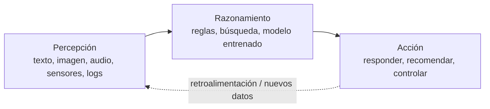

- **Percepción:** captar datos del mundo (texto, imagen, audio, sensores, registros de negocio).
- **Razonamiento:** procesarlos para obtener conocimiento o decidir (un modelo entrenado, un conjunto de reglas, una búsqueda).
- **Acción:** actuar sobre el entorno o sobre las personas (responder, recomendar, controlar un proceso).

???+ example "En el mundo real · el ciclo en un coche sin conductor"
    **Waymo** (Alphabet) ofrece robotaxis sin conductor. Según Wikipedia, en junio de 2026 operaba servicios comerciales públicos en **10 áreas metropolitanas de EE. UU.** y daba unos **500.000 viajes de pago por semana** ([Waymo](https://en.wikipedia.org/wiki/Waymo)). Su ciclo es el de arriba: **percibe** con cámaras y sensores como el lidar, **razona** sobre qué hay alrededor y qué harán los demás, **actúa** (acelera, frena, gira) y vuelve a percibir de forma continua.

    Un asistente de voz y el recomendador de una tienda online siguen el mismo patrón con otros datos: *audio → respuesta* y *historial de compras → lista de productos recomendados*.

    - **Google Maps y DeepMind.** Google Maps calcula la hora estimada de llegada a partir de datos de tráfico, y DeepMind ha colaborado con Google para mejorar esas predicciones con aprendizaje automático. Es un buen ejemplo de **percibe** (posición y velocidad de miles de móviles y vehículos), **razona** (un modelo que predice cuánto tardarás) y **actúa** (te propone la mejor ruta).

### 1.3 Características de un sistema inteligente

| Característica | Descripción |
|---|---|
| **Autonomía** | Opera sin supervisión humana constante |
| **Adaptación** | Aprende de los datos y mejora con la experiencia |
| **Toma de decisiones** | Recomienda o actúa basándose en datos, no solo en reglas fijas |

!!! example "¿Es IA un termostato?"
    Un termostato `si T < 18 °C → enciende` es, formalmente, un sistema de IA **basado en reglas**: percibe (termómetro), razona (la regla) y actúa (enciende). La diferencia con la IA moderna es que, cuando la tarea se complica, definir todas las reglas a mano es imposible: ahí entra el **aprendizaje automático**, que deduce los patrones de los datos.

**Reglas o datos: el único dilema que importa hoy.**

| | Reglas escritas | Aprendido de datos |
|---|---|---|
| **Ejemplo** | Termostato `si T<18 → enciende` | Filtro de spam que deduce criterios de ejemplos |
| **Cuándo** | Tarea cerrada y enumerable | Demasiados casos para escribir reglas |
| **Límite** | No generaliza | Necesita datos y evaluación honesta |

> **Regla de decisión:** ¿puedo escribir todas las reglas en una hoja? Si sí → **reglas**. Si no → **datos** (machine learning).

---

## 2 · IA débil y IA fuerte (CE 4a)

La clasificación más simple de la IA es **según la tarea que resuelve**:

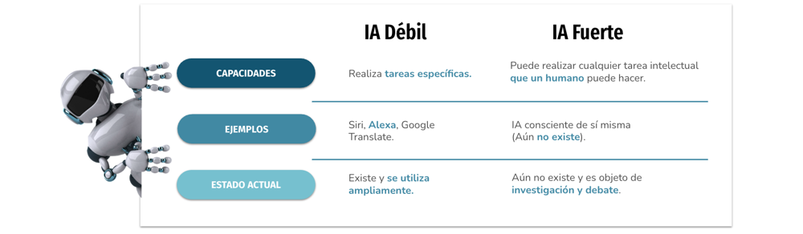

| Nivel | Alcance | Estado hoy |
|---|---|---|
| **ANI (débil / estrecha)** | Una o pocas tareas acotadas; reactiva, sin conciencia | **Toda la IA existente** (Siri, recomendadores, traductores, ChatGPT) |
| **AGI (general)** | Transfiere conocimiento y razona en dominios no entrenados | Teórica, sin prototipo |
| **ASI (superinteligencia)** | Supera lo humano en cualquier tarea intelectual | Ciencia-ficción |

La IA débil es **reactiva** (no actúa si no se la activa), **no flexible** (colapsa ante lo no previsto) y **no tiene conciencia**: computa, no razona en sentido humano. Aun así **tiene riesgos**: al ejecutar su tarea sin considerar el contexto ético o social, puede causar daño si se usa sin prudencia.

> **«Débil» y «estrecha» son lo mismo** (ANI, *narrow*). El ejemplo que lo deja claro: ChatGPT redacta un correo perfecto, pero si le pides **presupuestar** ese mismo correo se inventa los números. Es brillante en una tarea y nula en la contigua.

???+ example "En el mundo real · brillantes en una tarea, torpes en la de al lado"
    - **AlphaFold** (Google DeepMind) predice la forma tridimensional de las proteínas. Demis Hassabis y John Jumper recibieron por ello la mitad del **Nobel de Química de 2024** ([AlphaFold](https://en.wikipedia.org/wiki/AlphaFold)). Es un logro enorme y es **IA estrecha**: sirve para esa tarea y no para otra.
    - **Los modelos de lenguaje** (ChatGPT y similares) resuelven muchas tareas de texto, pero lo que hacen es generar texto plausible, no comprender. En 2023, en el caso [Mata contra Avianca](https://en.wikipedia.org/wiki/Mata_v._Avianca,_Inc.), un abogado presentó ante un tribunal de EE. UU. un escrito con **casos judiciales inventados por ChatGPT**; el juez consideró que hubo «mala fe subjetiva» suficiente para imponer sanciones.
    - **Air Canada (2024).** El chatbot de la aerolínea dio a un cliente información errónea sobre la tarifa por fallecimiento de un familiar, y el tribunal de resolución civil de Columbia Británica consideró **responsable a la aerolínea** de lo que había dicho su chatbot ([Moffatt contra Air Canada](https://en.wikipedia.org/wiki/Moffatt_v._Air_Canada)).
    - **La AGI sigue sin existir.** Lo que se anuncia son modelos cada vez más capaces, pero cada uno continúa siendo una IA estrecha.

??? info "Ampliación · Tests de inteligencia (Turing y Lovelace)"
    El **test de Turing** (1950) es conductual: un interrogador conversa por escrito con una persona y una máquina; si no las distingue, la máquina lo supera. El **test de Lovelace** (2001) mide otra cosa: si el sistema **origina** un resultado que su propio programador no puede explicar a partir del código. Superar Turing no implica superar Lovelace: Turing mide si *engañamos*, no si *comprendemos*.

### Vídeo 1 · ¿Qué es la IA? (00:00–03:26)

<iframe width="100%" height="380" src="https://www.youtube.com/embed/KytW151dpqU?start=0&end=206" title="DotCSV · fragmento 1" frameborder="0" allow="accelerometer; autoplay; clipboard-write; encrypted-media; gyroscope; picture-in-picture; web-share" referrerpolicy="strict-origin-when-cross-origin" allowfullscreen></iframe>

Qué mirar: el **mapa conceptual** (IA, ML, RN, big data y DL se solapan) · **IA débil vs. fuerte** · **imitar no es comprender**. [Abrir en YouTube (00:00)](https://www.youtube.com/watch?v=KytW151dpqU&t=0s) · Reproduce a 1,25×.

### Ejercicio 1 · La ficha de 1 minuto (14 min)

La ficha destila todo lo anterior en cuatro preguntas. Es la herramienta de la sesión para **caracterizar cualquier sistema de IA**:

```text
FICHA DE 1 MINUTO  —  <sistema>

1. ¿Qué PERCIBE?               (datos de entrada)
2. ¿Razona con REGLAS o con DATOS?
3. ¿Qué ACCIÓN produce?        (qué hace al final)
4. Tarea ESTRECHA: ¿cuál?      (solo una; lo que NO hace)
```

**Ejemplo resuelto — chatbot de reclamaciones:**

| Campo | Respuesta |
|---|---|
| **Percibe** | El texto del correo y el historial del cliente |
| **Reglas o datos** | **Datos**: clasificador entrenado con reclamaciones etiquetadas |
| **Acción** | Enruta el caso (devolución / cambio / defecto / consulta) |
| **Tarea estrecha** | Clasificar esas 4 categorías. **No** conversa de otra cosa |

Cuatro errores que debes evitar al rellenarla:

| Error típico | Por qué falla |
|---|---|
| «Usa IA» en la casilla 2 | No dice **cómo** decide: ¿reglas escritas o datos? |
| Tarea estrecha: «ayudar a los usuarios» | No es estrecha: si mañana le piden otra cosa, ¿la hace? |
| Solo 3 casillas | Se olvida la 4, la más importante: **qué NO hace** |
| «Es inteligente» en la 3 | Describe, no actúa: ¿responde, recomienda, controla? |

!!! example "Tu turno: la ficha se rellena en el cuaderno de Google Colab"
    El cuaderno **N01** te explica primero qué es **Google Colab** y qué es un **cuaderno de Jupyter** (no hace falta que los conozcas), te da la ficha en un formato que se rellena **sin saber programar** y, al ejecutarla, te avisa de los errores típicos de la tabla anterior.

    1. Abre el cuaderno y guarda una copia en tu Drive (**Archivo → Guardar una copia en Drive**).
    2. Elige **un sistema que conozcas de verdad**: uno de la empresa donde trabajas o donde hiciste las prácticas, una aplicación que uses a diario (las recomendaciones de Spotify o Netflix, el filtro de spam de tu correo) o un caso de los proyectos del módulo.
    3. Rellena las cuatro casillas y ejecuta la celda de comprobación hasta que no haya avisos.
    4. Clasifica tu sistema como **IA débil** (una sola tarea) y explica con qué **evidencia** has decidido entre reglas y datos.

    Evita las **frases de marketing** como «usa IA» o «es inteligente»: no describen nada. La ficha tiene que decir qué datos entran, cómo decide y qué hace.

    [Abrir N01 en Colab](https://colab.research.google.com/github/jmperez-profesor/mia/blob/main/docs/bloques/B01_RA1/sesion01_mapa_sistemas.ipynb){ .md-button }

---

## 3 · Tres lentes para clasificar la IA (CE 4a)

La IA se puede clasificar de tres maneras complementarias. No son excluyentes: son tres formas de mirar lo mismo.

### 3.1 Escuelas de pensamiento

| | IA convencional (simbólico-deductiva) | IA computacional (subsimbólico-inductiva) |
|---|---|---|
| **Cómo razona** | Análisis formal y estadístico explícito | Aprendizaje interactivo a partir de datos |
| **Técnicas** | Sistemas expertos, razonamiento por casos, redes bayesianas | Redes neuronales, SVM, lógica difusa, computación evolutiva |
| **Origen** | La «automatización» clásica (reglas + estadística) | El **aprendizaje automático** actual |

### 3.2 Russell y Norvig (1995)

En *Artificial Intelligence: A Modern Approach* proponen cuatro categorías según el **origen del comportamiento**:

| Categoría | Enfoque | Ejemplo |
|---|---|---|
| **Sistemas cognitivos** | Piensan como humanos | Modelos cognitivos |
| **Test de Turing** | Actúan como humanos | Robótica conversacional |
| **Leyes del pensamiento** | Piensan con lógica formal | Sistemas expertos acotados |
| **Agentes racionales** | Actúan racionalmente | Agentes de software actuales |

### 3.3 Hintze (2016): por capacidades

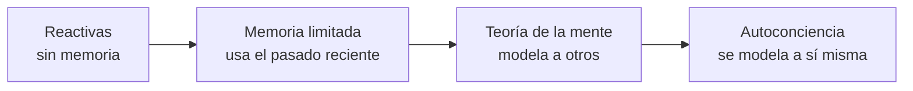

- **Reactivas:** sin memoria. **Deep Blue** (IBM, venció a Kaspárov en 1997) evalúa el tablero en tiempo real, sin concepto de lo anterior.
- **Memoria limitada:** usan observaciones recientes. Los **vehículos autónomos** actuales memorizan velocidad y trayectoria de otros coches para decidir un cambio de carril.
- **Teoría de la mente** y **autoconciencia:** teóricas, sin sistemas reales.

???+ example "En el mundo real · las tres lentes hoy"
    - **Escuelas.** La IA simbólica no ha desaparecido: los sistemas de reglas conviven con los modelos aprendidos. Muchos productos actuales **combinan ambos**: un modelo de lenguaje genera la respuesta y unas **reglas** (guardarraíles) le impiden salirse de lo permitido. Lo verás en el bloque de sistemas expertos y motores de reglas del módulo.
    - **Hintze.** **Deep Blue** es el ejemplo reactivo. Un **robotaxi** necesita memoria limitada, porque debe recordar la trayectoria de los demás vehículos. Un **asistente conversacional** solo «recuerda» lo que cabe en la conversación en curso.
    - **Russell y Norvig.** Los **asistentes de programación** que ejecutan pruebas, leen los errores y corrigen el código por su cuenta se acercan al modelo de **agente racional**: actúan para conseguir un objetivo.

---

## 4 · Breve historia de la IA (mapa de lectura)

??? info "Ampliación · De McCulloch y Pitts a los agentes de IA"
    

    | Año | Hito |
    |---|---|
    | 1943 | McCulloch y Pitts: primera neurona artificial |
    | 1950 | Turing publica *Computing Machinery and Intelligence* y propone el **test de Turing** |
    | 1956 | Dartmouth: John McCarthy acuña el término **inteligencia artificial** |
    | 1958 | Rosenblatt: el **perceptrón**, primera red que aprende |
    | 1997 | **Deep Blue** (IBM) vence al campeón de ajedrez Kaspárov |
    | 2011 | **Watson** (IBM) gana en *Jeopardy!*; emerge la ciencia de datos |
    | 2015 | Google libera **TensorFlow** como código abierto |
    | 2016 | **AlphaGo** (DeepMind) vence en Go |
    | 2017 | Vaswani et al. publican *Attention Is All You Need*: nace el **Transformer** |
    | 2022 | Los **grandes modelos de lenguaje (LLM)**, como ChatGPT, cambian la industria |
    | 2024-26 | Modelos **multimodales** y **agentes de IA** autónomos |

    

    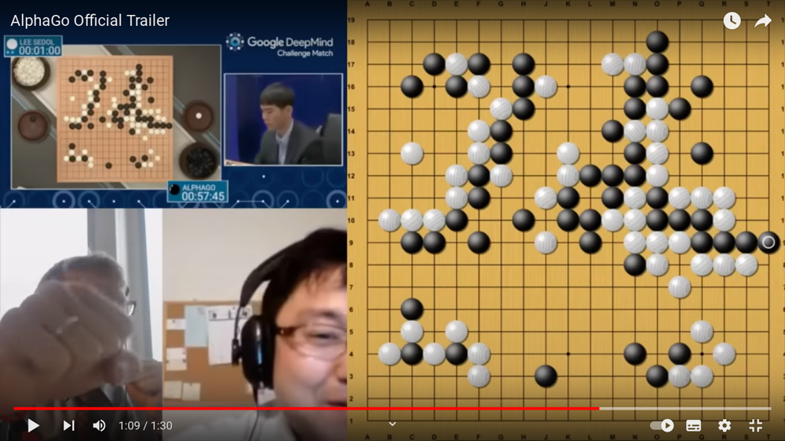

    La historia de la IA es cíclica: periodos de optimismo seguidos de «inviernos» y renacimientos. El salto actual (2017 en adelante) se apoya en tres palancas: **datos** masivos, **cómputo** en GPU y la arquitectura **Transformer**.

    **Lo más reciente, con fuente:**

    - **30 de noviembre de 2022:** OpenAI lanza ChatGPT ([ChatGPT](https://en.wikipedia.org/wiki/ChatGPT)).
    - **2024:** el Nobel de Física premia a **John Hopfield y Geoffrey Hinton** por descubrimientos que hicieron posible el aprendizaje automático con redes neuronales artificiales ([Nobel](https://www.nobelprize.org/prizes/physics/2024/press-release/)); el de Química premia a **Hassabis y Jumper** por AlphaFold.
    - **1 de agosto de 2024:** entra en vigor el **Reglamento de IA** de la UE, de aplicación gradual ([AI Act](https://en.wikipedia.org/wiki/Artificial_Intelligence_Act)).

---

## 5 · IA, machine learning, deep learning e IA generativa (CE 4c)

### Vídeo 2 · El papel del machine learning (03:26–05:37)

<iframe width="100%" height="380" src="https://www.youtube.com/embed/KytW151dpqU?start=206&end=337" title="DotCSV · fragmento 2" frameborder="0" allow="accelerometer; autoplay; clipboard-write; encrypted-media; gyroscope; picture-in-picture; web-share" referrerpolicy="strict-origin-when-cross-origin" allowfullscreen></iframe>

Qué mirar: los **subcampos** (robótica, NLP, voz) · **ML: supervisado, no supervisado y refuerzo** · las **técnicas** (árboles, regresión, clasificación, clustering). [Abrir en YouTube (03:26)](https://www.youtube.com/watch?v=KytW151dpqU&t=206s)

### 5.1 Cajas anidadas

La relación entre estos términos son **cajas anidadas**:

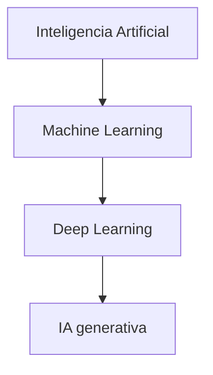

> **Regla para recordar.** **Todo machine learning es IA, pero no toda IA es machine learning.** Todo deep learning es machine learning; la IA generativa es una parte del deep learning.

### 5.2 Aprendizaje automático (ML)

El **ML** crea **modelos** entrenando un algoritmo sobre datos para predecir o decidir **sin ser programado explícitamente** para cada caso. Su objetivo es la **generalización**: acertar con datos **nuevos**.

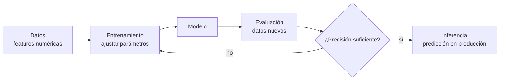

!!! example "Ejemplo · Precio de una casa"
    `Precio = A·superficie + B·habitaciones − C·edad + base`. El objetivo del ML es encontrar `A`, `B`, `C` y `base` que minimicen el error con las ventas conocidas.

???+ example "En el mundo real · un modelo de precios que salió caro"
    **Zillow** ofrece a los usuarios el «Zestimate», una **estimación del valor de una vivienda** ([Zillow](https://en.wikipedia.org/wiki/Zillow)): el ejemplo del precio de una casa llevado a un producto real. En 2018 la empresa empezó además a **comprar y vender casas** (Zillow Offers). En noviembre de 2021 anunció que cerraba esa división, vendía su inventario (unas 7.000 casas) y despedía al 25 % de la plantilla; la división había perdido **420 millones de dólares** en el tercer trimestre de ese año.

    La lección enlaza con la Tarea 2: un modelo que acierta *de media* no basta cuando cada error se paga con dinero real. Por eso se evalúa con un **KPI (Key Performance Indicator → indicador clave de rendimiento) de negocio** (euros, tiempo o errores en el proceso) y no solo con la métrica del modelo.

### 5.3 Tipos de aprendizaje

| Tipo | Datos | Objetivo | Ejemplos |
|---|---|---|---|
| **Supervisado** | Etiquetados | Predecir la respuesta | Clasificación (spam), regresión (precio) |
| **No supervisado** | Sin etiquetas | Encontrar estructura | Clustering, asociación, PCA |
| **Refuerzo (RL)** | Interacción | Maximizar recompensa | Robots, juegos, control |
| **Semi-supervisado** | Pocos etiquetados + muchos sin etiquetar | Combinar | Cuando etiquetar es caro |
| **Auto-supervisado** | Sin etiquetas humanas | Aprender de la estructura | Entrenamiento de LLM |

> **El criterio que importa: ¿hay etiquetas?** Supervisado = te dieron la respuesta; no supervisado = nadie te la dio; refuerzo = aprende por ensayo y recompensa. Truco: si la respuesta es **«sí/no» o un nombre** → clasificación; si es un **número con decimales** → regresión; si **nadie te dio las respuestas** → clustering.

???+ example "En el mundo real · un ejemplo de cada tipo"
    - **Supervisado:** el filtro de spam de tu correo y el desbloqueo facial del móvil aprenden de ejemplos etiquetados (*spam / no spam*, *esta cara / otra*).
    - **Visa.** Las redes de pago como **Visa** puntúan cada transacción con modelos de IA en una fracción de segundo para decidir si parece fraudulenta. Aprenden de millones de operaciones ya etiquetadas como *fraude* o *legítima*: aprendizaje supervisado de manual.
    - **No supervisado:** una tienda agrupa a sus clientes por hábitos de compra sin que nadie haya etiquetado antes a cada cliente (es lo que hace la demo no supervisada del cuaderno N02).
    - **Refuerzo:** AlphaGo, que venció en Go en 2016, mejoró jugando partidas. Y ChatGPT se afinó con **aprendizaje por refuerzo a partir de feedback humano (RLHF)**: personas valoran sus respuestas y el modelo aprende a preferir las mejores ([ChatGPT](https://en.wikipedia.org/wiki/ChatGPT)).
    - **Auto-supervisado:** los grandes modelos de lenguaje aprenden prediciendo la siguiente palabra en enormes cantidades de texto, sin etiquetas humanas.

!!! example "Vídeo · Una IA aprende a jugar al Breakout (1 min 43 s)"
    <iframe width="100%" height="380" src="https://www.youtube.com/embed/V1eYniJ0Rnk" title="Google DeepMind's Deep Q-learning playing Atari Breakout!" frameborder="0" allow="accelerometer; autoplay; clipboard-write; encrypted-media; gyroscope; picture-in-picture; web-share" referrerpolicy="strict-origin-when-cross-origin" allowfullscreen></iframe>

    [Abrir en YouTube](https://www.youtube.com/watch?v=V1eYniJ0Rnk) · canal *Two Minute Papers* (2015). Está en **inglés** y sin subtítulos propios: activa la traducción automática de YouTube.

    **Qué es.** Según la descripción del vídeo, un programa de Google DeepMind que usa **aprendizaje por refuerzo profundo** (redes neuronales profundas más aprendizaje por refuerzo) aprende a jugar a videojuegos de Atari y se **mejora a sí mismo** hasta un nivel superior al humano. Según Wikipedia, el sistema no recibió ningún conocimiento programado sobre cómo jugar: tras un periodo de prueba y error, acabó siendo experto ([Google DeepMind](https://en.wikipedia.org/wiki/Google_DeepMind)). El método se conoce como *deep Q-learning* ([Q-learning](https://en.wikipedia.org/wiki/Q-learning)).

    **Por qué es el ejemplo más sencillo de aprendizaje por refuerzo.** Se ven sus piezas:

    | Pieza | En el Breakout |
    |---|---|
    | **Agente** | El programa que juega |
    | **Entorno** | El juego: la pantalla, la pelota y los ladrillos |
    | **Acciones** | Mover la barra a la izquierda, a la derecha o quedarse quieta |
    | **Recompensa** | Los puntos que da cada ladrillo roto |
    | **Aprendizaje** | Prueba y error: repite partidas y se queda con lo que da más puntos |

    **La estrategia que acaba descubriendo.** En el artículo científico de DeepMind (*Nature*, 2015), al enseñar el progreso del entrenamiento tras 100, 200, 400 y 600 partidas, los autores explican que después de 600 partidas el programa **encuentra y aprovecha la estrategia óptima del juego: abrir un túnel por un lateral del muro de ladrillos y dejar que la pelota rebote por detrás**, rompiendo ladrillos sin apenas moverse ([artículo en *Nature*](https://www.nature.com/articles/nature14236)). Nadie le enseñó esa táctica: la descubre porque **da más puntos**. El artículo también precisa que el programa recibe **solo los píxeles de la pantalla y la puntuación** del juego, y que logró un nivel comparable al de un probador profesional en **49 juegos**, con el mismo algoritmo.

    **Para comentar en clase:**

    1. ¿Hay alguien que le diga si cada movimiento es correcto, como en el aprendizaje supervisado?
    2. ¿Qué tiene que hacer al principio, cuando todavía no sabe nada?
    3. Fíjate en **cómo cambia su forma de jugar** a medida que avanza el entrenamiento.

    ??? tip "Respuestas"
        1. **No.** En el aprendizaje supervisado cada ejemplo trae su respuesta correcta; aquí el programa solo recibe **la pantalla y los puntos**. No sabe si un movimiento concreto fue bueno: lo deduce de la recompensa que consigue después. Es la diferencia clave entre supervisado y refuerzo.
        2. **Probar.** No tiene ningún conocimiento programado sobre cómo se juega, así que solo puede **ensayar movimientos, ver cuántos puntos obtiene y quedarse con lo que funciona**: es la prueba y error del aprendizaje por refuerzo. Por eso al principio juega peor y mejora con las partidas.
        3. **Pasa de jugar sin criterio a una táctica concreta:** abrir un túnel lateral y hacer que la pelota rebote por detrás del muro. Es un comportamiento que **nadie programó** y que aparece porque maximiza la recompensa.

!!! example "Vídeo · Cómo AlphaGo ganó al mejor jugador de Go (42 s)"
    <div style="text-align:center">
    <iframe width="315" height="560" src="https://www.youtube.com/embed/z_35Y99Nlzc" title="How AlphaGo Beat the World's Best Go Player" frameborder="0" allow="accelerometer; autoplay; clipboard-write; encrypted-media; gyroscope; picture-in-picture; web-share" referrerpolicy="strict-origin-when-cross-origin" allowfullscreen></iframe>
    </div>

    [Abrir en YouTube](https://www.youtube.com/shorts/z_35Y99Nlzc) · canal *Think in Loops*. Está en **inglés**: activa los subtítulos de YouTube y la traducción automática al español.

    **Qué mirar:** el vídeo explica que el Go tiene más jugadas posibles que átomos en el universo, por lo que no se puede ganar «a fuerza bruta». AlphaGo combina **dos redes neuronales** (una *política*, que señala las jugadas prometedoras, y una *de valor*, que estima la probabilidad de ganar desde cada posición) con una **búsqueda que simula miles de partidas**. Y equilibra **explorar jugadas nuevas** con **aprovechar las que ya sabe que son buenas**.

    **Cómo se conecta con el aprendizaje por refuerzo.** El vídeo **no pronuncia** esa expresión, así que la conexión la haces tú, igual que con el Breakout: el sistema aprende **jugando** y su «recompensa» es **ganar la partida**. La diferencia es la escala: aquí hay muchísimas más jugadas posibles y la recompensa llega al final de la partida. Ese equilibrio entre **explorar y aprovechar** es uno de los problemas centrales del aprendizaje por refuerzo. Según Wikipedia, las redes de AlphaGo se entrenaron con aprendizaje por refuerzo, partiendo de partidas humanas, y en marzo de 2016 venció a Lee Sedol por 4 partidas a 1 ([AlphaGo](https://en.wikipedia.org/wiki/AlphaGo)). Los subtítulos automáticos escriben «Lee Seidel»: es Lee Sedol.

    **Para comentar en clase:** ¿hay etiquetas con la respuesta correcta de cada jugada? ¿Cuál es la recompensa? ¿Es IA débil o fuerte? (Es estrecha: solo juega al Go.)

!!! example "Ejercicio 2 · Clasifica: supervisado o no supervisado (18 min)"
    Clasifica cada ítem (técnica y tipo de aprendizaje):

    | Ítem | Técnica | Tipo |
    |---|---|---|
    | (a) Grietas por foto | ¿? | ¿? |
    | (b) Agrupar clientes | ¿? | ¿? |
    | (c) Spam | ¿? | ¿? |
    | (d) Asistente por voz | ¿? | ¿? |

    ??? tip "Solución"
        (a) Visión artificial · supervisado. (b) **Clustering · no supervisado** (es el único sin etiquetas previas). (c) Clasificación de texto · supervisado. (d) PLN · supervisado / secuencial.

    **Cuaderno N02 · Técnicas de IA (demo).** La demo **supervisada** (KNN sobre clientes) devuelve la etiqueta `0/1` («reclamará / no reclamará»); la **no supervisada** (k-means sobre compras) devuelve `0/1` por fila, pero son **identificadores de grupo** inventados, no «sí/no».

    [Abrir N02 en Colab](https://colab.research.google.com/github/jmperez-profesor/mia/blob/main/docs/bloques/B01_RA1/sesion01_tecnicas_ia.ipynb){ .md-button }

### 5.4 Deep learning e IA generativa

El **deep learning** usa **redes neuronales con muchas capas**: modela patrones complejos, pero necesita **muchos datos y GPU** y es menos explicable. Arquitecturas clave: **CNN** (imágenes), **RNN/LSTM** (secuencias) y **Transformers** (atención, base de los LLM).

La **IA generativa** crea contenido nuevo (texto, imagen, audio) a partir de un **prompt**. Tres fases: **modelo de base** → **ajuste** (*fine-tuning*, RLHF) → **generación + RAG**.


???+ example "En el mundo real · deep learning e IA generativa"
    - **Texto:** ChatGPT, Gemini o Claude son grandes modelos de lenguaje basados en la arquitectura Transformer. **Imagen y vídeo:** Midjourney, DALL·E o Sora generan contenido nuevo a partir de un *prompt*.
    - **Educación:** **Khanmigo**, de Khan Academy, es un chatbot que ayuda con matemáticas, ciencias y humanidades ([Khan Academy](https://en.wikipedia.org/wiki/Khan_Academy)).
    - **Empresa:** muchos chatbots de atención al cliente combinan un modelo de lenguaje con **los documentos de la propia empresa** (la técnica **RAG** citada arriba) para responder con información actualizada.

### Vídeo 3 · Redes neuronales y big data (05:37–07:46)

<iframe width="100%" height="380" src="https://www.youtube.com/embed/KytW151dpqU?start=337&end=466" title="DotCSV · fragmento 3" frameborder="0" allow="accelerometer; autoplay; clipboard-write; encrypted-media; gyroscope; picture-in-picture; web-share" referrerpolicy="strict-origin-when-cross-origin" allowfullscreen></iframe>

Qué mirar: el **aprendizaje jerárquico** (capas concretas → abstractas) · **deep learning = muchas capas** · **big data** y el mapa final **IA ⊃ ML ⊃ RN/DL**. [Abrir en YouTube (05:37)](https://www.youtube.com/watch?v=KytW151dpqU&t=337s)

!!! question "Puesta en común · tres preguntas orales"
    1. **¿Todo ML es IA? ¿Y toda IA es ML?** — Todo ML es IA; no toda IA es ML (hay IA de reglas y de búsqueda).
    2. **Un ejemplo de IA sin ML.** — Un sistema experto con reglas `si… entonces…`: es IA y no aprende de datos.
    3. **¿Dónde encaja la generativa?** — Dentro del deep learning: IA > ML > DL > GenAI.

??? info "Ampliación · Una red neuronal sencilla, paso a paso (con las flores de Iris)"
    Para ver con un ejemplo pequeño y concreto qué es una red neuronal, tienes esta página en español: [1. Introducción a las redes neuronales](https://logongas.es/doku.php?id=clase:iabd:pia:1eval:tema01) (material de *logongas*, con licencia CC BY-SA 4.0). **No hace falta que entiendas el código de Python**: lo que interesa es ver qué entra en la red, qué sale y cómo se organiza. Las secciones útiles para esta sesión son tres:

    | Sección de la página | Qué mirar | Con qué se conecta en esta guía |
    |---|---|---|
    | [Definición del problema](https://logongas.es/doku.php?id=clase:iabd:pia:1eval:tema01#definicion_del_problema) | Las flores de iris, con dos medidas del pétalo (largo y ancho). Primero se resuelve con unas reglas escritas **a mano** (`si longitud_petalo < 2.5 → Setosa…`) y después se ve el mismo problema resuelto por una red. La página lo resume así: las IA son algoritmos, **solo que el algoritmo se crea casi automáticamente a partir de los datos** | La casilla 2 de la ficha: **reglas o datos**. Y el ejemplo de las flores de las [soluciones](soluciones_s01.md#bloque-1-de-reglas-a-modelo-iris-3-especies), resuelto allí con un árbol de decisión: mismo conjunto de datos, dos modelos distintos |
    | [La red neuronal](https://logongas.es/doku.php?id=clase:iabd:pia:1eval:tema01#la_red_neuronal) | El dibujo de las **capas**: una capa de **entrada** (una neurona por cada dato que entra), varias capas **ocultas** y una capa de **salida** (el resultado). La red «aprende» una función matemática que, dadas las medidas del pétalo, calcula el tipo de flor | El esquema del vídeo 3: **deep learning = muchas capas** |
    | [Las dificultades de la IA](https://logongas.es/doku.php?id=clase:iabd:pia:1eval:tema01#las_dificultades_de_la_ia) | La foto de un chihuahua y un muffin: si la IA se entrena para reconocer chihuahuas y le enseñas un muffin, lo normal es que lo confunda con uno | **IA débil**: hace una sola tarea y colapsa ante lo que no había previsto |

    **Vocabulario que aparece en la página:**

    | Término | Qué significa |
    |---|---|
    | **Neurona** | Cada círculo del dibujo: una pequeña unidad que recibe valores de otras y pasa un valor a las siguientes |
    | **Capas** | Grupos de neuronas: entrada, ocultas y salida |
    | **Entrenar** | Que la red ajuste su función con ejemplos cuyo resultado ya se conoce |
    | **Época** | Cada pasada completa de la red por los datos de entrenamiento. Se repite muchas veces |
    | ***loss*** | Una cifra que dice lo mal que lo hace la red: cuanto más pequeña, mejor |
    | **Score y predicción** | La red no da exactamente 0 o 1, sino un número cercano (por ejemplo 0,99). Si es mayor que 0,5 se predice la clase 1 |

    !!! note "Qué no explica esa página"
        Trata la red como una **caja negra**: no cuenta todavía qué hace una neurona por dentro ni qué son la función de activación o el *loss*; su propio autor dice que eso se verá más adelante. Para ver una neurona por dentro, mira en [Recursos de vídeo (DotCSV)](recursos_video.md) los vídeos «¿Qué es una Red Neuronal? P1: La Neurona» y «P2.5: TensorFlow Playground», que es interactivo.

    **Para pensar:**

    1. En el ejemplo de las flores, ¿qué solución razona con **reglas** y cuál con **datos**?
    2. ¿Esa red es IA **débil** o **fuerte**? ¿Qué es lo único que sabe hacer?
    3. Si una red solo ha visto en el entrenamiento dos especies de flor, ¿qué crees que hará cuando le enseñes una tercera?

    ??? tip "Respuestas"
        1. Las **reglas escritas a mano** (`si … entonces …`) razonan con **reglas**; la **red neuronal** razona con **datos**: su función sale de ejemplos y nadie escribió el criterio.
        2. **Débil (estrecha).** Solo sabe clasificar flores a partir de esas medidas; no entiende nada más.
        3. **No sabe que existe**: solo conoce lo que ha visto al entrenar, así que clasificará la flor nueva como una de las dos especies que conoce. Es la misma idea del chihuahua y el muffin.

---

## 6 · Campos de aplicación de la IA (CE 4b)

| Campo | Ejemplos | Beneficio típico | Caso real y actual |
|---|---|---|---|
| Industria y logística | Mantenimiento predictivo, rutas, control de calidad visual | Menos paradas y costes | El proyecto de **hidrógeno verde** del módulo: optimizar el proceso y hacer mantenimiento predictivo. **Rolls-Royce** monitoriza sus motores de avión con sensores y analiza esos datos para anticipar el mantenimiento |
| Salud | Diagnóstico por imagen, triaje, descubrimiento de fármacos | Precisión, menos errores | La FDA publica la lista de dispositivos médicos con IA autorizados en EE. UU.: más de **1.600**, aproximadamente **tres de cada cuatro de radiología** (lista consultada en octubre de 2026, [FDA](https://www.fda.gov/medical-devices/software-medical-device-samd/artificial-intelligence-enabled-medical-devices)) |
| Finanzas | Detección de fraude, *scoring*, atención al cliente | Menos pérdidas | Cada pago con tarjeta recibe una puntuación de riesgo en fracciones de segundo para frenar los sospechosos |
| Comercio y retail | Recomendación, previsión de demanda | Más ventas, menos stock | Las recomendaciones de Amazon o Netflix se calculan a partir de tu historial |
| Marketing | Segmentación, análisis de sentimiento | Campañas más rentables | Una tienda segmenta a sus clientes por hábitos de compra para dirigir cada campaña |
| Educación | Tutoría adaptativa, análisis de abandono | Personalización | **Khanmigo** (Khan Academy), un tutor en forma de chatbot |
| Agricultura | Riego y fertilizantes de precisión | Menos coste e impacto | John Deere compró Blue River Technology, cuya visión por computador y aprendizaje automático permite pulverizar herbicida solo donde hay malas hierbas ([John Deere](https://en.wikipedia.org/wiki/John_Deere)) |


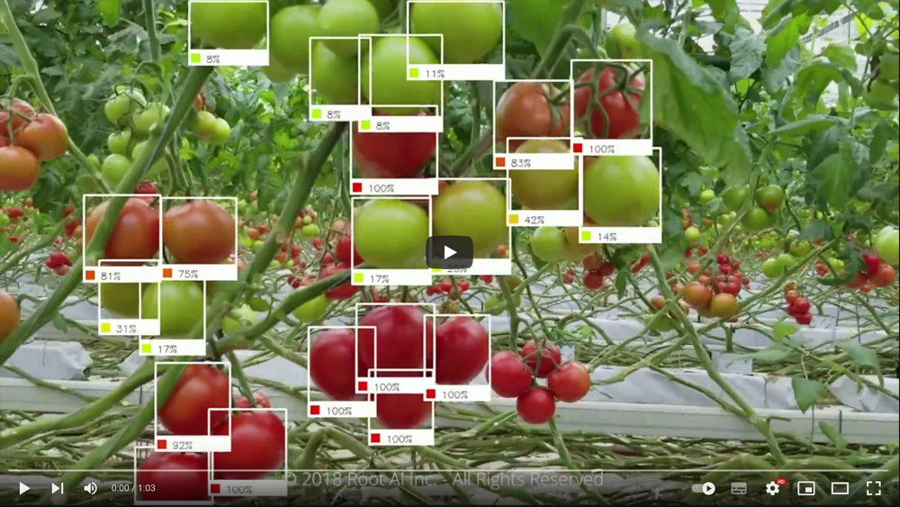

**Casos de estudio con beneficio medible:**

- **Fraude en banca.** Modelo entrenado con datos históricos etiquetados. *Antes:* revisión manual posterior a la pérdida. *Después:* alerta y bloqueo en tiempo real.
- **Mantenimiento predictivo.** Sensores de temperatura y vibración predicen fallos antes de que ocurran. *Antes:* averías inesperadas. *Después:* sustitución programada.
- **Atención al cliente con PLN.** Chatbot que responde consultas frecuentes y deriva las complejas. *Antes:* colas y horario limitado. *Después:* 24/7.
- **Salud: detección precoz.** Visión para detectar infecciones en TAC pulmonar; menos tiempo de respuesta.

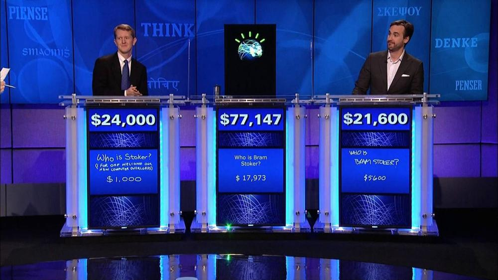

!!! example "Casos del entorno (proyectos del módulo)"
    **Proyecto LARA** (asistente/analítica de dominio), **hidrógeno verde** (optimización de proceso y mantenimiento predictivo) y **colmena inteligente** (IoT + visión/sonido para monitorizar y decidir). Cada uno se caracteriza con la ficha de 1 minuto y se mide con un KPI (Key Performance Indicator → indicador clave de rendimiento).

<!-- 
### 6.1 La IA en la vida cotidiana

| Uso cotidiano | Cómo interviene la IA |
|---|---|
| **Compras online y publicidad** | Recomendaciones personalizadas; optimización de inventario |
| **Buscadores** | Aprenden de los datos para ordenar resultados |
| **Asistentes de voz** | Responden, recomiendan y organizan rutinas |
| **Traducción automática** | Traduce texto y voz; subtítulos automáticos |
| **Hogar y ciudad inteligente** | Termostatos que aprenden; regulación del tráfico |
| **Ciberseguridad** | Detección de ciberataques por patrones |
| **Desinformación** | Detección de noticias falsas |
| **Administración pública** | Alertas tempranas de catástrofes; trámites automatizados |
-->
---

## 7 · Técnicas básicas de la IA (CE 4c)

| Técnica | Qué hace | Uso típico | Ejemplo real y actual |
|---|---|---|---|
| **Clasificación** (supervisado) | Asigna una categoría | Spam, priorizar incidencias, cribar CV | El filtro de spam de tu correo |
| **Regresión** (supervisado) | Predice un valor numérico | Prever demanda, precios | El «Zestimate» de Zillow: estima el precio de una vivienda |
| **Clustering** (no supervisado) | Agrupa por similitud | Segmentar clientes | Agrupar a los clientes de una tienda por hábitos de compra |
| **Detección de anomalías** | Detecta lo atípico | Fraude, averías | Bloquear un pago con tarjeta que se sale de tu patrón habitual |
| **PLN** | Entiende y genera lenguaje | Chatbots, sentimiento, resúmenes | ChatGPT y los traductores automáticos |
| **Visión artificial** | Interpreta imágenes y vídeo | Inspección, lectura de documentos | El desbloqueo facial del móvil; los pulverizadores que detectan malas hierbas |
| **Robótica** | Percibe y actúa en el mundo físico | Almacén, fabricación | Los robotaxis de Waymo; los robots de un almacén |
| **Sistemas expertos** | Reglas de un experto | Diagnóstico técnico | Reglas de validación de una solicitud de seguro o de crédito |
| **IA generativa / agentes** | Crea contenido y actúa | Redacción, tramitación | Un asistente de programación que escribe código, ejecuta pruebas y lo corrige |

---

## 8 · Tarea 2 — Nuevas formas de interacción y decidir con 1 KPI (CE 4d)

La IA aporta **eficiencia** solo si baja **coste, tiempo o error** medido antes/después. **Sin número, es opinión.**

> **Qué pide este criterio (CE 4d).** Identificar una **forma nueva de interactuar** con un negocio (chat, voz, imagen, recomendación, agente) y demostrar, con un **KPI**, que **mejora la eficiencia**: que la empresa gasta menos, tarda menos o se equivoca menos. Es el puente *técnica → interacción → beneficio*.

### 8.1 Nuevas formas de interacción

| Interacción | Qué es | Ejemplo real | Mejora (KPI) |
|---|---|---|---|
| **Asistente virtual** | Responde por voz o texto | Siri, Alexa | Resuelve dudas al instante, sin intervención humana |
| **Chatbot** | Conversación automatizada | Atención al cliente de una tienda o aerolínea; el tutor Khanmigo | Coste por consulta: 3 € → 0,10 € (resuelve el 60 % solo) |
| **Interacción por voz** | Transcribe y analiza audio | Transcripción y resumen automáticos en las videollamadas | Minutos de acta ahorrados por reunión |
| **Interacción por visión** | Lee imágenes y vídeo | Desbloqueo facial, control de accesos, inspección de piezas | Menos tiempo y menos errores |
| **Agentes autónomos** | Ejecutan tareas con herramientas | Asistentes de programación que leen el código, ejecutan las pruebas y lo corrigen | Horas de trabajo repetitivo menos |

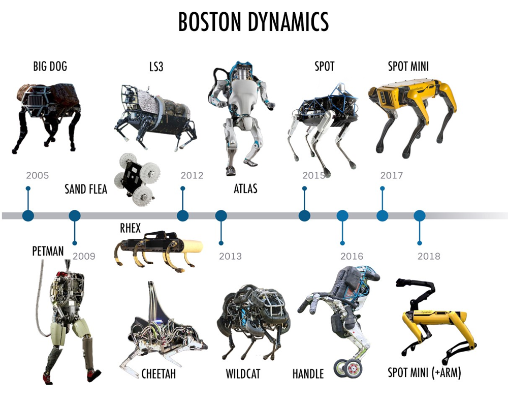

### 8.2 ¿Qué es un KPI?

Un **KPI** (*Key Performance Indicator* → **indicador clave de rendimiento**) no es «un dato» ni «una cifra bonita»: es un **número elegido a propósito para decidir**. Un KPI que sirve siempre tiene esta pinta:

```text
KPI = <métrica> · <unidad> · <periodo> · <referencia (antes)> · <objetivo (después)>
```

**Las 5 comprobaciones:**

| Criterio | La pregunta | No sirve | Sí sirve |
|---|---|---|---|
| **Medible** | ¿Tiene número y unidad? | «mejoramos la atención» | 3,00 € → 1,26 €/consulta |
| **Comparado** | ¿Tiene antes/después? | «cuesta 1,26 €» suelto | 3,00 → 1,26 € (**−58 %**) |
| **Atribuible** | ¿Lo mueve la IA que pongo? | suben las ventas (es diciembre) | baja el tiempo de las consultas automatizadas |
| **Honesto** | ¿Cuenta todo lo que cuesta? | solo los 0,10 € del bot | + licencia, mantenimiento y revisión humana |
| **Accionable** | Si falla, ¿sé qué hacer? | «el número está mal» | si la automatización cae del 60 % al 40 %, reentreno |

**KPI de negocio ≠ métrica de modelo.** La **precisión**, el *recall* y el F1 son **métricas de modelo** (cuánto acierta el modelo en un examen); el **coste, el tiempo y el error** de un proceso son **KPI de negocio** (lo que decide la empresa).

| **KPI de negocio** (decide la empresa) | **Métrica de modelo** (decide el ML) |
|---|---|
| Coste por consulta, tiempo de gestión, tiempo de ciclo | Precisión, *recall*, F1, AUC |
| Tasa de fraude detectado, merma, stock roto | MAE / RMSE, latencia de respuesta |

> La «precisión de 1,00» de la práctica de las flores es una **métrica de modelo**: no dice si compensa usarla. Para decidir hace falta un **KPI de negocio** con antes y después, como el −58 % del caso siguiente. [Solución de la práctica (Iris)](soluciones_s01.md#bloque-1-de-reglas-a-modelo-iris-3-especies).

**KPIs con nombre propio:** **FCR** (resolución al primer contacto) · **AHT** (tiempo medio de gestión) · ***Containment rate*** (% cerradas por la IA) · **OEE** (efectividad de equipo) · **MTBF** (tiempo medio entre averías) · ***Cycle time*** (tiempo de ciclo) · **coste por documento**.

??? info "Ampliación · Para profundizar en los KPI"
    - [Indicador clave de desempeño (Wikipedia, es)](https://es.wikipedia.org/wiki/Indicador_clave_de_desempe%C3%B1o) · [Key performance indicator (Wikipedia, en)](https://en.wikipedia.org/wiki/Key_performance_indicator)
    - [IBM · ¿Qué es un KPI?](https://www.ibm.com/topics/kpi)
    - [SMART criteria](https://en.wikipedia.org/wiki/SMART_criteria) (que el objetivo sea concreto y con fecha) · [Vanity metric](https://en.wikipedia.org/wiki/Vanity_metric) (la métrica que solo hace quedar bien)
    - [Cuadro de mando integral](https://es.wikipedia.org/wiki/Cuadro_de_mando_integral) · [Balanced Scorecard Institute](https://www.balancedscorecard.org/)
    - **KPIs de IA:** [NIST · AI Risk Management Framework](https://www.nist.gov/itl/ai-risk-management-framework) · [Stanford HAI · AI Index Report](https://aiindex.stanford.edu/report/) · [Google re:Work](https://rework.withgoogle.com/)

### 8.3 El caso resuelto: las 1.000 consultas

Un centro recibe **1.000 consultas/día** a **3 €** y **5 min** cada una. Un chatbot resuelve el **60 %** en 10 s a **0,10 €**. ¿Compensa?

| Paso | Qué calculo | Resultado |
|---|---|---|
| 1 · KPI base (indicador clave de rendimiento) | coste de atención · €/día | **3.000 €** (1.000 × 3) |
| 2 · Después | 600 automatizadas + 400 manuales | 600×0,10 + 400×3 = **1.260 €** |
| 3 · Δ | 1 − 1.260/3.000 | **−58 %** |
| 4 · Segundo KPI | tiempo: 5 min → 2 min de media | **−60 %** |
| 5 · Decisión | ¿sí/no? | **Sí**, con 1 riesgo |

!!! warning "Cuatro errores típicos al resolverlo"
    1. Sumar el bot **a** las manuales (`600×0,10 + 1.000×3`): se cuentan dos veces las automatizadas.
    2. Decir «ahorra 58 %» **sin €/día**: el % no se paga, se paga el euro.
    3. Olvidar la licencia: si el bot cuesta ≈18 €/día, el ahorro pasa de 1.740 a 1.722 €/día.
    4. Confundir **−11 p.p.** con **−11 %** al comparar dos porcentajes (15 % → 4 % = −11 p.p.).

!!! question "Tres preguntas orales"
    1. **¿Cuál es el KPI de «priorizar incidencias»?** — **Tiempo de primera respuesta** o % resuelto a la primera.
    2. **Si el chatbot solo resuelve el 30 %, ¿gasta más o menos?** — Relativamente más ahorro (77 %), pero **menos en €**: por eso se mira el euro, no el %.
    3. **¿La precisión del modelo es el KPI?** — No: es métrica de modelo. El KPI es de negocio.

???+ example "En el mundo real · el KPI de un chatbot de atención: Klarna y Air Canada"
    - **Klarna (2024).** La empresa de pagos dijo que su asistente de IA, basado en OpenAI, había gestionado **unos dos tercios de los chats** de atención al cliente en su primer mes, con un trabajo equivalente a **700 agentes a jornada completa** ([Klarna](https://en.wikipedia.org/wiki/Klarna)). Son cifras de la propia empresa. Es el tipo de KPI del caso de clase: *containment rate* (% resuelto por la IA) y coste. Aplícale las 5 comprobaciones: ¿es **honesto**? ¿Cuenta la calidad de las respuestas y los casos que acaban en una persona?
    - **Air Canada (2024).** Un fallo del chatbot acabó en un tribunal, que hizo responsable a la aerolínea ([Moffatt contra Air Canada](https://en.wikipedia.org/wiki/Moffatt_v._Air_Canada)). Un KPI que solo mide lo que se ahorra y no lo que puede costar un error es poco **honesto**.

### 8.4 El esquema que se repite + Ejercicio 3

**El esquema que se repite siempre:**

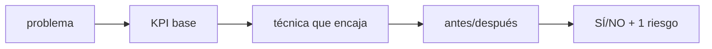

!!! example "Ejercicio 3 · Calcula antes/después (15 min)"
    Un proceso recibe **300 reclamaciones/día** a **2 €** cada una. Un clasificador resuelve el **80 %** a **0,20 €**. Calcula coste antes, coste después y % de ahorro.

    ```python
    antes   = 300 * 2.0
    despues = 240 * 0.20 + 60 * 2.0
    print((1 - despues/antes) * 100)
    ```

    ??? tip "Solución"
        Antes: `300 × 2 = 600 €/día`. Después: `240 × 0,20 + 60 × 2 = 48 + 120 = 168 €/día`. Ahorro **72 %** (de 2 € a 0,56 € por reclamación). Mayor que el −58 % del caso de clase porque lo automatizado es más (80 %) y más barato: **los KPI (Key Performance Indicator → indicador clave de rendimiento) no se comparan entre casos sin contexto**.

---

## 9 · Predictivo vs. generativo, agentes vs. fine-tuning (CE 4d)

- **IA predictiva:** estima un resultado (probabilidad, categoría, valor).
- **IA generativa:** crea contenido nuevo a partir de un *prompt*.
- **Agentes:** programas que **diseñan su flujo de trabajo** y **usan herramientas** para lograr un objetivo. No solo responden: **actúan**.
- ***Fine-tuning*:** adaptar un modelo base a una tarea concreta con datos específicos. Un agente puede usar un modelo afinado; no son excluyentes.

???+ example "En el mundo real · un caso de cada tipo"
    - **Predictiva:** el «Zestimate» de Zillow (valor de una vivienda) o la puntuación de riesgo de un pago con tarjeta.
    - **Generativa:** ChatGPT redactando un correo, Midjourney creando una imagen.
    - **Agente:** un asistente de programación que lee el proyecto, ejecuta las pruebas y corrige el código: no solo responde, **actúa**.
    - **Fine-tuning o documentos propios:** una empresa que quiere que su chatbot hable de sus productos puede **ajustar** un modelo con sus datos o **conectarlo a sus documentos** (RAG); también pueden combinarse.

---

## 10 · Beneficios, riesgos y marco legal

- **Beneficios:** automatización de tareas repetitivas, información más rápida de los datos, mejor decisión, menos errores, disponibilidad 24×7, menor riesgo físico.
- **Riesgos:** datos con sesgos o manipulación, modelos robados o alterados, fallos operativos (*model drift*), privacidad y ética. Un modelo entrenado con datos sesgados **amplifica** ese sesgo.
- **Marco normativo:** el **AI Act** (Reglamento UE 2024/1689) clasifica la IA por riesgo; el **RGPD** limita el uso de datos personales (minimización). El calendario del AI Act se ha ido actualizando: verifícalo en el DOUE antes de evaluarlo.
- **IA responsable:** explicabilidad, equidad, robustez, rendición de cuentas y privacidad.

???+ example "En el mundo real · cuando la IA sale mal"
    - **Sesgo.** Según Reuters, recogido por la BBC, Amazon abandonó una herramienta de selección de personal porque el sistema, entrenado con currículos recibidos durante 10 años (en buena parte de hombres), había aprendido a preferir a los candidatos masculinos ([BBC](https://www.bbc.com/news/technology-45809919)). Un modelo entrenado con datos sesgados **amplifica** ese sesgo.
    - **Fallo operativo.** Zillow cerró en 2021 su división de compra de casas tras perder 420 millones de dólares en un trimestre (ver §5.2).
    - **Responsabilidad y alucinaciones.** Los casos Mata contra Avianca (casos judiciales inventados) y Air Canada (el chatbot compromete a la empresa) están en la sección 2.
    - **Privacidad.** En marzo de 2023 la autoridad italiana de protección de datos **prohibió ChatGPT** en Italia y abrió una investigación por posible incumplimiento del RGPD; la prohibición se levantó en abril de 2023 tras cambios de OpenAI ([ChatGPT](https://en.wikipedia.org/wiki/ChatGPT)).
    - **Marco legal.** El **Reglamento de IA** de la UE entró en vigor el **1 de agosto de 2024** y se aplica de forma gradual; prohíbe las aplicaciones de riesgo inaceptable, como la puntuación social de personas ([AI Act](https://en.wikipedia.org/wiki/Artificial_Intelligence_Act)).

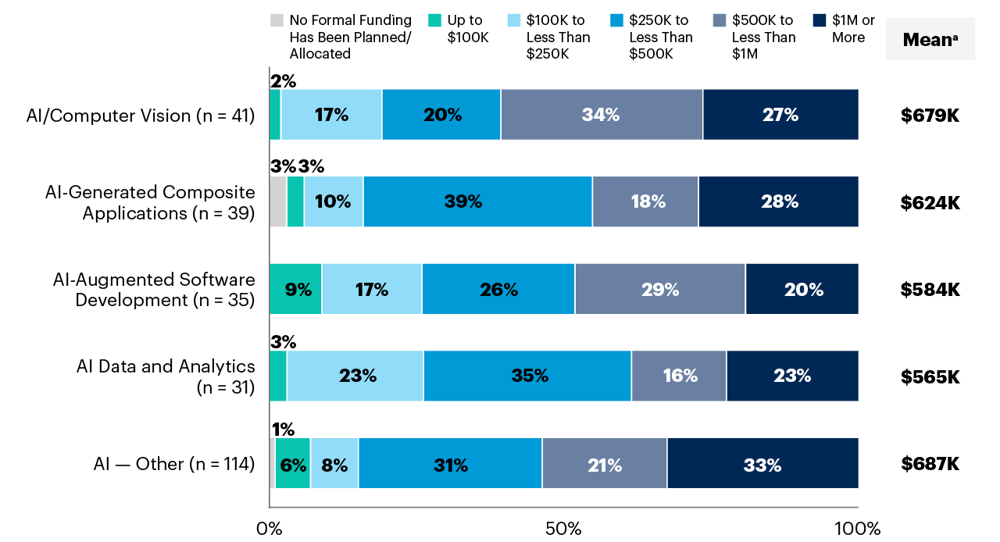

---

## 11 · Cierre — lo que entregas

!!! abstract "Puntos clave"
    - Un sistema inteligente **percibe, razona y actúa**; sus rasgos son autonomía, adaptación y decisión.
    - La IA se clasifica por **tarea** (débil/fuerte), por **escuela** (convencional/computacional) y por **capacidades** (Russell-Norvig, Hintze): son lentes complementarias.
    - **IA > ML > DL > IA generativa**: todo ML es IA, pero no toda IA es ML.
    - Aprendizaje **supervisado**, **no supervisado**, **por refuerzo**, **semi** y **auto-supervisado**.
    - La IA ya está en la vida cotidiana y en la empresa; las **nuevas interacciones** mejoran la eficiencia reduciendo coste, tiempo o error.
    - Sin **KPI comparado** (indicador clave de rendimiento medido antes y después), no hay mejora demostrable.
    - Un **KPI** es un número con **unidad, periodo y referencia**. **KPI de negocio ≠ métrica de modelo**: la precisión no decide, el coste o el tiempo sí.

**Un solo entregable** (ficha + KPI + decisión):

| Entregable | Qué es |
|---|---|
| **Ficha** | De **1 sistema real**: percibe / reglas o datos / acción / tarea estrecha |
| **KPI** | 2 números con unidad, **antes** y **después**, + el % |

---

## 12 · Autoevaluación

### Los 10 ejercicios

**Bloque 1 · Caracterizar**

1. Ficha de 1 minuto para un chatbot de reclamaciones.
2. Termostato `si T<18 → enciende` vs. filtro de spam aprendido: ¿qué tipo es cada uno y cuándo conviene cada enfoque?
3. ¿Por qué toda la IA actual es estrecha (débil)? Pon un ejemplo de lo que *no* puede hacer.
4. **(N02)** Ejecuta el notebook y explica la diferencia entre la salida supervisada y la no supervisada.
5. **(N01)** Elige 1 sistema real y clasifícalo (reglas o datos, tarea estrecha).
6. Clasifica: grietas por foto / agrupar clientes / spam / asistente por voz.

**Bloque 2 · Decidir con KPI (Key Performance Indicator → indicador clave de rendimiento)**

7. Reproduce el caso 1.000 consultas: coste antes, después y % de ahorro.
8. Variante: 300 reclamaciones a 2 €, 80 % a 0,20 €. Calcula antes, después y %.
9. Tu proceso (LARA, hidrógeno, colmena o el tuyo): propón técnica y KPI antes/después en 2 números.
10. Nombra 1 riesgo (sesgo, privacidad, drift) y su mitigación en 1 línea.

<!-- >> Corrección guiada en [Soluciones de prácticas](soluciones_s01.md) · [Preguntas frecuentes](faq_s01.md). -->

### Preguntas de repaso

??? question "1. Define con tus palabras la inteligencia artificial y cita tres capacidades que simula."
    Tecnología que permite a las máquinas simular capacidades humanas: **aprender, razonar y percibir/decidir** (también comprender y crear).

??? question "2. ¿Qué es un sistema inteligente y qué tres rasgos lo caracterizan?"
    Un sistema que **percibe → razona → actúa** para lograr un objetivo. Rasgos: **autonomía, adaptación y toma de decisiones**.

??? question "3. ¿Es IA un termostato? ¿De qué tipo?"
    Sí, formalmente es IA **basada en reglas** (`si T < 18 → enciende`). Es un caso elemental; cuando las reglas no bastan, se usa **machine learning**.

??? question "4. Diferencia IA débil y fuerte. ¿Cuál es toda la IA actual?"
    La **débil** resuelve una tarea acotada y no se adapta; la **fuerte** igualaría a una persona en cualquier tarea. **Toda la IA actual es débil**.

??? question "5. Diferencia la escuela convencional de la computacional."
    La **convencional** (simbólico-deductiva) razona con reglas y lógica explícitas; la **computacional** (subsimbólica-inductiva) **aprende de los datos** (redes neuronales, SVM).

??? question "6. Ordena los niveles de Hintze y pon un ejemplo."
    Reactiva → memoria limitada → teoría de la mente → autoconciencia. **Deep Blue** es reactiva; un **coche autónomo** es de memoria limitada.

??? question "7. Explica «todo ML es IA, pero no toda IA es ML»."
    El ML es una **familia dentro** de la IA (aprende de datos). Hay IA sin ML: sistemas basados en reglas y búsquedas heurísticas.

??? question "8. Clasifica: spam con etiquetas, agrupar clientes, robot por recompensa."
    **Supervisado** (spam), **no supervisado** (clustering) y **refuerzo** (recompensa).

??? question "9. ¿Qué diferencia hay entre clasificación y regresión?"
    La **clasificación** predice una categoría (spam/no spam); la **regresión**, un valor numérico continuo (precio).

??? question "10. ¿Qué es un KPI y por qué decide si la IA aporta eficiencia?"
    Un indicador medible (tiempo de ciclo, coste unitario, tasa de error). La IA aporta eficiencia **solo si mejora un KPI (Key Performance Indicator → indicador clave de rendimiento)** comparado antes/después; sin número, es una opinión.

---

## 13 · Glosario

| Término | Definición |
|---|---|
| **IA** | Tecnología que simula capacidades humanas (aprender, razonar, decidir) |
| **Sistema inteligente** | Sistema que percibe, razona y actúa para lograr un objetivo |
| **IA débil / fuerte** | Orientada a una tarea concreta (toda la actual) / IA general al nivel humano (teórica) |
| **ANI / AGI / ASI** | IA estrecha / general / superinteligencia |
| **IA convencional / computacional** | Escuela simbólico-deductiva / subsimbólica-inductiva |
| **Test de Turing** | Un interrogador no distingue a la máquina de una persona |
| **Test de Lovelace** | El sistema origina algo que su programador no puede explicar |
| **ML** | Técnicas que aprenden patrones de los datos sin programación explícita |
| **Deep learning** | Subconjunto del ML basado en redes neuronales profundas |
| **IA generativa** | IA que crea contenido nuevo (texto, imagen, audio) |
| **LLM** | Modelo de lenguaje grande (p. ej. ChatGPT) |
| **Generalización** | Capacidad del modelo de acertar con datos nuevos |
| **Supervisado / no supervisado** | Con etiquetas / sin etiquetas |
| **Refuerzo (RL)** | Aprendizaje por prueba-error con recompensas |
| **Clasificación / regresión** | Predecir categorías / valores continuos |
| **Clustering** | Agrupación no supervisada de datos similares |
| **PLN** | Procesamiento del lenguaje natural (texto y voz) |
| **Visión por computador** | IA que interpreta imágenes y vídeo |
| **Sistema experto** | IA basada en reglas de un experto humano |
| **Agente de IA** | Programa autónomo que usa herramientas para lograr objetivos |
| **Prompt** | Instrucción de texto para un modelo generativo |
| **Eficiencia operativa** | Reducción de costes, tiempos o errores en un proceso |
| **KPI** | Indicador clave de rendimiento (tiempo, coste, error) |

---

## 14 · Vídeos y recursos

**Vídeos de DotCSV para repasar:**

- [¿Qué es el ML? ¿Y Deep Learning? (mapa conceptual)](https://www.youtube.com/watch?v=KytW151dpqU) — el vídeo de hoy.
- [¿Qué es el Aprendizaje Supervisado y No Supervisado?](https://www.youtube.com/watch?v=oT3arRRB2Cw)
- [Modelos para entender una realidad caótica (¿qué es un modelo?)](https://www.youtube.com/watch?v=Sb8XVheowVQ)
- [Regresión Lineal y Mínimos Cuadrados](https://www.youtube.com/watch?v=k964_uNn3l0) · [Descenso del Gradiente](https://www.youtube.com/watch?v=A6FiCDoz8_4)

Más en [Recursos de vídeo (DotCSV)](recursos_video.md) y en el [catálogo completo](../../recursos/dotcsv.md).

**Materiales del módulo:** [UD01 · Caracterización de sistemas de IA (D. Martínez)](https://martinezpenya.es/ModelosIA/UD01/UD01_ES.html) · [Ejercicios de autoevaluación UD01](https://martinezpenya.es/ModelosIA/UD01/UD01_Ejercicios.html)

**Fuentes:** [IBM · ¿Qué es la inteligencia artificial?](https://www.ibm.com/topics/artificial-intelligence) · [IBM · ¿Qué es el machine learning?](https://www.ibm.com/topics/machine-learning) · [Russell y Norvig · AIMA](https://aima.cs.berkeley.edu/) · [Hintze · «The four types of AI» (2016)](https://theconversation.com/understanding-the-four-types-of-ai-from-reactive-robots-to-self-aware-beings-67616) · [Vaswani et al. · *Attention Is All You Need* (2017)](https://arxiv.org/abs/1706.03762)

> Créditos de imágenes: ilustraciones adaptadas de los materiales de la UD01 de David Martínez Peña (CC BY-NC-SA 4.0).

---
