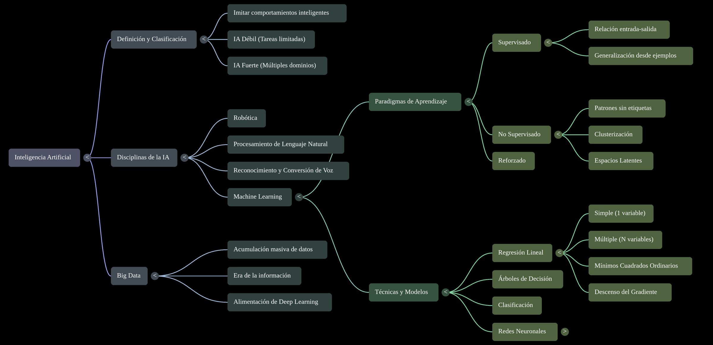

# B01 · RA1 — Recursos NotebookLM

Materiales complementarios generados con **NotebookLM** a partir de las fuentes del bloque (mapa mental, presentación, resúmenes y audio). Son material de **apoyo y repaso**, no sustituyen a los [apuntes](apuntes.md).

!!! info "Cómo se ha generado"
    Estos artefactos se han elaborado con NotebookLM a partir de las fuentes del RA1 (RD 279/2021, apuntes de la UD01 y artículos de referencia). Se citan las fuentes originales; el material se comparte bajo **CC BY-NC-SA 4.0**.

## Mapa mental

Visión general del bloque en un solo vistazo. Pulsa para ampliarlo.

<figure markdown>
  { width="100%" }
  <figcaption>Mapa mental del RA1 · elaborado con NotebookLM</figcaption>
</figure>

## Presentación: «El Atlas de la Inteligencia Artificial»

Guía visual de 15 diapositivas (IA, Machine Learning, Deep Learning y Big Data) pensada como repaso del bloque.

- [Descargar la presentación (PDF, 15 diapositivas)](../../assets/pdf/b01_atlas_ia.pdf)

<iframe src="../../assets/pdf/b01_atlas_ia.pdf" width="100%" height="640" style="border:1px solid #ccc;border-radius:8px"></iframe>

## Audio Overview (podcast)

*(pendiente de añadir)*

<!--
<audio controls style="width:100%">
  <source src="../../assets/audio/b01_overview.mp3" type="audio/mpeg">
  Tu navegador no soporta audio.
</audio>
-->

## Resúmenes y notas

*(pendiente de añadir)*

## Flashcards y autoevaluación

*(pendiente de añadir)*

## Cuaderno público

*(pendiente de añadir enlace al cuaderno compartido de NotebookLM)*

## Cómo añadir más material (guía rápida)

1. Descarga el artefacto de NotebookLM (PDF/PNG para infografías y presentaciones; `.wav`/`.mp3` para el audio).
2. Convierte y optimiza con el script del repositorio:
   ```bash
   ./scripts/nbl2assets.sh B01 <fichero>
   ```
3. Copia el bloque que imprime el script en esta página.
4. Cita siempre la **fuente original** y mantén la licencia CC BY-NC-SA 4.0.
