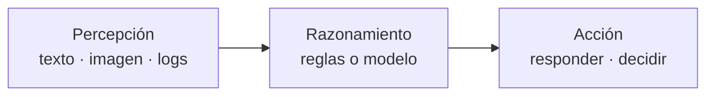

# Sesión 01 · RA1 en una sesión (UD01 compactada)

> **Filosofía:** mejor 2 cosas bien que 4 mal. Esta sesión compacta toda la UD01 de David (12 h / 4 sesiones de 3 h) en **2 h**: dos ideas concretas, sin profundizar. Todo lo demás queda como mapa de lectura, no como temario.
>
> **Las 2 cosas:** (1) caracterizar un sistema IA en 1 minuto · (2) decidir con 1 KPI si aporta eficiencia. Base: `material_david/docs/UD01/UD01_ES.md` + `artint/docs/ia/introduccion/`.

## Objetivos (solo 2)

Al finalizar, serás capaz de (RA1):

1. **Caracterizar** cualquier sistema IA con la ficha mínima: ciclo percepción→razonamiento→acción + reglas o datos + tarea estrecha.
2. **Decidir** con un número si compensa: KPI antes/después en 1 caso resuelto.

## Contenidos

### Cosa 1 (60 min) · Caracterizar un sistema en 1 minuto

**Definición operativa (3 líneas):** un sistema inteligente *percibe* su entorno (datos), *razona* (reglas o modelo aprendido) y *actúa* (responde, recomienda, controla) para lograr un objetivo.



**Reglas vs. aprende (el único dilema que importa hoy):**

|  | Reglas escritas | Aprendido de datos |
|---|---|---|
| Ejemplo | Termostato `si T<18 → enciende` | Filtro spam que deduce criterios de ejemplos |
| Cuándo | Tarea cerrada y enumerable | Demasiados casos para escribir reglas |
| Límite | No generaliza | Necesita datos y evaluación honesta |

**Toda la IA actual es estrecha (débil):** una tarea acotada, sin conciencia. AGI/ASI quedan fuera de esta sesión (mención, no temario).

**Ficha de 1 minuto (plantilla que usarás en la práctica):**

1. ¿Qué *percibe*?
2. ¿Con *reglas o datos* razona?
3. ¿Qué *acción* produce?
4. ¿Tarea estrecha cuál?

*Ejemplo resuelto:* chatbot de reclamaciones → percibe texto del correo → razona con clasificador entrenado (datos etiquetados) → actúa enrutando. Tarea estrecha: clasificar devolución/cambio/defecto.

### Cosa 2 (45 min) · Decidir con 1 KPI

La IA aporta **eficiencia** solo si baja **coste, tiempo o error** medido antes/después. Sin número, es opinión.

**Caso resuelto (el único que hacemos en clase):** centro con 1.000 consultas/día a 3 € y 5 min cada una. Un chatbot resuelve el 60 % en 10 s a 0,10 €.

- Antes: 1.000 × 3 € = **3.000 €/día**.
- Después: 600 × 0,10 € + 400 × 3 € = **1.260 €/día** → **−58 % coste** y tiempo medio de ~5 a ~2 min.

**Tabla mínima técnica→beneficio (solo 4 filas, sin profundizar):**

| Técnica | Ejemplo | Beneficio |
|---|---|---|
| Clasificación | Priorizar incidencias | Menos tiempo/error |
| Regresión | Prever demanda | Menos stock roto |
| PLN/chatbot | Responder reclamaciones | Coste/consulta ↓ |
| Visión | Inspeccionar piezas | Error/tiempo ↓ |

**Esquema de decisión (repite siempre):** problema → KPI base → técnica que encaja → antes/después → sí/no con riesgos (privacidad, sesgo).

### Mapa de lo NO profundizado (lectura, 0 min en clase)

Para que conste que existe, sin tiempo de aula: historia (Turing 1950 → Dartmouth 1956 → Deep Blue 1997 → Transformer 2017 → LLM 2022), jerarquía IA>ML>DL>Generativa, tipos de aprendizaje (tabla UD01 §4.2), Hintze/Russell-Norvig (una frase), PLN/visión/robótica (una línea cada una), riesgos y AI Act/RGPD (3 viñetas, se ven en UD06).

> Referencias: `UD01_ES.md` §§3–7, `artint/docs/ia/introduccion/{definicion,clases,campos}.md`.

## Temporalización (120 min)

- **0–15 Apertura:** *¿es inteligente tu lavadora?* (automatización vs. inteligencia) + ficha de 1 minuto en pizarra.
- **15–60 Cosa 1:** definición, reglas vs. datos, 1 ejemplo resuelto + demo guiada (código 1).
- **60–100 Cosa 2:** KPI, caso 1.000 consultas resuelto en pizarra + cálculo guiado (código 2).
- **100–120 Cierre:** el alumnado rellena su ficha + KPI en el notebook; dudas y rúbrica del entregable único.

## Práctica guiada (con solución) — 2 bloques de 10 líneas

Bloque 1 (caracterizar = ejecutar un `fit/predict` mínimo). Bloque 2 (decidir = calcular antes/después).

```python
# Bloque 1 · De reglas a modelo en 10 líneas (Iris, 2 clases)
from sklearn.datasets import load_iris
from sklearn.model_selection import train_test_split
from sklearn.tree import DecisionTreeClassifier

X, y = load_iris(return_X_y=True)
X_train, X_test, y_train, y_test = train_test_split(X, y, test_size=0.3, random_state=42)
clf = DecisionTreeClassifier(max_depth=3, random_state=42).fit(X_train, y_train)
print("Precisión:", round(clf.score(X_test, y_test), 3))
# Ficha: percibe 4 medidas → razona con árbol aprendido (datos) → actúa clasificando. Tarea estrecha.
```

```python
# Bloque 2 · El KPI decide (caso 1000 consultas)
antes = 1000 * 3.0
despues = 600 * 0.10 + 400 * 3.0
print(f"Antes: {antes:.0f} €/día · Después: {despues:.0f} €/día · Ahorro: {(1-despues/antes)*100:.0f}%")
```

## Práctica propuesta (miniproyecto único = N02+N04 fusionados)

**Un solo entregable** (sustituye a N02+N03+N04+N05 para esta sesión única): ficha de **1 sistema real** (el de tu empresa, LARA, hidrógeno o colmena) en `sesion01_miniproyecto.ipynb`:

1. Ficha 1-minuto (percibe / reglas o datos / acción / tarea estrecha).
2. KPI antes/después con 2 números (coste, tiempo o error).
3. Decisión en 3 líneas + 1 riesgo (sesgo, privacidad o drift).

**Criterios (RA1):** caracteriza con vocabulario propio; el KPI es plausible; la decisión es explícita.

**Notebook:** [Abrir/Descargar miniproyecto](sesion01_miniproyecto.ipynb) — botones *Abrir en Colab* / *Descargar .ipynb* arriba (vía `hooks.py` + `mkdocs.yml:extra.colab/raw_base`).

## Materiales / recursos

- **Apuntes (1 lectura):** `material_david/docs/UD01/UD01_ES.md` §§3, 6.2–6.5 (el resto es mapa).
- **Guiados en nav:** N01 Técnicas (demo) + N02 Mapa (plantilla de ficha).
- **Complemento:** `artint/docs/ia/introduccion/definicion.md`.

## Evaluación (CE RA1)

- **RA1-a/c:** ficha mínima correcta (ciclo + reglas/datos + tarea estrecha).
- **RA1-b/d:** KPI antes/después plausible y técnica que encaja.
- Ponderación del bloque: 40 % actividades / 60 % prueba, ≥5 por RA (Orden 8/2025). Esta sesión alimenta actividades con el entregable único.

## Atención a la diversidad

- **Refuerzo:** ficha con huecos (`Percibe: ___ / Razona con: ___ / Actúa: ___`) y calculadora del KPI ya escrita.
- **Ampliación:** segundo KPI o segundo riesgo con mitigación.

## Observaciones

- Lo que se quita respecto a UD01 completa (31 ejercicios, N03, N05, Turing/Lovelace, Hintze, Transformers, PLN a fondo) queda como **lectura voluntaria**, no evaluable en esta sesión. Si el grupo pide más, ampliar por el KPI, nunca por teoría.
- N02 original pedía 3 sistemas; aquí se pide **1 bien hecho**. N04 pedía propuesta completa; aquí **3 líneas de decisión**.
