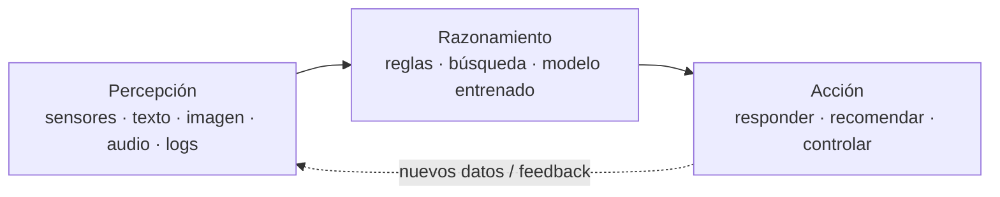
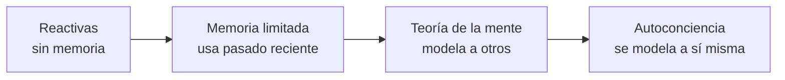

# Sesión 01 · Introducción a la IA y tipos de sistemas

> **Hilo conductor:** de qué hablamos cuando decimos "IA" hoy — del *vibecoding* y los chatbots a los agentes autónomos — y cómo distinguir, con criterio, qué tipo de sistema tenemos delante y dónde aporta valor en la empresa. Material base adaptado de `material_david/docs/UD01/UD01_ES.md` (§§3–6) y de `artint/docs/ia/introduccion/` (introducción, definición, historia, clases, campos).

## Objetivos de la sesión

Al finalizar, serás capaz de (RA1 · CE RA1-a / RA1-b / RA1-c / RA1-d):

- **RA1-a:** describir qué es un **sistema inteligente** y su ciclo **percepción → razonamiento → acción**, con sus rasgos (autonomía, adaptación, decisión).
- **RA1-b:** enumerar **campos de aplicación** de la IA con ejemplos reales y vincularlos a **mejora de la eficiencia operativa** (casos LARA, hidrógeno verde, colmena inteligente).
- **RA1-c:** distinguir **escuelas y técnicas** (simbólico-deductiva vs. computacional-inductiva), las tres lentes de clasificación (débil/fuerte, Russell-Norvig, Hintze) y los-tests de Turing/Lovelace.
- **RA1-d:** identificar **nuevas formas de interacción** (chatbots, voz, visión, agentes) y diferenciar **modelos predictivos vs. generativos** y **agentes vs. *fine-tuning***.

## Contenidos

### 1. Situación actual: la IA como revolución en curso

Tres familias de avances alimentan la IA visible hoy — **ASR** (reconocimiento de voz), **NLP** (lenguaje) y **CV** (visión) — y convergen en robótica, drones y vehículos autónomos. Sobre ellas se monta la ola generativa (GPT y familia) y la siguiente: **agentes** que no solo responden, sino que *actúan* con herramientas. La regulación y la ética aparecen desde el primer día: utilidad y riesgo van juntos.

> Referencia complementaria: `artint/docs/ia/introduccion/introduccion.md` (industria 4.0 y trípode ASR/NLP/CV).

### 2. ¿Qué es un sistema inteligente?

Definición operativa (Comisión Europea, adaptada): *software —y, en su caso, hardware— diseñado por humanos que, ante un objetivo complejo, percibe su entorno (datos estructurados o no), razona sobre ese conocimiento y decide la mejor acción en el mundo físico o digital*. Puede operar con **reglas simbólicas** explícitas o con un **modelo numérico aprendido**, y ajustar su comportamiento al observar los efectos de sus acciones.



| Rasgo | Qué significa en la práctica |
|---|---|
| **Autonomía** | Opera sin supervisión continua |
| **Adaptación** | Mejora con la experiencia (datos) |
| **Decisión** | Elige o recomienda a partir de evidencia, no solo por reglas fijas |

!!! note "Reglas vs. aprendizaje"
    Un termostato `si T < 18º → enciende` es, formalmente, IA basada en reglas. Cuando no podemos escribir todas las reglas, pasamos a **aprenderlas de los datos** (machine learning).

Referencia: `artint/docs/ia/introduccion/definicion.md` y `material_david/docs/UD01/UD01_ES.md` §3.1–3.3.

### 3. IA débil / fuerte y la escala ANI → AGI → ASI

| Nivel | Alcance | Estado hoy |
|---|---|---|
| **ANI (débil/estrecha)** | Una o pocas tareas bien acotadas, reactiva, sin conciencia | **Toda la IA existente** (Siri, recomendadores, traductores) |
| **AGI (general)** | Capacidad de transferir conocimiento y razonar en dominios no entrenados | Teórica, sin prototipo |
| **ASI (superinteligencia)** | Supera lo humano en cualquier tarea intelectual | Ciencia-ficción |

!!! warning "Riesgo de la IA débil bien hecha"
    Al ser excelente en su tarea y ciega al contexto más amplio, puede ejecutarla sin matices éticos. De ahí la importancia de UD06 (ética, sesgos, AI Act).

Detalles y matices en `artint/docs/ia/introduccion/clases.md` y `UD01_ES.md` §3.4.

### 4. Tres lentes para clasificar la misma realidad

**a) Escuelas de pensamiento**

|  | Convencional (simbólica, deductiva) | Computacional (subsimbólica, inductiva) |
|---|---|---|
| Razonamiento | Análisis formal explícito | Aprendizaje desde datos empíricos |
| Técnicas típicas | Sistemas expertos, RBR, redes bayesianas | Redes neuronales, SVM, lógica difusa, evolutivos |
| Aporta | Automatización con reglas + estadística | **Aprendizaje automático** moderno |

**b) Russell y Norvig (1995)** — por *origen del comportamiento*:

| Categoría | Idea | Ejemplo |
|---|---|---|
| Sistemas cognitivos | Piensan como humanos | Modelos cognitivos |
| Test de Turing | Actúan como humanos | Robótica conversacional |
| Leyes del pensamiento | Piensan con lógica formal | Sistemas expertos acotados |
| Agentes racionales | Actúan racionalmente | Agentes de software actuales |

**Tests de inteligencia:** *Turing* (1950, imitación conversacional) y *Lovelace* (2001, originalidad no explicable por el programador; v2.0 de Riedl 2014 con artefactos creativos evaluados por humanos). Pasar Turing no implica pasar Lovelace.

**c) Hintze (2016)** — por *capacidades*:



Ejemplos: **Deep Blue** (reactiva pura) → **coche autónomo** (memoria limitada, transitoria). Los dos últimos niveles son teóricos.

!!! tip "Cómo clasificar sin perderse"
    Pregunta primero por la **tarea** (casi siempre débil), luego por la **escuela** (¿reglas o datos?) y, si aplica, por **Hintze** (¿tiene memoria?).

Fuente: `UD01_ES.md` §3.5 y `artint/docs/ia/introduccion/historia.md` + `clases.md`.

### 5. Breve historia útil (no memorística)

| Año | Hito |
|---|---|
| 1943 | McCulloch & Pitts: neurona artificial |
| 1950 | Turing: juego de la imitación |
| 1956 | Dartmouth: McCarthy acuña "inteligencia artificial" |
| 1958 | Rosenblatt: perceptrón |
| 1997 | Deep Blue vence a Kasparov |
| 2017 | Vaswani et al.: **Transformer** (*Attention Is All You Need*) |
| 2022 | LLM de uso masivo (ChatGPT) |
| 2024–26 | Multimodalidad y agentes autónomos |

Idea clave de `artint/docs/ia/introduccion/historia.md`: ciclos de optimismo → "invierno" → renacimiento experto → industrialización con deep learning y método científico.

### 6. Tipos según su forma y según lo que producen

- **Por forma:** *software puro* (buscadores, asistentes, traductores, análisis de imagen/voz) vs. *encarnada* (robots, vehículos, IoT). Muchas soluciones combinan ambas.
- **Por salida:** **predictiva** (estima una categoría/valor: ¿fraude? ¿precio?) vs. **generativa** (crea contenido nuevo: texto, imagen, audio a partir de un *prompt*).
- **Agentes vs. *fine-tuning*:** un agente diseña su flujo y **usa herramientas** para lograr un objetivo; el *fine-tuning* adapta un modelo base a una tarea concreta con datos específicos. No son excluyentes.

### 7. Campos de aplicación y eficiencia operativa

| Campo | Ejemplos | Mejora típica |
|---|---|---|
| Industria / logística | Mantenimiento predictivo, optimización de rutas | Menos paradas y coste |
| Salud | Triaje, diagnóstico por imagen | Precisión, tiempo de respuesta |
| Finanzas | Scoring, detección de fraude | Menos pérdidas, velocidad |
| Comercio | Recomendación, previsión de demanda | Ventas, stock |
| Educación / RRHH | Tutoría adaptativa, cribado de CV | Personalización, tiempo |

**Casos de esta sesión (tu contexto):**

- **Proyecto LARA** — asistente/analítica aplicada a dominio específico.
- **Hidrógeno verde** — optimización de proceso y mantenimiento predictivo.
- **Colmena inteligente** — IoT + visión/sonido para monitorizar y decidir.

Cómo se conecta a empresa: `Acción en la dirección` — la IA entra por un **KPI antes/después** (tiempo de ciclo, coste por consulta, tasa de error, disponibilidad). Si no mejora un KPI, no es eficiencia operativa.

Ampliado en `artint/docs/ia/introduccion/campos.md` y `UD01_ES.md` §§5–6.

### 8. Nuevas interacciones: del chatbot al agente

| Interacción | Qué aporta | Ejemplo |
|---|---|---|
| Chatbot | Conversación 24/7 en web/mensajería | Soporte de tienda |
| Voz | Transcripción y comprensión | Asistente, actas |
| Visión | Lectura de imagen/vídeo | Control de acceso, inspección |
| Agente autónomo | Planifica y ejecuta con herramientas | Tramitar incidencia, reservar |

Detrás de texto/voz hay un *pipeline* de **PLN** (UD03): preprocesado → vectorización → modelo → salida. Se ve en detalle más adelante; hoy basta con situarlo.

## Temporalización (120 min)

- **Apertura / activación (15 min):** *¿Es inteligente tu lavadora?* Debate rápido + ejemplo *vibecoding* (generar una mini-app con un LLM en 2 minutos) para contrastar automatización vs. inteligencia y presentar el ciclo percepción→razonamiento→acción.
- **Desarrollo (75 min):** exposición dialogada §§2–7 con dos mermaid en pizarra, cuadro de escuelas y tabla débil/fuerte; micro-casos LARA/hidrógeno/colmena mapeados a KPI (tiempo, coste, error).
- **Cierre y práctica guiada (30 min):** ejecución en vivo de la práctica guiada (ver abajo) y arranque del notebook del alumnado.

## Práctica guiada (con solución) — en vivo

Clasificamos 12 sistemas ficticios según atributos binarios y visualizamos el reparto. Es la misma lógica que usarás en el miniproyecto, resuelta y comentada en clase.

```python
import pandas as pd
import matplotlib.pyplot as plt

sistemas = pd.DataFrame({
    "nombre": [
        "FiltroSpam-EX", "DiagnosticoMed-RB", "RecomendadorShop-ML",
        "ChatbotHR-ML", "PlanificadorRutas-SYM", "DeteccionCobre-ML",
        "ReglasCredito-RB", "VisionRobot-SYM", "AsistenteVoz-ML",
        "OptimizadorRed-SYM", "ClasificadorDocs-ML", "ExpertoLegal-RB",
    ],
    "usa_reglas":     [0,1,0,0,1,0,1,1,0,1,0,1],
    "usa_ml":         [1,0,1,1,0,1,0,0,1,0,1,0],
    "es_simbolico":   [0,1,0,0,1,0,1,1,0,1,0,1],
    "requiere_datos": [1,0,1,1,0,1,0,0,1,0,1,0],
    "autonomo":       [0,0,0,0,1,1,0,1,1,1,0,0],
})

def clasificar_tipo(f):
    if f["usa_reglas"] and f["es_simbolico"]:
        base = "IA simbólica / basada en reglas"
    elif f["usa_ml"] and f["requiere_datos"]:
        base = "Aprendizaje automático"
    elif (f["usa_reglas"] or f["es_simbolico"]) and (f["usa_ml"] or f["requiere_datos"]):
        base = "Híbrido"
    else:
        base = "Otro"
    return base + (" (autónomo)" if f["autonomo"] else "")

sistemas["tipo"] = sistemas.apply(clasificar_tipo, axis=1)
print(sistemas[["nombre", "tipo"]])

conteo = sistemas["tipo"].value_counts()
plt.figure(figsize=(8, 4))
plt.bar(conteo.index, conteo.values)
plt.xticks(rotation=30, ha="right")
plt.ylabel("Nº de sistemas")
plt.title("Reparto de sistemas por tipología")
plt.tight_layout()
plt.show()

sistemas.to_csv("sistemas_clasificados.csv", index=False)
```

**Qué se espera ver:** 12 filas etiquetadas (p. ej. `PlanificadorRutas-SYM` → *IA simbólica / basada en reglas (autónomo)*) y un gráfico de barras. El CSV queda como artefacto de la sesión.

!!! tip "Lectura guiada"
    Para cada fila, justifica en una frase: tarea (débil), escuela (reglas vs. datos) y nivel Hintze (¿memoria limitada?).

## Práctica propuesta (miniproyecto) — entregable

**Reto:** caracteriza 12 sistemas de un catálogo ficticio (te damos los atributos), clasifícalos con el criterio visto, genera el gráfico de reparto y justifica **3 casos** vinculándolos a un **KPI de eficiencia operativa** (tiempo, coste o error) en un escenario tipo LARA / hidrógeno / colmena.

**Entregables (en `sesion01_miniproyecto.ipynb`):**

1. `sistemas_clasificados.csv` (tabla completa etiquetada).
2. Gráfico de barras por tipología.
3. Párrafo de 3 justificaciones (tarea + escuela + Hintze) + KPI antes/después estimado.

**Criterios (RA1):** identifica principios y tipologías con criterios explícitos; la clasificación es coherente; el vínculo con eficiencia operativa es plausible.

**Notebook:** [Abrir/Descargar miniproyecto](sesion01_miniproyecto.ipynb) — botones *Abrir en Colab* / *Descargar .ipynb* arriba del todo (vía `hooks.py` + `mkdocs.yml:extra.colab/raw_base`).

## Materiales / recursos

- **Apuntes base (adaptados):** `material_david/docs/UD01/UD01_ES.md` §§3–6; `artint/docs/ia/introduccion/{introduccion,definicion,historia,clases,campos}.md`.
- **Notebooks de consulta (David, solo lectura):**
  - `UD01_N01_tecnicas_ia.ipynb` — demo supervisado/no supervisado.
  - `UD01_N02_mapa_sistemas.ipynb` — mapa de sistemas inteligentes.
  - `UD01_N03_tecnicas_casos.ipynb` — técnicas vs. casos reales.
  - `UD01_N05_linea_tiempo.ipynb` — línea del tiempo.
- **Glosario y FAQ de la unidad:** `UD01_ES.md` §§9–10 (IA débil/fuerte, ML vs. DL, clasificación vs. regresión).

## Evaluación (criterios CE)

- **CE RA1-a:** distingue principios y rasgos del sistema inteligente (ciclo + autonomía/adaptación/decisión).
- **CE RA1-b/c/d:** ubica campos, técnicas y nuevas interacciones y las relaciona con un KPI de eficiencia (no basta "va mejor": hay que cuantificar).

La rúbrica del bloque pondera **40 % actividades / 60 % prueba** por RA (Orden 8/2025). Esta sesión alimenta la parte de actividades.

## Atención a la diversidad

- **Refuerzo:** plantilla de tabla con 3 sistemas ya resueltos y checklist *tarea → escuela → Hintze*.
- **Ampliación:** añade una dimensión propia ("explicable" / "con memoria a largo plazo") y reclasifica; o propón un cuarto caso LARA/hidrógeno/colmena con su KPI.

## Observaciones

- Esta sesión sienta el **vocabulario** del módulo. Las prácticas de datos/ML (Kaggle, limpieza, métricas) empiezan en la S02–S04; aquí el foco es **caracterizar** correctamente antes de implementar.
- Si el grupo viene con nivel heterogéneo, dedica 10 min extra al diagrama percepción→razonamiento→acción con un ejemplo físico (p. ej. colmena: sensor temperatura → modelo → activar ventilación).
