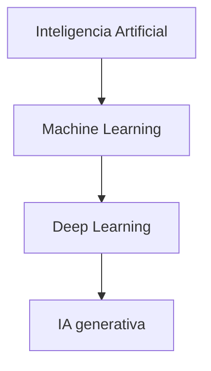
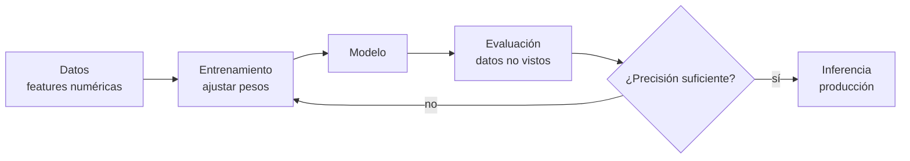
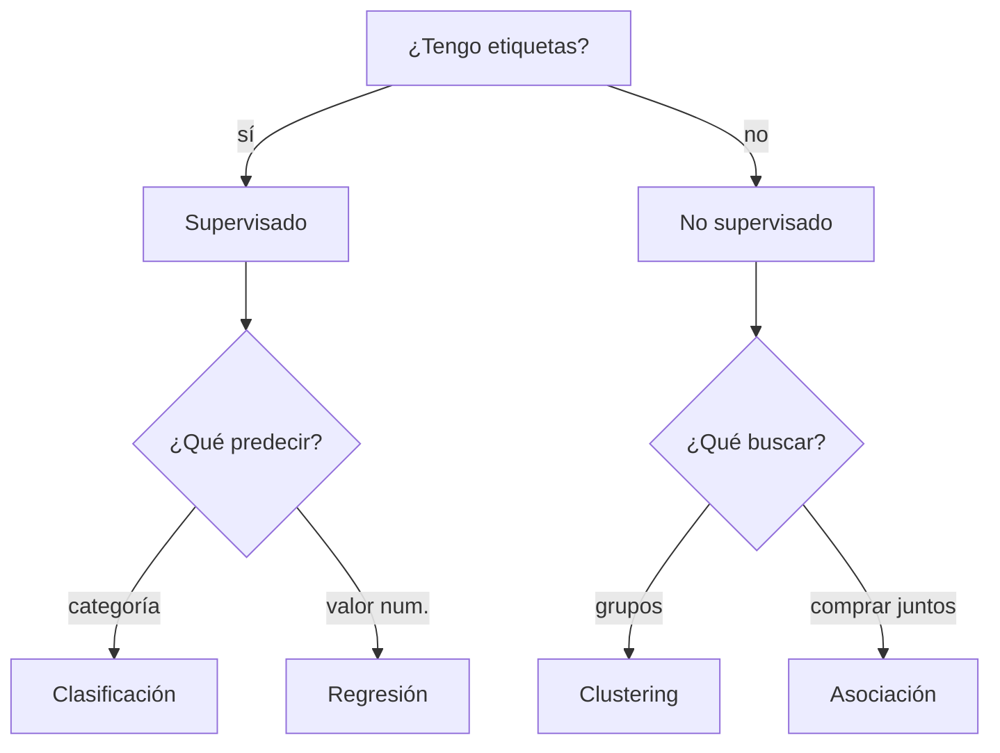

# Sesión 02 · IA 1: Actualidad y fundamentos

> **Hilo conductor:** por qué los datos mandan, qué problemas resuelve el aprendizaje automático y cómo asomarnos a Kaggle. Adaptado de `material_david/docs/UD01/UD01_ES.md` §4 (`IA → ML → DL → GenAI`, tipos de aprendizaje, algoritmos) y de `artint/docs/ia/tipos_aa/` (supervisión, instancias vs. modelos) + `artint/docs/ia/fases_aa/preprocesamiento.md` (Iris, escalado, división train/test).

## Objetivos de la sesión

Al finalizar, serás capaz de (RA1 · CE RA1-a/c):

- Explicar **qué es ML** y por qué **la calidad/cantidad de datos** decide el éxito (pocos datos, datos sesgados, ruido).
- Distinguir **qué tipo de problema** resuelve ML (clasificación, regresión, clustering, asociación, detección de anomalías) y **qué familia** usar.
- Diferenciar **supervisado / no supervisado / refuerzo / semi y auto-supervisado** y elegir el algoritmo base con criterio.
- Describir la **irrupción generativa** (del predictivo al generativo) sin perder de vista el ciclo del proyecto y asomarte a **Kaggle** como entorno visual.

## Contenidos

### 1. De IA a ML a DL a GenAI — cajas anidadas



!!! tip "Regla de oro"
    **Todo ML es IA, pero no toda IA es ML.** Y todo DL es ML; la generativa es una parte del DL. Sin esta jerarquía, todo debate sobre "IA" se embarra.

### 2. Qué es aprender de datos — y por qué los datos mandan

Un modelo de ML **no se programa regla a regla**: se **entrena** ajustando parámetros para minimizar el error en ejemplos y, sobre todo, para **generalizar** a datos nuevos.



- **Representación:** cada ejemplo → vector `[superficie, habitaciones, edad]` o `[píxeles, texto tokenizado...]`.
- **Entrenamiento:** función de pérdida + optimizador (gradiente descendente).
- **Evaluación honesta:** siempre con **test no visto** (`train_test_split`). Memorizar no es aprender.
- **Generalización:** objetivo real; si el modelo falla fuera del train, hay *overfitting*.

!!! note "Ejemplo numérico (UD01 §4.1)"
    Precio casa ≈ `A·superficie + B·habitaciones − C·edad + base`. El ML busca `A,B,C,base` óptimos. Si faltan datos o están sesgados, la fórmula aprenderá el sesgo.

**Iris como caso clásico** (`artint/docs/ia/fases_aa/preprocesamiento.md`): 150 flores, 4 medidas por fila. Antes de entrenar hay que **escalar** (misma magnitud), eliminar redundancias (correlación → reducción de dimensionalidad) y **dividir** train/test. Con pocos ejemplos o clases desbalanceadas, el rendimiento se hunde aunque el algoritmo sea potente.

> Por eso insistimos: **si tienes pocos datos o datos sesgados, tu prioridad no es el modelo, son los datos**.

### 3. Qué problemas resuelve ML — mapa rápido

| Familia | ¿Qué necesitas? | Objetivo | Ejemplos |
|---|---|---|---|
| **Supervisado** | Datos etiquetados | Predecir respuesta | Clasificación (spam/no spam), regresión (precio) |
| **No supervisado** | Sin etiquetas | Hallar estructura oculta | Clustering (k-means, DBSCAN), asociación, reducción (PCA) |
| **Por refuerzo (RL)** | Agente + entorno + recompensa | Política óptima | Juegos, robótica, control |
| **Semi-supervisado** | Muchos sin etiqueta + pocos con ella | Aprovechar ambos | Etiquetado caro (fotos) |
| **Auto-supervisado** | Sin etiquetas humanas explícitas | Predecir partes ocultas | Pre-entrenar LLM (ocultar palabra y predecirla) |

Fuente visual: `artint/docs/ia/tipos_aa/supervision.md` (etiquetas, agrupamiento, visualización, anomalías, asociación) y `UD01_ES.md` §4.2.

!!! example "Cuando etiquetar duele"
    Google Fotos agrupa caras sin saber quién es quién (no supervisado) y con **una etiqueta por persona** propaga el nombre a todas sus fotos (semi-supervisado). Etiquetar pocas, inferir muchas.

#### 3.1 Clustering — el valor de lo no supervisado

- **k-means:** k centros, asigna cada punto al más cercano. Útil para **segmentar clientes** o visitantes de un blog (40 % adolescentes comiqueros vs. 20 % adultos sci-fi).
- **DBSCAN:** por densidad, detecta formas raras y **anomalías** (fraude, defecto fabril).
- **Visualización / PCA:** proyecta a 2D/3D preservando estructura para *ver* los grupos.

No necesitas etiquetas para descubrir que tus datos ya vienen en grupos.

### 4. Tipos de algoritmos — cómo elegir sin magias



| Algoritmo | Tipo | Idea en una frase | Uso típico |
|---|---|---|---|
| **k-vecinos (KNN)** | Superv. | Vota según los k más cercanos | Recomendar similar |
| **Árbol de decisión** | Superv. | Preguntas `si/entonces` aprendidas | Aprobar préstamo |
| **Naive Bayes** | Superv. | Probabilidades con independencia | Spam / sentimiento |
| **Regresión logística** | Superv. | Probabilidad de clase | Abandono cliente |
| **Random forest** | Superv. | Bosque de árboles | Mantenimiento predictivo |
| **k-means / DBSCAN** | No superv. | Centros / densidad | Segmentación / anomalías |

Todos comparten en `scikit-learn` la interfaz `fit` / `predict` y se evalúan con `train_test_split` + `score`.

> **Instancias vs. modelos** (`artint/docs/ia/tipos_aa/instancias.md`): *basado en instancias* memoriza y compara por similitud (KNN); *basado en modelos* construye una fórmula y predice con ella (regresión, árboles). El primero es intuitivo, el segundo generaliza mejor con pocos ejemplos.

### 5. La irrupción generativa — del predictivo al creativo

- **Predictiva:** estima `P(y|x)` (¿fraude? ¿precio?).
- **Generativa:** crea `x_nuevo` desde un *prompt* (texto, imagen, audio). Tres fases: **modelo de base** entrenado con web a gran escala → **ajuste** (*fine-tuning*, RLHF) → **generación + RAG** contra fuentes externas.

!!! note "Va todo muy rápido, pero no mágico"
    2017 Transformer → 2022 LLM masivos → 2024-26 multimodalidad y agentes. La velocidad no quita que la base siga siendo **datos + evaluación honesta**.

### 6. Proyecto de IA en una diapositiva — y Kaggle como patio de juegos

Un proyecto no es "elegir modelo": es **1) definir problema → 2) conseguir datos → 3) preparar → 4) entrenar → 5) evaluar → 6) desplegar y medir impacto**. Esta sesión abre el ciclo; las S03–S04 lo desmenuzan.

**Kaggle** (`kaggle.com`): repositorio visual de datasets + notebooks + competiciones. Ideal para ver, sin instalar nada, qué pinta tiene un `DataFrame`, un histograma o una matriz de confusión. En clase abriremos un dataset *Iris* / *Titanic* y filtraremos por tamaño, *upvotes* y *usabilidad*.

## Temporalización (120 min)

- **Apertura (15 min):** dato sesgado que engaña (ej. Titanic: clase vs. supervivencia) + pregunta *¿qué tipo de problema es?* (clasificación/regresión/clustering).
- **Desarrollo (70 min):** §§2–5 con mermaid en pizarra, tabla de algoritmos y demo `fit/predict` mínima (ver práctica guiada).
- **Cierre (35 min):** tour guiado por Kaggle (buscar dataset, leer descripción, abrir un notebook público) + arranque del notebook del alumnado.

## Práctica guiada (con solución) — en vivo

Dos caras de la misma moneda con el mismo dataset *Iris*: **supervisado** (clasificación) y **no supervisado** (clustering). Verás el patrón `fit → predict/score` que repetirás todo el curso.

```python
# 1) Supervisado: ¿qué especie es? (clasificación)
from sklearn.datasets import load_iris
from sklearn.model_selection import train_test_split
from sklearn.tree import DecisionTreeClassifier
from sklearn.metrics import classification_report

X, y = load_iris(return_X_y=True)
# y = 0/1/2 (setosa/versicolor/virginica)
X_train, X_test, y_train, y_test = train_test_split(X, y, test_size=0.3, random_state=42)

clf = DecisionTreeClassifier(random_state=42)
clf.fit(X_train, y_train)
print("Precisión test:", round(clf.score(X_test, y_test), 3))
print(classification_report(y_test, clf.predict(X_test), target_names=load_iris().target_names))

# 2) No supervisado: ¿qué grupos emergen sin etiquetas? (clustering)
from sklearn.cluster import KMeans
import matplotlib.pyplot as plt

kmeans = KMeans(n_clusters=3, n_init=10, random_state=42)
kmeans.fit(X)  # ¡sin y!
clusters = kmeans.labels_

# Visualización rápida en 2D (dos primeras features)
plt.scatter(X[:, 0], X[:, 1], c=clusters, s=30)
plt.scatter(kmeans.cluster_centers_[:, 0], kmeans.cluster_centers_[:, 1], s=200, marker="X")
plt.xlabel("longitud sépalo"); plt.ylabel("anchura sépalo")
plt.title("k-means (k=3) sobre Iris — sin etiquetas")
plt.show()

# 3) Pistas sobre datos escasos/sesgados: simula 10 ejemplos por clase y re-evalúa
import numpy as np
rng = np.random.default_rng(0)
idx = np.hstack([rng.choice(np.where(y==c)[0], 10, replace=False) for c in range(3)])
X_small, y_small = X[idx], y[idx]
Xtr, Xte, ytr, yte = train_test_split(X_small, y_small, test_size=0.3, random_state=1)
print("Con pocos datos, precisión:", round(DecisionTreeClassifier().fit(Xtr, ytr).score(Xte, yte), 3))
```

**Qué observar:** con todo *Iris* la precisión roza 0,95; con 30 ejemplos totales cae y varía mucho. Clustering encuentra 3 grupos *sin* ver etiquetas, pero no siempre coinciden con la especie real: **estructura ≠ verdad etiquetada**. Esa es la lección de datos.

## Práctica propuesta (miniproyecto) — entregable

**Reto:** en `sesion02_miniproyecto.ipynb`, elige un dataset público sencillo en Kaggle (p. ej. *Iris*, *Titanic* o uno que propongas), justifica el **tipo de problema** (clasificación/regresión/clustering) y ejecuta **dos baselines**: uno **supervisado** y uno **no supervisado** (si aplica) con `scikit-learn`. Documenta el **efecto de pocos datos/sesgo** submuestreando.

**Entregables:**

1. Notebook con celdas `fit/predict/score` y visualizaciones (matriz de confusión o scatter de clusters).
2. Tabla comparativa supervisado vs. no supervisado (precisión / grupos hallados).
3. Párrafo breve: ¿qué aprendiste sobre la importancia de los datos?

**Criterios (RA1):** identifica correctamente tipo de problema y técnica; la ejecución es reproducible; la reflexión sobre datos es explícita.

**Notebook:** [Abrir/Descargar miniproyecto](sesion02_miniproyecto.ipynb)

## Materiales / recursos

- **Apuntes base:** `material_david/docs/UD01/UD01_ES.md` §4; `artint/docs/ia/tipos_aa/{introduccion,supervision,instancias}.md`; `artint/docs/ia/fases_aa/preprocesamiento.md`.
- **Kaggle:** `kaggle.com/datasets` (filtra por *usabilidad* y *tamaño*); cualquier dataset de < 10 MB vale para esta sesión.
- **Glosario rápido:** `UD01_ES.md` §9 (ML, DL, supervisado/no supervisado, clasificación/regresión, clustering, generalización).

## Evaluación (criterios CE)

- **CE RA1-a/c:** distingue **qué problema** resuelve ML y **qué familia** usar; justifica la elección con datos y no con intuición.
- La actividad cuenta en el **40 % de actividades** por RA; la prueba escrita posterior verificará el vocabulario (tipos de aprendizaje, algoritmos).

## Atención a la diversidad

- **Refuerzo:** plantilla con el código `fit/predict` ya escrito; el alumno solo cambia `test_size` y `random_state`.
- **Ampliación:** prueba `KMeans` con `k=2` vs. `k=4` y compara con `DBSCAN`; o añade `StandardScaler` antes de *clustering* y observa el cambio.

## Observaciones

- Esta sesión no pretende "enseñar a programar ML", sino **fijar el mapa**: qué es ML, por qué mandan los datos y qué familia elegir antes de abrir un notebook. El detalle del pipeline (preprocesado, entrenamiento, métricas) llega en S03–S05.
- Si el grupo tiene poca base Python, dedica 10 min a `pandas.DataFrame.head()` / `describe()` sobre *Iris* antes del clustering.
