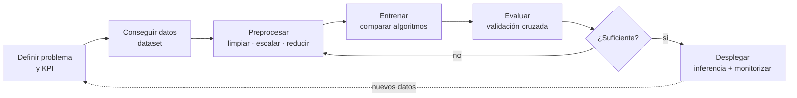
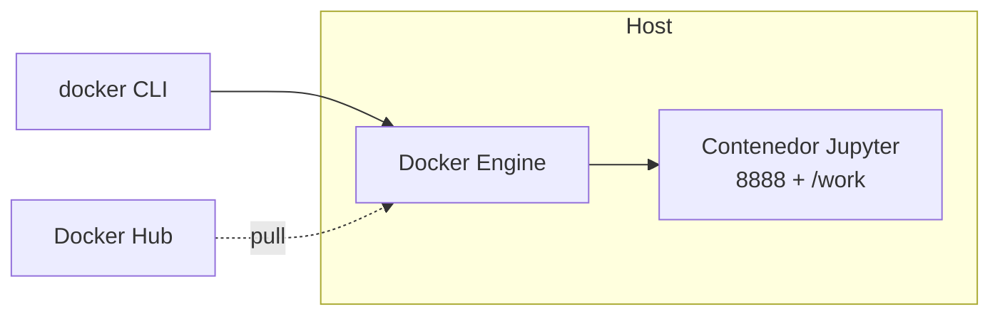

# Sesión 03 · IA 2: Entornos actuales. Proyectos IA fases

> **Hilo conductor:** cómo se hace un proyecto de IA de punta a punta y dónde se hace. Adaptado de `material_david/docs/UD00/UD00_ES.md` (§§5, 6, 10 — entorno reproducible con Docker y contenedor de prácticas) y de `artint/docs/ia/fases_aa/{introduccion,preprocesamiento,entrenamiento,evaluacion}.md` + referencia externa `logongas.es` Tema 01.

## Objetivos de la sesión

Al finalizar, serás capaz de (RA1 · CE RA1-b/c/d):

- Describir el **ciclo de vida** de un proyecto de IA (fases, por qué cada una importa y qué se entrega en cada una).
- Distinguir **entornos de desarrollo** actuales (local, **Google Colab**, **Docker**/Compose) y elegir con criterio según reproducibilidad, cómputo y dato.
- Aplicar buenas prácticas de **preprocesado**, **entrenamiento/selección** y **evaluación honesta** (sin fuga de información a test).
- Situar tu trabajo en el **antes/después** de un KPI: no es "hacer un modelo", es mejorar una métrica de negocio.

## Contenidos

### 1. El flujo de trabajo — de idea a modelo en producción



Fuente: `artint/docs/ia/fases_aa/introduccion.md` (figura *fases.png*) y `UD00_ES.md` §5 (Aules → web → Docker → Jupyter).

Cada fase tiene una pregunta que no puedes saltarte:

| Fase | Pregunta clave | Entregable mínimo |
|---|---|---|
| Definición | ¿Qué KPI mejora y cuánto vale ahora? | Ficha de problema + KPI base |
| Datos | ¿De dónde vienen, con qué calidad y permisos? | Inventario de fuentes + DIC |
| Preproceso | ¿Qué transformaciones necesita el algoritmo? | Notebook de limpieza reproducible |
| Entrenamiento | ¿Qué modelos comparas y con qué métrica? | Ranking de modelos |
| Evaluación | ¿Generaliza a datos no vistos? | Informe de métricas + matriz de confusión |
| Despliegue | ¿Cómo se usa y cómo se monitoriza? | Pipeline + *drift* vigilado |

!!! tip "No hay atajos"
    Saltarse el preproceso o evaluar con datos de entrenamiento da métricas bonitas y modelos inútiles.

### 2. Entornos — dónde ejecutar lo anterior

| Entorno | Cuándo lo quieres | Ventajas | Límites |
|---|---|---|---|
| **Local (venv/conda)** | Pruebas rápidas | Control total | "En mi máquina funciona" |
| **Google Colab** | Clase, sin instalar nada, GPU gratis | Cero fricción, compartir por enlace | Datos en la nube, tiempo limitado |
| **Docker + Compose** | Proyecto serio, reproducible | *Mismo* Python/bibliotecas en cualquier equipo, `jupyter/scipy-notebook` con `numpy, pandas, sklearn` | Requiere Docker funcionando |

Detalles de Docker en `UD00_ES.md` §§6–10 (imagen vs. contenedor, capas, `docker run`/`compose`, volúmenes vs. *bind mounts*) — aquí lo usamos como **idea**: reproducibilidad = capas + `Dockerfile` + montaje de tu carpeta `./practicas:/home/jovyan/work`.



!!! note "Regla práctica del curso"
    **Clase y prototipo → Colab.** **Entrega y proyecto → Docker** si necesitas reproducibilidad estricta. Ambos leen los mismos notebooks.

Referencia externa útil para comparar visiones: `https://logongas.es/doku.php?id=clase:iabd:pia:1eval:tema01` (ciclo CRISP-DM y fases).

### 3. Preprocesamiento — dar forma a los datos

Datos crudos casi nunca sirven tal cual (`artint/docs/ia/fases_aa/preprocesamiento.md` + `UD00_ES.md` §5 stack):

- **Escalado:** muchos algoritmos sufren si las features tienen magnitudes distintas → normalizar a `[0,1]` o `z-score`.
- **Correlación/redundancia:** features muy correlacionadas aportan poco; **reducción** (PCA) comprime y acelera sin perder señal.
- **División honesta:** `train / test` aleatorio; el *test* no se toca hasta el final.
- **Ejemplo Iris:** 150 flores × 4 medidas. Cada fila es un ejemplo, cada columna una feature. Proyectar a 2D permite *ver* los grupos antes de modelar.

!!! warning "Fugas que arruinan la evaluación"
    Ajustar el escalador o el PCA con **todo** el dataset (incluido test) filtra información del futuro. Los parámetros se aprenden **solo en train** y se *aplican* en test/nuevos datos.

### 4. Entrenamiento y selección — comparar, no adorar un modelo

Ningún algoritmo gana siempre. El flujo serio es: **probar varios → entrenar → comparar con una métrica común → elegir** (`artint/docs/ia/fases_aa/entrenamiento.md`).

- **Métrica:** precisión, F1, RMSE… según tarea.
- **Validación cruzada:** divide train en K pliegues para estimar generalización sin quemar el test.
- **Hiperparámetros:** los que *tú* fijas (profundidad de árbol, `k` de KNN, tasa de aprendizaje). No se aprenden de los datos; se optimizan por búsqueda.

### 5. Evaluación — el único número que importa

Después de entrenar, mides **error de generalización** en test con los **mismos** parámetros de transformación del train (`artint/docs/ia/fases_aa/evaluacion.md`):

- **Train:** ajusta modelo + define transformación (escala, PCA).
- **Test:** evalúa con esa transformación exacta.
- **Nuevos datos:** misma transformación; si la recalculas, la métrica es optimista y **no fiable**.

Ejemplos clásicos: precio vivienda (misma normalización en train y test) y PCA en imágenes médicas (misma matriz de proyección).

## Temporalización (120 min)

- **Apertura (15 min):** pregunta *¿dónde ejecutarías hoy un proyecto de IA y por qué?* Lluvia rápida local/Colab/Docker + mostrar el diagrama de fases en pizarra.
- **Desarrollo (70 min):** §§1–5 con figuras `fases.png` / `iris.png` proyectadas, demo de 3 comandos Docker (`run hello-world`, `-p 8888:8888`, bind mount) sin instalar nada en el aula, y lectura guiada de `logongas` Tema 01.
- **Cierre (35 min):** práctica guiada en vivo (ver abajo) + creación del primer cuaderno del alumno en Colab (`df.head() / describe()`).

## Práctica guiada (con solución) — en vivo

Dos comprobaciones que harás en todas las S03 en adelante: **(A)** entorno reproducible y **(B)** fuga de preproceso evitada.

```python
# A) ¿Mi entorno ve las mismas bibliotecas? (Colab o Docker)
import sys, numpy, pandas, sklearn, matplotlib
print(sys.version.split()[0])
print(numpy.__version__, pandas.__version__, sklearn.__version__)

# B) Pipeline honesto vs. con fuga — Iris + escalado
from sklearn.datasets import load_iris
from sklearn.model_selection import train_test_split
from sklearn.preprocessing import StandardScaler
from sklearn.pipeline import Pipeline
from sklearn.tree import DecisionTreeClassifier
from sklearn.metrics import accuracy_score

X, y = load_iris(return_X_y=True)
X_train, X_test, y_train, y_test = train_test_split(X, y, test_size=0.3, random_state=42)

# Honesto: scaler ajustado SOLO en train (vía Pipeline)
pipe = Pipeline([("scaler", StandardScaler()), ("clf", DecisionTreeClassifier(random_state=42))])
pipe.fit(X_train, y_train)
print("Precisión honesta:", round(accuracy_score(y_test, pipe.predict(X_test)), 3))

# Con fuga (NO hacer): ajustar scaler con TODO el dataset antes de split
scaler_bad = StandardScaler().fit(X)  # ¡usa test!
X_bad = scaler_bad.transform(X)
Xtr_bad, Xte_bad, ytr_bad, yte_bad = train_test_split(X_bad, y, test_size=0.3, random_state=42)
print("Con fuga (optimista):", round(DecisionTreeClassifier().fit(Xtr_bad, ytr_bad).score(Xte_bad, yte_bad), 3))
```

**Qué observar:** la precisión "con fuga" suele salir ligeramente **más alta** y engañosa. En un proyecto real esa diferencia es dinero y reputación.

!!! tip "Docker en 30 segundos (si toca)"
    ```bash
    docker run hello-world
    docker run --rm -p 8888:8888 -v "$PWD/practicas":/home/jovyan/work jupyter/scipy-notebook
    # abre http://localhost:8888 con token cursoia
    ```

## Práctica propuesta (miniproyecto) — entregable

**Reto:** en `sesion03_miniproyecto.ipynb`, crea tu **cuaderno base Colab** que (1) cargue un dataset pequeño (Iris u otro de Kaggle), (2) muestre `shape / head / describe / info`, (3) ejecute un `Pipeline` honesto `Scaler + Clasificador` con `train_test_split` y (4) reporte precisión y una figura simple.

**Entregables:**

1. Notebook ejecutado con salidas visibles.
2. Captura del flujo `fases.png` anotada con tu dataset (una frase por fase).

**Criterios (RA1):** describe fases y entornos con vocabulario propio; el notebook es reproducible y sin fuga.

**Notebook:** [Abrir/Descargar miniproyecto](sesion03_miniproyecto.ipynb)

## Materiales / recursos

- **Apuntes base:** `material_david/docs/UD00/UD00_ES.md` §§5–10; `artint/docs/ia/fases_aa/{introduccion,preprocesamiento,entrenamiento,evaluacion}.md`.
- **Visión externa:** `https://logongas.es/doku.php?id=clase:iabd:pia:1eval:tema01`.
- **Imágenes de apoyo:** `artint/docs/ia/fases_aa/images/{fases.png,iris.png}`.

## Evaluación (criterios CE)

- **CE RA1-b/d:** identifica fases y entornos y los vincula a un KPI antes/después (no basta listar, hay que justificar por qué esa fase/entorno aporta).

## Atención a la diversidad

- **Refuerzo:** checklist de fases impreso; solo rellenar con tu dataset.
- **Ampliación:** añadevalidación cruzada `cross_val_score(pipe, X_train, y_train, cv=5)` y compara con la precisión simple.

## Observaciones

- Esta sesión deja el andamiaje. La **limpieza profunda** (nulos, codificación, Titanic) y las **métricas** llegan en S04–S05; si tu grupo va justo, recorta Docker a demo y prioriza el pipeline honesto.
