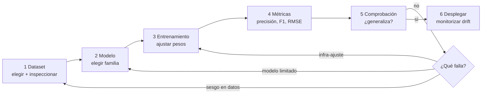

# Sesión 04 · IA 3: Entornos actuales. Proyectos IA fases

> **Hilo conductor:** de dónde salen los datos, cómo distinguir "dato bueno vs. dato malo" y qué hacer cuando el modelo no funciona. Adaptado de `material_david/docs/UD01/UD01_ES.md` §§5–6 (campos, eficiencia, KPIs) + `artint/docs/ia/fases_aa/{preprocesamiento,entrenamiento,evaluacion}.md` + `artint/docs/ia/modelos/datos.md` (tipos de columnas y codificación) y referencia `logongas` Tema 01.

## Objetivos de la sesión

Al finalizar, serás capaz de (RA1 · CE RA1-b/c):

- Explicar **cómo conseguir datos** (fuentes, licencias, Kaggle, APIs) y qué criterios hacen un **dataset** útil o inútil.
- Detectar **valores correctos vs. incorrectos** (nulos, outliers, sesgo, fuga) con un ejemplo real (*Titanic*).
- Recorrer los **6 pasos** Dataset → Modelo → Entrenamiento → Métricas → Comprobación → Ajuste, y decidir si **cambiar el modelo o arreglar los datos**.
- Clasificar el **tipo de problema** (regresión, clasificación, *clustering*, predicción temporal) antes de tocar código.

## Contenidos

### 1. Conseguir datos — no todo vale

| Fuente | Ejemplos | Riesgos a vigilar |
|---|---|---|
| **Abiertos** | Kaggle, UCI ML Repo, datos.gob.es | Licencia, actualización, sesgo de muestreo |
| **Propios** | Logs, CRM, sensores, encuestas | Calidad, privacidad (RGPD), consentimiento |
| **Derivados** | APIs, *scraping*, síntesis | Términos de uso, deriva temporal |

**Preguntas antes de descargar:** ¿qué KPI quiero mover?, ¿qué etiqueta necesito?, ¿quién es el *dueño* del dato y puedo usarlo? Un dataset sin etiqueta clara o sin permiso es un callejón sin salida.

### 2. Correcto vs. incorrecto — el dato manda

> **Garbage in, garbage out.** El 80 % del tiempo de un proyecto se va en preparar datos, no en elegir modelo (`artint/docs/ia/fases_aa/preprocesamiento.md`).

**Síntomas de "dato malo":**

- **Nulos sistemáticos** (ej. *Titanic*: `Age` y `Cabin` vacíos no al azar — los pasajeros de 3ª clase tienen menos registro).
- **Tipos mezclados** (`"23"` como texto, fechas como `12/03/2026` vs. `2026-03-12`).
- **Fuera de rango / atípicos** (edad 300, tarifa negativa).
- **Sesgo / fuga:** usar en *train* una columna que no existirá en producción (ej. `superviviente` para predecir `superviviente`).

**Reglas de `artint/docs/ia/modelos/datos.md`:**

| Tipo de columna | Qué hacer (resumen) |
|---|---|
| **Numérica** | Estandarizar (`StandardScaler`) / normalizar `[0,1]`; algoritmos como SVM/k-means lo exigen |
| **Categórica nominal** (*puerto, sexo*) | **One-Hot** (una columna binaria por categoría) o **Dummy** (n-1) |
| **Categórica ordinal** (*pequeño < mediano < grande*) | **Label** con orden |
| **Muchas categorías** | **Target encoding** (media del target por categoría, con cuidado ante sobreajuste) |
| **Fecha/hora** | Extraer `año, mes, día, día_semana` o diferencia a una fecha base |
| **Texto libre** | Longitud, conteos, TF-IDF, *split* por delimitador |

!!! warning "Codificación que crea mentiras"
    Codificar `rojo=0, verde=1, azul=2` hace creer al modelo que `azul > verde > rojo`. Para nominales usa One-Hot, no números arbitrarios.

### 3. Los 6 pasos (con bucle)



**Cómo decidir en 5–6:** si al añadir datos limpios la métrica sube, el cuello era el **dato**; si con más datos no mejora y el train ya va bien, prueba **otro modelo** o hiperparámetros.

### 4. Titanic — el laboratorio de lo imperfecto

Dataset clásico de Kaggle: 891 pasajeros, 12 columnas (`Survived, Pclass, Sex, Age, Fare, Cabin, Embarked…`), ~20 % de `Age` nulo y 77 % de `Cabin` vacío.

| Problema en Titanic | Qué significa | Arreglo habitual |
|---|---|---|
| `Age` nulo | Falta no aleatoria | Mediana por `Pclass+Sex`, o modelo que imputa |
| `Cabin` casi vacío | Demasiado hueco | Descartar o crear `tiene_cabin` binaria |
| `Sex` texto | Categórica nominal | One-Hot `sex_female/male` |
| `Fare` con colas largas | Escala | `log(Fare+1)` o `StandardScaler` |
| `Embarked` 2 nulos | Pocos | Moda |

Trabajar *Titanic* obliga a **entender el problema** antes de codificar: ¿es **clasificación** (`Survived` 0/1), **regresión** (predecir `Fare`), o **agrupación** (segmentar pasajeros)? Cada uno pide métrica y modelo distintos.

### 5. ¿Qué tipo de problema tengo?

| Tipo | Pregunta que responde | Métrica típica | Ejemplo Titanic |
|---|---|---|---|
| **Clasificación** | ¿A qué clase pertenece? | Accuracy, F1, ROC-AUC | ¿Sobrevive? |
| **Regresión** | ¿Qué valor numérico? | MAE, RMSE | ¿Cuánto pagó? |
| **Clustering** | ¿Qué grupos hay sin etiqueta? | Silueta, inercia | Segmentar pasajeros |
| **Serie temporal / predicción** | ¿Qué pasará después? | MAE temporal | Evolución de embarques |

!!! tip "Insistir mucho (tu nota)"
    Si no sabes si tu problema es clasificación o regresión, cualquier modelo y cualquier métrica serán al azar. Clasifica primero, codifica después.

### 6. Entornos — dónde hacer todo lo anterior hoy

**Colab** para clase (cero instalación, datasets de Kaggle con `!kaggle` o `pandas.read_csv`), **Docker** (`jupyter/scipy-notebook` con `8888:/home/jovyan/work`) para entrega reproducible. Ambos admiten el mismo `Pipeline` honesto de la S03 (scaler ajustado solo en *train*).

## Temporalización (120 min)

- **Apertura (15 min):** *¿de dónde saldrían los datos de hidrógeno verde / colmena?* Tormenta de fuentes + criterio "¿lo puedo usar mañana en producción?".
- **Desarrollo (70 min):** §§2–5 con tabla de codificación en pizarra, recorrido del CSV de *Titanic* (`head/isna/summary`) y diagrama de los 6 pasos.
- **Cierre (35 min):** práctica guiada en vivo (ver abajo) y arranque del notebook del alumno.

## Práctica guiada (con solución) — en vivo

Limpieza mínima y honesta de *Titanic* (vía `seaborn` para no descargar) + un baseline que **no** filtra fuga.

```python
import pandas as pd, numpy as np, seaborn as sns
from sklearn.model_selection import train_test_split
from sklearn.preprocessing import OneHotEncoder, StandardScaler
from sklearn.compose import ColumnTransformer
from sklearn.pipeline import Pipeline
from sklearn.impute import SimpleImputer
from sklearn.tree import DecisionTreeClassifier
from sklearn.metrics import accuracy_score, classification_report

# 1) Cargar (seaborn trae titanic ya limpio a medias; simula tu CSV)
df = sns.load_dataset("titanic")[["survived","pclass","sex","age","fare","embarked"]]
print(df.isna().sum())  # ver nulos
print(df.head(3))

X = df.drop(columns="survived"); y = df["survived"]

# 2) Columnas por tipo — según artint/docs/ia/modelos/datos.md
num = ["age","fare"]; cat = ["pclass","sex","embarked"]

# 3) Preprocesador honesto (ajustado SOLO en train vía Pipeline)
pre = ColumnTransformer([
    ("num", Pipeline([("imputer", SimpleImputer(strategy="median")), ("scaler", StandardScaler())]), num),
    ("cat", Pipeline([("imputer", SimpleImputer(strategy="most_frequent")), ("onehot", OneHotEncoder(handle_unknown="ignore"))]), cat),
])

pipe = Pipeline([("pre", pre), ("clf", DecisionTreeClassifier(random_state=42, max_depth=4))])

X_train, X_test, y_train, y_test = train_test_split(X, y, test_size=0.3, random_state=42, stratify=y)
pipe.fit(X_train, y_train)
pred = pipe.predict(X_test)
print("Accuracy honesta:", round(accuracy_score(y_test, pred), 3))
print(classification_report(y_test, pred, digits=3))

# 4) ¿Qué pasa si imputas con TODO antes de split? (fuga — NO hacer)
bad_age_median = df["age"].median()  # usa test
df_bad = df.copy(); df_bad["age"] = df_bad["age"].fillna(bad_age_median)
print("Mediana con fuga vs. mediana solo-train: ", round(bad_age_median,2), " vs ", round(X_train['age'].median(),2))
```

**Qué llevarte:** `SimpleImputer(median/most_frequent)` + `StandardScaler` para numéricas y `OneHot` para categóricas, todo **dentro** del `Pipeline`. La métrica honesta es la única que cuenta.

## Práctica propuesta (miniproyecto) — entregable

**Reto:** en `sesion04_miniproyecto.ipynb`, aplica el flujo de 6 pasos a tu dataset elegido (o *Titanic* si dudas): **(1)** inspecciona nulos/tipos, **(2)** decide tipo de problema, **(3)** construye un `ColumnTransformer` honesto y **(4)** reporta métrica + una frase: "¿cambiarías el modelo o arreglarías los datos y por qué?".

**Entregables:**

1. Notebook con `isna/summary` y `Pipeline` ejecutado.
2. Tabla de decisiones (problema → modelo → métrica).
3. Conclusión de 3 líneas sobre el paso 6.

**Criterios (RA1):** distingue valores correctos/incorrectos y justifica la transformación; identifica el tipo de problema sin confusión.

**Notebook:** [Abrir/Descargar miniproyecto](sesion04_miniproyecto.ipynb)

## Materiales / recursos

- **Apuntes base:** `material_david/docs/UD01/UD01_ES.md` §§5.2–6.2 (casos y KPIs); `artint/docs/ia/fases_aa/{preprocesamiento,entrenamiento,evaluacion}.md`; `artint/docs/ia/modelos/datos.md` (num/categórica/fecha/texto).
- **Dataset:** `seaborn.load_dataset("titanic")` o `kaggle datasets download titanic` + `logongas` Tema 01 para contrastar fases.
- **KPI a mano:** FCR/AHT/OEE si tu caso es atención/industria (ver UD01 §6.3).

## Evaluación (criterios CE)

- **CE RA1-b/c:** describe cómo conseguir y preparar datos y elige tipo de problema con criterio; la práctica demuestra que **los datos mandan** sobre el modelo.

## Atención a la diversidad

- **Refuerzo:** plantilla `ColumnTransformer` ya escrita; completar solo listas `num/cat`.
- **Ampliación:** añade `TargetEncoder` o `TF-IDF` si tu dataset tiene texto; compara `OneHot` vs. `Dummy`.

## Observaciones

- Si el grupo viene flojo en `pandas`, reserva 10 min para `df["age"].median()` vs. `df.groupby("pclass")["age"].median()` y la idea de imputación condicionada.
- *Titanic* tiene sesgo histórico (clase/sexo). Úsalo para hablar de equidad y de por qué nunca se despliega sin revisar sesgos (puente a ética).
