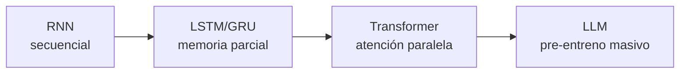
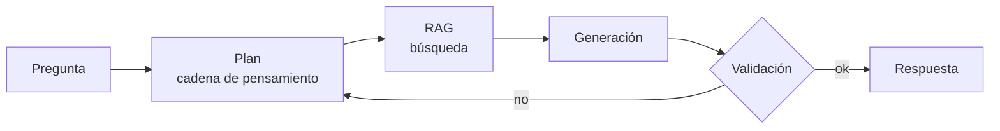

# Sesión 05 · IA 4 de ML a LLM

> **Hilo conductor:** ya dominas el ciclo del dato en Kaggle con ML clásico — ahora entendemos qué cambia cuando entra el deep learning y, sobre todo, los **LLM y agentes**. Adaptado de `artint/docs/redes-neuronales/{introduccion,perceptron,multicapa,regresion,clasificacion,convolucionales,lstm,transformers}.md` + `artint/docs/llm/{introduccion,finetuning,agentes}.md` + `material_david/docs/UD01/UD01_ES.md` §4.3–4.4 (DL y generativa, agentes).

## Objetivos de la sesión

Al finalizar, serás capaz de (RA1 · CE RA1-c/d):

- Explicar el **salto** de ML clásico → redes neuronales → **Transformers/LLM** (por qué aparece la atención).
- Distinguir **modelos predictivos vs. generativos** y **agente vs. *fine-tuning***.
- Aplicar y **leer métricas** (accuracy, precision/recall, F1, matriz de confusión, ROC-AUC) y entender sus límites en LLMs.
- Plantear una **mini-competición en Kaggle** como escenario para profundizar en métricas (tu nota de `PLAN.md:5.1`).

## Contenidos

### 1. Del perceptrón al Transformer — por qué tuvimos que cambiar de arquitectura

**Perceptrón (1943/1958):** neurona McCulloch-Pitts como puerta lógica con umbral → Rosenblatt la hace aprendible. Una neurona = suma ponderada + activación.

**Multicapa (MLP):** `entrada → capas ocultas (ReLU) → salida (sigmoid/softmax)`. Con 2 capas ya aproximas funciones no lineales (ej. `edad+ingresos → compra`).

| Tarea | Salida | Activación típica |
|---|---|---|
| Regresión | valor continuo | lineal |
| Clasificación binaria | probabilidad | sigmoid |
| Clasificación multiclase | vector de probs | softmax |

**CNN / LSTM:** convolucionales para **imágenes** (filtros que comparten pesos), recurrentes (LSTM) para **secuencias** (texto, series). Problema de las RNN: procesan paso a paso, no paralelizan y sufren **desvanecimiento del gradiente** en dependencias largas.

**2017 — Transformer** (*Attention Is All You Need*): elimina recurrencia y usa solo **atención**:

$$
\text{Attention}(Q,K,V)=\text{softmax}\left(\frac{QK^T}{\sqrt{d_k}}\right)V
$$

- **Q** (query): qué busca cada token.
- **K** (key): qué ofrece cada token.
- **V** (value): contenido semántico.



Ventaja: **paralelo en GPU** + conexión directa entre palabras lejanas. Coste: atención cuadrática en longitud.

Detalle completo en `artint/docs/redes-neuronales/introduccion.md` + `transformers.md` (§§ Arquitectura, Positional Encoding, Multi-Head).

### 2. Qué aporta cada familia — y dónde brilla cada una

| Familia | Cuándo gana | Ejemplo del curso |
|---|---|---|
| **ML clásico** (árbol, KNN, SVM) | Pocos datos, explicabilidad, tablas | Titanic con `DecisionTree` |
| **DL — MLP/CNN/LSTM** | Muchos datos, imagen/secuencia | Visión (CNN), serie temporal (LSTM) |
| **Transformers / LLM** | Lenguaje, multitarea, pocos ejemplos tras pre-entreno | Clasificación de texto, RAG |

!!! tip "No hay bala de plata"
    Con < 1k filas y 10 columnas, un `RandomForest` bien tuneado suele ganar a un Transformer. Con texto libre masivo, el Transformer arrasa.

### 3. LLM: predictivo → generativo → agente

- **Entrenamiento base:** modelo fundacional con web a escala (auto-supervisado: ocultar palabra y predecirla).
- **Ajuste:** `fine-tuning` o `RLHF` + **RAG** (recupera docs relevantes y genera condicionado).
- **Generación:** siguiente token con **temperatura** (baja = riguroso, alta = creativo). No garantiza verdad → **alucinación** (confabulación, desobediencia a instrucciones, fallo de razonamiento lógico).

**Agente** (`artint/docs/llm/agentes.md`): usa el LLM para **planificar, recuperar información, llamar herramientas y verificar**. No solo responde, *actúa* (buscar en web, consultar BBDD, indexar docs locales). Reglas de control: límite de iteraciones, validación de salida, abstención si no sabe.



### 4. Métricas — el idioma común (y su límite en LLM)

Hasta S04 el foco fue el **modelo**; ahora el foco es **cómo sabes si va bien**.

| Métrica | Qué mide | Cuándo mirarla |
|---|---|---|
| **Accuracy** | aciertos / total | Clases balanceadas |
| **Precision / Recall / F1** | equilibrio falsos positivos/negativos | Clases desbalanceadas (fraude, spam) |
| **Matriz de confusión** | dónde falla cada clase | Diagnóstico por clase |
| **ROC-AUC** | capacidad de separar clases | Ranking |

```python
# snippet mental que reproduciremos en la práctica guiada
from sklearn.metrics import classification_report, confusion_matrix
print(classification_report(y_test, y_pred))
print(confusion_matrix(y_test, y_pred))
```

**En LLMs** las métricas clásicas no bastan: se evalúa con **benchmarks** (exactitud en tareas, coherencia, seguimiento de instrucciones) y con **evaluador humano o modelo-juez**, no solo con accuracy.

!!! note "Tu idea de Kaggle competición"
    Crear una competición privada en Kaggle es el mejor gimnasio para métricas: defines *train/test* oculto, eliges métrica (F1, RMSE) y el *leaderboard* obliga a validar sin fuga. Lo plantearemos en S06.

## Temporalización (120 min)

- **Apertura (15 min):** *¿qué cambia si el problema es "clasificar tickets" vs. "responder como un agente"?* Mapa en pizarra ML→DL→LLM.
- **Desarrollo (65 min):** §§1–4 con figuras de neurona y atención proyectadas; demo en 5 minutos del salto `perceptron → MLP → Transformer` (sin código, solo diagramas y el ejemplo 2→4→2→1).
- **Práctica y cierre (40 min):** práctica guiada en vivo (métricas) + diseño colectivo de la rúbrica de la futura competición Kaggle (qué métrica, qué test oculto).

## Práctica guiada (con solución) — en vivo

Dos lecturas de la **misma** predicción: accuracy engañosa vs. matriz + F1. Verás por qué en negocio nunca te fías solo de accuracy.

```python
from sklearn.datasets import load_iris
from sklearn.model_selection import train_test_split
from sklearn.tree import DecisionTreeClassifier
from sklearn.metrics import accuracy_score, classification_report, confusion_matrix, ConfusionMatrixDisplay
import matplotlib.pyplot as plt

X, y = load_iris(return_X_y=True)
# Simulamos desbalanceo: recortamos versicolor
import numpy as np
rng = np.random.default_rng(0)
mask = np.ones(len(y), bool); mask[(y==1)][:30] = False  # deja solo 20 versicolor
Xb, yb = X[mask], y[mask]

X_train, X_test, y_train, y_test = train_test_split(Xb, yb, test_size=0.35, random_state=42, stratify=yb)
clf = DecisionTreeClassifier(max_depth=3, random_state=42).fit(X_train, y_train)
y_pred = clf.predict(X_test)

print("Accuracy:", round(accuracy_score(y_test, y_pred), 3))
print(classification_report(y_test, y_pred, target_names=load_iris().target_names[mask[:3]] if False else load_iris().target_names))

# Matriz — dónde duele
cm = confusion_matrix(y_test, y_pred)
ConfusionMatrixDisplay(cm).plot(); plt.title("Confusión (desbalanceada)"); plt.show()

# Contraste: F1 por clase vs. accuracy global
# Si accuracy=0.93 pero recall de versicolor=0.60, ¿te sirve para negocio?
```

**Qué llevarte:** con clases desbalanceadas, **F1/recall por clase** y la **matriz** cuentan la verdad que oculta la accuracy.

## Práctica propuesta (miniproyecto) — entregable

**Reto (ellos trabajan, tú guías):** en `sesion05_miniproyecto.ipynb`, toma tu dataset de S04 (o Titanic) y **compara dos modelos clásicos** (ej. Árbol vs. KNN) **solo por métricas**: reporta matriz de confusión + `classification_report`. Añade un **experimento LLM/agente** *conceptual* (no hace falta API): escribe el *prompt* + herramientas que usaría un agente para resolver el mismo problema y explica **qué métrica usarías para evaluar su respuesta** (¿exactitud, seguimiento de instrucciones, abstención?).

**Entregables:**

1. Notebook con métricas clásicas (5 líneas de interpretación).
2. Ficha de agente (prompt + herramientas + métrica propuesta).

**Criterios (RA1):** elige técnica con criterio; lee métricas sin autoengañarse; distingue agente vs. fine-tuning.

**Notebook:** [Abrir/Descargar miniproyecto](sesion05_miniproyecto.ipynb)

## Materiales / recursos

- **Apuntes base:** `artint/docs/redes-neuronales/{introduccion,perceptron,multicapa,regresion,clasificacion,convolucionales,lstm,transformers}.md`; `artint/docs/llm/{introduccion,agentes,finetuning}.md`; `material_david/docs/UD01/UD01_ES.md` §4.3–4.4.
- **Vídeo sugerido:** *Los transformers* (enlace al final de `transformers.md`) — 15 min para visualizar atención.
- **Kaggle:** prepara un dataset pequeño candidato para la competición de S06 (≤ 5 MB).

## Evaluación (criterios CE)

- **CE RA1-c/d:** fundamenta por qué un problema pide ML clásico o LLM/agente y lo argumenta con métrica, no con hype.

## Atención a la diversidad

- **Refuerzo:** plantilla `classification_report` ya importada; solo interpretar.
- **Ampliación:** añade `ROC-AUC` con `predict_proba` y explica cuándo supera a accuracy; o prueba `temperature=0.2` vs. `0.9` en un LLM y compara alucinaciones.

## Observaciones

- Esta sesión cierra el bloque teórico inicial. S06 profundiza en métricas con código y S07 es miniproyecto integrador RA1. Si el grupo pide más código, desplaza el bloque de alucinaciones a una píldora de 10 min y amplía la práctica de métricas.
