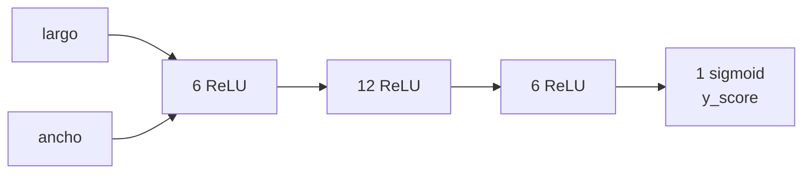

# Sesión 06 · Introducción a las redes neuronales

> **Hilo conductor:** de la regla escrita a mano (`if petalo < 2.5 → setosa`) a la función aprendida por una red. Tomamos como **texto base** `https://logongas.es/doku.php?id=clase:iabd:pia:1eval:tema01` (Introducción a las redes neuronales — Iris con 2 features, red 2→6→12→6→1) y lo reforzamos con `artint/docs/redes-neuronales/{introduccion,perceptron,multicapa}.md` + `material_david/docs/UD01/UD01_ES.md` §4.3 (DL).

## Objetivos de la sesión

Al finalizar, serás capaz de (RA1 · CE RA1-a/c):

- Explicar **qué es una neurona artificial** (McCulloch-Pitts 1943) y cómo se compone una red por **capas** (entrada/ocultas/salida) con **pesos y activación**.
- Distinguir **regla programada vs. modelo aprendido** y describir el flujo `x → red → y_score → y_pred`.
- Construir y entrenar en **Keras** una red `Sequential` densa para Iris binario, fijando **semilla**, `loss` y `epochs`, e interpretar `loss`/`y_score`.
- Visualizar la **frontera de decisión** y anticipar dificultades clásicas (muffin vs. chihuahua, sobreajuste por semilla/arquitectura).

## Contenidos

### 1. El problema que sí puedes resolver a mano — y por qué dejar de hacerlo

Dataset **Iris** (4 medidas, 150 ejemplos; aquí usamos solo `longitud pétalo` y `anchura pétalo` para verlo en 2D):

- Clases: `0=Setosa`, `1=Versicolor` (de momento, binario).

A ojo, una regla funciona:

```
si longitud_petalo < 2.5 → Setosa
sino si ancho_petalo < 1.7 → Versicolor
sino → Virginica
```

En Python:

```python
def predict(longitud_petalo, ancho_petalo):
    if longitud_petalo < 2.5:
        return 0
    return 2 if ancho_petalo >= 1.7 else 1
```

La idea de **logongas Tema 01** es justo esa: las IAs *son* algoritmos, solo que el algoritmo se crea **casi automáticamente a partir de datos**. La red aprenderá `tipo = f(largo, ancho)` sin que escribas el `if`.

!!! note "De 2 a 4 features"
    Iris real tiene 4 columnas (`sepalo largo/ancho`, `pétalo largo/ancho`). Con 2 la frontera se ve; con 4 la red gana precisión pero pierdes el dibujo.

### 2. Qué es una red — del modelo biológico al artificial

Neurona biológica (dendritas → cuerpo → axón) → **McCulloch-Pitts** la modela como puerta lógica con umbral. Una **neurona artificial** hace: `suma ponderada de entradas → activación no lineal → salida`.

- **Capa de entrada:** 2 neuronas (nuestras 2 features). Amarillo en el esquema de logongas.
- **Capas ocultas:** p. ej. `6 → 12 → 6` (verde). Cada una aplica `ReLU`.
- **Capa de salida:** 1 neurona con `sigmoid` → `y_score ∈ (0,1)`.



Fuente: `artint/docs/redes-neuronales/introduccion.md` (neurona, capas, activación, ejemplo 2→4→2→1) y `perceptron.md`/`multicapa.md`.

!!! tip "No existe la arquitectura perfecta"
    Logongas y artint coinciden: la configuración se encuentra por **prueba-error**. Más neuronas/capas dan capacidad, pero también sobreajuste y coste.

### 3. Keras en 10 líneas — y qué significa cada una

```python
import random, numpy as np, tensorflow as tf
from tensorflow.keras.models import Sequential
from tensorflow.keras.layers import Dense
from sklearn.datasets import load_iris

iris = load_iris()
x = np.column_stack((iris.data[0:99,2], iris.data[0:99,3]))  # solo pétalo
y = iris.target[0:99]  # 0 Setosa, 1 Versicolor

np.random.seed(5); tf.random.set_seed(5); random.seed(5)

model = Sequential()
model.add(Dense(6, activation='relu', input_dim=2))
model.add(Dense(12, activation='relu'))
model.add(Dense(6, activation='relu'))
model.add(Dense(1, activation='sigmoid'))
model.compile(loss='binary_crossentropy')

model.fit(x, y, epochs=100)
print(model.predict(np.array([[1.4,0.2]])))  # → ~0.09 (Setosa)
print(model.predict(np.array([[4.4,1.3]])))  # → ~0.99 (Versicolor)
```

- `Dense(n, activation)` : capa totalmente conectada con `n` neuronas.
- `input_dim=2` : tamaño de entrada.
- `compile(loss='binary_crossentropy')` : para binario; `categorical_crossentropy` si fueran 3 clases.
- `fit(epochs=100)` : cada *epoch* es una pasada por todo `x`. El `loss` debe **bajar** (0.64 → 0.07 en 100 epochs).
- **Semillas** fijas → resultados reproducibles; sin ellas cada ejecución cambia.

Herramienta visual: `http://alexlenail.me/NN-SVG/` genera el SVG 2→6→12→6→1 de logongas.

### 4. `y_score` vs. `y_pred` vs. `y_true`

| Concepto | Qué es | Ejemplo |
|---|---|---|
| `y_score` | salida continua de la red (0.099…) | 0.992 |
| `y_pred` | decisión con umbral `>0.5 → 1` | 1 (Versicolor) |
| `y_true` | etiqueta real | 1 |

Las redes no devuelven 0/1 exactos; umbralizas. Con 3 clases (añadiendo Virginica) necesitas `softmax` y `3` neuronas de salida — ejercicio 3 de logongas y límite del modelo actual.

### 5. Ver para creer — frontera de decisión

Logongas muestra dos figuras clave: **puntos reales** vs. **fondo coloreado** por la red (malla 300×300 + `predict`). Si ambas coinciden, la red ha capturado la geometría; si no, faltan neuronas/epochs.

Librerías del curso ya vistas: `matplotlib` + `ListedColormap` (ver código completo en logongas § Gráficas).

### 6. Dificultades que no se ven en el loss

- **Muffin vs. chihuahua** (`logongas` § Las dificultades de la IA): si entrenas para chihuahuas y le enseñas un muffin, lo confunde. No es magia, es **distribución fuera de entrenamiento**.
- **Semilla y tamaño importan:** ejercicios 5–6 de logongas (30-60-100-60-30-10-1 vs. 6-12-6-1, semillas 5/6/88) cambian `y_score` en filas 56/204 de *breast cancer* aunque el código sea idéntico.
- **Escalar no es opcional:** de `artint` y `UD01_ES.md` §4.3, sin normalizar el gradiente sufre.

### 7. Dónde encaja la página de logongas en tu curso

**Respuesta a tu pregunta:** esta página (**Tema 01**) es el **núcleo de la S06** (hoy) y la **lectura previa ideal para la S05** (ya vista: ML→DL→Transformer).

- **S05** (28/10): introdujo perceptrón/multicapa y Transformers a alto nivel.
- **S06** (hoy, 02/11): aterriza con el **ejemplo ejecutable** de logongas (Iris 2D, red concreta, `fit/predict`, figuras y ejercicios 1–3).
- **Tema 06 de logongas** (*Redes neuronales* y *Apéndices*) queda como **ampliación natural para S07–S08** (profundización y proyecto).

Recomendación práctica: deja **logongas Tema 01 como apuntes oficiales de S06** (enlace en Materiales) y usa `artint/redes-neuronales/introduccion.md` como marco teórico de 10 min al inicio.

## Temporalización (120 min)

- **Apertura (15 min):** regla a mano en pizarra (Iris) vs. red: *¿quién escribe el algoritmo?*
- **Desarrollo (70 min):** §§2–5 con esquema 2→6→12→6→1 en proyector, ejecución en Colab del bloque Keras (cambiar `epochs` 30→100) y comparativa `y_score`/`y_pred`.
- **Cierre (35 min):** práctica guiada en vivo (ver abajo) + inicio del miniproyecto; dibujar la red en `NN-SVG`.

## Práctica guiada (con solución) — en vivo

Reproduce el **ejercicio 1.A/1.B de logongas** con el código exacto del tema y verifica el umbral.

```python
# Iris binario (Setosa vs Versicolor) — red logongas 2-6-12-6-1
import random, numpy as np, tensorflow as tf
from tensorflow.keras.models import Sequential
from tensorflow.keras.layers import Dense
from sklearn.datasets import load_iris

iris = load_iris()
x = np.column_stack((iris.data[0:99,2], iris.data[0:99,3]))
y = iris.target[0:99]
np.random.seed(5); tf.random.set_seed(5); random.seed(5)

model = Sequential([Dense(6, activation='relu', input_dim=2),
                    Dense(12, activation='relu'),
                    Dense(6, activation='relu'),
                    Dense(1, activation='sigmoid')])
model.compile(loss='binary_crossentropy')
model.fit(x, y, epochs=100, verbose=0)

for largo, ancho in [(1.3,0.3),(3.9,1.2)]:
    s = float(model.predict(np.array([[largo,ancho]]), verbose=0)[0,0])
    print(f"({largo},{ancho}) → y_score={s:.4f} → y_pred={int(s>0.5)}")
# y_true para esos puntos: consultar tabla de logongas o inferir por posición
```

**Qué observar:** `loss` descendente, `y_score` cerca de 0 o 1, y cómo con `epochs=30` la frontera aún es difusa.

## Práctica propuesta (miniproyecto) — entregable

**Reto (Colab):** en `sesion06_miniproyecto.ipynb`, replica el flujo de logongas:

1. Entrena la red 2-6-12-6-1 con `epochs=100` y **dibuja** la figura de fondo coloreado (frontera) + puntos reales.
2. **Ejercicio 2:** cambia a `4-5-3-1` y `epochs=30` (semilla 5), dibuja de nuevo la red en `http://alexlenail.me/NN-SVG/` y compara frontera.
3. **Ejercicio 3:** amplía a las **3 clases** (`iris.data[:,2], iris.data[:,3]` + `iris.target[:]`, salida `softmax` 3 neuronas) y explica por qué tu red binaria actual falla con Virginica (ej. `5.1,1.5`).

**Entregables:** notebook con dos figuras de frontera + captura del SVG 4-5-3-1 + párrafo de 4 líneas sobre el fallo con 3 clases.

**Criterios (RA1):** describe arquitectura (capas/activación/loss) y justifica el paso de regla a función aprendida; la visualización es coherente.

**Notebook:** [Abrir/Descargar miniproyecto](sesion06_miniproyecto.ipynb)

## Materiales / recursos

- **Texto base (lectura obligatoria):** `https://logongas.es/doku.php?id=clase:iabd:pia:1eval:tema01` — Tema 01 completo (definición, red, Colab, código, gráficas, dificultades, ejercicios 1–7).
- **Marco teórico:** `artint/docs/redes-neuronales/introduccion.md` + `perceptron.md` + `multicapa.md`; `material_david/docs/UD01/UD01_ES.md` §4.3.
- **Ampliación inmediata:** `artint/docs/redes-neuronales/transformers.md` (por qué tras el MLP llegó la atención); `logongas` Tema 06 para profundizar.
- **Dibujo de redes:** `http://alexlenail.me/NN-SVG/index.html`.

## Evaluación (criterios CE)

- **CE RA1-a/c:** identifica principios de redes (neurona, capas, activación) y la técnica que corresponde al problema; métrica aquí es `loss` y coherencia visual de la frontera.

## Atención a la diversidad

- **Refuerzo:** copia el bloque `Sequential` tal cual; cambia solo `epochs`.
- **Ampliación:** prueba `breast cancer` (ej. 5 de logongas, 30→60→100→60→30→10→1 vs. 6→12→6→1) y tabla `y_score` filas 56/204 con semillas 5/6/88.

## Observaciones

- **Respuesta directa:** incluye **logongas Tema 01** como **apuntes de S06**; si quieres, también como **lectura previa de S05** (allí ya se usó `artint/transformers.md`). Tema 06 de logongas queda reservado para S07–S08.
- Si Colab pide GPU, no es necesario para este tamaño; CPU basta. Recuerda `verbose=0` para no inundar la salida.
