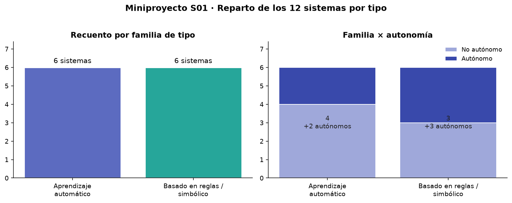

# S01 · Soluciones de prácticas

> **Uso docente.** Soluciones completas de la práctica guiada, de los 10 ejercicios de autoevaluación, de la actividad del N01, de un ejemplo resuelto del N02 y del miniproyecto. Los enlaces están publicados **a propósito**: el alumnado los guarda en favoritos y yo los oculto cuando haga falta.
>
> **Nota:** las respuestas de los ejercicios son una **posible** respuesta de referencia; si un alumno justifica distinto pero con coherencia, también vale.

---

## 1 · Práctica guiada (los 2 bloques de código)

### Bloque 1 · De reglas a modelo (Iris, 2 clases)

```python
from sklearn.datasets import load_iris
from sklearn.model_selection import train_test_split
from sklearn.tree import DecisionTreeClassifier

X, y = load_iris(return_X_y=True)
X_train, X_test, y_train, y_test = train_test_split(X, y, test_size=0.3, random_state=42)
clf = DecisionTreeClassifier(max_depth=3, random_state=42).fit(X_train, y_train)
print("Precisión:", round(clf.score(X_test, y_test), 3))
```

**Salida real:**

```text
Precisión: 1.0
```

**La ficha de 1 minuto, rellenada:**

| Pregunta | Respuesta |
|---|---|
| ¿Qué *percibe*? | 4 medidas numéricas de la flor (largo/ancho de pétalo y sépalo) |
| ¿Con *reglas o datos* razona? | **Datos**: un árbol de decisión aprendido de 105 ejemplos etiquetados |
| ¿Qué *acción* produce? | Devuelve la especie (setosa / versicolor / virginica) |
| ¿Tarea estrecha cuál? | Clasificar la especie de una flor con 4 medidas. Nada más |

!!! warning "Cuidado con «Precisión: 1.0»"
    **No es un error, pero no es mérito del modelo.** El test tiene solo 15 flores y el problema es fácil: el árbol acierta las 15. Es el caso típico de *overfitting* aparente o de un test demasiado pequeño. **Nunca saques conclusiones con 15 filas.** Regla para el entregable: un número bonito sin contexto no es evidencia.

!!! example "Variante A — mismo problema, otro modelo (KNN)"
    Cambia **solo la última línea** y el resultado es el mismo:

    ```python
    from sklearn.neighbors import KNeighborsClassifier
    clf = KNeighborsClassifier(n_neighbors=5).fit(X_train, y_train)
    print("Precisión:", round(clf.score(X_test, y_test), 3))   # Precisión: 1.0
    ```

    *Qué enseña:* **no hay una sola "IA buena"**; hay varias técnicas que resuelven el mismo problema. Elegir entre árbol y KNN es una decisión de ingeniería (explicabilidad, coste, datos), no de verdad.

!!! example "Variante B — y si lo hubiéramos hecho con reglas a mano"
    ```python
    def regla_manual(flor_largo_petalo):
        return "versicolor" if flor_largo_petalo < 4.8 else "virginica"
    ```

    Para 2 especies y umbral a mano llega. Para las 3 especies con 4 medidas **ya no**: el número de reglas crece y alguien tiene que escribirlas. Ese es exactamente el límite de la tabla *reglas vs. datos* de la sesión.

!!! example "Variante C — cambiar el tamaño del test (para demostrar el punto)"
    ```python
    X_train, X_test, y_train, y_test = train_test_split(X, y, test_size=0.8, random_state=0)
    # con test mucho más pequeño y otra semilla, la precisión ya NO es 1.0
    ```

    *Qué enseña:* la **semilla y el reparto** condicionan el número. Por eso se fija `random_state=42`: para que la clase obtenga el mismo resultado que tú.

### Bloque 2 · El KPI decide (caso 1.000 consultas)

```python
antes = 1000 * 3.0
despues = 600 * 0.10 + 400 * 3.0
print(f"Antes: {antes:.0f} €/día · Después: {despues:.0f} €/día · Ahorro: {(1-despues/antes)*100:.0f}%")
```

**Salida real:**

```text
Antes: 3000 €/día · Después: 1260 €/día · Ahorro: 58%
```

**Desglose (para explicarlo en pizarra):**

| Línea | Cálculo | Resultado |
|---|---|---|
| Antes | 1.000 consultas × 3 € | **3.000 €/día** |
| Después · automatizadas | 600 (60 %) × 0,10 € | 60 € |
| Después · manuales | 400 (40 %) × 3 € | 1.200 € |
| **Después · total** | 60 + 1.200 | **1.260 €/día** |
| **Ahorro** | 1 − 1.260/3.000 | **58 %** |

!!! example "Variante — el mismo KPI expresado en tiempo"
    - Antes: 1.000 consultas × 5 min = **5.000 min/día** ≈ 83 h.
    - Después: 600 × 10 s + 400 × 5 min = 100 + 2.000 = **2.100 min/día** ≈ 35 h.
    - **−58 % de tiempo**, igual que en coste (porque el coste era proporcional al tiempo).

!!! example "Variante — y si el chatbot solo resuelve el 30 %"
    ```python
    antes, desp, manual = 1000*3.0, 300*0.10, 700*3.0
    print(f"{(1-(desp+manual)/antes)*100:.0f} %")   # 77 %
    ```

    A *prima facie* sorprende: **a menor automatización, mayor ahorro relativo**, porque el chatbot casi no se usa. La trampa está en que el ahorro absoluto cae y la inversión en el chatbot sigue costando lo mismo. **Siempre mira el ahorro en €/día, no solo en %.**

!!! warning "Los 2 errores típicos en este bloque"
    1. **Sumar el chatbot a las manuales**: `despues = 600×0,10 + 400×3` está bien; `despues = 600×0,10 + 1.000×3` no (es contar dos veces las automatizadas).
    2. **Olvidar el precio del chatbot.** En el caso solo se ponen 0,10 € por consulta. En un entregable real hay que restar la **licencia + mantenimiento**: si cuesta 400 €/mes ≈ 18 €/día, el ahorro pasa de 1.740 € a 1.722 €/día (−57,4 %). Sigue compensando, pero el número cambia.

---

## 2 · Ejercicios de autoevaluación (1–10)

### Bloque 1 · Caracterizar (idea 1)

**1. Ficha de 1 minuto para un chatbot de reclamaciones.**

| Pregunta | Respuesta |
|---|---|
| ¿Qué percibe? | El **texto** del correo/formulario (y a veces el asunto y el historial del cliente) |
| ¿Razona con reglas o datos? | Con **datos**: un clasificador entrenado con reclamaciones etiquetadas |
| ¿Qué acción produce? | **Enrutando** el caso (devolución, cambio, defecto, consulta) y respondiendo el primer borrador |
| ¿Tarea estrecha cuál? | Clasificar y responder 4 categorías cerradas. No conversa sobre cualquier tema |

*Opción alternativa (más sencilla, también válida):* razona con **reglas** (`si la ficha de compra es reciente → devolución`) si la empresa no tiene datos etiquetados. Las dos respuestas son correctas; la clave es que **justifiques por qué una**.

**2. Termostato `si T<18 → enciende` vs. filtro spam aprendido.**

| | Termostato | Filtro spam |
|---|---|---|
| Tipo | IA **basada en reglas** (simbólica) | ML **supervisado** (aprendido) |
| Cómo funciona | Alguien escribió `si T<18 → enciende` | Deduce las marcas del spam de miles de ejemplos |
| Cuándo conviene | Tarea **cerrada y enumerable**: hay pocas reglas y se pueden escribir todas | **Demasiados casos** para escribir reglas: el spam muta y las reglas se romperían |
| Límite | No generaliza: si hace frío *y* está húmedo, no lo ve | Necesita **datos etiquetados** y evaluación honesta; puede fallar |

> Regla de decisión: **¿puedo escribir todas las reglas en una hoja? Si sí → reglas. Si no → datos.**

**3. ¿Por qué toda la IA actual es estrecha (débil)?**

Porque cada sistema resuelve **una tarea acotada y concreta**, sin conciencia ni transferencia: la máquina **no entiende**, computa un patrón aprendido o aplica reglas, y colapsa ante lo no previsto.

- *Ejemplo que lo demuestra:* GPT redacta un correo, pero le pides **presupuestar** el mismo correo y se inventa los números: es brillante en una tarea y nula en la contigua.
- *Lo que no puede hacer:* **transferir** lo aprendido en un dominio a otro sin reentrenar; razonar con sentido común general como una persona.

**4. (N01) Diferencia entre la salida supervisada y la no supervisada.**

- **Supervisada (KNN sobre clientes):** el modelo devuelve **0 o 1**, la etiqueta concreta de un caso («reclamará / no reclamará»). Hay **respuesta correcta** con la que comparar: se puede medir precisión.
- **No supervisada (k-means sobre compras):** devuelve **0 o 1 por fila** también, pero esos números **no significan «sí/no»**: son **identificadores de grupo** que el algoritmo inventó. No hay respuesta correcta; lo que hay que interpretar es que los 6 clientes se agruparon en **2 grupos**: 3 de importe bajo (~30 €, 2-3 pedidos) y 3 de importe alto (~82 €, 8-10 pedidos).

> **La diferencia en 2 líneas:** la supervisada **predice una respuesta que ya existe**; la no supervisada **busca estructura que nadie había etiquetado**.

**5. (N02) Clasificar 1 sistema real: reglas o datos, tarea estrecha.**

*Ejemplo de referencia (recomendador de películas de una plataforma):*

- **Razona con datos** (colaborative filtering): no hay reglas escritas; el patrón sale de lo que han visto y puntuado miles de usuarios.
- **Acción:** recomendar 5 títulos en la home.
- **Tarea estrecha:** ordenar catálogo para *ese* usuario. No explica el porqué a un humano ni entiende «me aburro».
- **Evidencia que hace decidir:** que el criterio **no está escrito** en ningún sitio y **cambia con cada usuario y con cada reproducción**. Si hubiera una tabla `si género=acción → recomendar X`, sería reglas.

**6. Clasifica: (a) grietas por foto, (b) agrupar clientes, (c) spam, (d) asistente por voz.**

| | Ítem | Técnica | Tipo |
|---|---|---|---|
| (a) | Grietas por foto | **Visión artificial** (clasificación de imagen) | Supervisado |
| (b) | Agrupar clientes | **Clustering** | **No supervisado** |
| (c) | Spam | **Clasificación de texto** | Supervisado |
| (d) | Asistente por voz | **PLN** (voz → texto → respuesta) | Supervisado / secuencial |

*Nota para el examen:* (b) es el único **no supervisado** porque **no hay etiquetas previas**: nadie etiquetó a los clientes. (a) y (c) sí tienen etiquetas («con grieta / sin grieta», «spam / no spam»).

### Bloque 2 · Decidir con KPI (idea 2)

**7. Caso 1.000 consultas/día.**

- **Antes:** `1.000 × 3 € = 3.000 €/día`.
- **Después:** `600 × 0,10 € + 400 × 3 € = 60 + 1.200 = 1.260 €/día`.
- **Ahorro:** `1 − 1.260/3.000 = 0,58 → 58 %`.
- **KPI usado:** **coste de atención por día (€/día)** — una media se derivaría el coste por consulta (3 € → 1,26 €).

**8. Variante: 300 reclamaciones/día a 2 €, clasificador resuelve 80 % a 0,20 €.**

```python
antes = 300 * 2.0
despues = 240 * 0.20 + 60 * 2.0
print(f"Antes: {antes:.0f} €/día · Después: {despues:.0f} €/día · Ahorro: {(1-despues/antes)*100:.1f}%")
```

```text
Antes: 600 €/día · Después: 168 €/día · Ahorro: 72.0 %
```

- **Antes:** `300 × 2 = 600 €/día`.
- **Después:** `240 × 0,20 + 60 × 2 = 48 + 120 = 168 €/día`.
- **Ahorro:** **72 %** (coste por reclamación de 2 € a 0,56 €).

*Comparar con el ejercicio 7:* aquí el porcentaje es **mayor** (72 % vs 58 %) **a la vez** porque el automatizado es mayor (80 % vs 60 %) y el unitario es más barato (0,20 € vs 0,10 € sobre 3 €). Buen ejemplo de que **los KPIs no se comparan entre casos distintos sin contexto**.

**9. Proceso propio → técnica + KPI.**

*Ejemplo de referencia (reparto de alquileres de una gestoría):*

| Campo | Valor |
|---|---|
| Proceso | Asignar cada solicitud de alquiler a la persona mejor adaptada |
| Técnica | **Clasificación supervisado** (¿sí/no?) con historial de adjudicaciones |
| KPI 1 (tiempo) | Antes: 25 min/solicitud a mano → Después: 4 min (revisión humana del descartado) → **−84 %** |
| KPI 2 (error) | Antes: 12 % de asignaciones mal orientadas → Después: 4 % → **−8 p.p.** |

*Variantes válidas según el proceso elegido:*

- **Colmena (IoT + visión):** regresión de producción por colmena; KPI *antes* 0 alertas → *después* 3 alertas tempranas de enjambrazón (falso negativo como error).
- **Hidrógeno:** mantenimiento predictivo; KPI *MTBF* (tiempo medio entre averías) sube de 40 a 70 días → **+75 %**.
- **LARA (asistente):** PLN de consulta interna; KPI *AHT* (tiempo medio de gestión) de 6 min a 2 min → **−67 %**.

**10. Un riesgo + su mitigación.**

| Riesgo | En 1 línea | Mitigación en 1 línea |
|---|---|---|
| **Sesgo** | Si las reclamaciones históricas solo cubren un tipo de cliente, el modelo ignorará al resto | Auditar la **distribución** por tipo de cliente antes de entrenar y reequilibrar |
| **Privacidad** | Entrenar con datos de clientes personales (correo, teléfono) sin base legal | **Minimización** (RGPD): anonimizar, limitar al dato necesario y registrar la finalidad |
| **Drift** | Las devoluciones cambian por Navidad y el modelo, entrenado en mayo, falla | **Vigilar el KPI cada mes** y reentrenar con datos recientes |

> **Fórmula para la entrega:** *«Riesgo X (por qué ocurre) → mitigación Y (qué hago)»*. Una mitigación concreta y verificable vale más que «ser cuidadoso con los datos».

---

## 3 · N01 · Actividad (las 3 preguntas)

**1. Detectar fraudes en tarjetas con datos históricos etiquetados → clasificación supervisado.** Los datos ya dicen `fraude / no fraude`, y el objetivo es que el modelo **asigne una categoría a una nueva operación** (además, se puede usar *detección de anomalías* como refuerzo no supervisado).

**2. Agrupar tiendas por volumen de ventas sin etiquetas → clustering (no supervisado).** No hay respuesta previa; lo que buscas son **segmentos naturales**. Salen 2 grupos en el ejemplo: tiendas de volumen bajo y de volumen alto.

**3. Propuesta de interacción nueva (ejemplo de referencia).**

> **Proceso:** matricularse en un ciclo formativo (formulario + llamadas).
> **Interacción:** **asistente por texto** que resuelve las dudas de requisitos y horarios y solo deriva a una persona los casos con beca o excepción.
> **Técnica:** PLN + clasificación (la misma del chatbot de la sesión).
> **KPI:** *antes* 6 min/llamada, 1 persona ocupada toda la mañana; *después* 2,5 min de revisión → **−58 % del tiempo** de ese bloque.

---

## 4 · N02 · Mapa de sistemas (ejemplo resuelto, de una organización)

*Ejemplo completo con una tienda local, para que el alumnado vea el **nivel de detalle** que se espera.*

### Fase 1 · Alcance

> **«Frutería y supermercado La Huerta»**, 2 trabajadores + propietario.
> **Procesos:** compras a proveedor, reposición, atención en caja, contabilidad, escaparate/promoción.
> **Dos procesos con IA ya presentes:** (1) el **escáner de caja** que lee y busca el precio (visión por código/imagen), (2) el **recomendador de la app** de reparto a domicilio.

### Fase 2 · Fichas de los 3 sistemas

| Campo | Sistema 1 · Escáner de caja | Sistema 2 · Recomendador de la app | Sistema 3 · Predicción de pedidos |
|---|---|---|---|
| **Sistema** | Lee el artículo y lo identifica | Sugiere productos en la home | Calcula el pedido semanal a proveedores |
| **Campo** | Comercio (retail) | Comercio / marketing | Logística |
| **Datos** | Imagen/código, precios, stock | Historial de compras, carritos | Ventas diarias, estacionalidad, caducidades |
| **Percepción → razonamiento → acción** | Percibe imagen/código → razona con reglas de correspondencia → actúa poniendo precio y descuento | Percibe compras previas → razona con un modelo de co-ocurrencia → actúa mostrando 4 recomendaciones | Percibe 12 meses de ventas → razona con regresión → actúa generando el pedido |
| **Interacción nueva** | Visión | Recomendación | — |
| **Beneficio** | Menos error de precio y cola más corta | Más ticket medio | Menos merma y menos roturas de stock |

### Fase 3 · Contraste con el art. 3.1 del Reglamento (UE) 2024/1689

| Sistema | ¿Autonomía? | ¿Adaptación tras el despliegue? | ¿Infiere o solo aplica reglas fijas? | ¿Sistema de IA según art. 3.1? |
|---|---|---|---|---|
| Escáner de caja | No (espera al operario) | No | **Solo aplica reglas** de correspondencia código→producto | **No**, en sentido estricto: es software de automatización |
| Recomendador | Sí, actúa solo en la home | **Sí**, se reentrena con nuevas compras | **Infiere** qué mostrar | **Sí** |
| Predicción de pedidos | Sí (genera pedido sin paso manual) | **Sí** (se recalibra cada semana) | **Infiere** un número futuro | **Sí** |

*Conclusión de la fase:* **de 3 sistemas, 2 son IA según la definición legal y 1 es automatización clásica.** Ese descarte **justificado** es exactamente lo que se pide: criticar, no dar por bueno todo lo que parece IA.

### Fase 4 · Campos y contexto

1. **Campos:** comercio (los 3) → *visión* también en industria (inspección de piezas), *recomendación* también en streaming, *regresión* también en sanidad (estancias).
2. **Otro sector con la misma técnica:** la **visión** del escáner es la misma familia que la inspección de grietas en una fábrica; la **regresión** del pedido es la misma que la previsión de demanda de una central.
3. **Dato de contexto:** con el **88 %** de adopción de IA (AI Index 2026), esta tienda está **por debajo**: usa 2 sistemas y ninguno está en su proceso de proveeduría, que sigue siendo a ojo. Se nota en **merma**: las pérdidas por caducidad son su KPI más bajo.

### Fase 5 · Conclusión

> **Es más rentable la IA en logística (previsión de pedido) y en caja (visión)** porque son los dos puntos con **coste y error visibles todos los días** (merma y cola). La recomendación es secundaria: mueve ticket, pero con 40 tickets/día el efecto es pequeño. **Prioriza por KPI, no por lo moderno que suene.**

---

## 5 · Miniproyecto · solución completa

### Enunciado (recordatorio)

Clasificar los 12 sistemas de la tabla en una tipología coherente y entregar: `sistemas_clasificados.csv`, un gráfico de barras y un párrafo justificando 3 sistemas.

### Solución A (recomendada) · reglas explícitas, explicables

```python
import numpy as np
import pandas as pd
import matplotlib.pyplot as plt

np.random.seed(42)

sistemas = pd.DataFrame({
    "nombre": [
        "FiltroSpam-EX", "DiagnosticoMed-RB", "RecomendadorShop-ML",
        "ChatbotHR-ML", "PlanificadorRutas-SYM", "DeteccionCobre-ML",
        "ReglasCredito-RB", "VisionRobot-SYM", "AsistenteVoz-ML",
        "OptimizadorRed-SYM", "ClasificadorDocs-ML", "ExpertoLegal-RB",
    ],
    "usa_reglas":     [0,1,0,0,1,0,1,1,0,1,0,1],
    "usa_ml":         [1,0,1,1,0,1,0,0,1,0,1,0],
    "es_simbolico":   [0,1,0,0,1,0,1,1,0,1,0,1],
    "requiere_datos": [1,0,1,1,0,1,0,0,1,0,1,0],
    "autonomo":       [0,0,0,0,1,1,0,1,1,1,0,0],
})

def clasificar_tipo(fila):
    if fila.usa_ml and fila.usa_reglas:
        base = "Híbrido"
    elif fila.usa_ml:
        base = "Aprendizaje automático"
    elif fila.es_simbolico or fila.usa_reglas:
        base = "Basado en reglas / simbólico"
    else:
        base = "No clasificado"
    if fila.autonomo:
        base += " (autónomo)"
    return base

sistemas["tipo"] = sistemas.apply(clasificar_tipo, axis=1)

familia = sistemas["tipo"].str.replace(" (autónomo)", "", regex=False)
recuento = familia.value_counts()
print(recuento)

sistemas.to_csv("sistemas_clasificados.csv", index=False)
```

**Salida:**

```text
Aprendizaje automático          6
Basado en reglas / simbólico    6
dtype: int64
```

**CSV resultante (12 filas):**

| nombre | tipo |
|---|---|
| FiltroSpam-EX | Aprendizaje automático |
| DiagnosticoMed-RB | Basado en reglas / simbólico |
| RecomendadorShop-ML | Aprendizaje automático |
| ChatbotHR-ML | Aprendizaje automático |
| PlanificadorRutas-SYM | Basado en reglas / simbólico (autónomo) |
| DeteccionCobre-ML | Aprendizaje automático (autónomo) |
| ReglasCredito-RB | Basado en reglas / simbólico |
| VisionRobot-SYM | Basado en reglas / simbólico (autónomo) |
| AsistenteVoz-ML | Aprendizaje automático (autónomo) |
| OptimizadorRed-SYM | Basado en reglas / simbólico (autónomo) |
| ClasificadorDocs-ML | Aprendizaje automático |
| ExpertoLegal-RB | Basado en reglas / simbólico |

> **Reparto:** 6 ML / 6 simbólicos, de los cuales **5 son autónomos** (3 simbólicos + 2 ML). Los sufijos `-ML`, `-RB`, `-SYM` del nombre **no valen como criterio**: el criterio son los **atributos**. (Buen gancho de clase: *«si clasificas por el nombre, sacas 12/12 y no has aprendido nada»*.)

**Gráfico de barras (el entregable nº 2):**



```python
familia = sistemas["tipo"].str.replace(" (autónomo)", "", regex=False)
recuento = familia.value_counts()

ax = recuento.plot(kind="bar", color=["#5c6bc0", "#26a69a"], rot=0, figsize=(7, 4),
                   title="Reparto de los 12 sistemas por tipo")
ax.set_xlabel("Tipo de sistema"); ax.set_ylabel("Nº de sistemas")
plt.tight_layout(); plt.savefig("sistemas_recuento.png", dpi=150)
```

### Solución B (alternativa) · validar con un clustering

En vez de **imponer** la tipología, comprueba que **la propia estructura de los datos la respalda**:

```python
from sklearn.cluster import KMeans

X = sistemas[["usa_reglas", "usa_ml", "es_simbolico", "requiere_datos", "autonomo"]]
sistemas["cluster"] = KMeans(n_clusters=2, n_init=10, random_state=42).fit_predict(X)

print(pd.crosstab(familia, sistemas["cluster"]))
```

**Salida:**

```text
cluster                       0  1
tipo
Aprendizaje automático        0  6
Basado en reglas / simbólico  6  0
```

**Cómo se lee:** la tabla de cruce es **perfectamente diagonal** — los 6 ML cayeron todos en el *cluster 1* y los 6 simbólicos en el *0*. Es decir, **un algoritmo que no sabía nada de tipologías separó exactamente las dos familias**. Es evidencia *además* de tu regla: la clasificación no es caprichosa.

*Cuándo usarla:* cuando quieras **justificar** que tu tipología emerge de los datos. Cuando el cruce salga sucio (un sistema en el cluster equivocado), ya sabes que esa tipología discutible — y ese es un buen argumento en el párrafo.

### Párrafo justificatorio (el entregable nº 3) — ejemplo de referencia

> He agrupado los 12 sistemas en dos familias según el **origen de su comportamiento**, no según su nombre. **Seis son de aprendizaje automático** porque usan `usa_ml = 1` y `requieren_datos = 1` sin reglas escritas: FiltroSpam, RecomendadorShop, ChatbotHR, DeteccionCobre, AsistenteVoz y ClasificadorDocs. **Seis son simbólicos/basados en reglas** porque aplican criterios explícitos (`es_simbolico = 1`) sin datos de entrenamiento: DiagnosticoMed, PlanificadorRutas, ReglasCredito, VisionRobot, OptimizadorRed y ExpertoLegal. He añadido el sufijo «autónomo» a los cinco que actúan sin supervisión (`autonomo = 1`), porque es un rasgo **transversal**: conviven familias y autonomías, y confundirlos sería el error más común. Considero que **PlanificadorRutas-SYM es el más discutible**: optimiza rutas con criterios fijos, pero su capacidad de decidir la propia ruta sin intervención lo acerca a un agente; lo clasifico como simbólico-autónomo y lo señalo como caso límite.

### Criterios de evaluación aplicados (autocontrol)

| Criterio | Cumples si… |
|---|---|
| Principios y tipología | La clasificación es **coherente con los atributos**, no con el nombre |
| Coherencia | Un mismo criterio se aplica a los 12 (y explicas los 5 autónomos igual) |
| Evidencia | Aportas el recuento **y** la tabla de cruce (Solución B) o una justificación razonada |
| Autonomía | Sabes decir **cuál es discutible** y por qué (no defiendes todo como perfecto) |

---

## 6 · Lista de comprobación antes de entregar

- [ ] **Ficha de 1 minuto:** los 4 campos completos (percibe / reglas o datos / acción / tarea estrecha).
- [ ] **KPI:** 2 números con unidad (€/día, min/caso, %) **antes** y **después**, y el % calculado.
- [ ] **Decisión explícita:** «sí/no» + **1 riesgo con 1 mitigación**.
- [ ] **Miniproyecto:** CSV + gráfico + párrafo con **3 sistemas** (uno discutible incluido).
- [ ] **Fuentes:** si has usado IA u otra web para una cifra, la citas.

> ¿Te falta alguno? La duda probablemente ya está en [Preguntas frecuentes](faq_s01.md).

## Ver también

- [Plan de la sesión](sesion01.md) · [Apuntes completos (RA1)](apuntes.md) · [Ejercicios de autoevaluación](ejercicios_s01.md)
- [Guion de sesión con vídeo](guion_video.md) · [Recursos de vídeo (DotCSV)](recursos_video.md)
- [Preguntas frecuentes de la S01](faq_s01.md)
