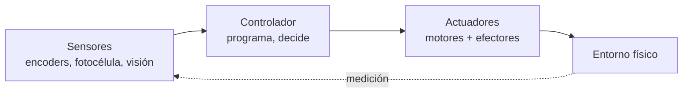
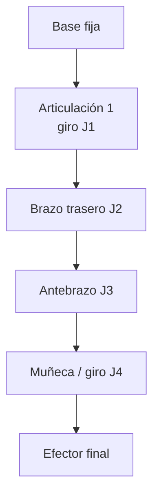
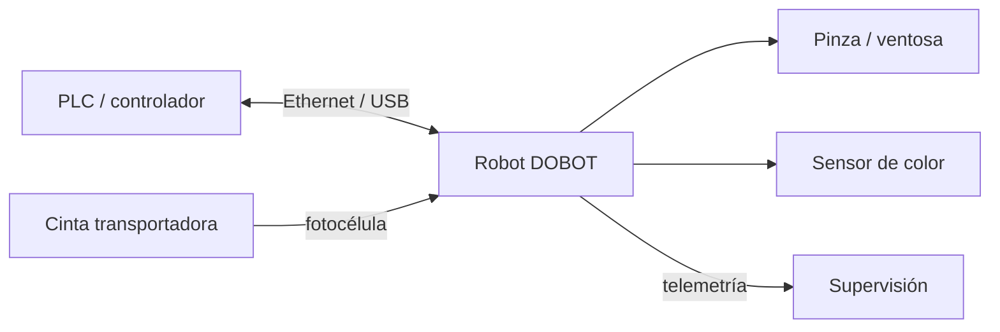

# B04 · RA4 — Análisis de sistemas robotizados

> **UD04 · 12 h** = 3 sesiones presenciales de 2 h (S1, S2, S3) + 3 sesiones autónomas de 2 h (TA1, TA2, TA3).
> **Resultado de aprendizaje RA4:** *Analiza sistemas robotizados, evaluando opciones de diseño e implementación.*
> **Hardware del aula:** un brazo **DOBOT Magician** (4 ejes) + cinta transportadora con fotocélula y sensor de color. Trabajo en 3-4 equipos por turnos.

**Criterios de evaluación y dónde se trabajan:**

| CE | Criterio oficial | Sección | Sesión |
|----|------------------|---------|--------|
| **4a** | Se han recopilado los problemas del modelado y control cinemático en robots manipuladores. | §2–§4 | S1, S2 |
| **4b** | Se han buscado soluciones a los problemas de los robots. | §4, §6, §7 | S2 |
| **4c** | Se han valorado las características diferenciadoras de las técnicas de programación de robots y de sistemas robotizados. | §6 | S1, S2 |
| **4d** | Se han evaluado diferentes opciones en el diseño e implementación de sistemas robotizados. | §5, §8 | S2, S3 |

## 1. ¿Qué es un robot?

> **Definición (ISO 8373).** Un **robot industrial** es un manipulador multifuncional, reprogramable y controlado automáticamente, programable en tres o más ejes, que puede estar fijo o móvil, y que se usa en aplicaciones de automatización industrial.

Un robot es un **agente encarnado**: percibe su entorno, lo procesa y **actúa físicamente** sobre él. Es el único sistema de IA de este módulo que puede cambiar el estado del mundo físico — y por eso un fallo no produce una etiqueta errónea, sino una pieza rota o un accidente.



**Tipos de robot** (por su mecánica y su relación con las personas):

| Tipo | Qué es | Ejemplo del aula |
|---|---|---|
| **Manipulador / brazo** | Cadena de eslabones que mueve un efector | DOBOT Magician |
| **Móvil** | Se desplaza sobre ruedas o patas | AGV/AMR de almacén |
| **Colaborativo (cobot)** | Comparte espacio con personas con fuerza limitada | DOBOT en modo guiado |
| **Pórtico / cartesiano** | Ejes lineales | Máquina de pick & place |

> **Más información · Historia.** El primer robot industrial fue **Unimate** (1961), instalado en la cadena de montaje de General Motors para manipular piezas calientes de fundición. Desde entonces, la robótica industrial ha crecido hasta superar los **500.000 robots instalados al año** (IFR *World Robotics*), con España como uno de los principales mercados europeos, impulsado por la automoción. En 2025-26, la ola nueva son los **AMR** en logística, los **cobots** y los primeros **humanoides** en pilotos.

## 2. Anatomía de un manipulador

Un manipulador es una **cadena cinemática**: eslabones rígidos unidos por articulaciones.

> **Definición · Grado de libertad (GDL o DoF).** Cada movimiento independiente de una articulación. Hacen falta **al menos 3** para alcanzar cualquier punto del espacio (posición) y **6** para fijar además la orientación. El DOBOT Magician tiene **4** (base, brazo trasero, antebrazo y rotación de muñeca), lo que basta para pick & place y dibujo, pero **no** para orientar libremente una herramienta en 3D.

| Concepto | Definición |
|---|---|
| **Eslabón** | Pieza rígida entre dos articulaciones |
| **Articulación de revolución (R)** | Gira: variable ángulo θ |
| **Articulación prismática (P)** | Se desliza: variable distancia d |
| **Espacio articular** | Vector con el valor de cada articulación `[J1, J2, J3, J4]` |
| **Espacio cartesiano** | Pose del efector `[X, Y, Z, RZ]` (posición + giro de muñeca) |



## 3. Cinemática: el problema de los manipuladores (CE 4a)

### 3.1 Cinemática directa (FK)

La **cinemática directa** calcula la **pose del efector** a partir de los valores de las articulaciones: `pose = f(q)`. Siempre tiene **una única solución** y es pura geometría.

> **Ejemplo · Brazo plano 2R resoluble a mano.** Dos eslabones de longitud `l₁ = 150 mm` y `l₂ = 120 mm`, con ángulos `θ₁` y `θ₂`. La punta está en:
> $$x = l_1\cos\theta_1 + l_2\cos(\theta_1+\theta_2)$$
> $$y = l_1\sin\theta_1 + l_2\sin(\theta_1+\theta_2)$$
> Con `θ₁ = 0°`, `θ₂ = 0°`: `x = 270 mm`, `y = 0 mm`. Con `θ₁ = 90°`, `θ₂ = 0°`: `x = 0`, `y = 270 mm`. Ese punto (270 mm) está **dentro** del alcance de 320 mm del DOBOT.

### 3.2 Cinemática inversa (IK)

La **cinemática inversa** va al revés: dada la pose deseada, calcula los ángulos `q = f⁻¹(pose)`. Es **el problema difícil** y la raíz de casi todos los fallos de un manipulador:

| Problema | En qué consiste | Consecuencia práctica |
|---|---|---|
| **Múltiples soluciones** | Un mismo punto se alcanza con «codo arriba» o «codo abajo» | Dos scripts distintos dibujan el mismo punto |
| **Singularidad** | El jacobiano pierde rango: la velocidad articular tiende a infinito | Vibración, sobrecorriente o parada de seguridad |
| **Fuera de alcance** | El objetivo está más allá de 320 mm | El robot no llega: hay que rediseñar la célula |
| **Límites articulares** | Cada eje tiene un rango válido | Movimiento imposible aunque el punto sea alcanzable |

> **Más información.** En un brazo de 6 ejes la IK puede tener **hasta 16 soluciones**; el DOBOT, con 4 ejes, tiene menos margen y por eso su **espacio de trabajo** es un casquete cilíndrico en torno a su base. Programar «a ciegas» sin comprobar el alcance es la primera causa de error en el aula.

### 3.3 Control

Los ejes se mueven con **servomotores con encoder** en lazo cerrado. El control clásico por eje es **P → PD → PID**; los robots industriales añaden **par calculado** (dinámica inversa). En el DOBOT, la velocidad y la aceleración de cada tramo se fijan con parámetros (`SetPTPJointParams`, `SetPTPCoordinateParams`).

## 4. Actuadores, sensores y efectores finales

**Actuadores:**

| Tipo | Cómo funciona | Dónde |
|---|---|---|
| **Eléctrico** | Motor que gira | Articulaciones (el del DOBOT) |
| **Neumático** | Aire comprimido | Pinza y ventosa |
| **Hidráulico** | Fluido a presión | Maquinaria pesada |

**Sensores:** los **propioceptivos** informan del propio robot (**encoders** de eje, finales de carrera) y los **exteroceptivos** del entorno (**fotocélula**, **sensor de color**, **visión**). El DOBOT usa encoders internos y, con el kit de cinta, una fotocélula y un sensor de color.

> **Definición · Efector final (EOAT, *end of arm tooling*).** La herramienta del extremo del brazo. El DOBOT Magician los tiene intercambiables:

| Efector | Para qué | Dato |
|---|---|---|
| **Portaminas / rotulador** | Dibujar y escribir | Ø 10 mm |
| **Pinza neumática** | Coger objetos rígidos | recorrido 27,5 mm, fuerza 8 N |
| **Ventosa** | Coger objetos planos/lisos | Ø 20 mm, −35 kPa |
| **Impresión 3D / láser** | Mención (no se usan en clase) | — |

> **Ejemplo · El caso de la ventosa.** Una ventosa no «agarra»: **aspira**. Con −35 kPa y Ø 20 mm, la fuerza teórica de sujeción es `F = P · A ≈ 35000 Pa × π·(0,01 m)² ≈ 11 N`, suficiente para un cubo ligero pero **no** para una pieza pesada o porosa. Elegir efector es parte del diseño.

## 5. El sistema robotizado: robot + controlador + entorno (CE 4d)

Un **sistema robotizado** no es solo el brazo: es la **célula** completa.



| Elemento | Función |
|---|---|
| **Robot + controlador** | Ejecuta el programa y gobierna los ejes |
| **Entorno** | Cinta, sensor de presencia, sensor de color, mesa de trabajo |
| **PLC / comunicaciones** | Coordina robot y periféricos (en el DOBOT, por su API) |
| **Seguridad** | Paradas, límites de movimiento, no invadir la trayectoria |

**Aplicaciones típicas** (las que se practican en el aula): **pick & place**, **paletizado** (dejar piezas en filas y capas), **clasificación por color** y **dibujo/escritura** con portaminas.

> **Más información.** En la industria, la célula se diseña **empezando por la tarea**: qué pieza, qué peso, qué cadencia, qué precisión y qué entorno. Después se elige robot (carga útil, alcance, repetibilidad) y efector. El DOBOT tiene **500 g de carga útil**, **320 mm de alcance** y **±0,2 mm de repetibilidad**: suficiente para piezas ligeras y trabajos de precisión de laboratorio, no para piezas de varios kilos.

## 6. Técnicas de programación de robots (CE 4c)

> **Definición.** Programar un robot es decirle **qué trayectoria** seguir y **cuándo** actuar sobre el efector. Hay varias técnicas, y cada una cambia quién escribe el movimiento y cuánto se tarda.

| Técnica | Cómo funciona | Ventaja | Inconveniente | Cuándo |
|---|---|---|---|---|
| **Guiado / teach pendant** | Mueves el brazo a mano o con la botonera y grabas puntos | Rapidísima, sin código | Poco flexible; el robot está parado | Trayectorias simples, puntos de paso |
| **Programación por bloques (Blockly)** | Encajas bloques de movimiento | Muy visual, ideal para aprender | Limitada (p. ej. sin arcos) | Docencia, prototipos |
| **Programación textual (Python + API)** | Escribes el script con `pydobot`/`dType` | Repetible, parametrizable, versionable | Requiere saber programar | Aula y producción real |
| **Online** | Se ejecuta sobre el robot conectado | Feedback inmediato | Ocupa el robot mientras programas | Puesta a punto |
| **Offline** | Se escribe y **valida sin el robot** | **Cero paro**; varios equipos a la vez | Exige comprobar límites por software | Nuestro caso: un solo brazo |

> **Ejemplo · Nuestro flujo (offline con validación).** Con **un solo brazo** para todo el grupo: cada equipo escribe y **comprueba** su script en un cuaderno Colab (sintaxis, número de parámetros, rangos, límites del espacio de trabajo) → lo entrega → el docente lo carga y lo ejecuta en el brazo → si falla, se depura en directo. Es el ciclo real **programo → compruebo → envío → miro qué sale**.

## 7. El DOBOT Magician y su API

| Especificación | Valor |
|---|---|
| Ejes | **4** (base, brazo trasero, antebrazo, muñeca) |
| Carga útil | **500 g** |
| Alcance | **320 mm** |
| Repetibilidad | **±0,2 mm** |
| Comunicación | USB / Wi-Fi / Bluetooth |
| Alimentación | 12 V CC |
| Accesorio | Cinta transportadora con fotocélula y sensor de color |

**Dos formas de programarlo:**

1. **DobotStudio / DobotLab** (interfaz gráfica): teach, Blockly y editor de script.
2. **Python** con la API oficial (`dType`) o la librería **`pydobot`** (más cómoda).

> **Definición · Comandos inmediatos vs. encolados.** La API permite ejecutar una orden **ya** (inmediata) o **encolarla** en una cola FIFO (`isQueued=1`). Encolar es lo que permite **construir una secuencia de movimiento** sin esperar: el robot la ejecuta en orden. Es la diferencia entre **teleoperar** (orden a orden) y **programar** (una secuencia completa). Para sincronizar, se puede consultar la pose con `GetPose` hasta que el robot llegue al punto.

```python
# API oficial (dType) — movimiento cartesiano lineal a un punto
dType.SetPTPCoordinateParams(api, 150, 500, 150, 500, isQueued=0)  # vel, ac
dType.SetPTPCmd(api, 2, x, y, z, r, isQueued=1)                    # modo 2 = lineal
dType.SetWAITCmd(api, 500, isQueued=1)                             # esperar 0,5 s
```

```python
# pydobot — misma idea, API de alto nivel
from pydobot import Dobot
robot = Dobot(port="/dev/ttyUSB0")
robot.move_to(250, 0, 50, 0)     # x, y, z, r
robot.gripper(close=False)        # abrir pinza (ventosa: robot.suck(True))
robot.wait(500)
robot.home()
robot.close()
```

> **Más información.** En el cuaderno Colab usamos una clase **`BrazoSimulado`** que imita esta API: registra las órdenes, **valida rangos** (X entre 150 y 320 mm, radio ≤ 320 mm, Z dentro de límites) y **dibuja la trayectoria XY** con matplotlib. Así el equipo **verifica su dibujo antes de enviarlo al robot real**, sin hardware y sin instalar simuladores 3D.

## 8. Autoevaluación

<details>
<summary>1. ¿Cuántos grados de libertad tiene el DOBOT Magician y para qué alcanzan?</summary>

Cuatro (base, brazo trasero, antebrazo y muñeca). Alcanzan para pick & place y dibujo, pero **no** para orientar libremente una herramienta en 3D (harían falta 6).
</details>

<details>
<summary>2. ¿Por qué la cinemática directa es «fácil» y la inversa «difícil»?</summary>

La directa es geometría encadenada y tiene **solución única**; la inversa puede tener **varias soluciones**, atravesar **singularidades** o no tener solución (fuera de alcance).
</details>

<details>
<summary>3. ¿Qué diferencia hay entre espacio articular y cartesiano?</summary>

El **articular** da el valor de cada eje `[J1..J4]`; el **cartesiano** da la pose del efector `[X, Y, Z, RZ]`. Un mismo punto cartesiano puede lograrse con distintas configuraciones articulares.
</details>

<details>
<summary>4. ¿Qué es una singularidad y qué se ve en la célula?</summary>

Configuración en la que el jacobiano pierde rango: la velocidad articular tiende a infinito. En la práctica se ve **vibración, sobrecorriente o parada de seguridad**.
</details>

<details>
<summary>5. Empareja efector y tarea: pinza, ventosa, portaminas.</summary>

**Pinza** → objetos rígidos (cubos); **ventosa** → objetos planos y lisos; **portaminas** → dibujar/escribir.
</details>

<details>
<summary>6. ¿Qué significa que un comando esté «encolado» (`isQueued=1`)?</summary>

Que se añade a una **cola FIFO** y el robot lo ejecutará en orden. Permite construir una **secuencia** de movimiento sin esperar a cada orden; es la base de la programación frente a la teleoperación.
</details>

<details>
<summary>7. ¿Por qué usamos programación offline si tenemos el robot delante?</summary>

Porque hay **un solo brazo** para todo el grupo: los equipos escriben y **validan sin el robot** (Colab + `BrazoSimulado`) y el docente ejecuta por turnos. Reduce el paro del robot y permite trabajar a varios equipos a la vez.
</details>

<details>
<summary>8. ¿Qué diferencia hay entre MoveJ y MoveL?</summary>

**MoveJ** interpola en el **espacio articular** (movimiento curvo, más rápido, no garantiza trayectoria recta); **MoveL** mueve la herramienta en **línea recta** (más preciso, pero puede acercarse a singularidades).
</details>

<details>
<summary>9. ¿Qué mide la repetibilidad y en qué se diferencia de la precisión?</summary>

La **repetibilidad** es la dispersión al volver al mismo punto programado (±0,2 mm en el DOBOT); la **precisión** es si ese punto coincide con el que se quería alcanzar. Un robot puede ser repetible pero impreciso.
</details>

<details>
<summary>10. ¿Qué comprueba el `BrazoSimulado` antes de enviar el script al robot?</summary>

El **número y tipo de parámetros**, los **rangos** (X entre 150 y 320 mm, radio ≤ 320 mm, Z dentro de límites) y dibuja la **trayectoria XY** para que el equipo vea si su dibujo tiene sentido.
</details>

---

## Cobertura de criterios

| CE | Dónde se evidencia |
|----|--------------------|
| **4a** | §2–§4 (anatomía, cinemática, singularidades) + Actividad 1 (cinemática) |
| **4b** | §4, §6, §7 (soluciones: efectores, validación offline, depuración) + Actividades 2 y 3 |
| **4c** | §6 (tabla comparativa de técnicas) + guiado vs. código en la sesión 2 |
| **4d** | §5 y §8 (diseño de la célula) + Actividad 3 (pick & place) y memoria |
