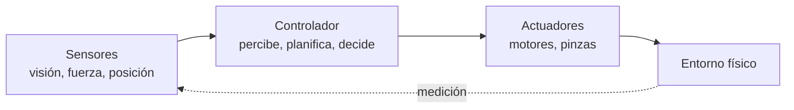
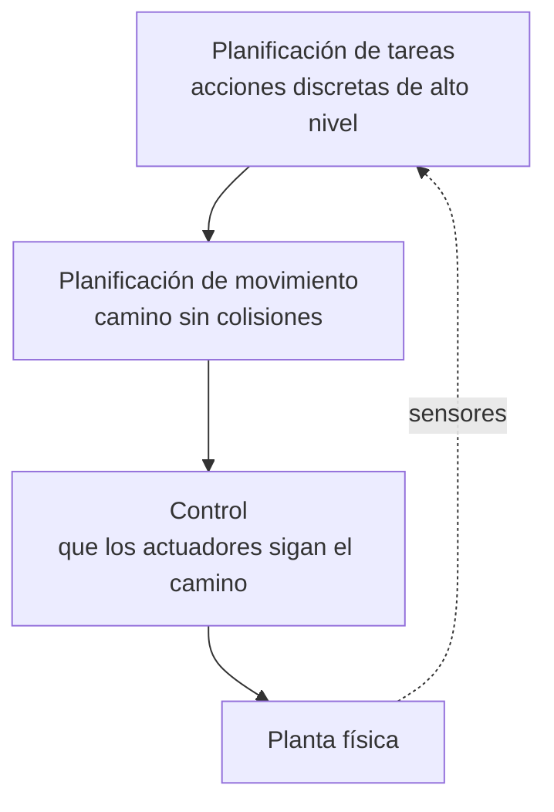

# B04 · RA4 — Análisis de sistemas robotizados

> **12 h = 3 sesiones presenciales de 2 h + 3 sesiones autónomas de 2 h.** Apuntes reescritos a partir de la UD04 de David Martínez Peña (`material_david/docs/UD04/UD04_ES.md`, CC BY-NC-SA 4.0) y actualizados al mercado actual, con cuadernos de Google Colab en Python.
>
> **Hilo conductor único: Célula-07**, una célula robotizada de *pick-and-place* en un almacén: un **brazo manipulador** que coge y coloca piezas y un **robot móvil (AMR)** que transporta. Cada sesión añade una capa sobre el mismo sistema.

## RA4 y criterios

**RA4** — Analiza sistemas robotizados, evaluando opciones de diseño e implementación.

| CE | Criterio | Sesión |
|---|---|---|
| RA4-a | Recopila los problemas del modelado y control cinemático en robots manipuladores. | S1 |
| RA4-b | Busca soluciones a los problemas de los robots. | S2 |
| RA4-c | Valora las características diferenciadoras de las técnicas de programación de robots. | S3 |
| RA4-d | Evalúa diferentes opciones en el diseño e implementación de sistemas robotizados. | S3 |

## Planificación (3 presenciales + 3 autónomas)

| Sesión | Horas | Alcance | CE | Entregable |
|---|---|---|---|---|
| **S1** presencial | 2 h | Robot, hardware y **cinemática** (FK/IK, jacobiano, singularidades) | RA4-a | Notebook S1 |
| **A1** autónomo | 2 h | **Actividad A1**: cinemática de un manipulador de Célula-07 | RA4-a | Notebook A1 + tabla DH |
| **S2** presencial | 2 h | **Planificación** de movimiento y **percepción** (RRT/PRM, SLAM) | RA4-b | Notebook S2 |
| **A2** autónomo | 2 h | **Actividad A2**: planificador + navegación del AMR | RA4-b | Notebook A2 |
| **S3** presencial | 2 h | **Programación**, humanos y **diseño** de la célula | RA4-c/d | Notebook S3 |
| **A3** autónomo | 2 h | **Actividad A3 (proyecto)**: diseñar la Célula-07 | RA4-d | Notebook A3 + memoria |

!!! tip "Cómo leer estos apuntes"
    Cada sesión tiene **contenido**, **práctica guiada** (código Colab) y **alcance**. Las actividades autónomas son las que se entregan y se corrigen con rúbrica.

---

# Sesión 1 · El robot y su cinemática (RA4-a)

## 1.1 ¿Qué es un robot?

Un **robot** es una máquina programable que **percibe** su entorno, **procesa** información y **actúa** físicamente sobre él. Es un **agente encarnado**: el único sistema de IA que cambia el estado del mundo físico — y por eso, cuando falla, no produce una etiqueta errónea, sino una pieza rota.



## 1.2 Tipos de robot (desde el hardware)

| Tipo | Qué es | Ejemplo en Célula-07 |
|---|---|---|
| **Manipulador** | Brazo articulado fijado a una base | El brazo de *pick-and-place* |
| **Móvil con ruedas** | Se desplaza (AGV/AMR) | El AMR que transporta |
| **Con patas** | Terreno accidentado | Inspección |
| **Aéreo (UAV) / submarino (AUV)** | Rotores o propulsión | Reparto, inspección |
| **Cobot** | Manipulador seguro junto a personas | Estación de montaje asistido |
| **Otros** | Prótesis, exoesqueletos, enjambres | Rehabilitación |

!!! important "Más grados de libertad no es mejor"
    Una pinza de **dos dedos** con un actuador se programa en un minuto y casi nunca falla; una mano de **20 actuadores** permite más, pero su control es mucho más difícil. La tarea manda.

## 1.3 Sensores y actuadores

**Sensores, por lo que miden:**

| Clase | Qué informa | Sensores |
|---|---|---|
| **Del entorno** | Distancia y forma | Sonar, visión estéreo, luz estructurada, **lidar**, radar, táctiles |
| **De ubicación** | Dónde está | GPS, balizas, wifi |
| **Propioceptivos** | Cómo está el robot | Encoders, odometría, giroscopios, fuerza/par |

**Actuadores:** eléctrico (el más común), hidráulico (mucha fuerza), neumático (rápido y simple). Mueven **articulaciones** de **revolución (R)** o **prismáticas (P)**.

!!! warning "La odometría se degrada sin límite"
    Contar vueltas de rueda parece exacto… durante unos metros. Las ruedas **patinan** y el error se **acumula** sin corrección. Por eso se combina con sensores inerciales y referencias externas → localización probabilística (S2).

## 1.4 Aplicaciones, con datos (IFR *World Robotics* 2025)

- **542.000** robots industriales instalados en 2024; **4,66 millones** operativos.
- **España, 3.er mercado europeo** (5.100 unidades), impulsada por la automoción.
- **Robótica médica +91 %** (~16.700 unidades), con *da Vinci* como referencia.
- Líder de densidad: **Corea del Sur**; líder de mercado: **China** (54 %).

## 1.5 Qué problema resuelve y la jerarquía de tres niveles

La robótica es **no determinista**, **parcialmente observable** y **multiagente**. Se parte en tres niveles:



Dividir reduce la complejidad, pero **renuncia a que los niveles se ayuden** (moverse para ver mejor, planificar contando la dinámica). Por eso la robótica actual investiga **volver a integrarlos**.

## 1.6 Modelado cinemático

Un manipulador es una **cadena cinemática**: eslabones rígidos unidos por articulaciones.

| Concepto | Definición |
|---|---|
| **Grado de libertad (DoF)** | Movimiento independiente. Se necesitan **≥ 6** para pose libre (posición + orientación) |
| **Articulación R / P** | Gira (θ) / se desliza (d) |
| **Espacio articular** | Vector `q` con la posición de cada articulación |
| **Espacio cartesiano** | Pose del efector (posición + orientación) |

| Configuración | Articulaciones | Uso |
|---|---|---|
| **Articulado (antropomórfico)** | ≥ 3R | El más común (6 ejes) |
| **Cartesiano / pórtico** | 3P | Gran alcance |
| **SCARA** | RRP | Montaje: rígido en Z, flexible en XY |
| **Delta / paralelo** | Paralelas | Empaquetado rápido |

### Cinemática directa (FK)

De los ángulos a la pose: `pose = f(q)`, encadenando **matrices de transformación homogénea** con los **parámetros DH** (θ, d, a, α). **Siempre tiene solución única.**

Brazo plano 3R, a mano:

$$x = l_1\cos\theta_1 + l_2\cos(\theta_1{+}\theta_2) + l_3\cos(\theta_1{+}\theta_2{+}\theta_3)$$
$$y = l_1\sin\theta_1 + l_2\sin(\theta_1{+}\theta_2) + l_3\sin(\theta_1{+}\theta_2{+}\theta_3)$$

### Cinemática inversa (IK)

De la pose deseada a los ángulos: `q = f⁻¹(pose)`. **Mucho más difícil**; aquí están los problemas de RA4-a:

| Problema | En qué consiste | Solución |
|---|---|---|
| **Múltiples soluciones** | Hasta **16** en un 6R general (8 con muñeca esférica) | Elegir por criterio (evitar obstáculos, recorrido) |
| **Redundancia** | Más DoF de los necesarios → **infinitas** soluciones | Optimizar en el **espacio nulo** del jacobiano |
| **Sin solución** | Objetivo fuera de alcance | Detectar y avisar |
| **Singularidad** | El jacobiano pierde rango → velocidad articular → ∞ | Evitar al planificar o cruzar despacio |

El **jacobiano** relaciona velocidades articulares y cartesianas: `v = J(q)·q̇`. Su pérdida de rango es la singularidad.

### Control

| Estrategia | Qué controla |
|---|---|
| **Posición** | Ángulo de cada articulación (PID por eje) |
| **Velocidad** (*resolved-rate*) | Velocidad del efector: `q̇ = J⁺v` |
| **Fuerza / impedancia** | Interacción con el entorno (ensamblaje, pulido) |

De menos a más: **P** (oscila) → **PD** (amortigua) → **PID** (elimina error sistemático) → **par calculado** (dinámica inversa + PID para el residuo, lo que usan los robots industriales).

!!! note "Precisión ≠ repetibilidad"
    Un robot puede volver **siempre al mismo punto equivocado** (repetible pero impreciso). Con *teach pendant* basta la repetibilidad; con programación **offline** (coordenadas de CAD) hay que **calibrar**.

## 1.7 Práctica guiada S1 (Colab)

Objetivo: tocar la cinemática con código. Notebook `sesion01_cinematica.ipynb`.

```python
import numpy as np
from scipy.optimize import least_squares

# --- Brazo plano 3R: cinematica directa ---
def fk_3r(q, L=(1.0, 1.0, 1.0)):
    t1, t2, t3 = q
    x = L[0]*np.cos(t1) + L[1]*np.cos(t1+t2) + L[2]*np.cos(t1+t2+t3)
    y = L[0]*np.sin(t1) + L[1]*np.sin(t1+t2) + L[2]*np.sin(t1+t2+t3)
    return np.array([x, y])

# --- Jacobiano 2D (posicion) ---
def jacobian_2d(q, L=(1.0, 1.0, 1.0)):
    t1, t2, t3 = q
    J = np.zeros((2, 3))
    J[0, 0] = -L[0]*np.sin(t1) - L[1]*np.sin(t1+t2) - L[2]*np.sin(t1+t2+t3)
    J[0, 1] = -L[1]*np.sin(t1+t2) - L[2]*np.sin(t1+t2+t3)
    J[0, 2] = -L[2]*np.sin(t1+t2+t3)
    J[1, 0] =  L[0]*np.cos(t1) + L[1]*np.cos(t1+t2) + L[2]*np.cos(t1+t2+t3)
    J[1, 1] =  L[1]*np.cos(t1+t2) + L[2]*np.cos(t1+t2+t3)
    J[1, 2] =  L[2]*np.cos(t1+t2+t3)
    return J

# --- IK numerica ---
def ik_3r(target, q0=(0.1, 0.1, 0.1)):
    sol = least_squares(lambda q: fk_3r(q) - target, q0)
    return sol.x

print("FK q=0:", np.round(fk_3r([0, 0, 0]), 3))
print("Jacobiano q=0:", np.round(jacobian_2d([0, 0, 0]), 3))
q = ik_3r([2.0, 1.0])
print("IK [2,1] ->", np.round(q, 3), "FK:", np.round(fk_3r(q), 3))
```

Y con un robot real (`roboticstoolbox-python`, modelo **Panda**):

```python
%pip install roboticstoolbox-python spatialmath-python
import roboticstoolbox as rtb

robot = rtb.models.Panda()
pose = robot.fkine([0, -0.8, 0.8, 0, 0.8, 0, 0])   # cinematica directa
sol = robot.ikine_LM(pose)                          # cinematica inversa (Levenberg-Marquardt)
print("IK ok:", sol.success, "q =", [round(x, 2) for x in sol.q])
```

**Alcance de la S1:** distinguir tipos y hardware, describir la jerarquía tarea→movimiento→control, resolver FK y entender la IK, identificar singularidades y repetibilidad, y ejecutar los dos notebooks.

---

# Autónomo 1 · Actividad A1 (RA4-a)

**Reto (2 h):** analizar la cinemática del manipulador de Célula-07 en `autonomo01_cinematica.ipynb`:

1. Construye la **tabla DH** de un brazo 6R (puedes partir del Puma 560 o del Panda) y calcula la FK con `roboticstoolbox`.
2. Resuelve la **IK** para 3 poses objetivo dentro del alcance y anota si hay **múltiples soluciones**.
3. Calcula el **jacobiano** en 3 configuraciones y detecta una **singularidad** (codo estirado).
4. Informe de 5 líneas: ¿qué configuración elegirías para no pasar por la singularidad?

**Entregable:** notebook ejecutado + tabla DH + informe. **Rúbrica:** corrección de la FK/IK, identificación de la singularidad y justificación.

---

# Sesión 2 · Planificación y percepción (RA4-b)

## 2.1 El espacio de configuración

Planificar es buscar un **punto moviéndose por el espacio de configuración** (todas las configuraciones posibles), donde los obstáculos son **regiones prohibidas**. Es el «problema de la mudanza del piano».

## 2.2 Métodos de planificación

| Método | Idea | Fuerte en | Flojo en |
|---|---|---|---|
| **Grafo de visibilidad** | Nodos en vértices de obstáculos, aristas con línea de visión; luego A* | Camino **más corto** (2D poligonal) | Muchos obstáculos; roza esquinas |
| **Diagrama de Voronoi** | Bordes entre regiones de cercanía | Camino **más seguro** | Más largo |
| **Descomposición celular** | Trocea el espacio libre en celdas | Sencillo | Explota con la dimensión |
| **Muestreo (RRT, PRM)** | Configuraciones al azar conectadas | **Muchas dimensiones** (brazos 6-7 ejes) | No óptimo; irregular |

El compromiso clásico: visibilidad = **más corto pero arriesgado**; Voronoi = **más seguro pero largo**.

## 2.3 Plan vs. política

- Un **plan** dice qué camino recorrer.
- Una **política** dice qué acción tomar **desde cualquier estado**.

La robótica real **planifica en cinemática** y luego **convierte el plan en política** (un controlador que sigue el plan y vuelve a él). Eso introduce dos suboptimalidades; el **control óptimo** (LQR/iLQR) las ataca juntas.

## 2.4 Percepción y SLAM

**Percepción** = convertir medidas con ruido en una representación interna.

| Problema | Se sabe | Se busca |
|---|---|---|
| **Localización** | El mapa | Dónde está |
| **Mapeo** | Dónde está | El mapa |
| **SLAM** | Nada | **Ambos a la vez** |

SLAM se resuelve **probabilísticamente**: el robot mantiene una **distribución** (estado de creencia) sobre dónde está y la afina con cada medida. Herramientas: **filtros de Kalman**, **HMM**, **filtro de partículas (MCL)**.

!!! example "Localización de Monte Carlo en tres fotos"
    1. Al arrancar, las partículas están repartidas por todo el plano (incertidumbre total).
    2. Con las primeras medidas se agrupan en zonas compatibles (puede haber **varios grupos**: pasillos que se parecen).
    3. Con suficientes medidas, **colapsan** en un sitio.

## 2.5 Incertidumbre y aprendizaje

Muchos robots en producción usan **algoritmos deterministas** con dos atajos: discretizar el estado y quedarse con el **estado más probable**. Funciona mientras la distribución tenga **un solo pico**; falla con varias hipótesis igual de buenas.

El **aprendizaje por refuerzo** funciona en simulación y falla en el robot real: el mundo no va más rápido que el tiempo real y el robot **no puede permitirse la prueba que lo dañaría**. De ahí el problema ***sim-to-real***.

## 2.6 Práctica guiada S2 (Colab)

Notebook `sesion02_planificacion_percepcion.ipynb`.

```python
import numpy as np

# --- RRT en 2D con obstaculos ---
def is_free(p):
    return not (0.8 < p[0] < 1.6 and 0.8 < p[1] < 1.6)   # caja prohibida

def rrt(start, goal, bounds=((0, 4), (0, 4)), n=1500, step=0.3, seed=0):
    rng = np.random.default_rng(seed)
    nodes = {0: np.array(start, float)}; parent = {0: None}
    for i in range(1, n):
        p = np.array(goal, float) if rng.random() < 0.05 else rng.uniform(*bounds)
        k = min(nodes, key=lambda k: np.linalg.norm(nodes[k] - p))
        v = p - nodes[k]; nv = np.linalg.norm(v) + 1e-9
        new = nodes[k] + (v / nv) * min(step, nv)
        if is_free(new):
            nodes[i] = new; parent[i] = k
            if np.linalg.norm(new - np.array(goal)) < step:
                path = []; c = i
                while c is not None:
                    path.append(nodes[c]); c = parent[c]
                return path[::-1]
    return []

camino = rrt([0, 0], [3, 3])
print("puntos del camino:", len(camino), "| meta:", np.round(camino[-1], 2))
```

```python
# --- Filtro de particulas 1D (localizacion) ---
def particle_filter(medidas, N=500, seed=1):
    rng = np.random.default_rng(seed)
    pos = rng.uniform(0, 10, N); w = np.ones(N) / N
    est = []
    for z in medidas:
        pos = pos + rng.normal(0, 0.3, N)                 # prediccion (movimiento)
        w = w * np.exp(-0.5 * ((z - pos) / 0.5) ** 2) + 1e-300   # correccion (sensor)
        w /= w.sum()
        pos = pos[rng.choice(N, N, p=w)]                  # remuestreo
        w = np.ones(N) / N
        est.append(np.average(pos, weights=w))
    return est

print("estimacion final:", round(particle_filter([5.0] * 10)[-1], 3))
```

Y con **AITK** (simulador de robot móvil en el propio notebook):

```python
%pip install aitk aitk.robots
import aitk.robots as bots

world = bots.World(220, 180, boundary_wall_color="yellow")
robot = bots.Scribbler(x=100, y=90, a=90)
robot.add_device(bots.Camera(64, 32))
world.add_robot(robot)
world.reset()
# world.seconds(30, [controlador], real_time=True)
```

**Alcance de la S2:** explicar el espacio de configuración y elegir método de planificación, distinguir plan y política, describir SLAM y el filtro de partículas, y ejecutar RRT + localización.

---

# Autónomo 2 · Actividad A2 (RA4-b)

**Reto (2 h):** en `autonomo02_planificacion.ipynb`:

1. Implementa un **planificador** (RRT o PRM) para el AMR de Célula-07 con al menos 3 obstáculos y compara el camino con **A\*** sobre una rejilla.
2. Haz navegar el robot con **AITK** siguiendo una línea con **reglas**; después suaviza con **lógica difusa** (o un controlador proporcional).
3. Mide y compara: longitud del camino, suavidad y **tiempo** hasta la meta.

**Entregable:** notebook + tabla comparativa (RRT vs A*, reglas vs difusa). **Rúbrica:** funciona, compara con datos y justifica la técnica.

---

# Sesión 3 · Programación, humanos y diseño (RA4-c/d)

## 3.1 Las cinco formas de programar un robot industrial

| Técnica | Cómo | Ventaja | Inconveniente | Cuándo |
|---|---|---|---|---|
| **Teach pendant** | Guiar el brazo por puntos | Curva mínima | Para producción al programar | Trayectorias simples |
| **Guiado manual** | Mover el efector a mano | Muy intuitivo | Solo cobots | Montaje asistido |
| **Textual** | RAPID, KRL, **URScript** | Determinista, integrable | Propietario, no portable | Alta cadencia |
| **Offline (OLP)** | Simulación sobre CAD | Cero parada de producción | Exige modelos y calibración | Geometrías complejas |
| **ROS 2** | Nodos, *topics*, servicios | Estándar abierto, IA | Curva alta | Investigación, móviles |

!!! tip "URScript se parece a Python"
    Los robots **Universal Robots** se programan en **URScript** y puede enviarse desde un cliente Python (FTP/SSH/RTDE): la puerta natural a la programación de cobots.

## 3.2 Comparar técnicas de verdad

El criterio RA4-c se aprende resolviendo **un mismo problema** de varias formas (seguir una línea):

| Enfoque | Qué escribes tú | Qué sale |
|---|---|---|
| **Reglas** | Todas las condiciones | El comportamiento programado |
| **Lógica difusa** | Variables lingüísticas y reglas | Transición suave |
| **Red neuronal** | Arquitectura y datos | Comportamiento aprendido |
| **Neuroevolución (NEAT)** | Función de aptitud | Red **y topología** evolucionadas |

Lo que importa no es «cuál gana», sino **qué se gana y qué se pierde** en cada salto: código, datos, tiempo y **explicabilidad** (las reglas se leen; los pesos no).

## 3.3 Cobots y seguridad

- **Cobots:** Universal Robots (UR3e–UR16e), Franka Emika, KUKA LBR; comparten espacio por **limitación de fuerza y potencia**.
- **ISO 10218:2025:** la norma vigente; absorbe la **ISO/TS 15066** (límites biomecánicos) y exige evaluar la **aplicación colaborativa completa** (robot + herramienta + entorno + tarea). Un cobot con un cuchillo no es una aplicación colaborativa.
- **ISO 12100** (evaluación de riesgos), **ISO 9283** (repetibilidad/precisión).

## 3.4 Humanos y robots

Coordinar un robot con personas no es esquivar un obstáculo: la persona es un **agente con objetivos**. La solución práctica: **predecir** lo que hará y **actuar** en consecuencia. Y como la recompensa real está en la cabeza del usuario, el robot debe **inferirla observando** (qué corrige, qué acepta) — un problema de alineación que se ve a fondo en RA6.

## 3.5 Diseño e implementación (RA4-d)

**Criterios de selección:**

| Criterio | Pregunta | Dato |
|---|---|---|
| **Payload** | ¿Qué masa mueve, **con herramienta**? | UR3e 3 kg … UR16e 16 kg; FANUC 2,3 t |
| **Alcance** | ¿Qué distancia máxima? | KUKA KR AGILUS 726-1.101 mm |
| **Repetibilidad** | ¿Cuánta dispersión al volver? | UR e-Series ±0,03-0,05 mm |
| **Entorno** | ¿Polvo, humedad, ATEX? | Versiones IP/ATEX |

!!! important "El payload no es el peso de la pieza"
    Es pieza **+ herramienta (EOAT) + brida + cables + sensores**. Y hay que comprobar los **momentos de inercia**: un robot puede aguantar 10 kg pegados a la brida y no 6 kg en una herramienta larga.

**Ciclo de vida:** requisitos → selección → simulación de la célula → integración → puesta en marcha → mantenimiento.

**Célula e Industria 4.0:** PLC de seguridad (PROFINET/EtherCAT), telemetría **OPC UA/MQTT**, **gemelo digital** y mantenimiento predictivo.

## 3.6 Práctica guiada S3 (Colab)

Notebook `sesion03_diseno_programacion.ipynb`. Selección de robot + comparación de controladores.

```python
# --- Seleccion de robot: filtrar por payload y alcance ---
catalogo = [
    {"modelo": "UR3e",  "payload": 3.0,  "alcance": 500},
    {"modelo": "UR5e",  "payload": 5.0,  "alcance": 850},
    {"modelo": "UR16e", "payload": 16.0, "alcance": 900},
    {"modelo": "KUKA KR AGILUS", "payload": 6.0, "alcance": 1101},
]
pieza, pinza, cables = 1.5, 0.5, 0.2
necesario = pieza + pinza + cables
print("payload necesario:", necesario, "kg")
candidatos = [r for r in catalogo if r["payload"] >= necesario and r["alcance"] >= 700]
print("candidatos:", [r["modelo"] for r in candidatos])
```

```python
# --- Comparar controladores (reglas vs proporcional) ---
def planta(t, u, dt=0.1):
    return t + dt * (2.0 * u - 0.1 * (t - 20))   # inercia + perdida

def control_reglas(t, sp=30):
    e = sp - t
    return 1.0 if e > 5 else 0.6 if e > 1 else 0.0

def control_proporcional(t, sp=30, kp=0.2):
    return max(0.0, min(1.0, kp * (sp - t)))

for nombre, ctrl in [("reglas", control_reglas), ("proporcional", control_proporcional)]:
    t = 20.0
    for _ in range(200):
        t = planta(t, ctrl(t))
    print(f"{nombre}: temperatura final = {t:.2f}")
```

**Alcance de la S3:** comparar las técnicas de programación, aplicar criterios de selección (payload con herramienta, alcance, repetibilidad, seguridad), valorar la ISO 10218:2025 y describir la célula 4.0.

---

# Autónomo 3 · Actividad A3 · Proyecto (RA4-d)

**Reto (2 h):** en `autonomo03_proyecto_celula.ipynb`, diseña la **Célula-07** completa:

1. **Tarea:** coger una pieza de 1,5 kg de un transportador y colocarla a 700 mm con repetibilidad ±0,1 mm.
2. **Selección:** calcula payload (con EOAT) y elige robot del catálogo; justifica.
3. **Seguridad:** ¿comparte espacio con personas? Decide aplicación colaborativa (ISO 10218:2025) o vallado.
4. **Verificación:** comprueba en simulación que la trayectoria no cruza una singularidad (codo estirado).
5. **Célula 4.0:** propón PLC, telemetría (OPC UA/MQTT) y un uso del gemelo digital.

**Entregable:** notebook + **memoria de 1 página** (tarea → criterios → selección → seguridad → riesgos). **Rúbrica:** coherencia tarea-modelo, justificación con datos y evaluación de seguridad.

---

# Mercado actual (2026) y tendencias

| Tendencia | Qué es |
|---|---|
| **Cobots** | Manipuladores seguros junto a personas (UR, Franka, KUKA LBR) |
| **AMR** | Robots móviles autónomos en logística (Amazon, almacenes) |
| **ROS 2** | Middleware estándar abierto para robótica |
| **Sim-to-real** | Entrenar en simulación (Isaac Sim, MuJoCo) y transferir al robot |
| **Foundation models / VLA** | Modelos visión-lenguaje-acción (RT-2, OpenVLA) que generalizan tareas |
| **Humanoides** | Figure, Optimus, Unitree: auge 2024-2026 en logística |
| **Gemelo digital** | Réplica virtual con telemetría para mantenimiento predictivo |
| **ISO 10218:2025** | Seguridad vigente: aplicación colaborativa completa + ciberseguridad |

## Puntos clave

- Un robot es un **agente encarnado**: percibe, procesa y actúa sobre el mundo físico.
- Hardware: tipos, sensores (entorno/ubicación/propioceptivos) y actuadores (eléctrico/hidráulico/neumático).
- Jerarquía **tarea → movimiento → control**; partir el problema simplifica pero desacopla.
- **FK** (única) vs. **IK** (hasta 16 soluciones, redundancia, **singularidades**); **jacobiano** y control P/PD/PID/par calculado.
- **Precisión ≠ repetibilidad**.
- Planificar = buscar camino en el **espacio de configuración**; visibilidad (corto) vs. Voronoi (seguro) vs. **muestreo (RRT/PRM)**.
- **Plan vs. política**; **SLAM** con **filtro de partículas**; **sim-to-real**.
- Cinco técnicas de programación; **«colaborativo» es de la aplicación**, no del hardware (ISO 10218:2025).
- Diseñar = **emparejar la tarea con el modelo** (payload con EOAT, alcance, repetibilidad, entorno, seguridad) y verificarlo en simulación.

## Glosario

| Término | Definición |
|---|---|
| **Robot / efector** | Máquina que percibe-procesa-actúa / pieza que ejerce fuerza |
| **Cobot / AMR** | Robot seguro junto a personas / robot móvil autónomo |
| **Grado de libertad** | Movimiento independiente de una articulación |
| **FK / IK** | Cinemática directa / inversa |
| **Parámetros DH** | θ, d, a, α que describen cada transformación |
| **Jacobiano** | Relación entre velocidades articulares y cartesianas |
| **Singularidad / redundancia** | Pérdida de rango del jacobiano / más DoF de los necesarios |
| **Espacio de configuración** | Espacio de todas las configuraciones del robot |
| **RRT / PRM** | Planificadores por muestreo |
| **SLAM** | Localización y mapeo simultáneos |
| **Filtro de partículas (MCL)** | Localización que representa la creencia como nube de hipótesis |
| **Sim-to-real** | Transferir a un robot real lo aprendido en simulación |
| **Teach pendant / OLP / ROS 2** | Programación guiada / offline / middleware |
| **URScript / RAPID / KRL** | Lenguajes de UR / ABB / KUKA |
| **Payload / repetibilidad / precisión** | Carga útil con EOAT / dispersión / coincidencia con lo programado |
| **ISO 10218:2025 / ISO 12100 / ISO 9283** | Seguridad de robots / evaluación de riesgos / repetibilidad |
| **Gemelo digital** | Réplica virtual alimentada con datos reales |

## FAQ

??? question "¿Un robot necesita IA?"
    No siempre: muchos robots industriales ejecutan programas fijos. La IA aparece cuando debe **percibir, adaptarse o aprender** (visión para localizar piezas, planificar en entornos cambiantes).

??? question "¿Qué pasa si el robot entra en una singularidad?"
    Las velocidades articulares necesarias tienden a infinito: el servo pide una corriente que no puede dar → vibraciones, error de seguimiento o parada de seguridad. Se evita al planificar o se cruza despacio.

??? question "¿Por qué un 6R llega al mismo punto de varias formas?"
    Porque la IK tiene **múltiples soluciones** (hasta 16, 8 con muñeca esférica). Codo arriba o abajo llegan al mismo sitio; el controlador elige por criterio.

??? question "¿Por qué no se resuelve la IK probando ángulos?"
    El espacio es continuo y de 6 dimensiones. Los métodos numéricos usan el **jacobiano** para saber en qué dirección converger, pero pueden caer en un mínimo local o no converger cerca de una singularidad.

??? question "¿Por qué el robot no aprende directamente en el mundo real?"
    Porque el mundo no va más rápido que el tiempo real (millones de pruebas = años) y **no puede permitirse la prueba que lo dañaría**. De ahí **sim-to-real**.

??? question "¿Qué diferencia hay entre planificar y controlar?"
    Planificar decide **el camino** (una vez); controlar consigue **seguirlo** pese al roce y la inercia, corrigiendo miles de veces por segundo.

## Evaluación (RA4)

| Peso | Instrumento |
|---|---|
| **40 %** actividades | A1 (cinemática), A2 (planificación/percepción) y A3 (proyecto de célula), con rúbrica |
| **60 %** prueba escrita | Test y desarrollo sobre RA4 (hardware, cinemática, planificación, SLAM, programación, diseño) |

La normativa exige **todos los RA** y **≥5 en cada RA** (Orden 8/2025, art. 5.1). Recuperación: repetir el análisis/diseño de un sistema robotizado con otro caso (art. 14.4).

## Recursos

- `material_david/docs/UD04/UD04_ES.md` (fuente base, CC BY-NC-SA 4.0) · https://martinezpenya.es/ModelosIA/UD04/UD04_ES.html
- [roboticstoolbox-python](https://github.com/petercorke/robotics-toolbox-python) · [AITK](https://github.com/ArtificialIntelligenceToolkit/aitk) · [ROS 2](https://docs.ros.org/)
- [IFR World Robotics](https://ifr.org/worldrobotics/) · [ISO 10218:2025](https://www.iso.org/standard/73933.html)
- AIMA cap. 26 (*Robotics*), Russell & Norvig.
