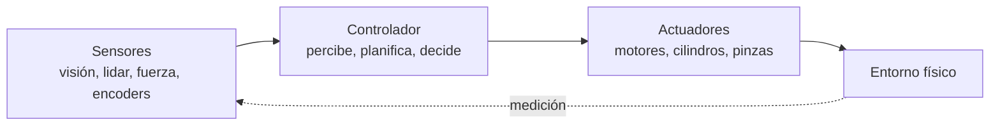
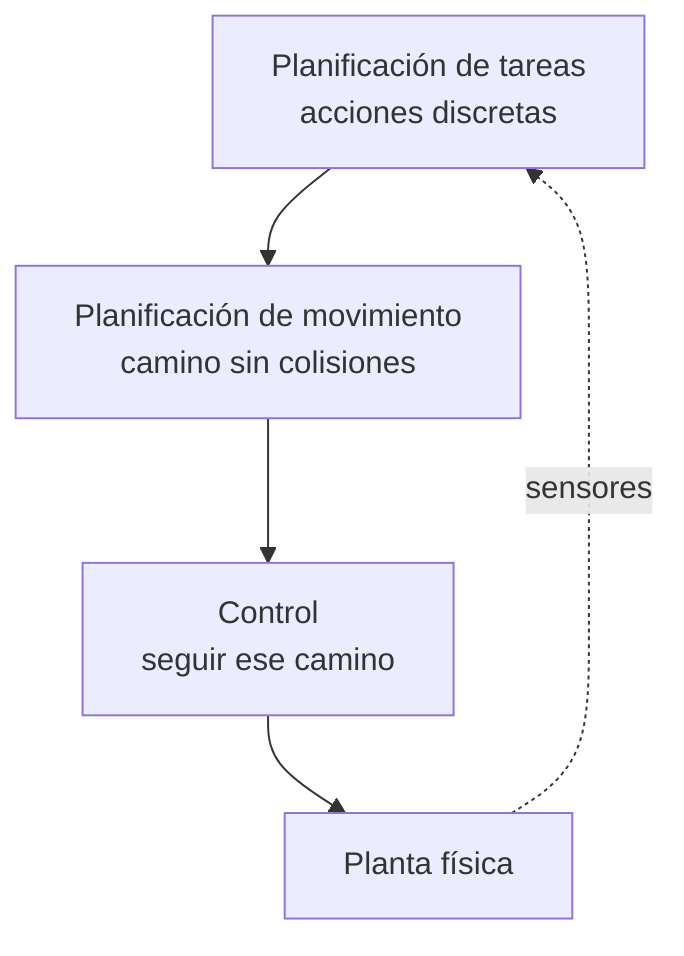
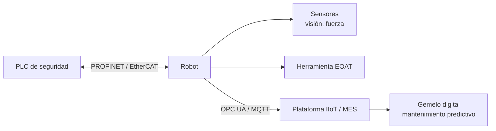

# B04 · RA4 — Análisis de sistemas robotizados

> **3 sesiones presenciales de 2 h + 3 sesiones autónomas de 2 h** (PLAN.md §5): S5 (28/10), S6 (04/11), S7 (09/11). Apuntes reescritos a partir de la UD04 de David Martínez Peña (`material_david/docs/UD04/UD04_ES.md`, CC BY-NC-SA 4.0; capítulo 26 *Robotics* de Russell & Norvig) y actualizados al **estado del arte 2026**: humanoides, *foundation models* para robótica (VLA), ROS 2, Isaac Sim/Lab y sim-to-real.
>
> **Hilo conductor: la célula LARA** — un brazo que recoge tarros de miel de una cinta y los coloca en cajas. Cada sesión añade una capa: mover el brazo → moverlo sin chocar → diseñar la célula completa.

## RA4 y criterios

**RA4** — Analiza sistemas robotizados, evaluando opciones de diseño e implementación.

| CE | Criterio | Sesión |
|---|---|---|
| RA4-a | Recopila los problemas del modelado y control cinemático en robots manipuladores. | S5 |
| RA4-b | Busca soluciones a los problemas de los robots. | S5, S6 |
| RA4-c | Valora las características diferenciadoras de las técnicas de programación de robots. | S6 |
| RA4-d | Evalúa diferentes opciones en el diseño e implementación de sistemas robotizados. | S7 |

## Planificación (6 h presenciales + 6 h autónomas)

| Sesión | Tipo | Contenido | CE |
|---|---|---|---|
| **S5 · 28/10** | Presencial 2 h | El robot, su cinemática y sus problemas: hardware, jerarquía tarea→movimiento→control, DH, FK/IK, singularidades | RA4-a/b |
| **A1 · 02/11** | Autónoma 2 h | Cinemática con `roboticstoolbox-python`: FK/IK de un brazo 3R y del Panda; singularidades | RA4-a/b |
| **S6 · 04/11** | Presencial 2 h | Planificación, percepción y programación: espacio de configuración, RRT, SLAM, sim-to-real, teach pendant→ROS 2 | RA4-b/c |
| **A2 · ~06/11** | Autónoma 2 h | Navegación con `aitk.robots`: seguir una línea con **reglas** y con **lógica difusa** | RA4-c |
| **S7 · 09/11** | Presencial 2 h | Diseño e implementación: selección del robot, célula, seguridad ISO 10218:2025, Industria 4.0 | RA4-d |
| **A3 · ~11/11** | Autónoma 2 h | Proyecto: diseño de la célula LARA (selección, layout, seguridad) | RA4-d |

---

# Sesión 5 · El robot, su cinemática y sus problemas (28/10)

## 5.1 Por qué robótica en 2026

La robótica es el campo de la IA que **cambia el estado del mundo físico**, y sus números no dejan de crecer (IFR *World Robotics* 2025, datos de 2024):

| Dato | Valor |
|---|---|
| Robots industriales instalados en 2024 | **542.000** (4.º año sobre 500.000) |
| Stock operativo mundial | **4,66 millones** (+9 %) |
| País líder en densidad | Corea del Sur (>1.000 robots/10.000 empleados) |
| Mayor instalador | China (54 % de las instalaciones) |
| **España** | **3.er mercado europeo** (5.100 unidades, tirón de la automoción) |
| Robótica médica | **+91 %** (sistema da Vinci como referencia) |

Y lo nuevo de 2025-26: **robots humanoides** (Figure, Tesla Optimus, Unitree, Agility Digit), **AMR** en logística (Amazon Robotics supera el millón de unidades) y **cobots** (Universal Robots, Franka, KUKA LBR) que comparten espacio con personas. Detrás de todo ello, los **modelos fundacionales para robótica** (VLA: *vision-language-action*), la simulación a escala (Isaac Sim/Lab, MuJoCo) y el **sim-to-real**.

!!! note "Qué aporta la IA a la robótica hoy"
    Un robot industrial clásico ejecuta programas fijos y **no necesita IA**. La IA aparece cuando hay que **percibir** (visión para piezas en cualquier orientación), **adaptarse** (entornos cambiantes) o **aprender** (tareas que no se saben programar). Si la pieza llega siempre igual, un programa fijo es la respuesta correcta.

## 5.2 Anatomía de un robot

Un **robot** es una máquina programable que **percibe, procesa y actúa** sobre el entorno físico:



| Bloque | Qué aporta |
|---|---|
| **Sensores** | Del entorno (cámara, lidar, sonar), de ubicación (GPS, balizas) o **propioceptivos** (encoders, giroscopio, fuerza/par) |
| **Actuadores** | Eléctricos (los más comunes), hidráulicos (mucha fuerza) o neumáticos (rápidos y simples) |
| **Efectores** | Ruedas, patas, articulaciones o **pinzas** (EOAT) |

!!! tip "El caso de la bombilla"
    Un brazo de una tonelada enroscando una bombilla no se rompe por ser suave, sino por **medir rápido**: los sensores de **fuerza y par** toman cientos de medidas por segundo y corrigen antes de romper el cristal. Manipular con cuidado = sensar con frecuencia.

## 5.3 La jerarquía tarea → movimiento → control

Entre los píxeles del sensor y «lleva los tarros a la caja» hay un abismo; la robótica lo parte en tres niveles:



- **Tarea:** qué submetas (ir a la cinta, coger tarro, colocarlo).
- **Movimiento:** qué camino sin colisiones une dos configuraciones.
- **Control:** que los actuadores sigan ese camino (P/PD/PID, par calculado).

## 5.4 Modelado: la cadena cinemática

Un manipulador se modela como **eslabones rígidos unidos por articulaciones**:

| Concepto | Definición |
|---|---|
| **Grado de libertad (DoF)** | Movimiento independiente; hacen falta **≥ 6** para pose libre en 3D |
| **Articulación de revolución (R)** | Gira: variable ángulo θ |
| **Articulación prismática (P)** | Se desliza: variable distancia d |
| **Espacio articular** | Vector `q` con la posición de cada articulación |
| **Espacio cartesiano** | Pose del efector: posición + orientación |

Configuraciones típicas: **articulado** (≥3R, el 6-ejes industrial), **cartesiano** (3P), **SCARA** (RRP, montaje) y **delta** (empaquetado rápido).

## 5.5 Cinemática directa (FK) — única y fácil

`pose = f(q)`: de los ángulos a la pose, multiplicando **transformaciones homogéneas** 4×4 descritas con los **parámetros de Denavit-Hartenberg (DH)** (θ, d, a, α por articulación).

**Código verificado** con `roboticstoolbox-python`:

```python
%pip install roboticstoolbox-python spatialmath-python
import numpy as np
import roboticstoolbox as rtb
from roboticstoolbox import DHRobot, RevoluteDH

# Brazo plano 3R (l1 = l2 = l3 = 1) construido con DH
brazo = DHRobot([
    RevoluteDH(a=1.0),
    RevoluteDH(a=1.0),
    RevoluteDH(a=1.0),
], name="Brazo3R")

print(brazo.fkine([0, 0, 0]).t)          # → posición (3, 0)
print(brazo.fkine([np.pi/2, 0, 0]).t)    # → posición (0, 3)

# Puma 560, el brazo clásico, con su tabla DH resuelta
puma = rtb.models.DH.Puma560()
print(puma.fkine([0, 0.2, 0.3, 0.4, 0.5, 0.6]).t)
# → [0.234, -0.15, 1.146]: la pose del efector para esos ángulos
```

La FK **siempre tiene una única solución**: es pura geometría encadenada.

## 5.6 Cinemática inversa (IK) — el problema de verdad

`q = f⁻¹(pose)`: dada la pose deseada, ¿qué ángulos la consiguen? Aquí están casi todos los problemas del RA4-a:

| Problema | En qué consiste | Cómo se aborda |
|---|---|---|
| **Múltiples soluciones** | Un 6R general tiene **hasta 16** (8 con muñeca esférica) | Elegir por criterio: codo arriba/abajo, evitar obstáculos, menor recorrido |
| **Redundancia** | Más DoF de los necesarios → **infinitas** soluciones | Optimizar en el espacio nulo del jacobiano |
| **Sin solución** | El objetivo está fuera del alcance | Detectarlo y avisar, no iterar sin fin |
| **Singularidad** | El jacobiano pierde rango → velocidad articular → ∞ | Evitarla al planificar o cruzarla bajando la velocidad |

```python
robot = rtb.models.Panda()
pose = robot.fkine([0, -0.8, 0.8, 0, 0.8, 0, 0])

sol = robot.ikine_LM(pose)      # Levenberg-Marquardt
print("¿ha convergido?:", sol.success)
print("q:", np.round(sol.q, 3))
# IK numérica: converge… o se queda en un mínimo local cerca de una singularidad
```

!!! important "Qué pasa de verdad en una singularidad"
    No es álgebra abstracta: las velocidades articulares necesarias **tienden a infinito**, así que en la célula se ve **sobrecorriente, vibración o parada de seguridad**. Por eso se evitan al planificar —o se cruzan despacio—.

## 5.7 Control y precisión

- **P** (proporcional), **PD** (amortigua), **PID** (elimina el error persistente) por eje; **par calculado** usa la dinámica inversa y deja al PID solo el error residual.
- Los robots industriales usan **servomotores con encoder** en lazo cerrado: sin realimentación no se sabe si el eje llegó.
- **Precisión ≠ repetibilidad**: un robot puede volver siempre al mismo punto equivocado (repetible pero impreciso). Con *teach pendant* basta la repetibilidad; con **programación offline** hay que calibrar.

**Práctica guiada (en clase).** FK de un brazo 3R a mano (ángulos 0 → (3,0); 90° → (0,3)), FK/IK del Panda y detección de una singularidad en `roboticstoolbox`. Notebook: [sesion05_robot_cinematica.ipynb](sesion05_robot_cinematica.ipynb).

---

# Sesión 6 · Planificación, percepción y programación (04/11)

## 6.1 Planificar el movimiento: el espacio de configuración

En vez de mover el robot por la habitación, se mueve un **punto por el espacio de configuración** (una dimensión por articulación). Los obstáculos se convierten en regiones prohibidas; queda el **espacio libre**, y el problema pasa de geométrico a **búsqueda de camino**:

| Método | Idea | Fuerte en | Flojo en |
|---|---|---|---|
| **Grafo de visibilidad** | Nodos en los vértices de los obstáculos, aristas con línea de visión | Camino **más corto** en 2D | Escala mal; **roza** las esquinas |
| **Diagrama de Voronoi** | Caminos por los bordes entre regiones | Camino **más seguro** | Más largo |
| **Descomposición celular** | Trocea el espacio libre en celdas | Simple y completo | Explota con la dimensión |
| **Muestreo (RRT, PRM)** | Configuraciones al azar conectadas hasta unir inicio y meta | **Lo único práctico con 6-7 ejes** | Sin optimalidad; hay que suavizar |

!!! tip "Plan ≠ política"
    Un **plan** dice qué camino seguir; una **política** dice qué hacer desde cualquier estado. La robótica real planifica en cinemática y convierte el plan en política; el **control óptimo** (LQR/iLQR) optimiza las dos cosas a la vez.

## 6.2 Percepción: localización, mapeo y SLAM

| Problema | Se conoce | Se busca |
|---|---|---|
| **Localización** | El mapa | Dónde está el robot |
| **Mapeo** | Dónde está el robot | El mapa |
| **SLAM** | Nada | **Las dos a la vez** |

SLAM parece un imposible (para saber dónde estás necesitas el mapa y viceversa), pero se resuelve **probabilísticamente**: el robot mantiene una **distribución de probabilidad** sobre su posición (estado de creencia) y la afina con cada medida. Herramientas: **filtros de Kalman**, modelos ocultos de Markov, **filtro de partículas (MCL)** — la creencia como una nube de hipótesis que colapsa a un único sitio con suficientes medidas.

!!! warning "Por qué la odometría no basta"
    Contar vueltas de rueda es barato… durante unos metros: las ruedas **patinan** y el error **se acumula sin límite**. La odometría siempre se combina con sensores inerciales y referencias externas. Es la razón de ser de la localización probabilística.

## 6.3 Incertidumbre, aprendizaje y sim-to-real

El aprendizaje por refuerzo funciona muy bien en simulación y muy mal en el robot real, por dos razones:

- El mundo real **no va más rápido que el tiempo real**: los millones de pruebas de una hora de simulación son **años** en la realidad.
- El robot **no puede arriesgarse** a la prueba que lo dañaría — que es justo la que más enseñaría.

De ahí el problema central de la robótica aprendida: **sim-to-real**. En 2026 se ataca con **datos sintéticos**, **domain randomization**, teleoperación + **aprendizaje por imitación**, y modelos VLA entrenados a escala que ya ejecutan tareas de manipulación nunca vistas.

## 6.4 Programar un robot: cinco técnicas

| Técnica | Cómo funciona | Ventaja | Coste | Cuándo |
|---|---|---|---|---|
| **Teach pendant** | Guías el brazo por los puntos y los grabas | Mínima curva de aprendizaje | **Para la producción** mientras programas | Trayectorias básicas, paletizado |
| **Guiado manual** | Mueves el efector con la mano | Intuitivo, sin código | Solo cobots | Montaje asistido |
| **Textual** (RAPID/KRL/URScript) | Código nativo del fabricante | Determinista, se integra con PLC | Sintaxis propietaria, no portable | Células de alta cadencia |
| **Offline (OLP)** | Programas en simulación sobre CAD | **Cero paro de producción** | Licencias + robot calibrado | Geometrías complejas |
| **ROS 2 + MoveIt 2 / Nav2** | Middleware de nodos y *topics* | Estándar abierto, acceso a la IA | Curva de aprendizaje | Móviles, investigación, multi-robot |

**Estado del arte:** ROS 2 (Jazzy) con MoveIt 2 para manipulación y Nav2 para navegación; simulación con **Isaac Sim/Isaac Lab** (NVIDIA), **MuJoCo** (DeepMind) y Gazebo Harmonic; y **modelos fundacionales** (RT-2, OpenVLA, π0, GR00T) que convierten un prompt o una demo en una política de manipulación.

## 6.5 Cobots y la ISO que cambió en 2025

Los **cobots** comparten espacio con personas gracias a la **limitación de potencia y fuerza** (UR e-Series ±0,03-0,05 mm de repetibilidad, Franka Research 3, KUKA LBR).

!!! important "«Colaborativo» no es una propiedad del hardware"
    La **ISO 10218:2025** prohíbe llamar colaborativo a un brazo aislado: lo que puede ser colaborativa es la **aplicación completa** (robot + herramienta + entorno + tarea). Un cobot con un cuchillo en la pinza no es una aplicación colaborativa. Es el matiz legal que decide si hace falta vallado.

**Práctica guiada (en clase).** Navegación con `aitk.robots`: un Scribbler con cámara sigue una línea usando **reglas** sobre los píxeles (la misma que usará A2 en versión difusa). Notebook: [sesion06_planificacion_percepcion.ipynb](sesion06_planificacion_percepcion.ipynb).

```python
%pip install aitk aitk.robots pillow
import numpy as np
from PIL import Image, ImageDraw
import aitk.robots as bots

# Pista circular dibujada en el propio notebook (autocontenido)
img = Image.new("RGB", (220, 180), "white")
ImageDraw.Draw(img).ellipse([50, 30, 170, 150], outline="black", width=14)
img.save("pista.png")

world = bots.World(220, 180, boundary_wall_color="yellow", ground_image_filename="pista.png")
robot = bots.Scribbler(x=105, y=95, a=90)
robot.add_device(bots.Camera(64, 32))
world.add_robot(robot)

def seguir_por_reglas(robot):
    a = np.asarray(robot["camera"].get_image())
    oscuros = np.where(a.mean(axis=2) < 100)          # píxeles de la línea
    if len(oscuros[0]) == 0:
        robot.move(0.2, 0.3)                          # no ve línea: busca
        return
    desvio = (oscuros[1].mean() / a.shape[1]) - 0.5   # centroide x
    robot.move(0.5, desvio * 1.5)                     # avanza y corrige

world.reset()
world.seconds(8, [seguir_por_reglas], real_time=False)
world.display()   # imagen final; world.watch() para el vídeo
```

---

# Sesión 7 · Diseño e implementación de sistemas robotizados (09/11)

## 7.1 Elegir el robot: la tarea manda

| Criterio | Pregunta guía | Dato típico |
|---|---|---|
| **Payload** | ¿Qué masa mueve el efector **con herramienta** (EOAT)? | UR3e 3 kg … UR16e 16 kg; FANUC hasta 2,3 t |
| **Alcance** | ¿Distancia máxima? | KUKA KR AGILUS 726-1.101 mm; FANUC 4,7 m |
| **Repetibilidad** | ¿Dispersión al volver al mismo punto? | UR e-Series ±0,03-0,05 mm |
| **Precisión** | ¿Coincide el punto con el programado? | Mejora con calibración (ISO 9283) |
| **Entorno** | ¿Temperatura, polvo, ATEX? | Versiones IP / ATEX |

!!! warning "El payload no es el peso de la pieza"
    Es la pieza **más** la herramienta, la brida, los cables y los sensores — y hay que comprobar los **momentos de inercia**: un robot puede aguantar 10 kg pegados a la brida y no 6 kg en el extremo de una herramienta larga.

**Ejemplo guiado (la célula LARA).** Recoger tarros de miel de 0,5 kg de una cinta y colocarlos en una caja a 700 mm, con repetibilidad ±0,1 mm:

1. **Payload:** tarro (0,5) + pinza (0,5) + cables ≈ **1,2 kg** → payload ≥ 2 kg. Un **UR5e** (5 kg, 850 mm) o un KUKA KR AGILUS (6 kg) cumplen.
2. **Repetibilidad:** ±0,1 mm pedida; ambos van sobrados (±0,05 mm). Puntos **enseñados**, no de CAD: no hace falta calibrar.
3. **Singularidades:** se simula la célula y se comprueba que la trayectoria no pasa por codo estirado ni muñeca alineada; si el *layout* obligara a cruzarla, **se cambia el layout**, no el controlador.
4. **Seguridad:** comparte espacio con personas → **aplicación colaborativa** (ISO 10218:2025); si es célula cerrada de alta cadencia → vallado con enclavamientos.

## 7.2 La célula y la Industria 4.0



- El **PLC** coordina la célula con buses deterministas (PROFINET, EtherCAT, EtherNet/IP).
- La telemetría viaja con **OPC UA** o **MQTT** al MES y al **gemelo digital**, que anticipa fallos (fatiga de reductoras) antes de que paren la línea.
- El ciclo de vida: requisitos → selección → simulación → integración → puesta en marcha → mantenimiento predictivo.

## 7.3 Seguridad y normativa (y el AI Act)

| Norma | Qué regula |
|---|---|
| **ISO 12100** | Evaluación de riesgos de máquinas (la base) |
| **ISO 10218-1/-2** | Robots y sistemas robotizados industriales |
| **ISO 10218:2025** | **Versión vigente**: absorbe la ISO/TS 15066 (límites biomecánicos de cobots) y añade **ciberseguridad industrial** |
| **ISO 9283** | Cómo se miden repetibilidad y precisión |

Además, el **AI Act** considera de **alto riesgo** los componentes de seguridad de productos y la maquinaria con IA (Anexo I); una célula con visión y decisión autónoma entra en ese perímetro, con sus obligaciones de documentación y supervisión humana.

## 7.4 Mercado y tendencias (2026)

- **AMR y logística:** Amazon Robotics (>1 M de robots), MiR, Locus; el *pick & place* sigue siendo el 60 % de las ventas de brazos industriales.
- **Humanoides:** primeras implantaciones piloto en logística (Figure, Agility, Unitree); el coste aún supera el de un AMR.
- **Cobots:** segmento de mayor crecimiento; el criterio de compra ya no es «cuántos kilos» sino **facilidad de integrar IA** (visión, OLP, ROS 2).
- **Foundation models:** la promesa de «aprende la tarea viéndome hacerla 20 veces» está en pilotos, no en líneas de producción.
- **Regulación:** ISO 10218:2025 y AI Act obligan a **documentar la aplicación completa** y a evaluar la célula, no solo el robot.

**Proyecto integrador (A3).** Diseñar la célula LARA completa: tarea, selección del robot (payload/alcance/repetibilidad), layout sin singularidades, sensores, seguridad (colaborativa o vallada) y una tabla de decisión final. Se entrega como notebook.

---

## Puntos clave

- Un robot es un **agente encarnado**: el único sistema de IA que cambia el mundo físico, en un entorno **parcialmente observable, estocástico y multiagente**.
- La robótica parte el problema en **tarea → movimiento → control**; cada nivel tiene sus técnicas.
- La **cinemática directa** (DH) es única; la **inversa** tiene hasta **16 soluciones**, redundancia y **singularidades**.
- **Precisión no es repetibilidad**; la odometría se degrada sin límite: siempre hay que corregirla.
- Planificar es buscar camino en el **espacio de configuración**: visibilidad (corto), Voronoi (seguro), **RRT/PRM** (muchas dimensiones).
- **SLAM** mantiene una **distribución de probabilidad** sobre la posición, no una respuesta única.
- El **RL** funciona en simulación y falla en lo real: **sim-to-real** es el problema abierto de la robótica aprendida.
- Hay **cinco formas** de programar un robot; la IA aparece con **visión, adaptación y aprendizaje**.
- «**Colaborativo**» es una propiedad de la **aplicación completa** (ISO 10218:2025), no del hardware.
- Diseñar es **emparejar la tarea con el modelo** (payload, alcance, repetibilidad, seguridad) y **verificarlo en simulación**.

## Glosario

| Término | Definición |
|---|---|
| **Robot** | Máquina programable que percibe, procesa y actúa físicamente |
| **Efector / EOAT** | Pieza que actúa sobre el entorno / herramienta del extremo del brazo |
| **Manipulador / cobot** | Brazo robótico / robot seguro entre personas |
| **DoF** | Grados de libertad; ≥ 6 para pose libre en 3D |
| **Espacio articular / cartesiano** | Vector de articulaciones / pose del efector |
| **DH** | Parámetros de Denavit-Hartenberg (θ, d, a, α) |
| **FK / IK** | Cinemática directa / inversa |
| **Jacobiano** | Relaciona velocidades articulares y cartesianas |
| **Singularidad** | Configuración donde el jacobiano pierde rango |
| **Redundancia** | Más DoF de los necesarios → infinitas soluciones |
| **Precisión / repetibilidad** | Error frente al punto programado / dispersión al repetir |
| **Espacio de configuración / espacio libre** | Todas las configuraciones / las que no colisionan |
| **RRT / PRM** | Planificadores por muestreo aleatorio |
| **Plan / política** | Camino concreto / acción desde cualquier estado |
| **SLAM / MCL** | Localización y mapeo simultáneos / filtro de partículas |
| **Sim-to-real** | Transferir lo aprendido en simulación al robot real |
| **Teach pendant / OLP** | Programación manual por puntos / offline sobre CAD |
| **ROS 2 / MoveIt 2 / Nav2** | Middleware robótico / manipulación / navegación |
| **VLA** | Modelo *vision-language-action* para robótica |
| **Payload** | Carga útil máxima contando herramienta y sensores |
| **Célula robotizada** | Robot + herramientas + PLC + sensores |
| **Gemelo digital** | Réplica virtual alimentada con datos reales |
| **ISO 10218:2025** | Norma vigente de seguridad de robots (absorbe la TS 15066) |

## FAQ

??? question "¿Un robot necesita inteligencia artificial?"
    No siempre. Si la pieza llega siempre al mismo sitio, un programa fijo es la respuesta correcta. La IA aparece con **visión, adaptación o aprendizaje**.

??? question "¿Qué pasa si el robot entra en una singularidad?"
    Las velocidades articulares tienden a infinito: sobrecorriente, vibración o **parada de seguridad**. No «se rompe» sin más, pero el ciclo se cae. Se evita al planificar.

??? question "¿Por qué un 6-ejes llega al mismo punto de varias formas?"
    Porque la **IK tiene múltiples soluciones** (hasta 16). Codo arriba o abajo llegan igual; el controlador elige por criterio (obstáculos, recorrido).

??? question "¿Por qué no resolver la IK probando ángulos al azar?"
    Porque el espacio es continuo y de 6 dimensiones. Los métodos numéricos usan el **jacobiano** para saber en qué dirección mover cada articulación — y aun así pueden quedarse en mínimos locales.

??? question "¿Planificar y controlar es lo mismo?"
    No. **Planificar** es decidir el camino, una vez. **Controlar** es seguirlo corrigiendo miles de veces por segundo. El plan es el dibujo; el control, el movimiento.

??? question "¿Por qué el robot no aprende directamente en el mundo real?"
    Porque el mundo no va más rápido que el tiempo real y el robot **no puede permitirse la prueba que lo dañaría**. De ahí el **sim-to-real**.

??? question "¿Qué lenguaje usan los robots industriales?"
    Propietarios: **RAPID** (ABB), **KRL** (KUKA), **URScript** (Universal Robots, muy parecido a Python). El estándar abierto es **ROS 2** con Python.

??? question "¿Cuándo un cobot no es colaborativo?"
    Cuando la aplicación completa (robot + herramienta + entorno + tarea) no cumple la ISO 10218:2025. Un cobot con una herramienta cortante no es una aplicación colaborativa.

## Evaluación (RA4)

| Peso | Instrumento |
|---|---|
| **40 %** actividades | A1 (cinemática), A2 (navegación reglas/difusa) y A3 (proyecto de diseño de célula), con rúbrica |
| **60 %** prueba escrita | Test y desarrollo sobre RA4 (hardware, FK/IK, singularidades, planificación, SLAM, programación, diseño y normativa) |

La normativa exige **todos los RA** y **≥5 en cada RA** (Orden 8/2025, art. 5.1). Recuperación: repetir el análisis/diseño con un caso distinto (art. 14.4).

## Recursos

- `material_david/docs/UD04/UD04_ES.md` (fuente base, CC BY-NC-SA 4.0; cap. 26 *Robotics* de Russell & Norvig, 4.ª ed.).
- [roboticstoolbox-python](https://petercorke.github.io/robotics-toolbox-python/) · [aitk.robots](https://github.com/ArtificialIntelligenceToolkit/aitk.robots)
- [ROS 2](https://docs.ros.org/) · [MoveIt 2](https://moveit.ai/) · [Isaac Sim/Lab](https://developer.nvidia.com/isaac) · [MuJoCo](https://mujoco.org/)
- [IFR World Robotics](https://ifr.org/) · [ISO 10218:2025](https://www.iso.org/standard/51330.html)
