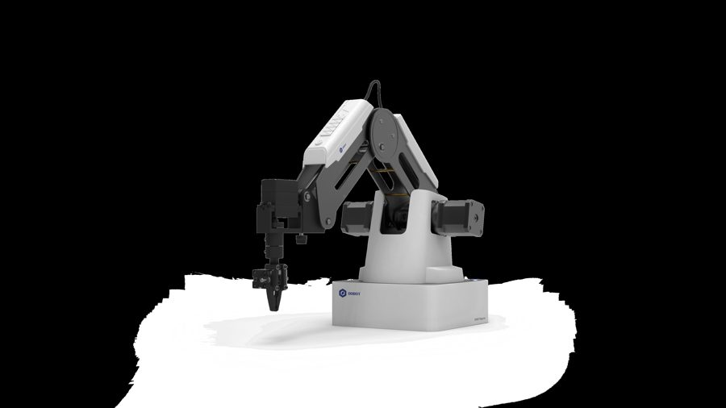
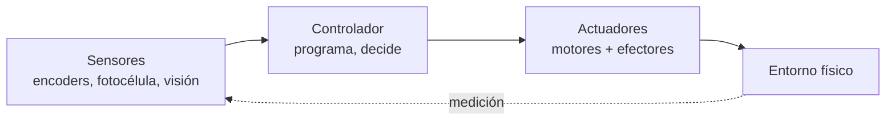
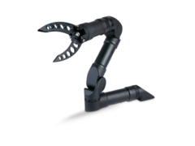
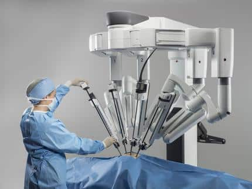
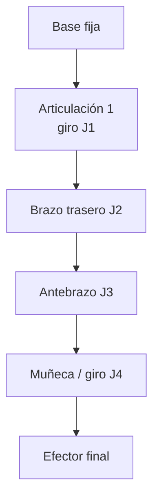
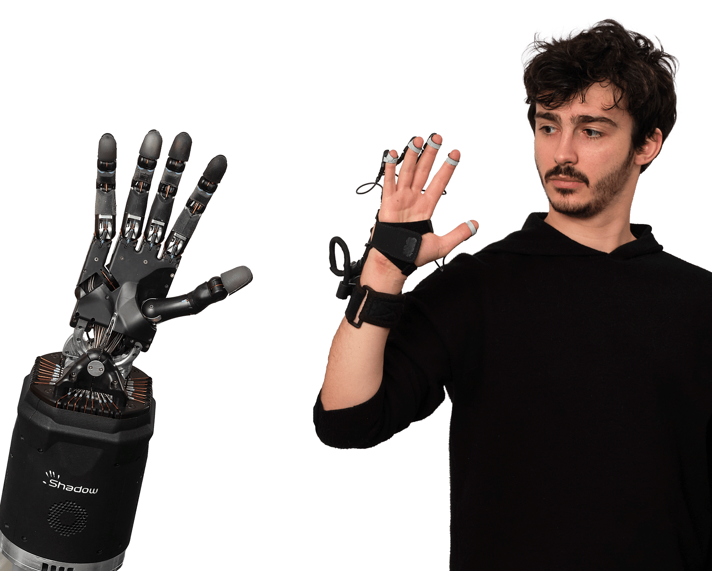
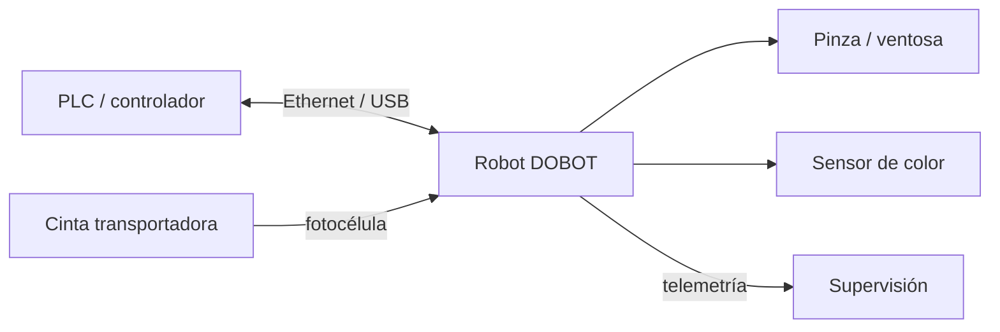
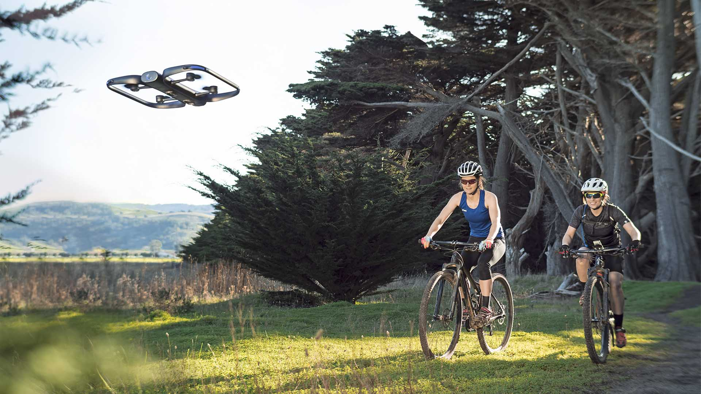

# B04 · RA4 — Análisis de sistemas robotizados

> **UD04 · 12 h** = 3 sesiones presenciales de 2 h (S1, S2, S3) + 3 sesiones autónomas de 2 h (TA1, TA2, TA3).
> **Resultado de aprendizaje RA4:** *Analiza sistemas robotizados, evaluando opciones de diseño e implementación.*
> **Hardware del aula:** un brazo **DOBOT Magician** (4 ejes) + cinta transportadora con fotocélula y sensor de color. Trabajo en 3-4 equipos por turnos.



**Criterios de evaluación y dónde se trabajan:**

| CE | Criterio oficial | Sección | Sesión |
|----|------------------|---------|--------|
| **4a** | Se han recopilado los problemas del modelado y control cinemático en robots manipuladores. | §2–§4 | S1, S2 |
| **4b** | Se han buscado soluciones a los problemas de los robots. | §5, §7, §8 | S2 |
| **4c** | Se han valorado las características diferenciadoras de las técnicas de programación de robots y de sistemas robotizados. | §7 | S1, S2 |
| **4d** | Se han evaluado diferentes opciones en el diseño e implementación de sistemas robotizados. | §6, §9 | S2, S3 |

## 1. Por qué robótica en 2026

La robótica es el campo de la IA que **cambia el estado del mundo físico**. Un clasificador que se equivoca produce una etiqueta errónea; un robot que se equivoca rompe una pieza, daña una máquina o lesiona a una persona. Esa responsabilidad física lo hace distinto de todo lo demás que hemos visto en el módulo.

Los números del sector lo confirman. Según la **IFR (*International Federation of Robotics*), *World Robotics* 2025** (datos de 2024):

| Dato | Valor |
|---|---|
| Robots industriales instalados en 2024 | **542.000** (4.º año por encima de 500.000) |
| Stock operativo mundial | **4,66 millones** (+9 %) |
| País líder en densidad | **Corea del Sur** (>1.000 robots por 10.000 empleados) |
| Mayor instalador | **China** (54 % de las instalaciones del mundo) |
| **España** | **3.er mercado europeo** (~5.100 unidades, tirón de la automoción) |
| Robótica médica | **+91 %**, con el sistema **da Vinci** como referencia |

> **Definición (ISO 8373).** Un **robot industrial** es un manipulador multifuncional, reprogramable y controlado automáticamente, programable en tres o más ejes, que puede estar fijo o móvil, y que se usa en aplicaciones de automatización industrial. Un **robot de servicio** es el que realiza tareas útiles para humanos fuera de la fabricación (logística, salud, agricultura, limpieza).

Un robot es un **agente encarnado**: percibe su entorno, lo procesa y **actúa físicamente** sobre él.



## 2. Tipos de robot y breve historia

**Tipos** (por su mecánica y su relación con las personas):

| Tipo | Qué es | Ejemplo |
|---|---|---|
| **Manipulador / brazo** | Cadena de eslabones que mueve un efector | DOBOT Magician |
| **Móvil** | Se desplaza sobre ruedas o patas | AGV/AMR de almacén |
| **Colaborativo (cobot)** | Comparte espacio con personas con fuerza limitada | DOBOT en modo guiado |
| **Pórtico / cartesiano** | Ejes lineales | Máquina de *pick & place* |
| **Aéreo / submarino** | Drones y vehículos de exploración | Cuadricópteros, AUV |
| **Humanoide** | Forma humana, bipedestación | Figure, Optimus, Unitree |



> **Más información · Historia de la robótica industrial.**
>
> - **1961 — Unimate.** El primer robot industrial entra en la cadena de montaje de General Motors (Ewing, Nueva Jersey) para manipular piezas calientes de fundición. Nace la robótica industrial.
> - **1966 — Shakey.** El primer robot móvil con «inteligencia» (SRI), pionero de la percepción y la planificación.
> - **1978 — PUMA.** Brazo de 6 ejes que se convierte en el estándar de la industria durante dos décadas (el `Puma560` sigue siendo el ejemplo canónico de la cinemática).
> - **2000 — da Vinci.** La cirugía robótica por telemanipulación entra en los quirófanos.
> - **2002 — Roomba.** La robótica de servicio llega a los hogares.
> - **2008 — Cobots.** Universal Robots populariza el robot colaborativo sin vallado.
> - **2012 — Amazon Robotics (Kiva).** Más de un millón de robots de almacén mueven los pedidos del comercio electrónico.
> - **2020s — Humanoides y *foundation models*.** Figure, Tesla Optimus, Unitree y los modelos **VLA** (*vision-language-action*) abren la nueva ola.



## 3. Anatomía de un manipulador

Un manipulador es una **cadena cinemática**: eslabones rígidos unidos por articulaciones.

> **Definición · Grado de libertad (GDL o DoF).** Cada movimiento independiente de una articulación. Hacen falta **al menos 3** para alcanzar cualquier punto del espacio (posición) y **6** para fijar además la orientación. El DOBOT Magician tiene **4** (base, brazo trasero, antebrazo y rotación de muñeca), lo que basta para *pick & place* y dibujo, pero **no** para orientar libremente una herramienta en 3D.

| Concepto | Definición |
|---|---|
| **Eslabón** | Pieza rígida entre dos articulaciones |
| **Articulación de revolución (R)** | Gira: variable ángulo θ |
| **Articulación prismática (P)** | Se desliza: variable distancia d |
| **Espacio articular** | Vector con el valor de cada articulación `[J1, J2, J3, J4]` |
| **Espacio cartesiano** | Pose del efector `[X, Y, Z, RZ]` (posición + giro de muñeca) |



**Configuraciones típicas:** **articulado** (≥3R, el 6-ejes industrial), **cartesiano/pórtico** (3P), **SCARA** (RRP, montaje electrónico) y **delta** (paralelo, empaquetado de alta velocidad).

## 4. Cinemática: el problema de los manipuladores (CE 4a)

### 4.1 Cinemática directa (FK)

La **cinemática directa** calcula la **pose del efector** a partir de los valores de las articulaciones: `pose = f(q)`. Siempre tiene **una única solución** y es pura geometría.

> **Ejemplo · Brazo plano 2R resoluble a mano.** Dos eslabones de longitud `l₁ = 150 mm` y `l₂ = 120 mm`, con ángulos `θ₁` y `θ₂`. La punta está en:
> $$x = l_1\cos\theta_1 + l_2\cos(\theta_1+\theta_2)$$
> $$y = l_1\sin\theta_1 + l_2\sin(\theta_1+\theta_2)$$
> Con `θ₁ = 0°`, `θ₂ = 0°`: `x = 270 mm`, `y = 0 mm`. Con `θ₁ = 90°`, `θ₂ = 0°`: `x = 0`, `y = 270 mm`. Ese punto (270 mm) está **dentro** del alcance de 320 mm del DOBOT.

En un robot real, la FK se resuelve encadenando **matrices de transformación homogénea** descritas con los **parámetros de Denavit-Hartenberg (DH)** (θ, d, a, α por articulación). Es el método estándar de la industria.

### 4.2 Cinemática inversa (IK)

La **cinemática inversa** va al revés: dada la pose deseada, calcula los ángulos `q = f⁻¹(pose)`. Es **el problema difícil** y la raíz de casi todos los fallos de un manipulador:

| Problema | En qué consiste | Consecuencia práctica |
|---|---|---|
| **Múltiples soluciones** | Un mismo punto se alcanza con «codo arriba» o «codo abajo» | Dos scripts distintos dibujan el mismo punto |
| **Singularidad** | El jacobiano pierde rango: la velocidad articular tiende a infinito | Vibración, sobrecorriente o parada de seguridad |
| **Fuera de alcance** | El objetivo está más allá de 320 mm | El robot no llega: hay que rediseñar la célula |
| **Límites articulares** | Cada eje tiene un rango válido | Movimiento imposible aunque el punto sea alcanzable |

> **Más información.** En un brazo de 6 ejes la IK puede tener **hasta 16 soluciones**; el DOBOT, con 4 ejes, tiene menos margen y por eso su **espacio de trabajo** es un casquete cilíndrico en torno a su base. Programar «a ciegas» sin comprobar el alcance es la primera causa de error en el aula. Lo practicas en el cuaderno [UD04_cinematica.ipynb](colab/UD04_cinematica.ipynb).

### 4.3 Control

Los ejes se mueven con **servomotores con encoder** en lazo cerrado. El control clásico por eje es **P → PD → PID**; los robots industriales añaden **par calculado** (dinámica inversa). En el DOBOT, la velocidad y la aceleración de cada tramo se fijan con parámetros (`SetPTPJointParams`, `SetPTPCoordinateParams`).

> **Definición · Repetibilidad vs. precisión.** La **repetibilidad** es la dispersión al volver al mismo punto programado (**±0,2 mm** en el DOBOT); la **precisión** es si ese punto coincide con el que se quería alcanzar. Un robot puede ser muy repetible y a la vez impreciso. Con *teach pendant* basta la repetibilidad; con programación **offline** (coordenadas de CAD) la precisión es crítica.

## 5. Actuadores, sensores y efectores finales

**Actuadores:**

| Tipo | Cómo funciona | Dónde |
|---|---|---|
| **Eléctrico** | Motor que gira | Articulaciones (el del DOBOT) |
| **Neumático** | Aire comprimido | Pinza y ventosa |
| **Hidráulico** | Fluido a presión | Maquinaria pesada |

**Sensores:** los **propioceptivos** informan del propio robot (**encoders** de eje, finales de carrera) y los **exteroceptivos** del entorno (**fotocélula**, **sensor de color**, **visión**). El DOBOT usa encoders internos y, con el kit de cinta, una fotocélula y un sensor de color.


> **Definición · Efector final (EOAT, *end of arm tooling*).** La herramienta del extremo del brazo. El DOBOT Magician los tiene intercambiables:

| Efector | Para qué | Dato |
|---|---|---|
| **Portaminas / rotulador** | Dibujar y escribir | Ø 10 mm |
| **Pinza neumática** | Coger objetos rígidos | recorrido 27,5 mm, fuerza 8 N |
| **Ventosa** | Coger objetos planos/lisos | Ø 20 mm, −35 kPa |
| **Impresión 3D / láser** | Mención (no se usan en clase) | — |



> **Ejemplo · El caso de la ventosa.** Una ventosa no «agarra»: **aspira**. Con −35 kPa y Ø 20 mm, la fuerza teórica de sujeción es `F = P · A ≈ 35000 Pa × π·(0,01 m)² ≈ 11 N`, suficiente para un cubo ligero pero **no** para una pieza pesada o porosa. Elegir efector es parte del diseño. Una **mano antropomórfica** puede tener 20 actuadores y mucha más destreza, pero **controlarla es mucho más difícil**: más grados de libertad = más que decidir.

## 6. El sistema robotizado: robot + controlador + entorno (CE 4d)

Un **sistema robotizado** no es solo el brazo: es la **célula** completa.



| Elemento | Función |
|---|---|
| **Robot + controlador** | Ejecuta el programa y gobierna los ejes |
| **Entorno** | Cinta, sensor de presencia, sensor de color, mesa de trabajo |
| **PLC / comunicaciones** | Coordina robot y periféricos (en el DOBOT, por su API) |
| **Seguridad** | Paradas, límites de movimiento, no invadir la trayectoria |

**Aplicaciones típicas** (las que se practican en el aula): **pick & place**, **paletizado** (dejar piezas en filas y capas), **clasificación por color** y **dibujo/escritura** con portaminas.

> **Más información · Diseño centrado en la tarea.** En la industria, la célula se diseña **empezando por la tarea**: qué pieza, qué peso, qué cadencia, qué precisión y qué entorno. Después se elige robot (carga útil, alcance, repetibilidad) y efector. El DOBOT tiene **500 g de carga útil**, **320 mm de alcance** y **±0,2 mm de repetibilidad**: suficiente para piezas ligeras y trabajos de precisión de laboratorio, no para piezas de varios kilos.


## 7. Técnicas de programación de robots (CE 4c)

> **Definición.** Programar un robot es decirle **qué trayectoria** seguir y **cuándo** actuar sobre el efector. Hay varias técnicas, y cada una cambia quién escribe el movimiento y cuánto se tarda.

| Técnica | Cómo funciona | Ventaja | Inconveniente | Cuándo |
|---|---|---|---|---|
| **Guiado / teach pendant** | Mueves el brazo a mano o con la botonera y grabas puntos | Rapidísima, sin código | Poco flexible; el robot está parado | Trayectorias simples, puntos de paso |
| **Programación por bloques (Blockly)** | Encajas bloques de movimiento | Muy visual, ideal para aprender | Limitada (p. ej. sin arcos) | Docencia, prototipos |
| **Programación textual (Python + API)** | Escribes el script con `pydobot`/`dType` | Repetible, parametrizable, versionable | Requiere saber programar | Aula y producción real |
| **Online** | Se ejecuta sobre el robot conectado | Feedback inmediato | Ocupa el robot mientras programas | Puesta a punto |
| **Offline** | Se escribe y **valida sin el robot** | **Cero paro**; varios equipos a la vez | Exige comprobar límites por software | Nuestro caso: un solo brazo |

> **Ejemplo · Nuestro flujo (offline con validación).** Con **un solo brazo** para todo el grupo: cada equipo escribe y **comprueba** su script en un cuaderno Colab (sintaxis, número de parámetros, rangos, límites del espacio de trabajo) → lo entrega → el docente lo carga y lo ejecuta en el brazo → si falla, se depura en directo. Es el ciclo real **programo → compruebo → envío → miro qué sale**.

> **Más información.** Los robots industriales usan lenguajes propietarios: **RAPID** (ABB), **KRL** (KUKA) y **URScript** (Universal Robots, muy parecido a Python). El estándar abierto es **ROS 2**, con **MoveIt 2** para manipulación y **Nav2** para navegación. En simulación se usan **NVIDIA Isaac Sim/Isaac Lab**, **MuJoCo** (DeepMind) y **Gazebo**.

## 8. El DOBOT Magician y su API

| Especificación | Valor |
|---|---|
| Ejes | **4** (base, brazo trasero, antebrazo, muñeca) |
| Carga útil | **500 g** |
| Alcance | **320 mm** |
| Repetibilidad | **±0,2 mm** |
| Comunicación | USB / Wi-Fi / Bluetooth |
| Alimentación | 12 V CC |
| Accesorio | Cinta transportadora con fotocélula y sensor de color |

**Dos formas de programarlo:**

1. **DobotStudio / DobotLab** (interfaz gráfica): teach, Blockly y editor de script.
2. **Python** con la API oficial (`dType`) o la librería **`pydobot`** (más cómoda).

> **Definición · Comandos inmediatos vs. encolados.** La API permite ejecutar una orden **ya** (inmediata) o **encolarla** en una cola FIFO (`isQueued=1`). Encolar es lo que permite **construir una secuencia de movimiento** sin esperar: el robot la ejecuta en orden. Es la diferencia entre **teleoperar** (orden a orden) y **programar** (una secuencia completa). Para sincronizar, se puede consultar la pose con `GetPose` hasta que el robot llegue al punto.

```python
# API oficial (dType) — movimiento cartesiano lineal a un punto
dType.SetPTPCoordinateParams(api, 150, 500, 150, 500, isQueued=0)  # vel, ac
dType.SetPTPCmd(api, 2, x, y, z, r, isQueued=1)                    # modo 2 = lineal
dType.SetWAITCmd(api, 500, isQueued=1)                             # esperar 0,5 s
```

```python
# pydobot — misma idea, API de alto nivel
from pydobot import Dobot
robot = Dobot(port="/dev/ttyUSB0")
robot.move_to(250, 0, 50, 0)     # x, y, z, r
robot.gripper(close=False)        # abrir pinza (ventosa: robot.suck(True))
robot.wait(500)
robot.home()
robot.close()
```

> **Más información.** En el cuaderno Colab usamos una clase **`BrazoSimulado`** que imita esta API: registra las órdenes, **valida rangos** (X entre 150 y 320 mm, radio ≤ 320 mm, Z dentro de límites) y **dibuja la trayectoria XY** con matplotlib. Así el equipo **verifica su dibujo antes de enviarlo al robot real**, sin hardware y sin instalar simuladores 3D.

## 9. Aplicaciones actuales y tendencias (2026)

| Ámbito | Ejemplo | Qué aporta |
|---|---|---|
| **Industria** | Soldadura, paletizado, *pick & place*, control de calidad | Cadencia y precisión constantes |
| **Salud** | Cirugía por telemanipulación (da Vinci), rehabilitación | Precisión milimétrica, menos invasión |
| **Logística** | AMR de almacén (Amazon Robotics, MiR) | Menos tiempo de desplazamiento |
| **Agricultura** | Drones de monitorización y riego de precisión | Menos coste e impacto ambiental |
| **Exploración** | Rovers y drones (Marte, inspección de infraestructuras) | Acceso a entornos peligrosos |



**Tendencias 2026:**

- **Cobots** en crecimiento: el criterio de compra ya no es solo «cuántos kilos», sino **facilidad para integrar visión y ROS 2**.
- **Humanoides** en pilotos de logística (Figure, Agility, Unitree); aún caros frente a un AMR.
- ***Foundation models* para robótica (VLA):** modelos como RT-2, OpenVLA, π0 o GR00T prometen «aprende la tarea viéndome hacerla», pero están en fase de investigación.
- **Sim-to-real:** entrenar en simulación (Isaac Lab, MuJoCo) y transferir al robot real, con datos sintéticos y *domain randomization*.
- **Seguridad y normativa:** la **ISO 10218:2025** absorbe los límites biomecánicos de la ISO/TS 15066 y añade ciberseguridad industrial; el **AI Act** clasifica como **alto riesgo** los componentes de seguridad y la maquinaria con IA.

> **Más información.** Para el montaje de una célula real se usan buses deterministas (**PROFINET**, **EtherCAT**) entre PLC y robot, y **OPC UA** o **MQTT** para publicar telemetría al MES y al **gemelo digital**, que anticipa fallos (fatiga de reductoras) antes de que paren la línea.

## 10. Buenas prácticas y seguridad en el aula

Trabajar con un robot real exige un protocolo. No es burocracia: es lo que evita dañar el brazo, la pieza o a un compañero.

- **Antes de ejecutar:** hacer **home**, comprobar que la trayectoria está libre y que **nadie tiene la mano** en el espacio de trabajo.
- **Velocidad reducida** en los primeros ensayos; subirla solo cuando el movimiento es correcto.
- **Sujetar** la mesa y la pieza; una pieza que se mueve arruina la repetibilidad.
- **No forzar los ejes a mano** salvo en modo **teach** con el robot habilitado.
- **Validar siempre en Colab** con `BrazoSimulado` antes de cargar el script: el 90 % de los errores (parámetros, rangos, fuera de alcance) se detectan sin tocar el robot.
- **Un solo equipo frente al brazo**; el resto trabaja a distancia. Turnos de 10-15 minutos.
- **Protocolo de entrega:** asunto normalizado (`UD04-S2-EQUIPO3-reto_dibujo`), `.ipynb` con celdas ejecutadas.

> **Más información.** Este protocolo conecta con la idea de **sistema robotizado** del §6: la seguridad no es una propiedad del brazo, sino del **conjunto** robot + herramienta + entorno + tarea. Es el mismo principio que recoge la ISO 10218:2025 para las aplicaciones colaborativas.

## 11. Preguntas frecuentes (FAQ)

??? question "¿Puedo programar el robot sin tenerlo delante?"
    Sí. Es la base de nuestro flujo: se escribe el script, se **valida con `BrazoSimulado`** (rangos, parámetros, trayectoria) y después el docente lo ejecuta en el brazo. Es programación **offline**.

??? question "¿Por qué no usamos un simulador 3D como Webots o CoppeliaSim?"
    Porque instalarlo y configurarlo genera demasiada fricción para el tiempo disponible. `BrazoSimulado` cubre lo esencial —validar límites y ver la trayectoria XY— dentro del propio cuaderno, sin instalar nada.

??? question "¿Qué pasa si mi script pide un punto fuera del alcance?"
    `BrazoSimulado` lanza un `ValueError` **antes** de ejecutar (p. ej. radio > 320 mm o X fuera de [150, 320]). En el robot real, el movimiento no se ejecutaría o daría error: mejor detectarlo en el cuaderno.

??? question "¿Uso MoveJ o MoveL?"
    **MoveJ** (articular) es más rápido y suave, pero la trayectoria no es recta. **MoveL** (lineal) garantiza una recta, útil al acercar una herramienta, pero puede acercarse a una singularidad. Para dibujar, MoveL da trazos rectos; para reposicionar, MoveJ.

??? question "¿Cuánto tarda un ciclo de pick & place?"
    Depende de las velocidades/aceleraciones y de los puntos de paso. Se mide con el cronómetro en la puesta a punto y se compara entre equipos (CE 4d).

??? question "¿Puedo usar la ventosa con cualquier objeto?"
    No. La ventosa aspira: necesita una superficie **lisa y no porosa**. Con una pieza rugosa pierde vacío y se cae. Para esas piezas, pinza.

??? question "¿Qué diferencia hay entre el DOBOT y un robot industrial de 6 ejes?"
    El DOBOT tiene **4 ejes**, 500 g de carga y 320 mm de alcance: es de laboratorio. Un 6-ejes industrial tiene 6 GDL (pose libre en 3D), cargas de decenas o cientos de kilos y repetibilidad de centésimas de milímetro. La **arquitectura** (cadena cinemática + controlador + programa) es la misma; cambian las prestaciones.

## 12. Autoevaluación

<details>
<summary>1. ¿Cuántos grados de libertad tiene el DOBOT Magician y para qué alcanzan?</summary>

Cuatro (base, brazo trasero, antebrazo y muñeca). Alcanzan para pick & place y dibujo, pero **no** para orientar libremente una herramienta en 3D (harían falta 6).
</details>

<details>
<summary>2. ¿Por qué la cinemática directa es «fácil» y la inversa «difícil»?</summary>

La directa es geometría encadenada y tiene **solución única**; la inversa puede tener **varias soluciones**, atravesar **singularidades** o no tener solución (fuera de alcance).
</details>

<details>
<summary>3. ¿Qué diferencia hay entre espacio articular y cartesiano?</summary>

El **articular** da el valor de cada eje `[J1..J4]`; el **cartesiano** da la pose del efector `[X, Y, Z, RZ]`. Un mismo punto cartesiano puede lograrse con distintas configuraciones articulares.
</details>

<details>
<summary>4. ¿Qué es una singularidad y qué se ve en la célula?</summary>

Configuración en la que el jacobiano pierde rango: la velocidad articular tiende a infinito. En la práctica se ve **vibración, sobrecorriente o parada de seguridad**.
</details>

<details>
<summary>5. Empareja efector y tarea: pinza, ventosa, portaminas.</summary>

**Pinza** → objetos rígidos (cubos); **ventosa** → objetos planos y lisos; **portaminas** → dibujar/escribir.
</details>

<details>
<summary>6. ¿Qué significa que un comando esté «encolado» (`isQueued=1`)?</summary>

Que se añade a una **cola FIFO** y el robot lo ejecutará en orden. Permite construir una **secuencia** de movimiento sin esperar a cada orden; es la base de la programación frente a la teleoperación.
</details>

<details>
<summary>7. ¿Por qué usamos programación offline si tenemos el robot delante?</summary>

Porque hay **un solo brazo** para todo el grupo: los equipos escriben y **validan sin el robot** (Colab + `BrazoSimulado`) y el docente ejecuta por turnos. Reduce el paro del robot y permite trabajar a varios equipos a la vez.
</details>

<details>
<summary>8. ¿Qué diferencia hay entre MoveJ y MoveL?</summary>

**MoveJ** interpola en el **espacio articular** (movimiento curvo, más rápido, no garantiza trayectoria recta); **MoveL** mueve la herramienta en **línea recta** (más preciso, pero puede acercarse a singularidades).
</details>

<details>
<summary>9. ¿Qué mide la repetibilidad y en qué se diferencia de la precisión?</summary>

La **repetibilidad** es la dispersión al volver al mismo punto programado (±0,2 mm en el DOBOT); la **precisión** es si ese punto coincide con el que se quería alcanzar. Un robot puede ser repetible pero impreciso.
</details>

<details>
<summary>10. ¿Qué comprueba el `BrazoSimulado` antes de enviar el script al robot?</summary>

El **número y tipo de parámetros**, los **rangos** (X entre 150 y 320 mm, radio ≤ 320 mm, Z dentro de límites) y dibuja la **trayectoria XY** para que el equipo vea si su dibujo tiene sentido.
</details>

## 13. Recursos, vídeos y fuentes

**Materiales del módulo (David Martínez):**

- [UD04 · Análisis de sistemas robotizados](https://martinezpenya.es/ModelosIA/UD04/UD04_ES.html)
- [N04 · Cinemática de un manipulador](https://martinezpenya.es/ModelosIA/UD04/notebooks/UD04_N04_cinematica_manipulador.html)
- [N11 · Diseño de un sistema robotizado](https://martinezpenya.es/ModelosIA/UD04/notebooks/UD04_N11_diseno_sistema_robotizado.html)

**Vídeos (YouTube):**

- [Robots industriales y brazos manipuladores](https://www.youtube.com/results?search_query=robot+industrial+brazo+manipulador)
- [DOBOT Magician: pick & place con cinta](https://www.youtube.com/results?search_query=dobot+magician+conveyor+pick+and+place)
- [Cinemática directa e inversa de un brazo](https://www.youtube.com/results?search_query=cinematica+directa+inversa+robot+brazo)
- [Boston Dynamics: robots móviles y humanoides](https://www.youtube.com/results?search_query=boston+dynamics+atlas)
- [ROS 2 y MoveIt en manipulación](https://www.youtube.com/results?search_query=ros2+moveit+manipulation)

**Fuentes y organismos:**

- [IFR · *World Robotics*](https://ifr.org/) — estadísticas oficiales del sector.
- [ISO 8373 · Robots y componentes robóticos (vocabulario)](https://www.iso.org/standard/55890.html).
- [ISO 10218:2025 · Seguridad de robots industriales](https://www.iso.org/standard/51330.html).
- [NVIDIA Isaac Sim/Lab](https://developer.nvidia.com/isaac)
- [MuJoCo](https://mujoco.org/)
- [ROS 2](https://docs.ros.org/).
- [DOBOT · documentación oficial](https://www.dobot.cc/)
- [pydobot](https://github.com/luismesas/pydobot).

> Créditos de imágenes: foto del DOBOT del kit del aula (INDALevante); ilustraciones de robótica adaptadas de los materiales de la UD04 de David Martínez Peña (CC BY-NC-SA 4.0).

## Cobertura de criterios

| CE | Dónde se evidencia |
|----|--------------------|
| **4a** | §2–§4 (anatomía, cinemática, singularidades) + Actividad 1 (cinemática) |
| **4b** | §5, §7, §8 (soluciones: efectores, validación offline, depuración) + Actividades 2 y 3 |
| **4c** | §7 (tabla comparativa de técnicas) + guiado vs. código en la sesión 2 |
| **4d** | §6 y §9 (diseño de la célula) + Actividad 3 (pick & place) y memoria |
