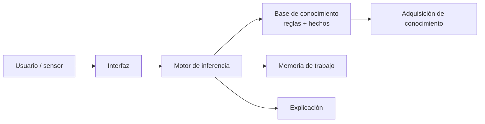

# B05 · RA5 — Sistemas expertos y motores de reglas

> **3 sesiones de 2 h** (PLAN.md §5): **S2 (19/10)** sistemas expertos · **S3 (21/10)** motores de reglas · **S4 (26/10)** motores de reglas 2. Reescrito a partir de la UD05 de David Martínez Peña (CC BY-NC-SA 4.0) con **foco en el mercado actual**: BRMS, DMN, GoRules ZEN, `rule-engine`, `clipspy`, reglas extraídas de datos y guardarraíles de LLM.
>
> **Hilo conductor único: Pagarium**, una pasarela de pagos que decide sobre transacciones. Cada sesión añade una capa sobre el mismo dominio.

## RA5 y criterios

**RA5** — Aplica sistemas expertos evaluando la influencia de los controladores inteligentes en el comportamiento del sistema.

| CE | Criterio | Sesión |
|---|---|---|
| RA5-a | Describe la dinámica y las estructuras elementales de los sistemas expertos. | S2 |
| RA5-b | Determina destrezas para representar y simular comportamientos básicos de muy diversos ámbitos. | S2, S3, S4 |
| RA5-c | Razona cómo influye la variación de las características en la dinámica. | S2 |
| RA5-d | Desarrolla estrategias de control definiendo objetivos y especificaciones. | S4 |
| RA5-e | Relaciona los controladores inteligentes con el comportamiento del sistema. | S4 |

!!! note "Alcance de estas 3 sesiones"
    El foco es **sistemas expertos y motores de reglas** con uso real en 2026. La **lógica difusa** y el **control PID/inteligente** de la UD05 de David se ven en otro bloque; aquí solo se mencionan como tendencia.

## Planificación

| Sesión | Fecha | Contenido | CE |
|---|---|---|---|
| **S2** | 2026-10-19 | Por qué reglas en 2026, anatomía, ciclo reconocer-actuar, micro-motor propio, `experta`, RETE/PHREAK, sensibilidad, `clipspy` | RA5-a/c |
| **S3** | 2026-10-21 | Decision management, tablas de decisión y *hit policy*, DMN, GoRules ZEN, `rule-engine`, verificador de cobertura, benchmark | RA5-b |
| **S4** | 2026-10-26 | Reglas extraídas de datos (FIGS), guardarraíles de agentes LLM, neuro-simbólico, AI Act, proyecto integrador Pagarium | RA5-b/d/e |

---

# Sesión 2 · Sistemas expertos (19/10/2026)

## 2.1 Por qué reglas en 2026

La IA generativa no ha enterrado las reglas: las ha **revalorizado**. En un sistema con LLM, las reglas son la capa que:

- **decide con precisión** lo que el modelo solo estima (importes, límites, elegibilidad);
- **explica** cada decisión (auditoría, compliance);
- **acota** al modelo (guardarraíl) para que no ejecute acciones fuera de rango.

Sectores donde las reglas siguen en producción: **banca y seguros** (scoring, AML, *underwriting*), **salud** (alertas, dosificación), **industria** (diagnóstico, control), **telecom** (averías), **cloud** (autorización) y **legal** (compliance).

## 2.2 Anatomía de un sistema experto



| Componente | Función |
|---|---|
| **Base de conocimiento** | Reglas y hechos del dominio |
| **Memoria de trabajo** | Hechos actuales y deducidos |
| **Motor de inferencia** | Ciclo **reconocer → resolver → actuar** |
| **Explicación** | Justifica el «por qué» y el «cómo» (su gran ventaja) |
| **Adquisición** | Capturar el conocimiento del experto (el *bottleneck*) |

## 2.3 Un micro-motor propio en 35 líneas (y su fallo didáctico)

Un motor de reglas es, en esencia, un bucle *match-resolve-act*. Este motor de Pagarium **no resuelve conflictos a propósito**: dispara **todas** las reglas que encajan, y eso produce **dos decisiones contradictorias** sobre el mismo pago. Es el mejor momento didáctico de la unidad.

```python
class MicroMotor:
    def __init__(self):
        self.hechos, self.reglas, self.traza = {}, [], []

    def hecho(self, **h):
        self.hechos.update(h)

    def regla(self, nombre, prioridad, condicion, accion):
        self.reglas.append((nombre, prioridad, condicion, accion))

    def run(self):
        pendientes = True
        while pendientes:
            pendientes = False
            for nombre, prioridad, condicion, accion in self.reglas:
                if nombre in self.traza:
                    continue
                if condicion(self.hechos):          # match
                    self.traza.append(nombre)        # (sin resolve)
                    accion(self.hechos)              # act
                    pendientes = True
        return self.hechos

motor = MicroMotor()
motor.hecho(importe=200, antiguedad_meses=10, n_intentos=5)
motor.regla("aprobar_pequena", 10, lambda h: h["importe"] < 500,
            lambda h: h.update(decision="aprobar"))
motor.regla("rechazar_reintentos", 10, lambda h: h["n_intentos"] >= 4,
            lambda h: h.update(decision="rechazar"))

print(motor.run())
# -> {'importe': 200, ..., 'decision': 'rechazar'}  ¡y antes pasó por 'aprobar'!
print(motor.traza)
# -> ['aprobar_pequena', 'rechazar_reintentos']
```

!!! warning "El bug que enseña"
    El motor dedujo **aprobar** y luego **rechazar** para el mismo pago. Es la puerta al **razonamiento no monótono** (una conclusión invalida otra) y a la **estratificación por `salience`**: sin resolución de conflictos, el resultado depende del orden de las reglas. Un motor de producción resuelve esto con prioridades o con estratos.

## 2.4 Encadenamiento y sensibilidad

- **Forward (data-driven):** de los hechos a las conclusiones → control, monitorización.
- **Backward (goal-driven):** de la meta a los hechos → diagnóstico.
- **`salience`/prioridad:** decide qué regla gana cuando varias encajan.
- **Sensibilidad y umbrales:** variar un umbral cambia la dinámica (más falsos positivos o alertas ignoradas). El ruido en un sensor con umbral justo provoca conmutación constante (**histéresis** como remedio).

**Factores de certeza (MYCIN):** cuando el conocimiento es parcial, cada regla lleva un CF y la evidencia se acumula (p. ej. fiebre CF 0,6 + rigidez de nuca CF 0,4).

## 2.5 `experta` con parche (docencia, no producción)

`experta` (2019, sin mantenimiento) es ideal para **entender** el ciclo de inferencia. En Python 3.10+ necesita el parche de `collections.Mapping`:

```python
%pip install experta

import collections, collections.abc
if not hasattr(collections, "Mapping"):
    collections.Mapping = collections.abc.Mapping
    collections.Iterable = collections.abc.Iterable
    collections.MutableMapping = collections.abc.MutableMapping

from experta import *

class Pagarium(KnowledgeEngine):
    @DefFacts()
    def inicio(self):
        yield Fact(accion="evaluar")

    @Rule(Fact(accion="evaluar"), Fact(importe=P(lambda i: i < 500)),
          Fact(n_intentos=P(lambda n: n < 4)), salience=20)
    def aprobar(self):
        self.declare(Fact(decision="aprobar"))

    @Rule(Fact(n_intentos=P(lambda n: n >= 4)), salience=30)
    def rechazar(self):
        self.declare(Fact(decision="rechazar"))

motor = Pagarium(); motor.reset()
motor.declare(Fact(importe=200, n_intentos=5))
motor.run()
print([dict(f) for f in motor.facts.values() if "decision" in f])
```

!!! warning "Trampa con `experta`"
    Compara por **igualdad**: `Fact(error=lambda e: e > 3)` nunca coincide. Las condiciones van dentro de `P(...)`. Y **no uses `self` dentro de `P(...)`**: el decorador se evalúa al definir la clase.

## 2.6 RETE y PHREAK

El ciclo *match* ingenuo compara todas las reglas con todos los hechos (lento). Los motores de producción usan el algoritmo **RETE** (red de nodos que reutiliza coincidencias) y su evolución **PHREAK** (Drools), que escala mejor con miles de reglas. Por eso un motor industrial rinde donde un `for` no.

## 2.7 `clipspy`: CLIPS 6.4 para producción

`clipspy` es el binding Python de **CLIPS 6.4**, mantenido. Es la opción que llevarías a producción en un sistema clásico basado en reglas:

```python
%pip install clipspy
import clips

env = clips.Environment()
env.build("""
(defrule aprobar
  (importe ?i&:(< ?i 500))
  (n_intentos ?n&:(< ?n 4))
  =>
  (assert (decision aprobar)))
(defrule rechazar
  (declare (salience 30))
  (n_intentos ?n&:(>= ?n 4))
  =>
  (assert (decision rechazar)))
""")
env.assert_string("(importe 200)")
env.assert_string("(n_intentos 5)")
env.run()
print([str(f) for f in env.facts()])
# -> ['(importe 200)', '(n_intentos 5)', '(decision rechazar)']
```

**Actividad A1 (1,5 h).** Extiende el micro-motor de Pagarium con `salience` para que gane la regla más prioritaria y comprueba que desaparece la contradicción. Después reescribe las mismas dos reglas en `experta` y en CLIPS (`clipspy`) y compara la traza.

---

# Sesión 3 · Motores de reglas (21/10/2026)

## 3.1 Decision management

**Decision management** es tratar las reglas como un **activo de negocio** gestionable por el área que las posee, no como código disperso. Un **BRMS** (*Business Rule Management System*) permite versionar, probar y desplegar reglas sin tocar la aplicación. Herramientas: **Drools/Apache KIE**, **IBM ODM**, **FICO Blaze**, **SAP BRF+**.

## 3.2 Tablas de decisión y *hit policy*

Una **tabla de decisión** cruza condiciones con acciones. La **hit policy** define qué hacer cuando varias filas encajan:

| Hit policy | Significado |
|---|---|
| **First** | Gana la primera fila que encaja |
| **Unique** | Solo una puede encajar (si no, error de cobertura) |
| **Priority** | Gana la de mayor prioridad |
| **Collect** | Devuelve todas las que encajan (suma, mínimo, lista…) |

La *hit policy* es la respuesta formal al **fallo didáctico** del micro-motor del §2.3.

## 3.3 DMN (Decision Model and Notation)

**DMN** (OMG) es el estándar para expresar decisiones como tablas legibles por negocio. Ejemplo para Pagarium:

| Importe | Antigüedad (meses) | Intentos | Decisión |
|---|---|---|---|
| `< 500` | `>= 6` | `< 4` | Aprobar |
| `< 500` | `>= 6` | `>= 4` | Revisar |
| `>= 500` | — | — | Revisar |
| — | `< 6` | — | Rechazar |

La misma tabla se despliega en Drools (KIE) o en GoRules ZEN sin reescribir la lógica.

## 3.4 GoRules ZEN: el motor que se usa hoy

**GoRules ZEN** es un motor de decisiones open-source, rápido y embebible, muy usado en **fintech** (pagos, KYC, scoring). Define el grafo de decisión en formato **JDM** (JSON Decision Model), normalmente dibujado en su editor web, y se ejecuta desde Python, Node, Rust o Go.

```python
%pip install zen-engine
import json
from zen import ZenEngine

# El grafo JDM suele exportarse del editor de GoRules. Estructura mínima:
# input -> decisionTableNode -> output
graph = {
    "contentType": "application/vnd.gorules.decision",
    "nodes": [
        {"id": "input", "type": "inputNode", "name": "Request",
         "position": {"x": 0, "y": 0}},
        {"id": "table", "type": "decisionTableNode", "name": "Politica",
         "content": {
             "hitPolicy": "first",
             "inputs": [{"id": "i1", "field": "importe", "name": "Importe"}],
             "outputs": [{"id": "o1", "field": "decision", "name": "Decision"}],
             "rules": [
                 {"i1": "< 500", "_id": "r1", "o1": "aprobar"},
                 {"i1": ">= 500", "_id": "r2", "o1": "revisar"},
             ],
         },
         "position": {"x": 200, "y": 0}},
        {"id": "out", "type": "outputNode", "name": "Response",
         "content": {"fields": [{"id": "decision", "field": "decision"}]},
         "position": {"x": 400, "y": 0}},
    ],
    "edges": [
        {"id": "e1", "sourceId": "input", "targetId": "table"},
        {"id": "e2", "sourceId": "table", "targetId": "out"},
    ],
}

engine = ZenEngine()
decision = engine.create_decision(json.dumps(graph))
print(decision.evaluate(json.dumps({"importe": 200})))
```

!!! note "Versiones de ZEN"
    La API de `zen-engine` cambia entre versiones (nombres de módulo y de campos del grafo). Si el grafo no devuelve salida, exporta uno desde el **editor de GoRules** y usa esa estructura: es la fuente fiable.

## 3.5 `rule-engine` en Python puro

Para reglas ligeras en un servicio Python, `rule-engine` permite escribir condiciones en texto legible y evaluarlas contra un contexto:

```python
%pip install rule-engine
import rule_engine

ctx = {"importe": 200, "n_intentos": 5, "antiguedad_meses": 10}
aprueba = rule_engine.Rule("importe < 500 and antiguedad_meses >= 6 and n_intentos < 4")
rechaza = rule_engine.Rule("n_intentos >= 4 or antiguedad_meses < 6")

print("aprueba:", aprueba.matches(ctx))   # False (n_intentos=5)
print("rechaza:", rechaza.matches(ctx))   # True
```

## 3.6 Verificador de cobertura

Un conjunto de reglas puede tener **huecos** (casos sin cubrir) y **solapes** (varias reglas que encajan). Con `hit policy = unique`, un solape es un error. El **verificador de cobertura** comprueba que toda combinación posible tiene exactamente una decisión. Es una práctica habitual en DMN y en ZEN, y evita el fallo del §2.3.

## 3.7 Benchmark: ¿siempre necesitas un motor?

Órdenes de magnitud medidos en el material de referencia para decidir un pago:

| Motor | Tiempo/pago |
|---|---|
| `if/else` a mano | **~0,1 µs** |
| GoRules ZEN | ~54 µs |
| CLIPS (`clipspy`) | ~96 µs |
| `experta` | ~190 µs |

!!! tip "La cifra que hay que leer"
    Un motor de reglas cuesta entre 500 y 2000 veces más que un `if/else`. **No siempre es la respuesta.** Se justifica cuando hay **muchas reglas**, **cambian a menudo** y las **gestiona negocio** (BRMS); no cuando son 3 condiciones fijas.

**Actividad A2 (2 h).** Modela la política de Pagarium como **tabla DMN** con hit policy `unique`, comprueba la cobertura (que no haya huecos ni solapes) e impleméntala con `rule-engine` y con GoRules ZEN. Compara el código y el rendimiento.

---

# Sesión 4 · Motores de reglas 2 (26/10/2026)

## 4.1 Reglas extraídas de datos (FIGS)

Cuando nadie escribió las reglas pero existen en los datos, un algoritmo puede **recuperarlas** de forma legible. Generamos 4.000 pagos de Pagarium con una política **latente** (`importe > 1000 y antigüedad < 6`, **o** `n_intentos >= 4`) más un 3 % de ruido, y **FIGS** la redescubre casi literal:

```python
%pip install imodels scikit-learn
import numpy as np
from imodels import FIGSClassifier
from sklearn.model_selection import train_test_split

rng = np.random.default_rng(0)
n = 4000
importe = rng.uniform(0, 2000, n)
antiguedad = rng.uniform(0, 24, n)
n_intentos = rng.integers(0, 6, n)

y = ((importe > 1000) & (antiguedad < 6)) | (n_intentos >= 4)
# ruido del 3 %
flip = rng.random(n) < 0.03
y = np.where(flip, ~y, y).astype(int)

X = np.column_stack([importe, antiguedad, n_intentos])
X_tr, X_te, y_tr, y_te = train_test_split(X, y, test_size=0.3, random_state=0)

clf = FIGSClassifier(max_rules=6)
clf.fit(X_tr, y_tr)
print("Accuracy:", round(clf.score(X_te, y_te), 3))
print(clf)
# Reglas recuperadas (aprox.): importe > 997.45, antiguedad <= 5.5, n_intentos > 3.5
```

FIGS devuelve reglas como `importe > 997.45` (frente al umbral real 1000), `antiguedad <= 5.5` (real 6) y `n_intentos > 3.5` (real 4). **Ha redescubierto la política latente** con márgenes por el ruido. Es el puente perfecto para la **sesión con negocio**: las reglas extraídas se validan con quienes deciden.

## 4.2 Reglas como guardarraíl de agentes LLM

Un agente LLM propone; las reglas **validan y acotan** antes de ejecutar. Patrón actual en pagos, salud y cloud:

```python
import re

def validar_accion_llm(texto):
    """Reglas de negocio sobre la propuesta de un agente. Devuelve (ok, motivo)."""
    importes = [float(x) for x in re.findall(r"(\d+(?:\.\d+)?)\s*EUR", texto)]
    if any(i > 1000 for i in importes):
        return False, "importe fuera de rango"
    if "cuenta no verificada" in texto.lower():
        return False, "destino no permitido"
    if re.search(r"transferir.*sin confirmar", texto, re.IGNORECASE):
        return False, "requiere confirmación humana"
    return True, "ok"

for t in ["Transferir 500 EUR a la cuenta A",
          "Transferir 5000 EUR",
          "Pagar a cuenta no verificada"]:
    print(t, "->", validar_accion_llm(t))
```

## 4.3 Sistemas neuro-simbólicos

Los **sistemas neuro-simbólicos** combinan redes neuronales (aprendizaje) con razonamiento simbólico (reglas). Aportan:

- **menos alucinaciones** (las reglas acotan la salida),
- **explicabilidad** (se puede mostrar la regla aplicada),
- **trazabilidad** para cumplimiento normativo.

Es la evolución natural de los híbridos reglas/datos, y la tendencia dominante en IA aplicada a negocio.

## 4.4 AI Act y decisiones automatizadas

El **AI Act** (Reglamento UE 2024/1689) regula la IA por riesgo. Calendario **actualizado** (verificar antes de usarlo en clase):

- Prácticas prohibidas: desde **2/2/2025**.
- Transparencia y alfabetización en IA: desde **agosto de 2026**.
- Obligaciones de **alto riesgo** del Anexo III (incluye scoring crediticio): **aplazadas a diciembre de 2027** por el **Ómnibus Digital (Reglamento UE 2026/1744)**.

!!! warning "Verifica el calendario"
    El calendario del AI Act ha cambiado varias veces. Antes de evaluar, contrasta la fecha vigente en el DOUE/BOE y en las guías de la AESIA.

## 4.5 Proyecto integrador Pagarium

**Reto (individual o parejas):** construir la política de decisión completa de Pagarium con **dos capas**:

1. **Reglas de negocio** (elegibilidad) en DMN/ZEN o `rule-engine`.
2. **Guardarraíl** que valida las acciones de un agente LLM.

**Entregables:** tabla DMN con hit policy y cobertura verificada, implementación ejecutable, y un breve informe (300 palabras) con: huecos/solapes detectados, decisión sobre usar o no un motor (con el benchmark) y 1 riesgo de cumplimiento (AI Act/RGPD).

**Actividad A3 (3 h).** FIGS sobre un dataset propio: extrae reglas, valídalas con «negocio» y compáralas con las escritas a mano.

---

## Aplicaciones y tendencias (mercado 2026)

| Ámbito | Uso |
|---|---|
| Banca y seguros | Scoring, AML, *underwriting*, pagos (DMN + BRMS) |
| Salud | Alertas clínicas, dosificación, CDSS |
| Industria | Diagnóstico de máquinas, control de procesos |
| Telecom | Diagnóstico de averías, gestión de red |
| Cloud / DevOps | Autorización con OPA/Rego, Cedar, Kyverno |
| Legal / compliance | Reglas normativas y trazabilidad de decisiones |
| IA generativa | Guardarraíles, enrutado y validación de salidas de LLM/agentes |

**Tendencias:** BRMS con DMN, *policy-as-code*, **neuro-simbólico**, **XAI** (derecho a explicación del RGPD) y reglas como **guardarraíl** del ML generativo.

## Puntos clave

- Un sistema experto codifica conocimiento en reglas y lo aplica con un motor (ciclo reconocer-resolver-actuar).
- **Resolver conflictos** (salience, hit policy) es lo que evita decisiones contradictorias.
- La **explicación** es su ventaja frente al ML; el **bottleneck** es capturar el conocimiento.
- Motores actuales: **Drools/KIE**, **ODM**, **Blaze**, **ZEN**, `clipspy` (CLIPS), `rule-engine`, `experta`.
- **DMN** y las **tablas de decisión** son el lenguaje de negocio; la **hit policy** formaliza el conflicto.
- **RETE/PHREAK** explican por qué un motor escala con miles de reglas.
- **FIGS** recupera políticas latentes de los datos; los **guardarraíles** acotan LLM/agentes.
- Un motor **no siempre compensa**: mide (µs) antes de adoptarlo.

## Glosario

| Término | Definición |
|---|---|
| **Sistema experto** | Programa que emula el razonamiento de un experto en un dominio |
| **Base de conocimiento / memoria de trabajo** | Reglas del dominio / hechos actuales |
| **Motor de inferencia** | Ejecuta el ciclo reconocer-resolver-actuar |
| **Forward / backward chaining** | De hechos a conclusiones / de meta a hechos |
| **Salience** | Prioridad de una regla |
| **Razonamiento no monótono** | Una conclusión nueva invalida otra anterior |
| **RETE / PHREAK** | Algoritmos de *matching* eficiente de motores de producción |
| **Factor de certeza** | Confianza de una conclusión (MYCIN) |
| **BRMS** | Sistema de gestión de reglas de negocio (Drools) |
| **DMN** | Estándar de tablas de decisión de negocio |
| **Hit policy** | Regla de resolución cuando varias filas encajan |
| **JDM** | JSON Decision Model (GoRules ZEN) |
| **Cobertura** | Garantía de que no hay huecos ni solapes en las reglas |
| **FIGS** | Extrae reglas interpretables de los datos |
| **Neuro-simbólico** | Redes + razonamiento simbólico |
| **Guardarraíl** | Reglas que acotan y validan salidas de ML/LLM |
| **Policy engine** | Motor de políticas (OPA/Rego, Cedar) |
| **XAI** | IA explicable |

## FAQ

??? question "¿Los sistemas expertos están anticuados?"
    No. Siguen en **BRMS** (Drools, ODM, Blaze), en **policy engines** (OPA) y resurgen en **neuro-simbólico** y como **guardarraíl** del ML/LLM.

??? question "¿Un sistema experto aprende de los datos?"
    No por sí mismo (reglas escritas por un experto, el *bottleneck*). Los **híbridos** (§4.1) dejan que el ML deduzca o mejore las reglas.

??? question "¿`experta` sirve para producción?"
    No: sin mantenimiento desde 2019 y necesita parche. Para producción, `clipspy` (CLIPS) o GoRules ZEN.

??? question "¿Cuándo merece la pena un motor de reglas?"
    Cuando hay muchas reglas, cambian a menudo y las gestiona negocio. Con 3 condiciones fijas, un `if/else` es 500-2000× más rápido.

??? question "¿Qué evita decisiones contradictorias?"
    La **resolución de conflictos**: `salience`, hit policy (`unique`/`priority`) y la **estratificación**. El micro-motor del §2.3 falla a propósito para demostrarlo.

??? question "¿Qué aporta lo neuro-simbólico?"
    Menos alucinaciones, más explicabilidad y trazabilidad: las reglas acotan y justifican lo que genera el modelo.

## Evaluación (RA5)

| Peso | Instrumento |
|---|---|
| **40 %** actividades | A1 (1,5 h), A2 (2 h), A3 (3 h) y proyecto integrador Pagarium (3,5 h), con rúbrica |
| **60 %** prueba escrita | Test y desarrollo sobre RA5 (anatomía, ciclo, motores, DMN, híbridos, guardarraíles) |

La normativa exige **todos los RA** y **≥5 en cada RA** (Orden 8/2025, art. 5.1). Recuperación: repetir la construcción de un sistema basado en reglas con otro problema (art. 14.4).

## Recursos

- `material_david/docs/UD05/UD05_ES.md` (fuente base, CC BY-NC-SA 4.0).
- [experta](https://experta.readthedocs.io/)
- [CLIPS](https://www.clipsrules.net/)
- [clipspy](https://clipspy.readthedocs.io/)
- [Drools / Apache KIE](https://www.drools.org/)
- [GoRules ZEN](https://gorules.io/)
- [rule-engine](https://zerosteiner.github.io/rule-engine/)
- [imodels (FIGS)](https://github.com/csinva/imodels)
- [OPA](https://www.openpolicyagent.org/)
