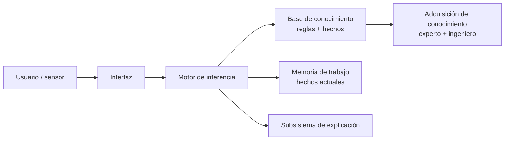

# B05 · RA5 — Sistemas expertos y motores de reglas

> **12 horas (6 sesiones de 2 h).** Apuntes reescritos a partir de la UD05 de David Martínez Peña (`material_david/docs/UD05/UD05_ES.md`, CC BY-NC-SA 4.0) y actualizados al mercado actual: motores de reglas (Drools/KIE, CLIPS, NRules, OPA), estándar **DMN**, *policy engines*, **guardarraíles de LLM** y **sistemas neuro-simbólicos**.
>
> **Hilo conductor:** codificar el conocimiento de un experto en **reglas legibles y ejecutables**, aplicarlas con un **motor de inferencia** y usar ese sistema para **diagnosticar, asesorar y controlar**. Con código Python en cada sesión.

## RA5 y criterios de evaluación

**RA5** — Aplica sistemas expertos evaluando la influencia de los controladores inteligentes en el comportamiento del sistema.

| CE | Criterio | Sesión |
|---|---|---|
| RA5-a | Describe la dinámica y las estructuras elementales de los sistemas expertos. | S1, S2 |
| RA5-b | Determina destrezas para representar y simular comportamientos básicos de muy diversos ámbitos. | S3, S4 |
| RA5-c | Razona cómo influye la variación de las características en la dinámica. | S5 |
| RA5-d | Desarrolla estrategias de control definiendo objetivos y especificaciones de respuesta. | S5, S6 |
| RA5-e | Relaciona los controladores inteligentes con el comportamiento del sistema. | S6 |

## Planificación (12 h)

| Sesión | 2 h | Contenido | CE |
|---|---|---|---|
| S1 | Del conocimiento a las reglas | DIKW, arquitectura, ciclo reconocer-actuar, encadenamiento, factores de certeza | RA5-a |
| S2 | Representación y motores actuales | Continuo de representaciones, DMN, BRMS, policy engines, reglas propias en Python | RA5-a |
| S3 | Simular con `experta` | Hechos, reglas, `DefFacts`, salience, MATCH; diagnóstico y clasificación | RA5-b |
| S4 | Híbridos reglas/datos | Deducir reglas (FIGS, skope-rules), Human-Learn, guardarraíles de LLM | RA5-b |
| S5 | Lógica difusa y dinámica | `scikit-fuzzy`, fuzzificación/inferencia/desfuzzificación, sensibilidad e histéresis | RA5-b/c/d |
| S6 | Control y controladores inteligentes | Agenda, especificaciones, PID vs experto/difuso/ANN/MPC, tendencias | RA5-d/e |

---

# Sesión 1 · Del conocimiento a las reglas (RA5-a)

## 1.1 Dato, información, conocimiento y sabiduría (DIKW)

| Nivel | Qué es | Ejemplo |
|---|---|---|
| **Dato** | Valor registrado, sin interpretar | `37` |
| **Información** | Dato interpretado por un agente | «La temperatura es 37 ºC» |
| **Conocimiento** | Información integrada en un modelo | «Si supera 37 ºC hay fiebre» |
| **Sabiduría** | Meta-conocimiento: cuándo y cómo aplicarlo | «Si hay fiebre, pauta paracetamol y controla cada 6 h» |

Un sistema experto almacena **conocimiento** (reglas) y, en su forma avanzada, **sabiduría** (metarreglas). El error típico al empezar es acumular *datos* en lugar de codificar *reglas*.

## 1.2 ¿Qué es un sistema experto?

Programa que **emula el razonamiento de un experto** en un dominio acotado: codifica su conocimiento en una **base de conocimiento** y lo aplica a los hechos con un **motor de inferencia**.



| Componente | Función |
|---|---|
| **Interfaz** | Pregunta datos, muestra resultados, comunica con otros sistemas |
| **Base de conocimiento** | Reglas y hechos del dominio (los formaliza el **ingeniero de conocimiento**) |
| **Memoria de trabajo** | Hechos actuales y deducidos durante la consulta |
| **Motor de inferencia** | Evalúa reglas, resuelve conflictos y ejecuta acciones |
| **Subsistema de explicación** | Justifica el «por qué» y el «cómo» mostrando las reglas usadas |
| **Adquisición de conocimiento** | Incorporar conocimiento sin perfil técnico (el *bottleneck*) |

!!! important "La explicación es la ventaja diferencial"
    Poder mostrar **qué regla se disparó y por qué** distingue a un sistema experto de una caja negra de ML. En dominios regulados (sanidad, banca) es obligatorio. MYCIN fue el pionero.

## 1.3 Dinámica: el ciclo reconocer-actuar

1. **Reconocer (match):** los hechos de la memoria de trabajo se comparan con las condiciones (LHS) de las reglas; las que encajan van a la **agenda**.
2. **Resolver (resolve):** si hay varias activas, se elige una según la estrategia (salience, recency, specificity — S6).
3. **Actuar (act):** se ejecuta el consecuente (RHS), que declara/modifica/retira hechos; se repite hasta vaciar la agenda.

## 1.4 Encadenamiento y reglas de inferencia

- **Hacia delante (forward, data-driven):** de los hechos a las conclusiones → monitorización, control, planificación.
- **Hacia atrás (backward, goal-driven):** de la meta a los hechos que la sustentan → diagnóstico (MYCIN, Prolog).
- **Mixto:** combina ambos.

**Modus Ponens:** si *P→Q* y *P*, entonces *Q* (base del forward).
**Modus Tollens:** si *P→Q* y *¬Q*, entonces *¬P* (base del backward).

## 1.5 Incertidumbre: factores de certeza

MYCIN introdujo los **factores de certeza (CF)**: cada regla lleva un CF y al encadenar se **acumula evidencia**.

- Regla A: «fiebre alta → meningitis, CF=0,6».
- Regla B: «rigidez de nuca → meningitis, CF=0,4».
- Combinadas dan más confianza que cada una por separado; la evidencia en contra descuenta.

Alternativas modernas: **lógica difusa** (S5), Dempster-Shafer y **redes bayesianas**.

## 1.6 Código · primer motor con `experta`

`experta` (2019) es una biblioteca Python con matcher **RETE**, alternativa a CLIPS. En Python 3.10+ necesita un parche porque `collections.Mapping` se eliminó:

```python
%pip install experta

import collections, collections.abc
if not hasattr(collections, "Mapping"):
    collections.Mapping = collections.abc.Mapping
    collections.Iterable = collections.abc.Iterable
    collections.MutableMapping = collections.abc.MutableMapping

from experta import *

class DiagnosticoPC(KnowledgeEngine):
    @DefFacts()
    def inicio(self):
        yield Fact(accion="diagnosticar")

    @Rule(Fact(accion="diagnosticar"), salience=10)
    def arrancar(self):
        print("Diagnóstico del PC...")
        self.declare(Fact(luz_encendida=True), Fact(sonido="pitidos_cortos"))

    @Rule(Fact(luz_encendida=True), Fact(sonido="pitidos_cortos"))
    def ram(self):
        self.declare(Fact(causa="problema_ram"))

    @Rule(Fact(causa="problema_ram"))
    def resultado(self):
        print("DIAGNÓSTICO: fallo de memoria RAM.")

motor = DiagnosticoPC()
motor.reset()   # carga DefFacts y limpia la memoria de trabajo
motor.run()     # ciclo reconocer-actuar hasta vaciar la agenda
# → Diagnóstico del PC... / DIAGNÓSTICO: fallo de memoria RAM.
```

!!! note "Por qué el mercado sigue usando reglas"
    Las reglas son **auditables**, **versionables** y **explicables**. Por eso sobreviven en seguros, banca, sanidad y compliance, y hoy reaparecen como **guardarraíles** de los LLM (S4).

**Actividad S1.** Escribe un motor `experta` que clasifique una incidencia TI como `crítica` si `impacto=alto` **o** `usuarios>50`; `media` si `usuarios>10`; `baja` en otro caso. Ejecuta con 3 casos y explica por qué se dispara cada regla.

---

# Sesión 2 · Representación y motores de reglas actuales (RA5-a)

## 2.1 El continuo de representación

Representar el conocimiento es hacerlo **entendible** por la máquina, **útil** y **eficiente**. Hay un continuo de representaciones simples (algoritmos) a flexibles (lenguaje natural).

| Representación | Estructura | Inferencia | Ventaja | Límite |
|---|---|---|---|---|
| **Pares atributo-valor** | Nodos y aristas | Coincidencia de atributos | Muy simple | Poco expresiva |
| **Reglas de producción** | `SI ... ENTONCES ...` | Forward/backward | Modular, legible, explicable | Lenta con bases enormes; malas para jerarquías |
| **Jerarquías** | Árbol | Recorrido, herencia | Natural para taxonomías | Rígida |
| **Marcos (frames)** | Ranuras y valores por defecto | Herencia | Conocimiento estructurado | Herencia múltiple conflictiva |
| **Lógica formal** | Predicados de 1.er orden | Resolución, unificación | Rigor | Explosión combinatoria |
| **Redes semánticas** | Grafo dirigido etiquetado | Búsqueda/propagación | Intuitiva | Semántica ambigua |
| **Ontologías** | Clases, propiedades, axiomas (OWL) | Razonadores (Pellet, HermiT) | Interoperabilidad | Curva de aprendizaje |

El mismo hecho («si llueve, coge el paraguas») puede escribirse como regla, como lógica proposicional, como jerarquía o como par atributo-valor. **Elegir representación = elegir qué será fácil después.**

## 2.2 Motores de reglas y estándares en el mercado (2026)

| Motor / estándar | Lenguaje / ecosistema | Uso típico |
|---|---|---|
| **Drools / Apache KIE** | Java, DMN, JSR-94 | BRMS empresarial: banca, seguros, retail. Motor **PHREAK** (RETE evolucionado) |
| **IBM ODM** | Java | Reglas de negocio a gran escala en banca |
| **FICO Blaze Advisor** | Propio | Scoring y decisión crediticia |
| **SAP BRF+** | ABAP/Java | Reglas dentro de procesos SAP |
| **CLIPS** | C | Sistemas expertos clásicos y embebidos |
| **NRules** | .NET/C# | Reglas en el ecosistema Microsoft |
| **json-rules-engine** | JS/TS | Reglas ligeras en backend Node |
| **`durable_rules`** | Python (RETE) | Reglas y *event processing* en Python |
| **`experta`** | Python (RETE) | Docencia y prototipos; alternativa a CLIPS |
| **DMN** (OMG) | Tablas de decisión | Estándar de decisión de negocio, legible por no técnicos |
| **OPA / Rego** | Go, policy-as-code | Autorización y políticas en cloud/K8s |
| **Cedar** (AWS) | Policy language | Control de acceso |
| **Casbin** | Multi-lenguaje | Autorización (RBAC/ABAC) |

!!! tip "Dos familias que conviene no confundir"
    **BRMS/reglas de negocio** (Drools, DMN, ODM): modelan decisiones de empresa. **Policy engines** (OPA/Rego, Cedar, Casbin): autorizan accesos y validan configuraciones. Ambas son «motores de regla», pero con objetivos distintos.

## 2.3 DMN en una tabla

DMN expresa decisiones como **tablas** legibles por negocio. Ejemplo de scoring:

| Antigüedad | Impagos | Decisión |
|---|---|---|
| `< 1 año` | `> 0` | Rechazar |
| `< 1 año` | `= 0` | Revisar |
| `>= 1 año` | `= 0` | Aprobar |

En Drools se implementa con `dmn` o con reglas DRF; en Python puede reproducirse con un motor propio o `business-rules`.

## 2.4 Código · un motor de reglas mínimo en Python

Sin dependencias externas: hechos como diccionarios, reglas como funciones y ciclo match-resolve-act.

```python
from dataclasses import dataclass

@dataclass
class Regla:
    nombre: str
    prioridad: int
    condicion: callable
    accion: callable

class MotorReglas:
    def __init__(self):
        self.reglas, self.hechos, self.traza = [], {}, []

    def add(self, regla): self.reglas.append(regla)

    def declarar(self, **hechos): self.hechos.update(hechos)

    def run(self):
        while True:
            activas = [r for r in self.reglas if r.condicion(self.hechos)]
            activas = [r for r in activas if r.nombre not in self.traza]
            if not activas: break
            r = max(activas, key=lambda x: x.prioridad)   # resolución de conflictos
            self.traza.append(r.nombre)
            r.accion(self.hechos)
        return self.hechos

m = MotorReglas()
m.add(Regla("critica", 30, lambda h: h.get("impacto") == "alto" or h.get("usuarios", 0) > 50,
            lambda h: h.update(nivel="critica")))
m.add(Regla("media", 20, lambda h: h.get("nivel") is None and h.get("usuarios", 0) > 10,
            lambda h: h.update(nivel="media")))
m.add(Regla("baja", 10, lambda h: h.get("nivel") is None,
            lambda h: h.update(nivel="baja")))
m.declarar(impacto="alto", usuarios=5)
print(m.run())
# → {'impacto': 'alto', 'usuarios': 5, 'nivel': 'critica'}
```

**Actividad S2.** Traduce a **tabla DMN** y a este motor la política: «una devolución se aprueba si han pasado <30 días y el producto está sin usar; si pasaron 30-60 días, requiere supervisor; si >60, se rechaza».

---

# Sesión 3 · Simular comportamientos con `experta` (RA5-b)

## 3.1 Hechos, reglas y `DefFacts`

- **Hecho (`Fact`):** subclase de `dict`; `Fact(a=1, b=2)`.
- **Regla:** método decorado con `@Rule(...)`; el **LHS** son patrones y el **RHS** el cuerpo.
- **`DefFacts`:** hechos iniciales que se cargan en cada `reset()`.
- **`declare` / `retract` / `modify` / `duplicate`:** manipulan la memoria de trabajo.
- **`MATCH`:** captura valores para pasarlos al RHS; **`P(...)`:** condición de predicado (evaluar, no comparar por igualdad).
- **`salience`:** prioridad numérica.

!!! warning "Trampa nº 1 con `experta`"
    `experta` compara por **igualdad**. `Fact(error=lambda e: e > 3)` busca un hecho cuyo `error` sea *literalmente* esa función y nunca coincide. Hay que envolver la condición en `P(...)`: `@Rule(Fact(error=P(lambda e: e > 3)))`. Si no, el motor se queda congelado sin lanzar error.

## 3.2 Código · diagnóstico y clasificación

Diagnóstico (forward chaining) y clasificación de animales (sistema de producción clásico):

```python
class Animales(KnowledgeEngine):
    @DefFacts()
    def inicio(self):
        yield Fact(analizar=True)

    @Rule(Fact(analizar=True), salience=10)
    def datos(self):
        self.declare(Fact(pelo=True), Fact(carnivoro=True),
                     Fact(color="leonado"), Fact(manchas="oscuras"))

    @Rule(Fact(pelo=True))
    def mamifero(self):
        self.declare(Fact(mamifero=True))

    @Rule(Fact(mamifero=True), Fact(carnivoro=True),
          Fact(color="leonado"), Fact(manchas="oscuras"))
    def guepardo(self):
        print("IDENTIFICADO: guepardo")

motor = Animales()
motor.reset()
motor.run()
# → IDENTIFICADO: guepardo
```

## 3.3 «Muy diversos ámbitos»

El mismo motor sirve para dominios distintos; lo que cambia es el **conocimiento**, no el motor:

| Dominio | Qué simula |
|---|---|
| Informática | Diagnóstico de averías (PC, red) |
| Zoología | Clasificación de animales |
| Medicina | Diagnóstico de lesión de rodilla a partir de síntomas |
| Juegos | Piedra, papel o tijera por reglas |
| Empresa | Triaje de incidencias, admisión de devoluciones |

**Actividad S3.** Implementa un sistema experto de **triaje de urgencias** (5 reglas, 2 niveles) y otro de **diagnóstico de red** (3 reglas). Compara ambos: misma arquitectura, distinto conocimiento.

---

# Sesión 4 · Sistemas híbridos reglas/datos (RA5-b)

## 4.1 Dos enfoques híbridos

1. **Deducir reglas de los datos:** un algoritmo genera reglas `SI...ENTONCES` legibles a partir de un dataset (interpretable, no caja negra).
2. **Integrar reglas propias con ML:** el experto fija reglas y el aprendizaje las mejora/completa.

| Biblioteca | Qué hace |
|---|---|
| **Human-Learn** | Definir reglas propias como si fuera un clasificador de scikit-learn (`FunctionClassifier`) |
| **skope-rules** | Deducir reglas de clasificación de los datos, auditables |
| **FIGS** (`imodels`) | Reglas interpretables como suma de árboles pequeños |
| **spaCy** | Reglas de extracción de información de texto |

## 4.2 Código · reglas que salen de los datos (FIGS)

```python
%pip install imodels scikit-learn

from sklearn.datasets import load_iris
from sklearn.model_selection import train_test_split
from imodels import FIGSClassifier

X, y = load_iris(return_X_y=True)
X_tr, X_te, y_tr, y_te = train_test_split(X, y, test_size=0.3, random_state=42)

clf = FIGSClassifier(max_rules=8)
clf.fit(X_tr, y_tr)
print("Accuracy:", round(clf.score(X_te, y_te), 3))
print(clf)   # reglas SI...ENTONCES legibles, deducidas por el algoritmo
```

## 4.3 Código · reglas propias + ML (Human-Learn)

```python
from human_learn import FunctionClassifier
import numpy as np

def mi_regla(X):
    # regla de experto: pétalo largo -> clase 2, si no, la más frecuente
    return np.where(X[:, 2] > 4.5, 2, 1)

clf = FunctionClassifier(mi_regla)
clf.fit(X_tr, y_tr)
print("Accuracy regla de experto:", round(clf.score(X_te, y_te), 3))
```

## 4.4 Reglas como guardarraíl del ML/LLM (mercado actual)

Los sistemas expertos han vuelto como **capa de seguridad** sobre modelos generativos:

- **Validación de salidas:** reglas que acotan rangos, importes o acciones permitidas de un LLM/agente.
- **Enrutado y compliance:** reglas de negocio (DMN) que deciden si una respuesta generada puede ejecutarse.
- **NeMo Guardrails / Guardrails AI / structured outputs (Pydantic):** validación declarativa de entradas/salidas.
- **Sistemas neuro-simbólicos:** red neuronal (aprendizaje) + razonamiento simbólico (reglas) para reducir alucinaciones y aportar explicabilidad.

!!! tip "Del pasado al presente"
    MYCIN y XCON demostraron que el conocimiento declarativo y la explicación importan. Hoy esa idea vive en BRMS, en *policy engines* y en los guardarraíles del ML generativo. Saber construir y auditar sistemas de reglas sigue siendo una competencia muy demandada.

**Actividad S4.** Con `load_breast_cancer`, genera reglas con FIGS y compáralas con 2 reglas de experto que tú definas. ¿Qué enfoque explica mejor una decisión médica? Justifícalo.

---

# Sesión 5 · Lógica difusa y dinámica (RA5-b/c/d)

## 5.1 De lo binario a lo continuo

La lógica clásica es binaria; «hace frío» es una cuestión de **grado**. La **lógica difusa** usa valores de verdad en `[0, 1]` mediante **funciones de pertenencia** `μ_A(x)`.

| Concepto | Ejemplo |
|---|---|
| **Variable lingüística** | *Temperatura* |
| **Valores lingüísticos** | *Frío*, *Calor* |
| **Función de pertenencia** | `27 ºC → Calor = 0,8` |
| **Regla difusa** | «Si temperatura es *fría* → calefacción *alta*» |
| **Agregación** | Combina varias reglas en una conclusión |

## 5.2 Tres pasos

1. **Fuzzificación:** valor preciso → grados difusos (`27 ºC → Calor=0,8, MuchoCalor=0,2`).
2. **Evaluación de reglas:** combina pertenencias y deduce la relevancia de la salida.
3. **Desfuzzificación:** conclusión difusa → valor preciso (centro de gravedad o máximo).

## 5.3 Código · el problema de la propina (`scikit-fuzzy`)

```python
%pip install scikit-fuzzy

import numpy as np, skfuzzy as fuzz
from skfuzzy import control as ctrl

servicio = ctrl.Antecedent(np.arange(0, 11, 0.1), "servicio")
comida   = ctrl.Antecedent(np.arange(0, 11, 0.1), "comida")
propina  = ctrl.Consequent(np.arange(0, 26, 0.1), "propina")

servicio["baja"]  = fuzz.trimf(servicio.universe, [0, 0, 5])
servicio["media"] = fuzz.trimf(servicio.universe, [0, 5, 10])
servicio["alta"]  = fuzz.trimf(servicio.universe, [5, 10, 10])
comida.automf(3)
propina["baja"]  = fuzz.trimf(propina.universe, [0, 0, 13])
propina["media"] = fuzz.trimf(propina.universe, [0, 13, 25])
propina["alta"]  = fuzz.trimf(propina.universe, [13, 25, 25])

r1 = ctrl.Rule(servicio["baja"] | comida["poor"], propina["baja"])
r2 = ctrl.Rule(servicio["media"], propina["media"])
r3 = ctrl.Rule(servicio["alta"] | comida["good"], propina["alta"])

sistema = ctrl.ControlSystem([r1, r2, r3])
sim = ctrl.ControlSystemSimulation(sistema)
sim.input["servicio"] = 9.8
sim.input["comida"] = 6.5
sim.compute()
print(f"Propina: {sim.output['propina']:.2f} €")   # ≈ 19,24 €
```

De la propina al **quemador de gas**: misma estructura, pero la salida es la potencia de un actuador real.

## 5.4 Variación de características: sensibilidad y robustez (RA5-c)

- **Sensibilidad:** cuánto cambian las conclusiones ante pequeñas desviaciones (detecta pronto, pero da **falsas alarmas**).
- **Robustez:** mantener conclusiones estables ante ruido o fallos.

| Qué varía | Efecto |
|---|---|
| **Reglas** | Más condiciones → más inercia; simplificar → sobreactivación |
| **Hechos** | Ruido en un sensor → conmutación constante de actuadores |
| **Umbrales** | Subirlo → menos falsos positivos, pero puede ignorar alertas tempranas |

!!! example "Histéresis"
    Un sensor de CO oscila 28-32 ppm con umbral en 30. Sin histéresis, los extractores se encienden/apagan cada ciclo. Solución: exigir que la alerta se mantenga 30 s, o un **controlador difuso** que suavice la transición.

**Actividad S5.** Con el controlador difuso de riego, sube/baja los umbrales de las funciones de pertenencia y mide cómo cambia la salida. ¿Dónde gana en robustez y dónde pierde precisión?

---

# Sesión 6 · Control y controladores inteligentes (RA5-d/e)

## 6.1 Estrategias de control de la agenda (RA5-d)

| Estrategia | Qué hace |
|---|---|
| **Salience** | Prioridad numérica (emergencias primero) |
| **Recency** | Prefiere hechos más recientes |
| **Specificity** | Prefiere la regla con más condiciones |
| **Control de meta** | Metarreglas que cambian prioridades o modos (arranque/operación/parada) — la «sabiduría» del DIKW |

## 6.2 Especificaciones de respuesta

| Especificación | Qué mide |
|---|---|
| **Precisión** | Error en régimen permanente |
| **Tiempo de respuesta** | Subida (tr) y asentamiento (ts) |
| **Estabilidad** | Sobreimpulso (*overshoot*) máximo aceptable |
| **Alcance** | Rango de operación de la planta |

## 6.3 Del PID a los controladores inteligentes (RA5-e)

Un lazo de control compara el setpoint (SP) con la variable medida (PV), calcula el error y actúa con un **PID**: `u = Kp·e + Ki·∫e + Kd·de/dt`. Es simple y fiable en sistemas lineales, pero sufre con **retrasos, no linealidades y ruido**.

| Controlador | Cómo funciona | Ventaja frente al PID |
|---|---|---|
| **Difuso** | Reglas lingüísticas + pertenencia (Mamdani/Sugeno) | Robusto ante ruido y no linealidad; no necesita modelo |
| **Por reglas (experto)** | Motor de inferencia con reglas del operador | Captura heurísticas; explicable |
| **Redes neuronales** | Aprenden la dinámica inversa | Sistemas no lineales |
| **MPC** | Predice la trayectoria y optimiza | Proactivo, anticipa restricciones |

**Datos de mejora documentados:** control térmico difuso −76 % de asentamiento y sobreimpulso 0 %; Mitsubishi (aire) 5× más rápido y −24 % consumo; DeepMind centros de datos −40 % en refrigeración.

!!! tip "¿Siempre gana el controlador inteligente?"
    No. El PID es barato y fiable en sistemas bien modelados. La regla es **empezar simple** y añadir inteligencia solo cuando hay no linealidad, retraso o ruido fuerte.

## 6.4 Código · controlador experto de climatización

```python
import collections, collections.abc
if not hasattr(collections, "Mapping"):
    collections.Mapping = collections.abc.Mapping
    collections.Iterable = collections.abc.Iterable
    collections.MutableMapping = collections.abc.MutableMapping
from experta import *

def planta(temp, potencia, inercia=0.05, exterior=15.0):
    # modelo simple con inercia térmica; equilibrio: temp = exterior + 10·potencia
    return temp + inercia * (potencia * 10 - (temp - exterior))

class ControladorClima(KnowledgeEngine):
    def __init__(self, setpoint=21.0):
        super().__init__()
        self.setpoint, self.potencia, self._temp = setpoint, 0.0, 15.0

    @DefFacts()
    def _hechos(self):
        # self sí está disponible aquí (se ejecuta en reset())
        yield Fact(error=self.setpoint - self._temp)

    @Rule(Fact(error=P(lambda e: e > 3)))
    def alta(self): self.potencia = 1.0

    @Rule(Fact(error=P(lambda e: 1 < e <= 3)))
    def media(self): self.potencia = 0.8

    @Rule(Fact(error=P(lambda e: 0 < e <= 1)))
    def baja(self): self.potencia = 0.6

    @Rule(Fact(error=P(lambda e: e <= 0)))
    def apagar(self): self.potencia = 0.0

    def paso(self, temp):
        self._temp = temp
        self.reset(); self.run()
        return self.potencia

ctrl = ControladorClima(21.0)
temp = 15.0
for i in range(60):
    potencia = ctrl.paso(temp)
    temp = planta(temp, potencia)
    if i % 10 == 0:
        print(f"t={i:2d}  temp={temp:5.2f}  potencia={potencia}")
```

!!! warning "Por qué NO se puede usar `self` dentro de `P(...)`"
    El decorador `@Rule(...)` se evalúa al **definir la clase**, cuando `self` todavía no existe; un `lambda` que use `self` falla al llamarse. Por eso el controlador declara el **error** como hecho en `DefFacts` (donde `self` sí existe, porque se ejecuta en `reset()`) y las reglas solo comparan contra constantes.

**Actividad S6.** Mide con este controlador: error en régimen permanente, tiempo de asentamiento (banda 20,5-21,5 ºC) y sobreimpulso. Después cambia el umbral de la regla «media» de 3 a 1,5 y compara. ¿Qué trade-off observas? ¿Cuándo elegirías un PID y cuándo un controlador experto/difuso?

## 6.5 Aplicaciones y tendencias (mercado actual)

| Sector | Uso actual |
|---|---|
| **Banca / seguros** | Scoring, *underwriting*, AML y fraude por reglas (ODM, Blaze, Drools) |
| **Salud** | Ayuda a la decisión clínica (CDSS), alertas, dosificación |
| **Industria** | Control de procesos, diagnóstico de máquinas, mantenimiento (Gensym G2) |
| **Telecomunicaciones** | Diagnóstico de averías y gestión de red |
| **Cloud / DevOps** | Autorización y políticas con OPA/Rego, Cedar, Kyverno |
| **Legal / compliance** | Reglas normativas, DMN y trazabilidad de decisiones |
| **IA generativa** | Guardarraíles, enrutado, validación de salidas de LLM y agentes |

**Tendencias:** BRMS con DMN, *policy-as-code*, **neuro-simbólico**, **XAI** (derecho a explicación del RGPD) y reglas como **guardarraíl del ML**.

---

## Puntos clave

- DIKW distingue dato/información/conocimiento/sabiduría; un sistema experto almacena **conocimiento** (reglas) y **sabiduría** (metarreglas).
- Arquitectura: base de conocimiento + motor de inferencia (ciclo reconocer-actuar) + explicación.
- **Forward** (hechos→conclusiones) vs. **backward** (meta→hechos); Modus Ponens/Tollens.
- Representaciones: de pares atributo-valor a ontologías; en la práctica, **reglas de producción** + difuso.
- Motores actuales: Drools/KIE, ODM, Blaze, CLIPS, NRules, `experta`, **DMN**, **OPA/Rego**.
- Híbridos reglas/datos: FIGS, skope-rules, Human-Learn; reglas como **guardarraíl** de LLM.
- Lógica difusa: fuzzificación → reglas → desfuzzificación; clave para control real.
- Sensibilidad vs. robustez; **histéresis** contra falsas alarmas.
- Control: salience/meta, especificaciones (precisión, tiempo, estabilidad); PID vs. difuso/experto/ANN/MPC.
- Tendencias: BRMS, neuro-simbólico, XAI, guardarraíles.

## Glosario

| Término | Definición |
|---|---|
| **Sistema experto** | Programa que emula el razonamiento de un experto en un dominio |
| **Base de conocimiento** | Reglas y hechos del dominio |
| **Memoria de trabajo** | Hechos actuales del problema |
| **Motor de inferencia** | Ejecuta el ciclo reconocer-actuar |
| **Ingeniero de conocimiento** | Formaliza el conocimiento del experto |
| **Forward / backward chaining** | Encadenamiento hacia delante / hacia atrás |
| **Modus Ponens / Tollens** | Reglas de inferencia clásicas |
| **Factor de certeza** | Confianza de una conclusión (MYCIN) |
| **Frame / red semántica / ontología** | Estructuras de representación |
| **DMN** | Estándar de tablas de decisión de negocio |
| **BRMS** | Sistema de gestión de reglas de negocio (Drools) |
| **Policy engine** | Motor de políticas (OPA/Rego, Cedar, Casbin) |
| **FIGS** | Reglas interpretables como suma de árboles |
| **Lógica difusa** | Lógica con valores en `[0,1]` |
| **Fuzzificación / desfuzzificación** | Preciso → difuso / difuso → preciso |
| **Salience / control de meta** | Prioridad / metarreglas del motor |
| **Sensibilidad / robustez** | Cambio ante perturbación / estabilidad |
| **Histéresis** | Retardo para evitar conmutaciones |
| **PID** | Controlador proporcional-integral-derivativo |
| **MPC** | Control predictivo basado en modelo |
| **Neuro-simbólico** | Redes + razonamiento simbólico |
| **XAI** | IA explicable |
| **Guardarraíl** | Reglas que acotan y validan salidas de ML/LLM |

## FAQ

??? question "¿Un sistema experto puede aprender de los datos?"
    No por sí mismo: las reglas las escribe un experto (el *bottleneck*). Los **sistemas híbridos** (S4) dejan que el ML deduzca o mejore las reglas.

??? question "¿Están anticuados?"
    No. Siguen en **BRMS** (Drools, ODM, Blaze), en **policy engines** (OPA) y resurgen en **neuro-simbólico** y como **guardarraíl** del ML/LLM.

??? question "¿Por qué dan falsas alarmas?"
    Por **sensibilidad excesiva** con umbrales ajustados y sensores con ruido. Se corrige con **histéresis**, suavizado o control difuso.

??? question "¿PID o controlador inteligente?"
    Depende: PID en sistemas lineales bien modelados; inteligente (difuso/experto/ANN/MPC) con no linealidad, retraso o ruido. Empezar simple.

??? question "¿`experta` funciona en Python moderno?"
    La librería (2019) falla en 3.10+ por `frozendict`. Con el parche `collections.Mapping = collections.abc.Mapping` funciona. Existe `om-experta` (archivado, 2023); usamos siempre el parche.

??? question "¿Reglas puras o sistema híbrido?"
    Reglas puras si el experto puede formalizar todo el conocimiento (más explicable). Híbrido si el conocimiento es parcial, cambia o hay muchos datos.

## Evaluación (RA5)

| Peso | Instrumento |
|---|---|
| **40 %** actividades | Entregables prácticos (un sistema experto por dominio: diagnóstico, híbrido, difuso, control) con rúbrica |
| **60 %** prueba escrita | Test y desarrollo sobre RA5 (DIKW, arquitectura, encadenamiento, difuso, control) |

La normativa exige **todos los RA** y **≥5 en cada RA** (Orden 8/2025, art. 5.1). Recuperación: repetir la construcción de un sistema experto con un problema distinto (art. 14.4).

## Recursos

- `material_david/docs/UD05/UD05_ES.md` (fuente base, CC BY-NC-SA 4.0).
- [experta](https://experta.readthedocs.io/) · [CLIPS](https://www.clipsrules.net/) · [Drools / Apache KIE](https://www.drools.org/) · [OPA](https://www.openpolicyagent.org/)
- [imodels (FIGS)](https://github.com/csinva/imodels) · [skope-rules](https://github.com/scikit-learn-contrib/skope-rules) · [Human-Learn](https://koaning.github.io/human-learn/)
- [scikit-fuzzy](https://pythonhosted.org/scikit-fuzzy/) · [PID controller](https://en.wikipedia.org/wiki/PID_controller)
