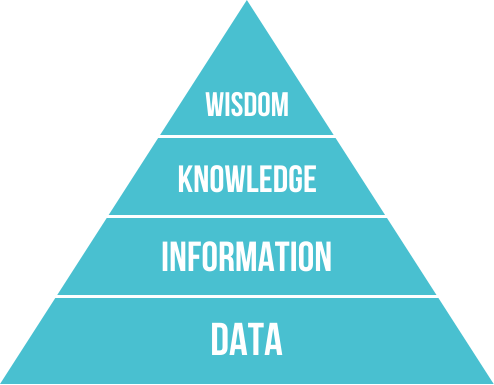
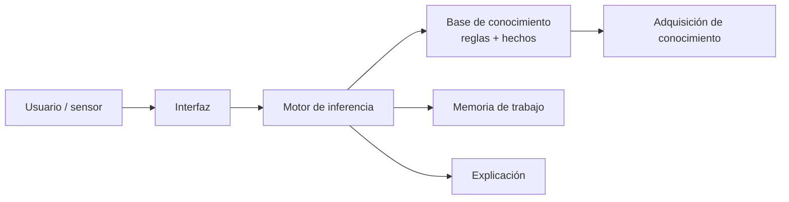
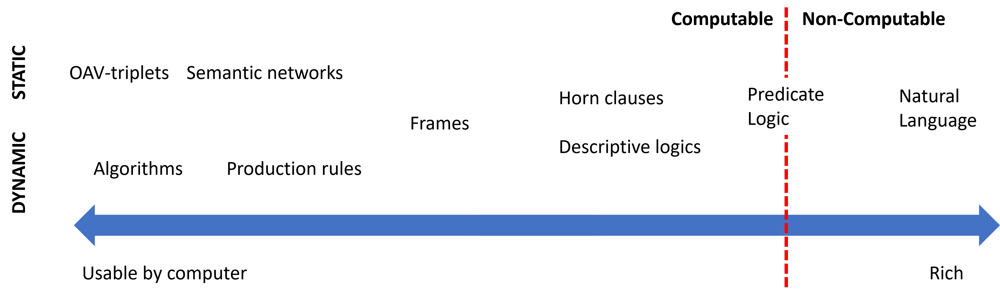
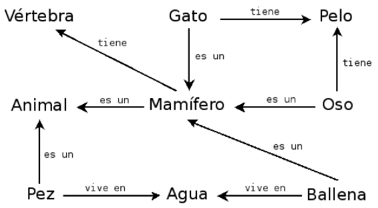

# Sesión 9 · Sistemas expertos (19/10/2026)

> **Bloque B05 · RA5.** Primera de las tres sesiones sobre sistemas expertos y motores de reglas. Hilo conductor de las tres: **Pagarium**, una pasarela de pagos que decide sobre transacciones.
>
> **Criterios de evaluación (CE):** RA5-a (dinámica y estructuras elementales de los sistemas expertos) y RA5-c (cómo influye la variación de las características en su dinámica).

## Qué vas a aprender

| # | Al terminar la sesión serás capaz de… |
|---|---|
| 1 | Situar el conocimiento en la jerarquía **DIKW** y describir la **anatomía** de un sistema experto |
| 2 | Diferenciar las **estructuras de representación** del conocimiento (reglas, marcos, lógica, ontologías…) |
| 3 | Explicar el **ciclo de ejecución** (reconocer-resolver-actuar) y el **encadenamiento** hacia delante/atrás |
| 4 | Construir y ejecutar un sistema experto con `experta` y con `clipspy` (CLIPS) |
| 5 | Explicar por qué un motor industrial usa **RETE/PHREAK** y no un simple `for` |

## Vídeo · ¿Qué es un sistema experto?

<iframe width="100%" height="380" src="https://www.youtube.com/embed/tCnJtIyWQ6w" title="Sistemas expertos · Inteligencia artificial · Componentes" frameborder="0" allow="accelerometer; autoplay; clipboard-write; encrypted-media; gyroscope; picture-in-picture; web-share" referrerpolicy="strict-origin-when-cross-origin" allowfullscreen></iframe>

[Ver en YouTube](https://www.youtube.com/watch?v=tCnJtIyWQ6w) · *Tecnología 4.0*. Introduce qué es un sistema experto y sus componentes. Míralo como apoyo; lo que importa está explicado abajo.

## 1 · Por qué reglas en 2026

La IA generativa no ha enterrado las reglas: las ha **revalorizado**. En un sistema con LLM, las reglas son la capa que:

- **decide con precisión** lo que el modelo solo estima (importes, límites, elegibilidad);
- **explica** cada decisión (auditoría, *compliance*);
- **acota** al modelo (guardarraíl) para que no ejecute acciones fuera de rango.

Sectores donde las reglas siguen en producción: **banca y seguros** (*scoring*, AML, *underwriting*), **salud** (alertas, dosificación), **industria** (diagnóstico, control), **telecom** (averías), **cloud** (autorización) y **legal** (*compliance*).

## 2 · Del dato al conocimiento: la jerarquía DIKW

Antes de representar el conocimiento hay que distinguirlo de sus vecinos. La **jerarquía DIKW** (*Data, Information, Knowledge, Wisdom*) los ordena:



| Nivel | Qué es | Ejemplo |
|---|---|---|
| **Dato** | Hecho o valor registrado, independiente de quien lo lee | «37 ºC» |
| **Información** | El dato interpretado por un agente | «La temperatura corporal es 37 ºC» |
| **Conocimiento** | Información integrada en un modelo del mundo | «Si supera 37 ºC, hay fiebre» |
| **Sabiduría** | Meta-conocimiento: cuándo y cómo aplicar el conocimiento | «Si hay fiebre, toma paracetamol» |

!!! important "Por qué importa esta distinción"
    Un sistema experto no almacena datos ni información: almacena **conocimiento** (reglas) y, en los más avanzados, un poco de **sabiduría** (metarreglas que deciden cuándo aplicar otras reglas). Confundir los niveles es el error más común al empezar: se acumulan datos en vez de codificar reglas.

## 3 · Anatomía de un sistema experto

Un **sistema experto** es un programa de IA que **emula el razonamiento de un experto humano** en un dominio concreto: codifica su conocimiento en una **base de conocimiento** y usa un **motor de inferencia** para aplicarlo a los hechos del problema. Fueron muy populares en los años 70-80 y se consideran los primeros sistemas de IA con utilidad práctica real.



| Componente | Función |
|---|---|
| **Base de conocimiento** | Reglas y hechos del dominio, formalizados por el **ingeniero de conocimiento** junto al experto |
| **Memoria de trabajo** | Hechos actuales: los que aporta el usuario o los sensores, más los deducidos |
| **Motor de inferencia** | Evalúa qué reglas se cumplen, resuelve conflictos y ejecuta (ciclo reconocer-resolver-actuar) |
| **Explicación** | Justifica el «por qué» y el «cómo» de una conclusión (su gran ventaja frente al ML) |
| **Adquisición** | Capturar el conocimiento del experto: el famoso *bottleneck*, la parte más lenta |

!!! important "La explicación marca la diferencia"
    La capacidad de **explicar** su razonamiento es lo que distingue a un sistema experto de un modelo de ML: en dominios regulados (medicina, finanzas) la justificación es obligatoria. **MYCIN** fue el pionero, mostrando las reglas que usó.

## 4 · Representar el conocimiento

Representar el conocimiento es hacerlo **entendible** para la máquina, **útil** para resolver problemas y **eficiente** de procesar. Las representaciones forman un **continuo**: en un extremo las simples (algoritmos) y en el otro las flexibles (texto natural), que una máquina no puede usar directamente.



| Representación | Estructura | Inferencia | Ventaja | Límite |
|---|---|---|---|---|
| **Pares atributo-valor** | Tripletes objeto-atributo-valor | Recorrido y coincidencia | Muy simple de construir | Poco expresiva para relaciones complejas |
| **Reglas de producción** | `SI … ENTONCES …` | Encadenamiento + resolución de conflictos | Modular, legible, explicable | Difícil modelar jerarquías; lenta con bases grandes |
| **Jerarquías** | Árbol de conceptos | Recorrido, herencia | Natural para taxonomías | Rígida si un concepto cuelga de varias ramas |
| **Marcos (frames)** | Registros con ranuras y valores por defecto | Herencia de clases | Conocimiento estructurado | Conflicto con herencia múltiple |
| **Lógica formal** | Predicados de primer orden | Resolución, deducción | Rigor matemático | Explosión combinatoria |
| **Redes semánticas** | Grafo de conceptos y relaciones | Búsqueda en grafos | Intuitiva para relaciones | Semántica ambigua |
| **Ontologías** | Clases, propiedades, axiomas (OWL) | Razonadores (Pellet, HermiT) | Interoperabilidad | Curva de aprendizaje alta |



!!! tip "Regla práctica de esta sesión"
    Usamos sobre todo **reglas de producción** (con `experta` y `clipspy`). Ontologías, redes semánticas, frames y lógica formal se tratan a nivel conceptual.

## 5 · El ciclo de ejecución y el encadenamiento

El motor de inferencia opera en un **bucle reconocer-actuar**:

1. **Reconocer (match):** se comparan los hechos de la memoria de trabajo con las condiciones (LHS) de las reglas; las que encajan van a la **agenda**.
2. **Resolver (resolve):** si hay varias activas, se elige una según la estrategia (salience, recency, especificidad).
3. **Actuar (act):** se ejecuta el consecuente (RHS), que declara/modifica/retira hechos, y el ciclo se repite.

**Encadenamiento:**

- **Hacia delante (forward, data-driven):** de los hechos a las conclusiones → control, monitorización.
- **Hacia atrás (backward, goal-driven):** de una meta a los hechos que la sustentan → diagnóstico (MYCIN, Prolog).


!!! tip "Las dos reglas de inferencia clásicas"
    El encadenamiento se apoya en **Modus Ponens** («si *P* implica *Q*, y *P* es verdad, entonces *Q* es verdad») y **Modus Tollens** («si *P* implica *Q*, y *Q* no es cierto, entonces *P* no es cierto»). Hacia delante aplica Modus Ponens repetidamente; hacia atrás busca qué *P* sustentaría un *Q* dado.

## 6 · Incertidumbre: factores de certeza (MYCIN)

MYCIN introdujo los **factores de certeza (CF)** para razonar con conocimiento parcial: cada regla lleva un CF y la evidencia se **acumula** al encadenar.

!!! example "Combinar factores de certeza"
    «SI fiebre alta ENTONCES sospecha de meningitis **CF 0,6**» y «SI rigidez de nuca ENTONCES sospecha de meningitis **CF 0,4**». MYCIN combina ambos apoyos en una confianza conjunta mayor que cada uno por separado (acumulación de evidencia). Si hay evidencia en contra, se descuenta.

## 7 · Un micro-motor propio (y su fallo didáctico)

Un motor de reglas es, en esencia, un bucle *match-resolve-act*. Este motor de Pagarium **no resuelve conflictos a propósito**: dispara **todas** las reglas que encajan, produciendo **dos decisiones contradictorias** sobre el mismo pago. Es el mejor momento didáctico de la unidad.

```python
class MicroMotor:
    def __init__(self):
        self.hechos, self.reglas, self.traza = {}, [], []

    def hecho(self, **h):
        self.hechos.update(h)

    def regla(self, nombre, prioridad, condicion, accion):
        self.reglas.append((nombre, prioridad, condicion, accion))

    def run(self):
        pendientes = True
        while pendientes:
            pendientes = False
            for nombre, prioridad, condicion, accion in self.reglas:
                if nombre in self.traza:
                    continue
                if condicion(self.hechos):          # match
                    self.traza.append(nombre)        # (sin resolve)
                    accion(self.hechos)              # act
                    pendientes = True
        return self.hechos

motor = MicroMotor()
motor.hecho(importe=200, antiguedad_meses=10, n_intentos=5)
motor.regla("aprobar_pequena", 10, lambda h: h["importe"] < 500,
            lambda h: h.update(decision="aprobar"))
motor.regla("rechazar_reintentos", 10, lambda h: h["n_intentos"] >= 4,
            lambda h: h.update(decision="rechazar"))

print(motor.run())
# -> {'importe': 200, ..., 'decision': 'rechazar'}  ¡y antes pasó por 'aprobar'!
print(motor.traza)
# -> ['aprobar_pequena', 'rechazar_reintentos']
```

!!! warning "El bug que enseña"
    El motor dedujo **aprobar** y luego **rechazar** para el mismo pago. Es la puerta al **razonamiento no monótono** (una conclusión invalida otra) y a la **estratificación por `salience`**: sin resolución de conflictos, el resultado depende del orden de las reglas.

## 8 · `experta` con parche (docencia, no producción)

`experta` (2019, sin mantenimiento) es ideal para **entender** el ciclo de inferencia. En Python 3.10+ necesita el parche de `collections.Mapping`:

```python
%pip install experta

import collections, collections.abc
if not hasattr(collections, "Mapping"):
    collections.Mapping = collections.abc.Mapping
    collections.Iterable = collections.abc.Iterable
    collections.MutableMapping = collections.abc.MutableMapping

from experta import *

class Pagarium(KnowledgeEngine):
    @DefFacts()
    def inicio(self):
        yield Fact(accion="evaluar")

    @Rule(Fact(accion="evaluar"), Fact(importe=P(lambda i: i < 500)),
          Fact(n_intentos=P(lambda n: n < 4)), salience=20)
    def aprobar(self):
        self.declare(Fact(decision="aprobar"))

    @Rule(Fact(n_intentos=P(lambda n: n >= 4)), salience=30)
    def rechazar(self):
        self.declare(Fact(decision="rechazar"))

motor = Pagarium(); motor.reset()
motor.declare(Fact(importe=200, n_intentos=5))
motor.run()
print([dict(f) for f in motor.facts.values() if "decision" in f])
```

!!! warning "Trampa con `experta`"
    Compara por **igualdad**: `Fact(error=lambda e: e > 3)` nunca coincide. Las condiciones van dentro de `P(...)`. Y no uses `self` dentro de `P(...)`: el decorador se evalúa al definir la clase.

## 9 · RETE y PHREAK

El ciclo *match* ingenuo compara todas las reglas con todos los hechos (lento). Los motores de producción usan el algoritmo **RETE** (una red de nodos que reutiliza coincidencias) y su evolución **PHREAK** (Drools), que escala mejor con miles de reglas. Por eso un motor industrial rinde donde un `for` no.

## 10 · `clipspy`: CLIPS 6.4 para producción

`clipspy` es el *binding* Python de **CLIPS 6.4**, mantenido. Es la opción que llevarías a producción en un sistema clásico basado en reglas:

```python
%pip install clipspy
import clips

env = clips.Environment()
env.build("""
(defrule aprobar
  (importe ?i&:(< ?i 500))
  (n_intentos ?n&:(< ?n 4))
  =>
  (assert (decision aprobar)))
(defrule rechazar
  (declare (salience 30))
  (n_intentos ?n&:(>= ?n 4))
  =>
  (assert (decision rechazar)))
""")
env.assert_string("(importe 200)")
env.assert_string("(n_intentos 5)")
env.run()
print([str(f) for f in env.facts()])
# -> ['(importe 200)', '(n_intentos 5)', '(decision rechazar)']
```

## 11 · Sensibilidad y robustez (RA5-c)

- **Sensibilidad:** cómo cambian las conclusiones ante pequeñas desviaciones en parámetros o datos. Muy sensible → detecta anomalías pronto, pero **falsas alarmas** con ruido.
- **Robustez:** mantener conclusiones estables ante ruido o fallos parciales.
- Variar **umbrales** cambia la dinámica: subir el umbral de un diagnóstico reduce falsos positivos pero puede **ignorar alertas tempranas**. El ruido en un sensor con umbral justo provoca conmutación constante (**histéresis** como remedio).

## 12 · Historia: los pioneros

| Sistema | Año | Qué hizo |
|---|---|---|
| **DENDRAL** | 1965 | Primer sistema experto: acotaba millones de isómeros moleculares a un conjunto manejable |
| **MYCIN** | 1972 | ~500-600 reglas de diagnóstico clínico; pionero de la explicación y los factores de certeza |
| **XCON/R1** | 1978 | Configuraba ordenadores VAX de DEC; pasó de 250 a más de 6.200 reglas, con ahorro de ~25 M$/año |

<iframe width="100%" height="380" src="https://www.youtube.com/embed/eVTBSEZLIzY" title="Mycin Expert System" frameborder="0" allow="accelerometer; autoplay; clipboard-write; encrypted-media; gyroscope; picture-in-picture; web-share" referrerpolicy="strict-origin-when-cross-origin" allowfullscreen></iframe>

[Ver en YouTube](https://www.youtube.com/watch?v=eVTBSEZLIzY) · *Grow Fast*. MYCIN, el sistema experto que inauguró la explicabilidad (en inglés).

## Actividad A1 (1,5 h)

Extiende el micro-motor de Pagarium con `salience` para que gane la regla más prioritaria y comprueba que desaparece la contradicción. Después reescribe las mismas dos reglas en `experta` y en CLIPS (`clipspy`) y compara la traza. El cuaderno de la sesión es `sesion09_sistemas_expertos.ipynb`.

## Puntos clave de la sesión

- Un **sistema experto** codifica conocimiento (DIKW) en reglas y lo aplica con un motor (reconocer-resolver-actuar).
- **Resolver conflictos** (salience, hit policy) evita decisiones contradictorias; el micro-motor falla a propósito para demostrarlo.
- La **explicación** es su ventaja frente al ML; el *bottleneck* es capturar el conocimiento.
- La **representación** es un continuo; aquí usamos sobre todo **reglas de producción**.
- `experta` para docencia; `clipspy` (CLIPS) para producción; **RETE/PHREAK** para escalar.
