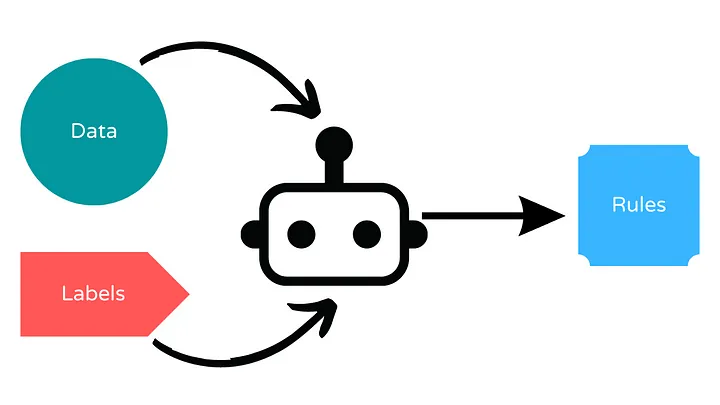

# Sesión 14 · Híbridos, guardarraíles y neuro-simbólico (26/10/2026)

> **Bloque B05 · RA5.** Tercera y última sesión del bloque. Cerramos con la evolución moderna de los sistemas expertos: reglas extraídas de datos, guardarraíles para LLM, sistemas neuro-simbólicos y el marco legal (AI Act), culminando en el proyecto integrador.
>
> **CE de esta sesión:** RA5-b (simular comportamientos), RA5-d (estrategias de control) y RA5-e (controladores inteligentes y su influencia en el sistema).

## Qué vas a aprender

| # | Al terminar la sesión serás capaz de… |
|---|---|
| 1 | Recuperar **reglas legibles** de los datos con **FIGS** y validarlas con negocio |
| 2 | Construir un **guardarraíl** que acota las acciones de un agente LLM |
| 3 | Explicar qué es un **sistema neuro-simbólico** y qué aporta |
| 4 | Situar el **AI Act** y el derecho a explicación en las decisiones automatizadas |
| 5 | Integrar reglas + guardarraíl en el **proyecto Pagarium** |

## 1 · Reglas extraídas de datos (FIGS)

Cuando nadie escribió las reglas pero existen en los datos, un algoritmo puede **recuperarlas** de forma legible. Generamos 4.000 pagos de Pagarium con una política **latente** (`importe > 1000 y antigüedad < 6`, **o** `n_intentos >= 4`) más un 3 % de ruido, y **FIGS** la redescubre casi literal:

```python
%pip install imodels scikit-learn
import numpy as np
from imodels import FIGSClassifier
from sklearn.model_selection import train_test_split

rng = np.random.default_rng(0)
n = 4000
importe = rng.uniform(0, 2000, n)
antiguedad = rng.uniform(0, 24, n)
n_intentos = rng.integers(0, 6, n)

y = ((importe > 1000) & (antiguedad < 6)) | (n_intentos >= 4)
flip = rng.random(n) < 0.03            # ruido del 3 %
y = np.where(flip, ~y, y).astype(int)

X = np.column_stack([importe, antiguedad, n_intentos])
X_tr, X_te, y_tr, y_te = train_test_split(X, y, test_size=0.3, random_state=0)

clf = FIGSClassifier(max_rules=6)
clf.fit(X_tr, y_tr)
print("Accuracy:", round(clf.score(X_te, y_te), 3))
print(clf)
# Reglas recuperadas (aprox.): importe > 997.45, antiguedad <= 5.5, n_intentos > 3.5
```

FIGS devuelve reglas como `importe > 997.45` (frente al umbral real 1000), `antiguedad <= 5.5` (real 6) y `n_intentos > 3.5` (real 4). **Ha redescubierto la política latente** con márgenes por el ruido.



Dos enfoques híbridos:

- **Deducir reglas de los datos** (FIGS, [skope-rules](https://github.com/scikit-learn-contrib/skope-rules)): el resultado sigue siendo `SI…ENTONCES…` legible, pero nadie lo escribió a mano.
- **Integrar reglas propias con ML** ([Human-Learn](https://koaning.github.io/human-learn/index.html)): el experto pone las reglas de partida y el aprendizaje las mejora.

## 2 · Reglas como guardarraíl de agentes LLM

Un agente LLM propone; las reglas **validan y acotan** antes de ejecutar. Patrón actual en pagos, salud y cloud:

```python
import re

def validar_accion_llm(texto):
    """Reglas de negocio sobre la propuesta de un agente. Devuelve (ok, motivo)."""
    importes = [float(x) for x in re.findall(r"(\d+(?:\.\d+)?)\s*EUR", texto)]
    if any(i > 1000 for i in importes):
        return False, "importe fuera de rango"
    if "cuenta no verificada" in texto.lower():
        return False, "destino no permitido"
    if re.search(r"transferir.*sin confirmar", texto, re.IGNORECASE):
        return False, "requiere confirmación humana"
    return True, "ok"

for t in ["Transferir 500 EUR a la cuenta A",
          "Transferir 5000 EUR",
          "Pagar a cuenta no verificada"]:
    print(t, "->", validar_accion_llm(t))
```

## 3 · Sistemas neuro-simbólicos

Los **sistemas neuro-simbólicos** combinan redes neuronales (aprendizaje) con razonamiento simbólico (reglas). Aportan:

- **menos alucinaciones** (las reglas acotan la salida),
- **explicabilidad** (se puede mostrar la regla aplicada),
- **trazabilidad** para cumplimiento normativo.

Es la evolución natural de los híbridos reglas/datos, y la tendencia dominante en IA aplicada a negocio.

<iframe width="100%" height="380" src="https://www.youtube.com/embed/ZfWDVO3rzeA" title="What Is NeuroSymbolic AI? Bridging Reasoning & Neural Networks" frameborder="0" allow="accelerometer; autoplay; clipboard-write; encrypted-media; gyroscope; picture-in-picture; web-share" referrerpolicy="strict-origin-when-cross-origin" allowfullscreen></iframe>

[Ver en YouTube](https://www.youtube.com/watch?v=ZfWDVO3rzeA) · *IBM Technology*. Qué es la IA neuro-simbólica y cómo une razonamiento y redes neuronales (en inglés).

## 4 · AI Act y decisiones automatizadas

El **AI Act** (Reglamento UE 2024/1689) regula la IA por riesgo. Calendario **actualizado** (verificar antes de usarlo en clase):

- Prácticas prohibidas: desde **2/2/2025**.
- Transparencia y alfabetización en IA: desde **agosto de 2026**.
- Obligaciones de **alto riesgo** del Anexo III (incluye *scoring* crediticio): **aplazadas a diciembre de 2027** por el **Ómnibus Digital (Reglamento UE 2026/1744)**.

!!! warning "Verifica el calendario"
    El calendario del AI Act ha cambiado varias veces. Antes de evaluar, contrasta la fecha vigente en el DOUE/BOE y en las guías de la AESIA.

La **explicación** (de la que MYCIN fue pionero) es hoy obligatoria en varios contextos: el **RGPD** recoge el **derecho a explicación** de las decisiones automatizadas.

## 5 · Proyecto integrador Pagarium

**Reto (individual o parejas):** construir la política de decisión completa de Pagarium con **dos capas**:

1. **Reglas de negocio** (elegibilidad) en DMN/ZEN o `rule-engine`.
2. **Guardarraíl** que valida las acciones de un agente LLM.

**Entregables:** tabla DMN con hit policy y cobertura verificada, implementación ejecutable, y un breve informe (300 palabras) con: huecos/solapes detectados, decisión sobre usar o no un motor (con el benchmark) y 1 riesgo de cumplimiento (AI Act/RGPD).

**Actividad A3 (3 h).** FIGS sobre un dataset propio: extrae reglas, valídalas con «negocio» y compáralas con las escritas a mano. El cuaderno es `sesion14_hibridos_guardarrailes.ipynb`.

## Aplicaciones y tendencias (mercado 2026)

| Ámbito | Uso |
|---|---|
| Banca y seguros | *Scoring*, AML, *underwriting*, pagos (DMN + BRMS) |
| Salud | Alertas clínicas, dosificación, CDSS |
| Industria | Diagnóstico de máquinas, control de procesos |
| Telecom | Diagnóstico de averías, gestión de red |
| Cloud / DevOps | Autorización con OPA/Rego, Cedar, Kyverno |
| Legal / compliance | Reglas normativas y trazabilidad de decisiones |
| IA generativa | Guardarraíles, enrutado y validación de salidas de LLM/agentes |

**Tendencias:** BRMS con DMN, *policy-as-code*, **neuro-simbólico**, **XAI** (derecho a explicación del RGPD) y reglas como **guardarraíl** del ML generativo.

## Puntos clave de la sesión

- **FIGS** recupera políticas latentes de los datos; los **guardarraíles** acotan a los LLM/agentes.
- Lo **neuro-simbólico** reduce alucinaciones y aporta explicabilidad y trazabilidad.
- El **AI Act** y el derecho a explicación del RGPD hacen que la explicación ya no sea opcional.
- El **proyecto Pagarium** integra las tres sesiones: reglas + DMN/ZEN + guardarraíl.
